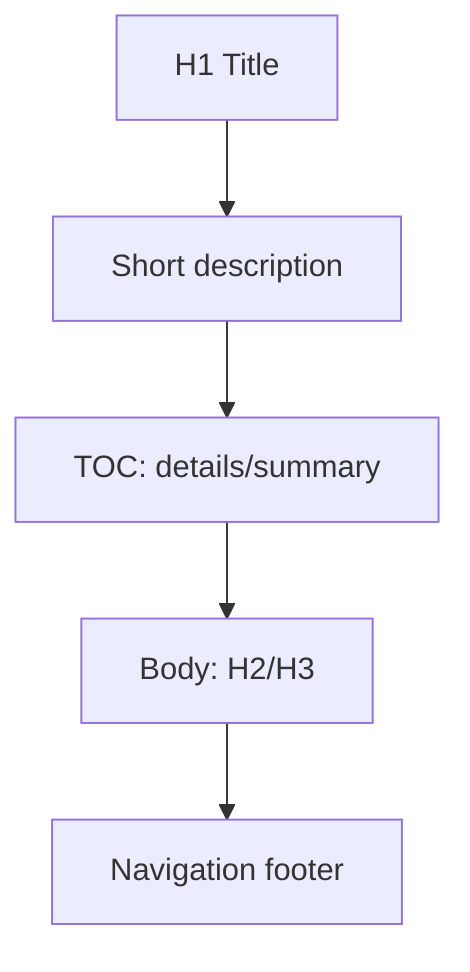
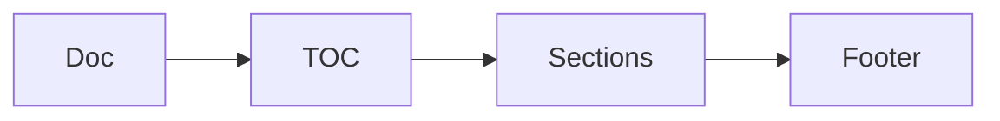

# Documentation Standards Guide

_This guide defines normative documentation standards and practices for contributors editing files in the `docs/` directory._

<details><summary>Table of Contents</summary>

- [Executive summary](#executive-summary)
- [Core principles](#core-principles)
- [Audience and usage](#audience-and-usage)
- [Quick start](#quick-start)
- [File & directory conventions](#file--directory-conventions)
- [Index & navigation strategy](#index--navigation-strategy)
- [Document structure](#document-structure)
- [Headings & hierarchy](#headings--hierarchy)
- [TOC standards](#toc-standards)
- [Anchors & slugs](#anchors--slugs)
- [Linking policy](#linking-policy)
- [Code blocks, diagrams & media](#code-blocks-diagrams--media)
- [Content granularity & splitting](#content-granularity--splitting)
- [Accessibility & clarity](#accessibility--clarity)
- [Admonitions & callouts](#admonitions--callouts)
- [Navigation footer specification](#navigation-footer-specification)
- [Review & submission checklist](#review--submission-checklist)
- [Normalization mapping (summary)](#normalization-mapping-summary)
- [Implementation & migration plan](#implementation--migration-plan)
- [Future enhancements](#future-enhancements)
- [Glossary](#glossary)
- [Appendix: Author template](#appendix-author-template)
- [Examples catalogue](#examples-catalogue)
- [End](#end)

</details>

## Executive summary

This guide is the authoritative contributor-facing standard for creating and updating documentation under `/docs/`. It replaces older, inconsistent practices and provides prescriptive rules contributors MUST follow.

## Core principles

- Purpose-driven: Every document starts with a clear purpose and intended audience. [Rule: PURPOSE]
- Discoverable: Use predictable filenames, headings, and navigation elements so readers find content quickly. [Rule: DISCOVERABLE]
- Linkable: Prefer stable anchors and link forms so cross-references remain valid. [Rule: LINKABLE]
- Small and focused: Prefer single-responsibility documents with clear splits. [Rule: GRANULAR]
- Accessible: Use semantic structure and descriptive text. [Rule: ACCESSIBLE]

## Audience and usage

This guide is written for contributors, writers, and automation agents that create or normalize files in the `docs/` directory. Use it when adding new documents, changing filenames, refactoring indexes, or adjusting navigation footers.

## Quick start

- Filename: Use UPPERCASE_SNAKE_CASE.md (for example, `CONTRIBUTING_GUIDE.md`) [Rule: FILENAME].
- Heading: Start with a single H1 only, then a short descriptive sentence on the next line.
- TOC: Add a collapsible TOC after the short description using HTML details/summary.
- Anchor: Add explicit anchors only when auto-derived anchors would not match the required slug (see Anchors & slugs).

## File & directory conventions

- Location: All canonical docs live in `docs/`. Ancillary or generated artifacts may live elsewhere but must link back.
- Filename standard: Use UPPERCASE_SNAKE_CASE.md for all file names. Filenames MUST use ASCII letters, numbers, and underscores only. [Rule: FILENAME]
- Root index: Maintain a top-level `INDEX.md` that lists domain indexes. If absent, create one referencing new docs.
- Directory indexes: Use `ROOT_INDEX.md` or `INDEX.md` in subdirectories when a directory contains multiple topical docs.

## Index & navigation strategy

- Navigation is driven by index files and a navigation footer in each doc (see Navigation footer specification).
- Maintain a minimal Root Index file at [`ORCHESTRATOR_INDEX.md`](ORCHESTRATOR_INDEX.md:1) to orient readers.

## Document structure

Each document SHOULD follow this anatomy:

- H1 title (single)
- One-line short description (sentence)
- Collapsible Table of Contents (<details><summary>Table of Contents</summary>...) listing H2/H3
- Executive summary or purpose (italic recommended)
- Body (H2/H3 sections)
- Navigation footer (explicit named anchor + standardized links)
- Change log or last-updated metadata (optional)



## Headings & hierarchy

- Allowed hierarchy: H1 → H2 → H3. H4 may be used only for tightly scoped enumerations in a single file (narrow lists), and only when necessary. [Rule: HIERARCHY]
- Heading case: H1 in Title Case, H2/H3 in sentence case.
- Single H1: Every file MUST contain exactly one H1 at the top.

## TOC standards

- Add the collapsible TOC immediately after the short description paragraph.
- Include H2 and H3 entries only. Do not list H4.
- Keep the TOC concise; if the document has fewer than three H2s and is under ~800 words, a TOC is optional.
- Authors may leave the TOC as an HTML comment template while drafting, then replace with final links before publishing:
      <!--
- <!-- TOC start: remove this comment and fill with H2/H3 links -->
    -->

## Anchors & slugs

- Anchor IDs MUST use lowercase-kebab-case and only include a–z, 0–9 and hyphens. [Rule: ANCHOR]
- Do not add explicit <a id="..."/> anchors unless the required ID cannot be derived from the heading text or a special reference is required (e.g., Navigation Footer). Use explicit anchor for navigation footer:
  <a id="navigation-footer"></a>
- Example: For a heading "Navigation footer specification" the auto-derived anchor is `#navigation-footer-specification`. Only add <a id="..."/> when the target must be different.

## Linking policy

Use the following link types depending on target:

| Use case            |                                      Example | Allowed                                            | Rule tag        |
| ------------------- | -------------------------------------------: | -------------------------------------------------- | --------------- |
| Doc → Doc           |                                `../GUIDE.md` | Relative links preferred                           | LINK-REL        |
| Doc → Code          |     `/src/services/marketplace/index.ts#L25` | Absolute repo-root links for code                  | LINK-ABS-CODE   |
| Doc → Document line | `ORCHESTRATOR_LIFECYCLE.md#specific-section` | Relative with anchor                               | LINK-REL-ANCHOR |
| Internal section    |                              `#section-name` | Auto-derived anchors; explicit only when necessary | LINK-INTERNAL   |

- Prefer relative links for doc-to-doc references to preserve portability (LINK-REL).
- When authoring files inside the documentation directory (`docs/`), do NOT prefix doc-to-doc relative links with `docs/`. Use paths relative to the current docs folder (for example `ORCHESTRATOR_LIFECYCLE.md` or `../SUBDIR/FILE.md`). If you need an absolute repo-root reference to a docs file, use a leading slash like `/docs/FILE.md`.
- When a document mentions another repository file by name, always include a clickable link to that file (relative link inside `docs/` or `/docs/` repo-root for absolute). This ensures readers can navigate immediately and enables automation to validate references. (Rule: LINK-MENTION)
- Use absolute repo-root paths for code files when referencing implementation lines (LINK-ABS-CODE).
- Do not use reference-style links (the `[ref]: url` pattern). This is prohibited unless a repository-wide decision adopts it in future.
- When linking to a specific line in source, include `#L<line>` (example: `/src/services/marketplace/index.ts#L25`).

## Code blocks, diagrams & media

- Always use fenced code blocks with a language tag: `typescript, `json, `bash, `mermaid.
- For code samples include a short descriptive caption above the block if needed.
- Diagrams: Use mermaid fenced blocks. Keep diagrams simple and add a text alternative description immediately before the block for accessibility.
- Images: Currently avoid images for primary content. If needed in future, include descriptive alt text and a caption. Store images in a versioned `assets/` directory off `docs/` (future policy).

Example TypeScript snippet:

```typescript
// Example: export a small helper
export function slugify(input: string): string {
	return input.trim().toLowerCase().replace(/\s+/g, "-")
}
```

Example shell:

```bash
# Run tests for a single file (see Code Quality rules)
cd src && npx vitest run tests/example.test.ts
```

## Content granularity & splitting

- Aim for single-topic documents. If a file exceeds ~1500 words or covers more than three distinct concerns, split it.
- Use domain indexes to aggregate short docs rather than creating long monoliths.
- When splitting, create a redirecting top-level doc linking to subdocs and maintain consistent naming.

## Accessibility & clarity

- Use active voice and imperative instructions for directives (Use…, Do not…).
- Provide descriptive link text (avoid "click here").
- Use semantic headings and logical reading order.
- When adding images later, include alt text and a short textual summary.

## Admonitions & callouts

- Current pattern: Use blockquote style with a bold label, for example:
    > **Note:** This is an informational note.
- Future consideration: Adopt a standardized admonition container system (e.g., custom components) via CI tooling. Until then, use the blockquote pattern consistently.

## Navigation footer specification

- Every document MUST include a navigation footer at the end with the anchor `<a id="navigation-footer"></a>` followed by standardized links.
- Required links (order required):
    1. Back to parent index (relative)
    2. Root index (relative)
    3. Related docs (optional)
    4. Source (absolute repo-root link to the file with `#L1` if useful)
- When listing related files or indexes in the navigation footer or elsewhere in the doc, ensure each mentioned filename is a clickable link (relative doc link). This is required so readers can follow references directly and tooling can validate cross-doc references. (Rule: NAV-LINK)
- Minimal footer example:
  <a id="navigation-footer"></a>
- Back: [`ROOT_INDEX.md`](ORCHESTRATOR_INDEX.md:1) · Root: [`INDEX.md`](INDEX.md:1) · Source: `/docs/DOCUMENTATION_GUIDE.md#L1`

## Review & submission checklist

Before submitting a PR, confirm the following items (answer Yes/No for each):

- [ ] Single H1 at top (yes/no)
- [ ] Short description on line 2 (yes/no)
- [ ] Collapsible TOC present if required (yes/no)
- [ ] Headings follow H1→H2→H3 hierarchy (yes/no)
- [ ] Anchors use lowercase-kebab-case where explicit anchors are used (yes/no)
- [ ] Docs link with relative links for doc-to-doc (yes/no)
- [ ] All mentioned docs/files are linked (yes/no)
- [ ] Code references use absolute repo-root paths (yes/no)
- [ ] Fenced code blocks include language tags (yes/no)
- [ ] Mermaid diagrams have textual alternative (yes/no)
- [ ] Navigation footer present and correct (yes/no)
- [ ] Accessibility checks (link text, alt text) (yes/no)
- [ ] Tests or linting related to docs (if applicable) (yes/no)

## Normalization mapping (summary)

| Legacy pattern        | Normalized form         | Rule      |
| --------------------- | ----------------------- | --------- |
| mixed-case.md         | UPPERCASE_SNAKE_CASE.md | FILENAME  |
| multiple H1s          | single H1               | HIERARCHY |
| reference-style links | inline relative links   | LINK-REL  |

## Implementation & migration plan

Phased rollout:

- Phase 0 — Preparation: publish this guide as [`docs/DOCUMENTATION_GUIDE.md`](docs/DOCUMENTATION_GUIDE.md:1). Identify high-priority docs.
- Phase 1 — Normalize critical docs: rename and update 10–25 high-traffic files; open PRs with reviewers assigned.
- Phase 2 — Automation: add scripts and CI checks for filename, single-H1, TOC presence, and navigation footer.
- Phase 3 — Maintenance: adopt optional frontmatter and automated tooling (deferred).

Acceptance criteria:

- CI enforces filename pattern and single H1.
- Navigation footer present in all normalized docs.

## Linking policy matrix

| From | To       |               Form | Example                                  |
| ---- | -------- | -----------------: | ---------------------------------------- |
| Doc  | Doc      |           relative | `../GUIDE.md`                            |
| Doc  | Code     | absolute repo-root | `/src/services/marketplace/index.ts#L25` |
| Doc  | External |     absolute https | `https://example.com`                    |

## Admonitions & callouts (examples)

- Note:
    > **Note:** Prefer relative links for docs.
- Warning:
    > **Warning:** Do not use reference-style links unless adopted repo-wide.

## Style & tone

- Use active voice and imperative mood for instructions.
- Be concise. Prefer short paragraphs and lists.
- Use Title Case for the H1, Sentence case for H2/H3.

## Diagrams and mermaid guidance

- Keep diagrams small, referenced by alt text, and placed near the explanatory paragraph.
- Example:



## Glossary

- Root index: top-level index file that lists domain indexes. [Term]
- Anchor: the HTML id used for section linking. [Term]
- Slug: lowercase-kebab-case form used for anchors and URLs. [Term]
- Navigation footer: required standardized footer with index/source links.

## Examples catalogue

- Canonical filename:

```text
CONTRIBUTING_GUIDE.md
```

- Minimal document template:

```markdown
# Example Document Title

One-line short description.

<details><summary>Table of Contents</summary>

- [Purpose](#purpose)
- [Usage](#usage)

</details>

## Purpose

_This document explains..._

## Usage

Content here.

<a id="navigation-footer"></a>

- Back: [`ROOT_INDEX.md`](docs/ORCHESTRATOR_INDEX.md:1) · Root: [`INDEX.md`](docs/INDEX.md:1) · Source: `/docs/EXAMPLE_DOCUMENT.md#L1`
```

## Appendix: Author template

Copy/paste-ready template — replace bracketed values.

```markdown
# TITLE OF DOCUMENT

One-line short description.

<details><summary>Table of Contents</summary>

- [Executive summary](#executive-summary)
- [Purpose](#purpose)
- [Details](#details)

</details>

## Executive summary

_One-sentence purpose._

## Purpose

Describe the intent and audience.

## Details

Main content here.

<a id="navigation-footer"></a>

- Back: [`ROOT_INDEX.md`](docs/ORCHESTRATOR_INDEX.md:1) · Root: [`INDEX.md`](docs/INDEX.md:1) · Source: `/docs/TEMPLATE.md#L1`
```

## Review & submission checklist (expanded)

- Confirm file name is UPPERCASE_SNAKE_CASE.md.
- Confirm single H1 and short description.
- Confirm TOC presence if required.
- Confirm navigation footer anchor exists.
- Confirm links: doc↔doc relative; code absolute repo-root when needed.

## Future enhancements

- Adopt frontmatter for metadata (deferred).
- Add lint rules and CI enforcement for filenames, H1 count, and navigation footer.
- Build admonition component and linting for admonition usage.
- Consider automated TOC generation tools and anchor normalization scripts.

## Change log

- 2025-09-19: Initial publication of this guide.

End of Documentation Standards Guide.
