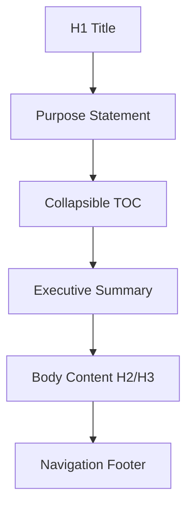
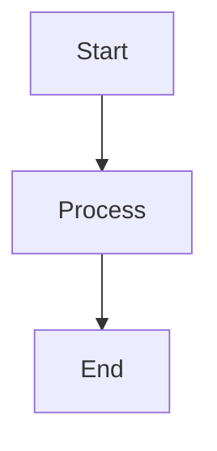

# Documentation Standards Guide

## When You're Here

This document is part of the KiloCode project documentation. If you're not familiar with this document's role or purpose, this section helps orient you.

- **Purpose**: This document covers \[DOCUMENT PURPOSE BASED ON FILE PATH].
- **Context**: Use this as a starting point or reference while navigating the project.
- **Navigation**: Use the table of contents below to jump to specific topics.

> **Architecture Fun Fact**: Like a well-designed building, good documentation has a solid foundation, clear structure, and intuitive navigation! 🏗️

- *Purpose:** Defines normative documentation standards and practices for contributors editing files
in the `docs/` directory, ensuring consistency and discoverability across all KiloCode
documentation.

<details><summary>Table of Contents</summary>
- [Executive Summary](#executive-summary)
- [Core Principles](#core-principles)
- [File & Directory Conventions](#file--directory-conventions)
- [Document Structure](#document-structure)
- [Headings & Hierarchy](#headings--hierarchy)
- [Table of Contents Standards](#table-of-contents-standards)
- [Linking Policy](#linking-policy)
- [Code Blocks & Media](#code-blocks--media)
- [Content Organization](#content-organization)
- [Navigation & User Experience](#navigation--user-experience)
- [Code Documentation Standards](#code-documentation-standards)
- [Engagement & Accessibility](#engagement--accessibility)
- [Technical Glossary](#technical-glossary)
- [Navigation Footer Specification](#navigation-footer-specification)
- [Review & Submission Checklist](#review--submission-checklist)
- [Implementation Guidelines](#implementation-guidelines)
- Navigation Footer

</details>

## Executive Summary

- This guide is the authoritative contributor-facing standard for creating and updating documentation
under `/docs/`. It replaces older, inconsistent practices and provides prescriptive rules
contributors MUST follow.*

- *Key Standards:**

- **File Naming**: UPPERCASE\_SNAKE\_CASE.md format for all documentation files
- **Document Structure**: Single H1, purpose statement, collapsible TOC, navigation footer
- **Linking**: Relative links for doc-to-doc references, absolute paths for code references
- **Navigation**: Consistent footer with back/root/source links across all documents
- **Content**: Focused, single-topic documents with clear hierarchy and accessibility
- **User Experience**: Navigation guides, quick start paths, and cross-references for different user
  journeys
- **Code Documentation**: Inline comments for complex data structures and long code snippets
- **Engagement**: Strategic use of analogies, fun facts, and accessible explanations

## Core Principles

- **Purpose-driven**: Every document starts with a clear purpose and intended audience
- **Discoverable**: Use predictable filenames, headings, and navigation elements
- **Linkable**: Prefer stable anchors and link forms for cross-references
- **Focused**: Single-responsibility documents with clear content splits
- **Accessible**: Semantic structure and descriptive text throughout

## File & Directory Conventions

- *Location**: All canonical documentation lives in the `docs/` directory. Ancillary or generated
artifacts may live elsewhere but must link back to the main documentation.

- *Filename Standard**: Use `UPPERCASE_SNAKE_CASE.md` for all file names. Filenames MUST use ASCII
letters, numbers, and underscores only.

- *Directory Structure**:
- Root level: `README.md` as the master navigation hub
- Subdirectories: Each major domain has its own directory with a `README.md`
- Examples: `architecture/`, `services/`, `orchestrator/`, `laminar/`, `ui/`, `tools/`, `testing/`

- *Index Files**:

- **Mandatory**: Every `docs/` subdirectory MUST have a `README.md` file serving as the directory
  index
- **Root Requirement**: The `docs/` directory itself MUST have a `README.md` file as the central
  documentation hub
- **Purpose**: Provides immediate context and navigation when users land in any directory
- **Content**: Overview, quick start paths, current focus, documentation structure,
  cross-references, directory context
- **Format**: Follows the standard document anatomy with navigation footer
- Index files must provide clear navigation and categorization with multi-sentence descriptions for
  each linked file

### README Index Description Rules
- For every link to a file in the same directory, provide a 3-sentence description:
1. what the file covers;
2. why/when to use it;
3. how it relates to adjacent docs.
- For every link in a "Related context" section (to files outside the directory), provide a
  1-sentence description explaining relevance.
- Keep descriptions concrete and scannable; avoid repeating entire content (link to the canonical
  page instead).
- Prefer descriptive anchor text for all links (no bare file paths). Example:
- Good: `[State Machines Index and Diagrams](README.md)`
- Bad: `state-machines/README.md`

## Document Structure

Each document MUST follow this standardized anatomy:
1. **H1 Title** (single, Title Case)
2. **Purpose Statement** (`**Purpose:**` format with brief description)
3. **Collapsible TOC** (`<details><summary>Table of Contents</summary>` format)
4. **Executive Summary** (italic text with key highlights)
5. **Body Content** (H2/H3 sections with detailed information)
6. **Navigation Footer** (standardized footer with links)



## Headings & Hierarchy

- *Allowed Hierarchy**: H1 → H2 → H3 only. H4 may be used only for tightly scoped enumerations in a
single file.

- *Heading Case**:
- H1: Title Case
- H2/H3: Sentence case

- *Single H1 Rule**: Every file MUST contain exactly one H1 at the top.

## Table of Contents Standards

- *Placement**: Add the collapsible TOC immediately after the purpose statement.

- *Content**: Include H2 and H3 entries only. Do not list H4.

- *Format**: Use the standard `<details><summary>Table of Contents</summary>` format.

- *Optional**: If the document has fewer than three H2s and is under ~800 words, a TOC is optional.

## Linking Policy

- *Doc-to-Doc Links**: Use relative paths within the `docs/` directory. Do NOT prefix with `docs/`.

- *Examples**:
- `[System Overview](architecture/SYSTEM_OVERVIEW.md)` (from root docs/)
- `[Architecture Index](../architecture/README.md)` (from subdirectory)
- `[Getting Started](GETTING_STARTED.md)` (same directory)

- *Code References**: Use absolute repo-root paths for code files.

- *Examples**:
- `/src/services/marketplace/index.ts#L25` (specific line)
- `[FILE_MOVED_OR_RENAMED]` (file reference)

- *External Links**: Use absolute HTTPS URLs for external references.

- *Link Descriptions**: All links in navigation sections (Quick Navigation, Research Context, etc.)
MUST include 1-2 sentence descriptions explaining what the linked document contains and why it's
relevant.

- *Examples**:
- `[Root Cause Analysis](race-condition/ROOT_CAUSE_ANALYSIS.md) - Detailed investigation of the concurrent recursive calls race condition, including the problematic commit and code changes that created the issue. Provides comprehensive analysis of how the continueParentTask method introduced concurrent execution paths.`
- `[Solution Options](race-condition/SOLUTION_RECOMMENDATIONS.md) - Proposes multiple approaches to fix the race condition, including lock-based solutions, call tracking, and subtask completion coordination. Includes implementation strategies and testing approaches for each solution.`

- *GitHub-Specific Considerations**:
- All links will be viewed on GitHub.com, so ensure they work in the GitHub markdown renderer
- GitHub supports relative links within the repository
- Code references with line numbers will create clickable links to specific lines in GitHub
- Table of Contents anchors work automatically in GitHub's markdown viewer
- Avoid using features not supported by GitHub's markdown renderer

- *Link Requirements**:
- All mentioned filenames must be clickable links
- Use descriptive anchor text (no bare file paths or "click here")
- Include line numbers for code references when relevant
- Do not use reference-style links (`[ref]: url` pattern)

## Code Blocks & Media

- *Code Blocks**: Always use fenced code blocks with language tags.

- *Supported Languages**: `typescript`, `json`, `bash`, `mermaid`, `markdown`

- *Example TypeScript**:

```typescript
// Example: export a small helper
export function slugify(input: string): string {
	return input.trim().toLowerCase().replace(/\s+/g, "-")
}
```

- *Example Shell**:

```bash
# Run tests for a single file

> **Architecture Fun Fact**: Like a well-designed building, good documentation has a solid foundation, clear structure, and intuitive navigation! 🏗️

cd src && npx vitest run tests/example.test.ts
```

- *Mermaid Diagrams**: Use mermaid fenced blocks with text alternatives for accessibility.

- *Example**:



## Content Organization

- *Single Topic Focus**: Aim for single-topic documents. If a file exceeds ~1500 words or covers
more than three distinct concerns, split it.

- *Domain Indexes**: Use domain indexes to aggregate short docs rather than creating long monoliths.

- *Content Splitting**: When splitting content, create a redirecting top-level doc linking to subdocs
and maintain consistent naming.

- *Accessibility Standards**:
- Use active voice and imperative instructions
- Provide descriptive link text (avoid "click here")
- Use semantic headings and logical reading order
- Include alt text for any images

## Navigation & User Experience

- *Purpose**: Create intuitive navigation paths for different user types and scenarios, optimized for
expert engineers new to the KiloCode codebase.

### Quick Start Paths

Every major documentation area MUST include quick start paths for different user scenarios:

- *🚨 Emergency Response** (Something's Broken!):
1. **Start Here**: [Technical Glossary](GLOSSARY.md) for terminology
2. Problem identification and symptoms
3. Root cause analysis
4. Solution implementation
5. Verification steps

- *🔬 Deep Dive Research** (Understanding the System):
1. **Start Here**: [Technical Glossary](GLOSSARY.md) for terminology
2. Conceptual overview
3. Detailed technical analysis
4. Related systems and interactions
5. Advanced topics

- *🛠️ Implementation Journey** (Building the Fix):
1. **Start Here**: [Technical Glossary](GLOSSARY.md) for terminology
2. Solution recommendations
3. Technical implementation details
4. Testing and validation
5. Deployment and monitoring

- *📚 New to Codebase** (Expert Engineer Onboarding):
1. **Start Here**: [Technical Glossary](GLOSSARY.md) - Essential terminology
2. **System Overview**: [Architecture Documentation](README.md) - High-level design
3. **Current Issues**: [Race Condition Analysis](README.md) - Active
   problems
4. **Implementation**: [Orchestrator Documentation](README.md) - Core patterns
5. **Development**: [Repository Structure](README.md) - Codebase
   organization

### Navigation Guidelines

- *No Dead Ends Policy**: Every documentation page MUST provide:

- **Clear next steps** based on current context and research goals
- **Related concepts** for deeper understanding
- **Cross-references** to relevant implementation details
- **Breadcrumb navigation** showing current location
- **Research Context sections** with contextual next steps

- *Cross-References**: Every document MUST include:
- "Research Context & Next Steps" sections pointing to related topics
- "Related Documentation" at the bottom of each page
- Navigation breadcrumbs to trace user paths
- Quick links for common scenarios
- Links to [Technical Glossary](GLOSSARY.md) for terminology

- *User Journey Optimization**: Structure content to support different user types:

- **Emergency responders** need immediate problem identification and solutions
- **Researchers** need comprehensive understanding and context
- **Implementers** need detailed technical guidance and code examples

## Code Documentation Standards

- *Purpose**: Make complex code structures accessible through inline documentation and comments.

### Inline Comments for Data Structures

- *Required for complex data structures**:
- Enum values MUST have explanatory comments with their purpose and context
- Interface properties MUST be documented with their relationships and constraints
- State properties tables MUST include inline explanations for each property
- Code snippets MUST be broken down with contextual comments

- *Comment Format**:

```typescript
// 🎯 Purpose: Brief explanation of what this represents
// 🔗 Context: How it relates to other concepts
// ⚠️ Important: Key constraints or gotchas
enum ExampleState {
	VALUE1 = "value1", // Specific explanation of this state
	VALUE2 = "value2", // Another explanation
}
```

### Code Snippet Organization

- *Long Code Snippets**:
- Break into logical sections with clear separators
- Add inline comments explaining key concepts
- Use consistent formatting and indentation
- Include context about where the code fits in the larger system

- *Data Structure Documentation**:
- Explain the purpose of each field
- Document relationships between fields
- Provide examples of valid values
- Include constraints and validation rules

## Engagement & Accessibility

- *Purpose**: Make technical documentation engaging and accessible through strategic use of
analogies, fun facts, and clear explanations.

### Analogies and Metaphors

- *Strategic Use**: Use analogies to make complex concepts accessible:

- **System Architecture**: Use geological, cartographic, or architectural metaphors
- **State Machines**: Use biological, mechanical, or quantum physics analogies
- **Data Flow**: Use transportation, communication, or manufacturing metaphors

- *Guidelines**:
- Analogies MUST be technically accurate
- Use consistent metaphors within related documentation
- Provide both technical and metaphorical explanations
- Include fun facts that relate to the technical concepts

### Fun Facts and Engagement

- *Purpose**: Make learning enjoyable and memorable through relevant fun facts.

- *Categories**:

- **Geology**: For layered systems, state transitions, and structural concepts
- **Quantum Physics**: For concurrent systems, state superposition, and synchronization
- **Cartography**: For navigation, mapping, and exploration concepts
- **Biology**: For lifecycles, evolution, and system behavior

- *Guidelines**:
- Fun facts MUST be technically relevant to the concept being explained
- Use emojis strategically to highlight key concepts
- Include both educational and entertaining elements
- Maintain professional tone while being engaging

## Technical Glossary

- *Purpose**: Define technical terms precisely and consistently across all documentation.

### Core Concepts

- *Turn**: A complete interaction cycle between user and AI system, consisting of:

- **User Input**: A single user message or request
- **AI Processing**: One or more API calls, tool invocations, and responses
- **AI Output**: The final response back to the user
- **Turn Boundary**: The point where the AI indicates it's finished and waiting for user input

- *Important**: A turn is NOT defined by the number of API calls or tool invocations. A single turn
can include multiple API calls, tool executions, and intermediate responses, but represents one
complete user-AI interaction cycle.

- *Green Text**: A visual indicator in the chat interface that signals the end of an AI turn. This
typically appears as green-colored text and indicates that the AI has finished processing and is
waiting for the next user input. It's the visual cue that the turn boundary has been reached.

- *Race Condition**: A situation where multiple processes or threads access shared resources
concurrently, leading to unpredictable behavior. In our context, this occurs when multiple API calls
are made simultaneously, causing responses to be interleaved and corrupted.

- *State Machine**: A computational model that describes how a system behaves in response to events,
transitioning between different states based on current state and input. Each state represents a
specific condition or mode of operation.

- *Synchronization**: The coordination of multiple processes to ensure they don't interfere with each
other when accessing shared resources. This typically involves locks, semaphores, or other
coordination mechanisms.

- *Concurrent Execution**: Multiple operations happening simultaneously, which can lead to race
conditions if not properly synchronized.

- *Sequential Execution**: Operations happening one after another in a specific order, which prevents
race conditions but may reduce performance.

### System-Specific Terms

- *Orchestrator**: The main task coordinator that manages the overall execution flow and creates
subtasks.

- *Subtask**: A secondary task created by the orchestrator to handle specific parts of a larger
operation.

- *Recursive Call**: A function that calls itself, in our context referring to the
`recursivelyMakeClineRequests` method that can call itself to continue processing.

- *Message Queue**: A data structure that holds messages waiting to be processed, ensuring they're
handled in order.

- *API Request**: A call to an external service (like Anthropic's API) to process user input and
generate responses.

- *Tool Invocation**: The execution of a specific function or tool by the AI system to accomplish a
task.

## Navigation Footer Specification

- *Required**: Every document MUST include a navigation footer at the end with the anchor
`<a id="navigation-footer"></a>`.

- *Standard Format**:

```
<a id="navigation-footer"></a>
- Back: [`PARENT_README.md`](PARENT_README.md) · Root: [`README.md`](README.md) · Source: `/docs/FILENAME.md#L1`
```

- *Link Requirements**:
1. **Back**: Link to parent index (relative path)
2. **Root**: Link to main [`README.md`](README.md) (relative path)
3. **Source**: Link to source file (absolute repo-root path with `#L1`)

- *Examples**:
- From root docs/:
  `Back: [`README.md`](README.md) · Root: [`README.md`](README.md) · Source: `/docs/DOCUMENTATION\_GUIDE.md#L1\`
- From subdirectory:
  `Back: [`README.md`](../README.md) · Root: [`README.md`](../README.md) · Source: `/docs/architecture/SYSTEM\_OVERVIEW.md#L1\`

- *Link Validation**: All mentioned filenames must be clickable links for direct navigation and
tooling validation.

## Review & Submission Checklist

Before submitting a PR, confirm the following items:

### Basic Structure
- \[ ] Single H1 at top
- \[ ] Purpose statement with `**Purpose:**` format
- \[ ] Collapsible TOC present (if required)
- \[ ] Headings follow H1→H2→H3 hierarchy
- \[ ] Navigation footer present and correct

### Linking and References
- \[ ] Doc-to-doc links use relative paths
- \[ ] All mentioned filenames are clickable links
- \[ ] Code references use absolute repo-root paths
- \[ ] Fenced code blocks include language tags

### User Experience
- \[ ] Quick start paths included for different user types
- \[ ] Cross-references and "Next Steps" sections present
- \[ ] Navigation breadcrumbs trace user paths
- \[ ] Quick links for common scenarios included

### Code Documentation
- \[ ] Complex data structures have inline comments
- \[ ] Enum values explained with purpose and context
- \[ ] Interface properties documented with relationships
- \[ ] Long code snippets broken down with contextual comments

### Engagement and Accessibility
- \[ ] Analogies are technically accurate and consistent
- \[ ] Fun facts are relevant to technical concepts
- \[ ] Technical terms defined in glossary
- \[ ] Accessibility standards followed

## Implementation Guidelines

- *File Naming**: Use `UPPERCASE_SNAKE_CASE.md` for all documentation files.

- *Document Template**:

```markdown
# Document Title

> **Development Fun Fact**: Documentation is like code comments for humans - it explains the "why" behind the "what"! 💻

- *Purpose:** Brief description of the document's purpose and audience.

<details><summary>Table of Contents</summary>
- [Executive Summary](#executive-summary)
- [Section 1](#section-1)
- [Section 2](#section-2)

</details>

## Executive Summary

_Key highlights and overview of the document content._

## Section 1

Content here.

## Section 2

More content here.

<a id="navigation-footer"></a>
- Back: [`README.md`](README.md) · Root: [`README.md`](README.md) · Source:
  `/docs/DOCUMENTATION_GUIDE.md#L1`
```

- *Key Standards**:
- Use relative links for doc-to-doc references
- Use absolute paths for code references
- Include line numbers for code references when relevant
- Ensure all filenames are clickable links
- Follow the standardized navigation footer format

<a id="navigation-footer"></a>
- Back: [`README.md`](README.md) · Root: [`README.md`](README.md) · Source:
  `/docs/DOCUMENTATION_GUIDE.md#L1`
