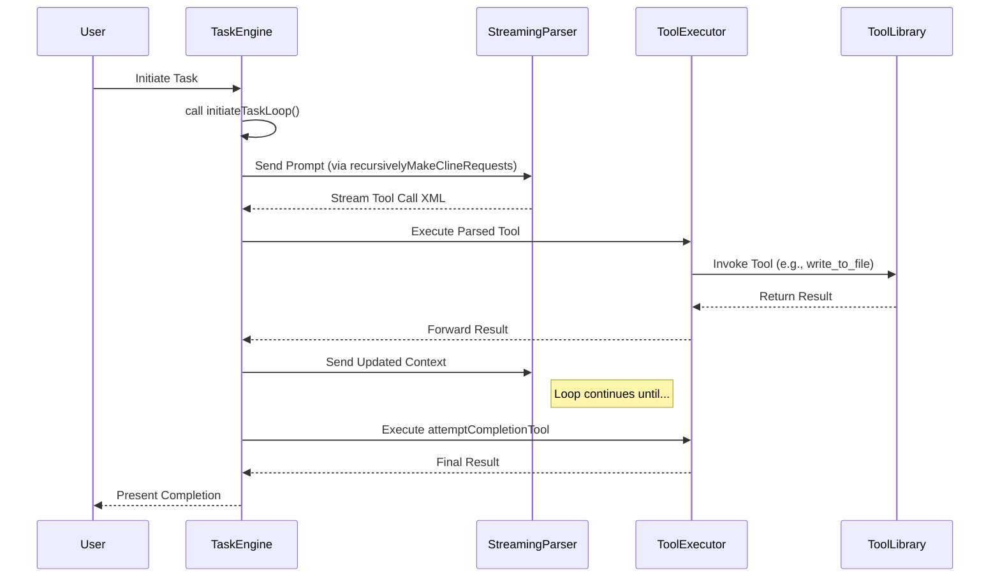

# Orchestrator Architecture

**Purpose:** This document provides a detailed overview of the Kilo Code Orchestrator's architecture, including its core components, their interactions, and the flow of data through the system.

Table of Contents

- [1. Related Documents](#1-related-documents)
- [2. Architectural Philosophy](#2-architectural-philosophy)
- [3. Core Components](#3-core-components)
- [4. Data Flow Diagram](#4-data-flow-diagram)
- [5. Component Deep Dive](#5-component-deep-dive)
- [6. Key Interactions](#6-key-interactions)
- [7. Navigation Footer](#7-navigation-footer)

---

### 1. Related Documents

- **[ORCHESTRATOR_INDEX.md](ORCHESTRATOR_INDEX.md)**: The master index for all orchestrator documentation.
- **[ORCHESTRATOR_LIFECYCLE.md](ORCHESTRATOR_LIFECYCLE.md)**: Provides a step-by-step breakdown of the task execution lifecycle.
- **[ORCHESTRATOR_SECURITY_GOVERNANCE.md](ORCHESTRATOR_SECURITY_GOVERNANCE.md)**: Details the security model, including modes and permissions.

[Back to Top](#orchestrator-architecture)

---

### 2. Architectural Philosophy

The orchestrator is built on a modular, extensible, and state-driven architecture. The primary design goals are:

- **Decoupling**: Components are designed to be independent, allowing for isolated testing and maintenance. The `Task` engine, for instance, is not directly aware of specific tool implementations.
- **Extensibility**: The system is designed to be easily extended with new tools and modes. See [ORCHESTRATOR_EXTENSIBILITY.md](ORCHESTRATOR_EXTENSIBILITY.md).
- **Robustness**: A clear separation of concerns and defined error-handling pathways ensure predictable behavior.
- **Clarity**: Data flow and control flow are designed to be explicit and traceable, primarily through the central `Task` loop.

[Back to Top](#orchestrator-architecture)

---

### 3. Core Components

The architecture comprises several key components that work in concert to execute tasks.

- **Task Engine (`Task.ts`)**: The heart of the orchestrator. It manages the entire lifecycle of a task, from initiation to completion. Its main entry point is [`initiateTaskLoop`](../src/core/task/Task.ts:1699).
- **Streaming Parser**: This component is responsible for processing the output from the language model in real-time, identifying and extracting tool-call requests.
- **Tool Executor**: Once a tool call is parsed, this component validates permissions and executes the corresponding tool, such as [`attemptCompletionTool`](../src/core/tools/attemptCompletionTool.ts:35).
- **Mode & Permission Service**: Manages the active operational `Mode` and enforces access control rules, determining which tools are available via [`isToolAllowedForMode`](../src/shared/modes.ts:167).
- **Subtask Manager**: Handles the delegation of work into smaller, isolated subtasks using [`startSubtask`](../src/core/task/Task.ts:1628) and [`completeSubtask`](../src/core/task/Task.ts:1669).
- **Prompt Generation**: Constructs the system prompts sent to the model, incorporating rules and context. A key function is [`getSystemPrompt`](../src/core/task/Task.ts:2499).

[Back to Top](#orchestrator-architecture)

---

### 4. Data Flow Diagram

The following diagram illustrates how data and control flow between the core components.

[Back to Top](#orchestrator-architecture)

---

### 5. Component Deep Dive

#### 5.1. Task Engine

The `Task` engine is the central coordinator. It maintains the state of the current operation, manages the conversation history with the model, and orchestrates calls to other components. The [`recursivelyMakeClineRequests`](../src/core/task/Task.ts:1735) function is the primary driver of the iterative execution loop.

#### 5.2. Streaming Parser

The parser's role is critical for performance and responsiveness. It scans the model's output stream for XML-like tool-call syntax. This allows the system to act on a tool request before the full model response has been received, enabling parallel execution of long-running tasks.

#### 5.3. Tool Executor & Library

The executor acts as a gateway to the `ToolLibrary`. Before invoking a tool, it consults the **Mode & Permission Service**. If a tool is not permitted in the current mode, it throws a [`FileRestrictionError`](../src/shared/modes.ts:157) or a similar permissions-related error, which is then handled by the Task Engine.

[Back to Top](#orchestrator-architecture)

---

### 6. Key Interactions

- **Task Initiation to Tool Call**: A user request starts [`initiateTaskLoop`](../src/core/task/Task.ts:1699). The engine generates a prompt with [`getSystemPrompt`](../src/core/task/Task.ts:2499), which is sent to the model. The parser identifies a tool call, and the executor invokes it.
- **Mode Switching**: A tool call to [`switchModeTool`](../src/core/tools/switchModeTool.ts:8) instructs the **Mode & Permission Service** to change the active mode, altering the set of available tools for subsequent operations.
- **Subtask Delegation**: When a task is too complex, the model can invoke [`startSubtask`](../src/core/task/Task.ts:1628). This creates a new, nested `Task` instance with its own lifecycle, allowing for recursive problem decomposition. The parent task is paused until [`completeSubtask`](../src/core/task/Task.ts:1669) is called.

[Back to Top](#orchestrator-architecture)

---

### 7. Navigation Footer

You have reached the end of the architecture document. Return to the [Master Index](ORCHESTRATOR_INDEX.md) or proceed to the [Lifecycle Document](ORCHESTRATOR_LIFECYCLE.md).

[Back to Top](#orchestrator-architecture)

---

End of document.
