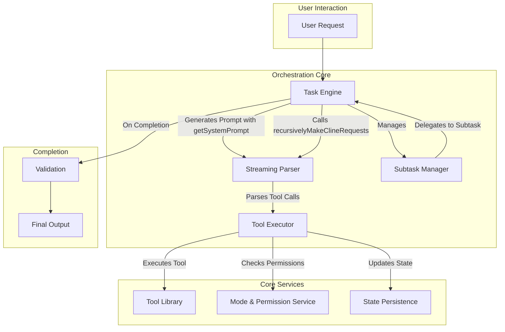

# Orchestrator Documentation Index

**Mission Statement:** To provide a centralized, comprehensive, and easily navigable resource for understanding the Kilo Code Orchestrator's architecture, lifecycle, and core functionalities. This index serves as the primary entry point for all orchestrator-related documentation.

Table of Contents

- [1. Related Documents](#1-related-documents)
- [2. At-a-Glance Summary](#2-at-a-glance-summary)
- [3. Concept Glossary](#3-concept-glossary)
- [4. High-Level Architecture Diagram](#4-high-level-architecture-diagram)
- [5. Lifecycle Snapshot](#5-lifecycle-snapshot)
- [6. Tool Categories Overview](#6-tool-categories-overview)
- [7. Safety & Guardrails Overview](#7-safety--guardrails-overview)
- [8. Expansion & Extensibility Teaser](#8-expansion--extensibility-teaser)
- [9. Cross-Link Matrix](#9-cross-link-matrix)
- [10. Navigation Footer](#10-navigation-footer)

---

### 1. Related Documents

This master index is the starting point for the orchestrator documentation suite. The following documents provide detailed information on specific aspects of the system:

- **[ORCHESTRATOR_ARCHITECTURE.md](ORCHESTRATOR_ARCHITECTURE.md)**: Describes the high-level system design, component interactions, and data flow patterns.
- **[ORCHESTRATOR_LIFECYCLE.md](ORCHESTRATOR_LIFECYCLE.md)**: Details the end-to-end journey of a task from initiation to completion, including state transitions and subtask management.
- **[ORCHESTRATOR_TASK_DELEGATION.md](ORCHESTRATOR_TASK_DELEGATION.md)**: Explains how complex tasks are broken down and delegated to different modes or sub-processes.
- **[ORCHESTRATOR_TOOLS_REFERENCE.md](ORCHESTRATOR_TOOLS_REFERENCE.md)**: Provides a comprehensive reference for all available tools, their parameters, and usage guidelines.
- **[ORCHESTRATOR_ERROR_HANDLING.md](ORCHESTRATOR_ERROR_HANDLING.md)**: Outlines the strategies for error detection, recovery, and the "Mistake Limit" concept.
- **[ORCHESTRATOR_SECURITY_GOVERNANCE.md](ORCHESTRATOR_SECURITY_GOVERNANCE.md)**: Covers security policies, mode-based permissions, and file access restrictions.
- **[ORCHESTRATOR_BEST_PRACTICES.md](ORCHESTRATOR_BEST_PRACTICES.md)**: Offers guidelines for developing, testing, and interacting with the orchestrator effectively.
- **[ORCHESTRATOR_EXTENSIBILITY.md](ORCHESTRATOR_EXTENSIBILITY.md)**: Documents how to add new tools, modes, and capabilities to the system.
- **[RULES_LOADING_SUMMARY.md](RULES_LOADING_SUMMARY.md)**: Details the process for loading and applying workspace-specific rules.

[Back to Top](#orchestrator-documentation-index)

---

### 2. At-a-Glance Summary

| Aspect                  | Purpose                                                                     | Primary Symbols                                                                                                                               | Linked Doc                                                   |
| :---------------------- | :-------------------------------------------------------------------------- | :-------------------------------------------------------------------------------------------------------------------------------------------- | :----------------------------------------------------------- |
| **Modes & Permissions** | Governs capabilities and access control for different operational contexts. | [`isToolAllowedForMode`](../src/shared/modes.ts:167), [`FileRestrictionError`](../src/shared/modes.ts:157)                                    | [Security & Governance](ORCHESTRATOR_SECURITY_GOVERNANCE.md) |
| **Task Lifecycle**      | Manages the execution flow of a user request from start to finish.          | [`initiateTaskLoop`](../src/core/task/Task.ts:1699), [`startSubtask`](../src/core/task/Task.ts:1628)                                          | [Lifecycle](ORCHESTRATOR_LIFECYCLE.md)                       |
| **Tooling System**      | Provides the actions and capabilities the orchestrator can perform.         | [`attemptCompletionTool`](../src/core/tools/attemptCompletionTool.ts:35), [`updateTodoListTool`](../src/core/tools/updateTodoListTool.ts:156) | [Tools Reference](ORCHESTRATOR_TOOLS_REFERENCE.md)           |
| **Extensibility**       | Defines extension points for adding new functionality.                      | `(Future)`                                                                                                                                    | [Extensibility](ORCHESTRATOR_EXTENSIBILITY.md)               |

[Back to Top](#orchestrator-documentation-index)

---

### 3. Concept Glossary

- **Always-Available Tool**: A tool that can be used in any mode, regardless of permissions.
- **Attempt Completion**: The final tool call in a task, signaling that the work is complete. See [`attemptCompletionTool`](../src/core/tools/attemptCompletionTool.ts:35).
- **Continuity Metadata**: Information passed between tasks to maintain context and state.
- **File Restriction**: A security mechanism that limits file system access based on the active mode. Governed by [`FileRestrictionError`](../src/shared/modes.ts:157).
- **Mistake Limit**: A threshold for recoverable errors before a task is halted.
- **Mode**: A distinct operational context with a specific set of permissions and available tools. Defined in [`src/shared/modes.ts`](../src/shared/modes.ts:69).
- **Streaming Parser**: The component responsible for parsing model output in real-time to identify and execute tool calls.
- **Subtask**: A smaller, delegated unit of work created to accomplish a larger parent task. Managed via [`startSubtask`](../src/core/task/Task.ts:1628) and [`completeSubtask`](../src/core/task/Task.ts:1669).
- **Task Loop**: The primary execution cycle that drives a task to completion. Initiated by [`initiateTaskLoop`](../src/core/task/Task.ts:1699).
- **Todo Gating**: A mechanism that uses a checklist to manage task progression, ensuring steps are completed in order. See [`updateTodoListTool`](../src/core/tools/updateTodoListTool.ts:156).
- **Tool**: A specific function the orchestrator can execute, like reading a file or applying a diff.

[Back to Top](#orchestrator-documentation-index)

---

### 4. High-Level Architecture Diagram

This diagram illustrates the primary components and their interactions within the orchestrator.

[Back to Top](#orchestrator-documentation-index)

---

### 5. Lifecycle Snapshot

A task progresses through several key stages, managed by the core task engine. For a complete breakdown, see [ORCHESTRATOR_LIFECYCLE.md](ORCHESTRATOR_LIFECYCLE.md).

- **Initiation**: A user request triggers [`initiateTaskLoop`](../src/core/task/Task.ts:1699).
- **Prompt Generation**: The system constructs a detailed prompt using [`getSystemPrompt`](../src/core/task/Task.ts:2499).
- **Execution Loop**: The model responds, and [`recursivelyMakeClineRequests`](../src/core/task/Task.ts:1735) manages the iterative process of parsing and tool execution.
- **Subtask Delegation**: Complex work may be delegated via [`startSubtask`](../src/core/task/Task.ts:1628).
- **Completion**: The task concludes with [`attemptCompletionTool`](../src/core/tools/attemptCompletionTool.ts:35), and state is persisted.

[Back to Top](#orchestrator-documentation-index)

---

### 6. Tool Categories Overview

Tools are the actions the orchestrator performs. They are grouped by function. See the [Tools Reference](ORCHESTRATOR_TOOLS_REFERENCE.md) for a full list.

- **File System**: Tools for reading, writing, and modifying files.
- **Task Management**: Tools for controlling task flow, like [`switchModeTool`](../src/core/tools/switchModeTool.ts:8) and [`newTaskTool`](../src/core/tools/newTaskTool.ts:14).
- **User Interaction**: Tools for communicating with the user, such as [`askFollowupQuestionTool`](../src/core/tools/askFollowupQuestionTool.ts:6).
- **State & Planning**: Tools for managing internal state, like [`updateTodoListTool`](../src/core/tools/updateTodoListTool.ts:156).

[Back to Top](#orchestrator-documentation-index)

---

### 7. Safety & Guardrails Overview

The orchestrator includes several mechanisms to ensure safe and predictable execution.

- **Mode-Based Permissions**: Restricts tool access based on the current mode. See [`isToolAllowedForMode`](../src/shared/modes.ts:167).
- **File Access Control**: Prevents unauthorized file modifications via [`FileRestrictionError`](../src/shared/modes.ts:157).
- **Error Handling**: Manages unexpected issues and enforces mistake limits. See [Error Handling](ORCHESTRATOR_ERROR_HANDLING.md).
- **Input/Output Formatting**: Enforces structured communication via rules like [`markdownFormatting_SECTION`](../src/core/prompts/sections/markdown-formatting.ts:1).

[Back to Top](#orchestrator-documentation-index)

---

### 8. Expansion & Extensibility Teaser

The system is designed for growth. Key extension points include adding new tools, defining custom modes, and integrating external services. For detailed instructions, refer to [ORCHESTRATOR_EXTENSIBILITY.md](ORCHESTRATOR_EXTENSIBILITY.md).

[Back to Top](#orchestrator-documentation-index)

---

### 9. Cross-Link Matrix

This matrix shows the dependencies between the primary documentation modules.

| Document            | Depends On          | Provides                                  |
| :------------------ | :------------------ | :---------------------------------------- |
| **Architecture**    | (None)              | Foundational component overview.          |
| **Lifecycle**       | Architecture        | Detailed process flow for tasks.          |
| **Task Delegation** | Lifecycle           | Subtask creation and management patterns. |
| **Tools Reference** | Architecture        | API-level details for all tools.          |
| **Security**        | Architecture, Tools | Access control and governance rules.      |

[Back to Top](#orchestrator-documentation-index)

---

### 10. Navigation Footer

You have reached the end of the index. Use the links above to navigate to the detailed documentation.

[Back to Top](#orchestrator-documentation-index)

---

End of document.
