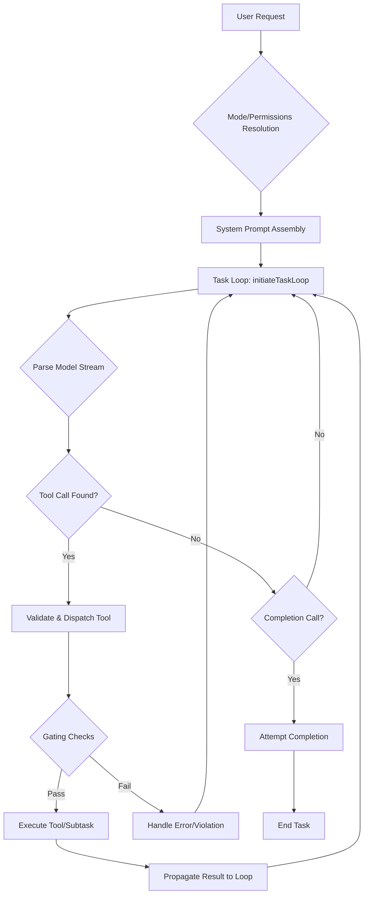

# Orchestrator Master Index

**Mission:** To provide a centralized, comprehensive, and easily navigable guide to the Orchestrator's architecture, lifecycle, and core responsibilities, enabling developers to understand, maintain, and extend its capabilities with confidence.

## Table of Contents

1. [Purpose & Scope](#1-purpose--scope)
2. [High-Level Responsibilities](#2-high-level-responsibilities)
3. [Core Concepts At a Glance](#3-core-concepts-at-a-glance)
4. [Lifecycle Snapshot](#4-lifecycle-snapshot)
5. [Documentation Map](#5-documentation-map)
6. [Quick Reference Matrix](#6-quick-reference-matrix)
7. [Architecture Flow Diagram](#7-architecture-flow-diagram)
8. [Guardrails & Safety Overview](#8-guardrails--safety-overview)
9. [Change Management & Versioning](#9-change-management--versioning)
10. [Glossary](#10-glossary)

---

## Purpose & Scope

This document serves as the master index for the Orchestrator documentation suite. Its purpose is to provide a high-level overview and a centralized entry point into the more detailed documents covering specific aspects of the Orchestrator's functionality. It establishes the conceptual framework and key terminology used throughout the suite.

**Scope:**

- **IN SCOPE:** High-level architecture, core responsibilities, task lifecycle, key concept definitions, and a map to all sibling orchestrator documents.
- **OUT OF SCOPE:** Detailed implementation logic, specific tool implementation, low-level state management, or UI-specific interactions. These topics are delegated to the specialized documents linked in the [Documentation Map](#5-documentation-map).

---

## High-Level Responsibilities

The Orchestrator is responsible for managing the end-to-end lifecycle of a user's task. This includes interpreting the request, executing tools, managing state, and ensuring safe, predictable outcomes.

- **System Prompt Assembly:** Constructs the master prompt that guides the model by combining user requests, system instructions, and context. See [`getSystemPrompt`](/src/core/task/Task.ts#L2499).
- **Task Execution Loop:** Manages the primary loop that drives a task, from parsing the model's response to tool invocation and state management. See [`initiateTaskLoop`](/src/core/task/Task.ts#L1699) and [`recursivelyMakeClineRequests`](/src/core/task/Task.ts#L1735).
- **Tool Management & Gating:** Provides and validates tools for the model, ensuring that only permitted tools are used by the active mode. Key tools include [`attemptCompletionTool`](/src/core/tools/attemptCompletionTool.ts#L35), [`newTaskTool`](/src/core/tools/newTaskTool.ts#L14), [`switchModeTool`](/src/core/tools/switchModeTool.ts#L8), [`askFollowupQuestionTool`](/src/core/tools/askFollowupQuestionTool.ts#L6), and [`updateTodoListTool`](/src/core/tools/updateTodoListTool.ts#L156).
- **Mode-Based Permissions:** Enforces which tools and file operations are allowed for a given mode, preventing unintended side effects. See [`isToolAllowedForMode`](/src/shared/modes.ts#L167) and the resulting [`FileRestrictionError`](/src/shared/modes.ts#L157).
- **Formatting & Presentation:** Ensures that all model outputs adhere to a strict markdown format for reliable parsing and presentation. See [`markdownFormattingSection`](/src/core/prompts/sections/markdown-formatting.ts#L1).

---

## Core Concepts At a Glance

- **Mode:** A distinct persona or capability set (e.g., `code`, `architect`) that defines available tools and operational boundaries.
- **Tool Invocation:** The process by which the model requests to execute a system-provided function (e.g., `read_file`, `apply_diff`).
- **Subtask:** A discrete unit of work delegated by the Orchestrator to a specialized mode or function, managed via [`startSubtask`](src/core/task/Task.ts:1628) and [`completeSubtask`](src/core/task/Task.ts:1669).
- **Todo Gating:** A mechanism that requires the model to create and follow a plan (`todo list`) for complex tasks, ensuring structured execution.
- **Streaming Parser:** The component responsible for real-time parsing of the model's output stream to identify and execute tool calls as they arrive.
- **Mistake Limit:** A configurable threshold for the number of consecutive errors a model can make before the task is halted.
- **Continuity Metadata:** Information passed between tasks to maintain context, such as the last active file or user selections.
- **File Restriction:** A security mechanism that limits file system access based on the active mode's permissions, enforced via [`FileRestrictionError`](src/shared/modes.ts:157).

---

## Lifecycle Snapshot

A typical task follows this orchestrated sequence:

1.  **User Request:** A user submits a prompt in a specific mode.
2.  **Mode Resolution:** The system identifies the active mode and its associated permissions from [`src/shared/modes.ts`](/src/shared/modes.ts#L69).
3.  **System Prompt Assembly:** The Orchestrator builds the full context for the model using [`getSystemPrompt`](/src/core/task/Task.ts#L2499).
4.  **Task Loop Initiation:** The main control loop begins with [`initiateTaskLoop`](/src/core/task/Task.ts#L1699).
5.  **Streaming Parse & Tool Handling:** The model's response is parsed in real-time. Tool calls are identified and dispatched.
6.  **Gating & Guardrails:** The system checks for `todo` list compliance, file restrictions, and other safety rules like those defined in [`isToolAllowedForMode`](/src/shared/modes.ts#L167).
7.  **Subtask Delegation:** If necessary, a subtask is created and managed via [`startSubtask`](/src/core/task/Task.ts#L1628).
8.  **Result Propagation:** The result of the tool or subtask is fed back into the loop.
9.  **Completion or Anomaly:** The loop continues until [`attemptCompletionTool`](/src/core/tools/attemptCompletionTool.ts#L35) is called or an unrecoverable error occurs.

---

## Documentation Map

This table maps out the complete Orchestrator documentation suite.

| Document                              | Purpose                                                         | Primary Audience        | Key Cross-Links                       |
| :------------------------------------ | :-------------------------------------------------------------- | :---------------------- | :------------------------------------ |
| **ORCHESTRATOR_INDEX.md**             | **This document.** High-level entry point and map.              | All Devs                | All sibling docs                      |
| `ORCHESTRATOR_ARCHITECTURE.md`        | Details the static components and their interactions.           | Architects, New Devs    | `LIFECYCLE`, `TOOLS_REFERENCE`        |
| `ORCHESTRATOR_LIFECYCLE.md`           | Traces the dynamic flow of a task from start to finish.         | All Devs                | `ARCHITECTURE`, `TASK_DELEGATION`     |
| `ORCHESTRATOR_TASK_DELEGATION.md`     | Explains the subtask creation and management process.           | Core Devs               | `LIFECYCLE`, `ERROR_HANDLING`         |
| `ORCHESTRATOR_TOOLS_REFERENCE.md`     | Provides a detailed reference for all core tools.               | All Devs                | `ARCHITECTURE`, `BEST_PRACTICES`      |
| `ORCHESTRATOR_ERROR_HANDLING.md`      | Describes strategies for fault tolerance and recovery.          | Core Devs               | `LIFECYCLE`, `SECURITY_GOVERNANCE`    |
| `ORCHESTRATOR_SECURITY_GOVERNANCE.md` | Covers permissions, gating, and safety guardrails.              | Security, Core Devs     | `TOOLS_REFERENCE`, `EXTENSIBILITY`    |
| `ORCHESTRATOR_BEST_PRACTICES.md`      | Offers guidelines for developing with and for the Orchestrator. | All Devs                | `TOOLS_REFERENCE`, `ARCHITECTURE`     |
| `ORCHESTRATOR_EXTENSIBILITY.md`       | Guides adding new modes, tools, and capabilities.               | Core Devs, Contributors | `SECURITY_GOVERNANCE`, `ARCHITECTURE` |

---

## Quick Reference Matrix

| Concept          | Primary Symbols                                                                                                          | Linked Detailed Doc                   |
| :--------------- | :----------------------------------------------------------------------------------------------------------------------- | :------------------------------------ |
| Mode Permissions | [`isToolAllowedForMode`](src/shared/modes.ts:167), [`FileRestrictionError`](src/shared/modes.ts:157)                     | `ORCHESTRATOR_SECURITY_GOVERNANCE.md` |
| Task Lifecycle   | [`initiateTaskLoop`](src/core/task/Task.ts:1699), [`recursivelyMakeClineRequests`](src/core/task/Task.ts:1735)           | `ORCHESTRATOR_LIFECYCLE.md`           |
| Subtasking       | [`startSubtask`](src/core/task/Task.ts:1628), [`completeSubtask`](src/core/task/Task.ts:1669)                            | `ORCHESTRATOR_TASK_DELEGATION.md`     |
| Core Tools       | [`attemptCompletionTool`](src/core/tools/attemptCompletionTool.ts:35), [`newTaskTool`](src/core/tools/newTaskTool.ts:14) | `ORCHESTRATOR_TOOLS_REFERENCE.md`     |
| Planning         | [`updateTodoListTool`](src/core/tools/updateTodoListTool.ts:156)                                                         | `ORCHESTRATOR_BEST_PRACTICES.md`      |
| User Interaction | [`askFollowupQuestionTool`](src/core/tools/askFollowupQuestionTool.ts:6)                                                 | `ORCHESTRATOR_LIFECYCLE.md`           |

---

## Architecture Flow Diagram

This diagram illustrates the high-level flow of control within the Orchestrator.

---

## Guardrails & Safety Overview

The Orchestrator enforces several safety mechanisms to ensure predictable and secure operation:

- **File Restrictions:** Modes are restricted to specific file patterns, preventing unauthorized access. A [`FileRestrictionError`](src/shared/modes.ts:157) is thrown on violation.
- **Single Tool Constraint:** The model is only permitted to call one tool at a time, simplifying parsing and execution logic.
- **Todo Gating:** For complex tasks, the model must first generate a plan, which is then enforced step-by-step via [`updateTodoListTool`](src/core/tools/updateTodoListTool.ts:156).
- **Missing Parameter Handling:** The system validates that all required parameters for a tool call are present before execution.
- **Mistake Count:** A task will fail if the model makes too many consecutive mistakes (e.g., malformed tool calls).
- **Continuity Handling:** State is explicitly passed between tasks to maintain context, avoiding reliance on implicit or hidden state.

---

## Change Management & Versioning

To keep documentation synchronized with the codebase, follow these principles:

1.  **Atomic Commits:** All code changes that affect Orchestrator logic MUST be accompanied by corresponding documentation updates in the same commit.
2.  **Symbol Link Integrity:** When refactoring, ensure all clickable code references like [`initiateTaskLoop`](src/core/task/Task.ts:1699) are updated with correct line numbers.
3.  **Diagram Updates:** Architectural or lifecycle changes must be reflected in the relevant Mermaid diagrams.
4.  **Rules as Policy:** For automated verification of documentation rules, consider adding checks inspired by `docs/RULES_LOADING_SUMMARY.md`.

---

## Glossary

- **Continuity:** The mechanism for preserving state and context across multiple, related tasks.
- **Gating:** A checkpoint or condition that must be satisfied before a task can proceed.
- **Mode:** A defined set of capabilities, tools, and restrictions that governs the model's behavior.
- **Orchestrator:** The top-level process that manages the entire lifecycle of a task.
- **Subtask:** A smaller, self-contained task that is delegated by the main Orchestrator loop.
- **Tool:** A function exposed to the model that allows it to interact with the system (e.g., read files, apply code changes).

---

End of document.
