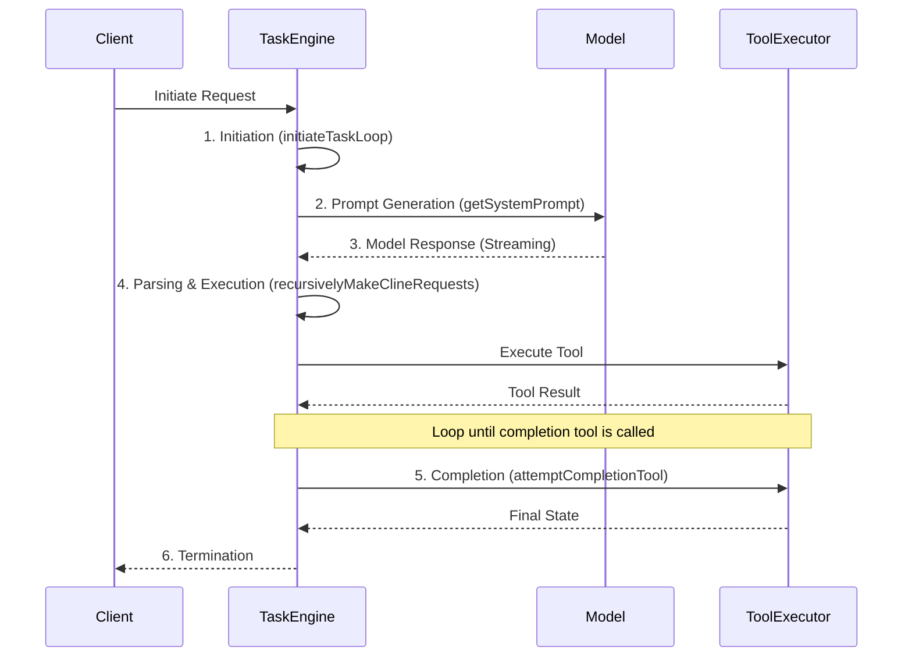

# Orchestrator Task Lifecycle

**Purpose:** This document provides a detailed, step-by-step description of the orchestrator's task lifecycle, from the moment a request is received to its final completion. It covers state transitions, the execution loop, and subtask management.

Table of Contents

- [1. Related Documents](#1-related-documents)
- [2. Lifecycle Overview](#2-lifecycle-overview)
- [3. Lifecycle Stages in Detail](#3-lifecycle-stages-in-detail)
- [4. State Transitions](#4-state-transitions)
- [5. The Execution Loop: `recursivelyMakeClineRequests`](#5-the-execution-loop-recursivelymakeclinerequests)
- [6. Subtask Lifecycle](#6-subtask-lifecycle)
- [7. Navigation Footer](#7-navigation-footer)

---

### 1. Related Documents

- **[ORCHESTRATOR_INDEX.md](ORCHESTRATOR_INDEX.md)**: The master index for all orchestrator documentation.
- **[ORCHESTRATOR_ARCHITECTURE.md](ORCHESTRATOR_ARCHITECTURE.md)**: Describes the components involved in the lifecycle.
- **[ORCHESTRATOR_TASK_DELEGATION.md](ORCHESTRATOR_TASK_DELEGATION.md)**: Focuses specifically on the subtask creation and management process.
- **[ORCHESTRATOR_ERROR_HANDLING.md](ORCHESTRATOR_ERROR_HANDLING.md)**: Explains how errors are handled at various stages of the lifecycle.

[Back to Top](#orchestrator-task-lifecycle)

---

### 2. Lifecycle Overview

The task lifecycle is a stateful, iterative process managed by the `Task` engine. It is designed to handle complex, multi-step workflows that may involve multiple interactions with the language model and various tools. The entire process is kicked off by a single call and runs until a completion state is reached.

[Back to Top](#orchestrator-task-lifecycle)

---

### 3. Lifecycle Stages in Detail

#### Stage 1: Initiation

A task begins when an external caller (e.g., the VS Code extension UI) invokes the [`initiateTaskLoop`](../src/core/task/Task.ts:1699) function. At this stage, the `Task` object is created, initial state is set up, and the context for the task is established.

#### Stage 2: Prompt Generation

The `Task` engine constructs the initial prompt to be sent to the language model. This is handled by the [`getSystemPrompt`](../src/core/task/Task.ts:2499) function, which assembles the user's request, conversation history, available tools, and formatting rules like [`markdownFormatting_SECTION`](../src/core/prompts/sections/markdown-formatting.ts:1).

#### Stage 3: Model Response & Parsing

The prompt is sent to the model. The orchestrator's `StreamingParser` begins processing the response as it arrives. It actively scans for tool-call syntax, allowing the system to react instantly without waiting for the full response.

#### Stage 4: Parsing & Execution Loop

This is the core interactive phase of the lifecycle, driven by [`recursivelyMakeClineRequests`](../src/core/task/Task.ts:1735). When the parser identifies a valid tool call, the `ToolExecutor` validates and runs it. The result of the tool execution is then appended to the conversation history, and the loop continues by sending the updated context back to the model.

#### Stage 5: Completion

The loop terminates when the model invokes the special [`attemptCompletionTool`](../src/core/tools/attemptCompletionTool.ts:35). This signals that the task's objective has been met. The tool is responsible for packaging the final result and setting the task's status to "completed."

#### Stage 6: Termination

The `Task` engine performs final cleanup, persists the final state, and returns the result to the initial caller. The lifecycle for this task instance is now complete.

[Back to Top](#orchestrator-task-lifecycle)

---

### 4. State Transitions

A task can exist in several states throughout its lifecycle:

- `pending`: The task has been created but the execution loop has not yet begun.
- `in_progress`: The task is actively engaged in the model-response/tool-execution loop.
- `awaiting_subtask`: The task has delegated work to a subtask and is paused, waiting for it to complete.
- `completed`: The task has successfully finished via `attemptCompletionTool`.
- `failed`: The task terminated due to an unrecoverable error or reaching its mistake limit.

[Back to Top](#orchestrator-task-lifecycle)

---

### 5. The Execution Loop: `recursivelyMakeClineRequests`

The function [`recursivelyMakeClineRequests`](../src/core/task/Task.ts:1735) is the engine of the lifecycle. It is not a simple loop but a recursive function that represents one full turn of the conversation with the model.

1.  **Call Model**: Sends the current context (history, tool results) to the model.
2.  **Parse Response**: The `StreamingParser` processes the output.
3.  **Execute Tools**: If tool calls are found, they are executed.
4.  **Recurse**: The function calls itself with the updated context, continuing the "conversation" until a terminal state (completion or failure) is reached.

[Back to Top](#orchestrator-task-lifecycle)

---

### 6. Subtask Lifecycle

When the model determines a part of the task requires isolated execution, it can use the [`startSubtask`](../src/core/task/Task.ts:1628) tool.

1.  **Pause Parent**: The parent task's state is set to `awaiting_subtask`.
2.  **Create Child**: A new `Task` instance is created with a specific, narrowed-down objective. This child task has its own independent lifecycle.
3.  **Execute Child**: The child task runs through its own initiation, execution, and completion stages.
4.  **Resume Parent**: Once the child task calls [`completeSubtask`](../src/core/task/Task.ts:1669), its result is passed back to the parent. The parent task's state is switched back to `in_progress`, and its execution loop continues, now with the information from the completed subtask.

[Back to Top](#orchestrator-task-lifecycle)

---

### 7. Navigation Footer

You have reached the end of the lifecycle document. Return to the [Master Index](ORCHESTRATOR_INDEX.md) or proceed to the [Task Delegation Document](ORCHESTRATOR_TASK_DELEGATION.md).

[Back to Top](#orchestrator-task-lifecycle)

---

End of document.
