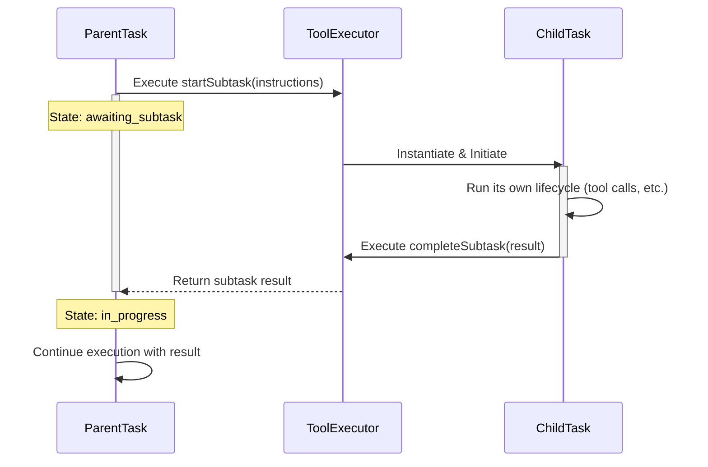

# Orchestrator Task Delegation

**Purpose:** This document explains the mechanism and strategy behind task delegation in the Kilo Code Orchestrator. It covers how complex problems are decomposed into smaller, manageable subtasks and the lifecycle of those subtasks.

Table of Contents

- [1. Related Documents](#1-related-documents)
- [2. The Philosophy of Delegation](#2-the-philosophy-of-delegation)
- [3. The Subtask Mechanism](#3-the-subtask-mechanism)
- [4. Subtask Workflow Diagram](#4-subtask-workflow-diagram)
- [5. Key Symbols and Their Roles](#5-key-symbols-and-their-roles)
- [6. When to Use Subtasks](#6-when-to-use-subtasks)
- [7. Navigation Footer](#7-navigation-footer)

---

### 1. Related Documents

- **[ORCHESTRATOR_INDEX.md](ORCHESTRATOR_INDEX.md)**: The master index for all orchestrator documentation.
- **[ORCHESTRATOR_LIFECYCLE.md](ORCHESTRATOR_LIFECYCLE.md)**: Describes the overall task lifecycle where delegation occurs.
- **[ORCHESTRATOR_TOOLS_REFERENCE.md](ORCHESTRATOR_TOOLS_REFERENCE.md)**: Provides details on the `startSubtask` and `completeSubtask` tools.

[Back to Top](#orchestrator-task-delegation)

---

### 2. The Philosophy of Delegation

The orchestrator's task delegation capability is a form of recursive problem decomposition. Instead of attempting to solve a large, multi-faceted problem in a single, long-running task, the system can break it down into a series of smaller, more focused subtasks.

This approach has several advantages:

- **Isolation**: Subtasks have their own context and history, preventing prompt contamination and allowing the model to focus on a specific goal.
- **Specialization**: A subtask can be initiated in a different `Mode` than its parent, granting it access to a specialized set of tools. For example, a `code` mode task could delegate to a `test` mode subtask.
- **Resilience**: An error in a subtask does not automatically fail the parent task. The parent can decide how to proceed based on the subtask's result.
- **Clarity**: It creates a clear, hierarchical structure for complex work, which is easier to debug and manage.

[Back to Top](#orchestrator-task-delegation)

---

### 3. The Subtask Mechanism

Task delegation is facilitated by a pair of specialized tools:

1.  **`startSubtask`**: This tool is called by the model when it identifies a piece of work that should be handled in isolation. It pauses the current (parent) task and initiates a new (child) task.
2.  **`completeSubtask`**: This tool is called by the child task when its objective is complete. It terminates the child task and returns its result to the waiting parent task, which then resumes its own execution loop.

The parent task is effectively in an `awaiting_subtask` state while the child task is active.

[Back to Top](#orchestrator-task-delegation)

---

### 4. Subtask Workflow Diagram

[Back to Top](#orchestrator-task-delegation)

---

### 5. Key Symbols and Their Roles

- [`startSubtask`](../src/core/task/Task.ts:1628): The entry point for delegation. This function is responsible for pausing the parent task and creating the new child `Task` instance. It takes the instructions for the new subtask as an argument.
- [`completeSubtask`](../src/core/task/Task.ts:1669): The exit point for a subtask. This function packages the subtask's final output and signals the parent task to resume its operation.
- **`newTaskTool`**: While not strictly for subtasks, the [`newTaskTool`](../src/core/tools/newTaskTool.ts:14) can be used to fire off independent, asynchronous tasks that do not block the parent. This is useful for "fire and forget" operations where the result is not immediately needed.

[Back to Top](#orchestrator-task-delegation)

---

### 6. When to Use Subtasks

The decision to delegate is made by the language model based on the complexity of the task at hand. Common scenarios for delegation include:

- **Mode Switching for a Specific Action**: A task in `architect` mode needs to write code. It delegates to a subtask in `code` mode to perform the file modifications.
- **Complex Queries**: A task needs to gather information from multiple sources. It can delegate a subtask for each source to run in parallel (if the architecture supports it) or sequentially.
- **Refactoring**: A large-scale refactoring task can be broken down into subtasks for each file or module that needs to be changed.
- **Verification Steps**: A task can delegate to a `test` mode subtask to run verification checks on the code it has just written.

[Back to Top](#orchestrator-task-delegation)

---

### 7. Navigation Footer

You have reached the end of the task delegation document. Return to the [Master Index](ORCHESTRATOR_INDEX.md) or proceed to the [Tools Reference](ORCHESTRATOR_TOOLS_REFERENCE.md).

[Back to Top](#orchestrator-task-delegation)

---

End of document.
