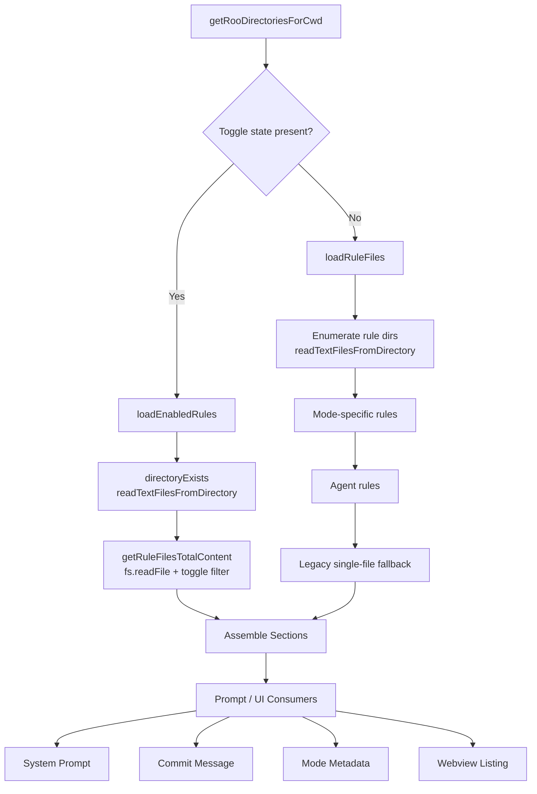
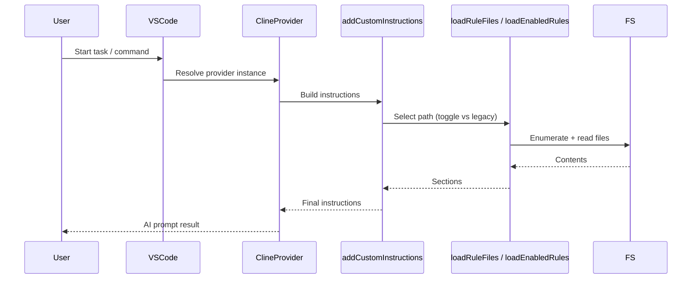
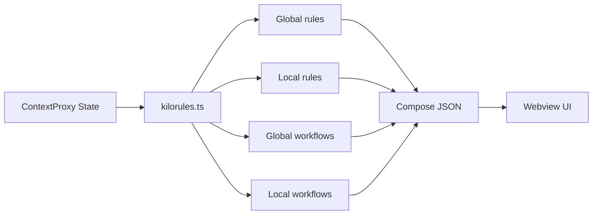

# Rules Loading and Usage Summary

This document provides a code-referenced description of how rule files under `.kilocode/rules` (plus legacy fallback files) are discovered, read, filtered, merged, and consumed inside the extension. It includes a collapsible Table of Contents and Mermaid diagrams for GitHub-friendly visualization.

---

<strong>Table of Contents</strong>

- [1. Core Implementation Files](#1-core-implementation-files)
- [2. Directory Resolution](#2-directory-resolution)
- [3. Rule Discovery & Loading Paths](#3-rule-discovery--loading-paths)
    - [3.1 Standard (Non-Toggle) Path](#31-standard-non-toggle-path)
    - [3.2 Toggle-Based Path](#32-toggle-based-path)
    - [3.3 Webview / UI Access](#33-webview--ui-access)
- [4. File Inclusion & Filtering](#4-file-inclusion--filtering)
- [5. Fallback & Legacy Support](#5-fallback--legacy-support)
- [6. Agent & Mode-Specific Augmentation](#6-agent--mode-specific-augmentation)
- [7. Invocation Lifecycle](#7-invocation-lifecycle-when-rules-are-loaded)
- [8. Data Flow Summary (Diagrams)](#8-data-flow-summary-diagrams)
- [9. Error Handling Characteristics](#9-error-handling-characteristics)
- [10. Caching & Performance](#10-caching--performance)
- [11. Edge Cases & Notable Behaviors](#11-edge-cases--notable-behaviors)
- [12. Test Coverage](#12-test-coverage-representative-files)
- [13. Related Workflow Toggling](#13-related-supplemental-ruleworkflow-toggling)
- [14. Security & Robustness Notes](#14-security--robustness-notes)
- [15. Quick Reference Matrix](#15-quick-reference-matrix)
- [16. High-Level Summary](#16-high-level-summary)
- [17. Potential Improvement Opportunities](#17-potential-improvement-opportunities-non-implemented)
- [18. File Index](#18-file-index-all-referenced)
- [Back to Top](#rules-loading-and-usage-summary)

---

## Core Implementation Files

### Primary Loader & Prompt Assembler

- [`src/core/prompts/sections/custom-instructions.ts`](/src/core/prompts/sections/custom-instructions.ts#L1)
  Key function blocks (approx line ranges):
    - `safeReadFile` (32–43) – Reads UTF-8 text; swallows `ENOENT` / `EISDIR` returning `""`; rethrows unexpected errors (e.g. permissions).
    - `directoryExists` (48–55) – Boolean `fs.stat` wrapper; returns false on error.
    - `resolveDirectoryEntry` (62–81) – Determines if a Dirent is file/symlink; delegates symlink handling.
    - `resolveSymLink` (86–122) – Resolves symlink target (file or directory). If directory, enumerates entries (recursively) with depth cap (`MAX_DEPTH = 5`).
    - `readTextFilesFromDirectory` (127–192) – Traverses a `rules` directory aggregating file metadata:
        - Uses `fs.readdir` with recursion (including symlinked folders).
        - Filters entries via `shouldIncludeRuleFile`.
        - Skips binary files (binary detection helper).
        - Reads each text file content (using `safeReadFile`).
        - Sorts by original (symlink) filename case-insensitively.
    - `formatDirectoryContent` (197–205) – Produces a section block: `# Rules from <path>:\n<content>`.
    - `loadRuleFiles` (211–250) – Iterates candidate roo directories (global + project) and assembles sections.
    - `loadAgentRulesFile` (256–295) – Loads optional `AGENTS.md` / `AGENT.md`.
    - `addCustomInstructions` (297–421) – Orchestrates resolution + assembly (legacy, mode-specific, agent, toggle-aware delegation).
    - `shouldIncludeRuleFile` (436–471) – Filename-based exclusion (cache/system/ignored patterns).

### Toggle-Aware Loader

- [`src/core/prompts/sections/kilo.ts`](/src/core/prompts/sections/kilo.ts#L60)
  Functions:
    - `loadEnabledRules` (60–66 header) – Public aggregation honoring per-file toggles.
    - `loadEnabledRulesFromDirectory` – Directory existence + listing + formatting.
    - `getRuleFilesTotalContent` (near 13–33) – Re-reads each file (`fs.readFile`), applies toggle filtering by absolute path, concatenates annotated blocks.
      Behavior:
    - Global path: `path.join(os.homedir(), GlobalFileNames.kiloRules)`
    - Local path: `path.join(cwd, GlobalFileNames.kiloRules)`
    - Always re-reads; no cache layer.

### Shared Constants

- [`src/shared/globalFileNames.ts`](/src/shared/globalFileNames.ts#L1)
  Defines canonical names (e.g. `kiloRules`, workflows, custom modes, MCP settings).

### Webview Rule Extraction (Supplemental)

- [`src/core/webview/kilorules.ts`](/src/core/webview/kilorules.ts#L1)
  Supplies enabled rules + workflows to UI (toggle-driven), using `getEnabledRulesFromDirectory` analogs plus state from `ContextProxy`.

[Back to Top](#rules-loading-and-usage-summary)

---

## Directory Resolution

- [`src/services/roo-config/index.ts`](/src/services/roo-config/index.ts#L1)
    - `getGlobalRooDirectory` → `homedir + "/.kilocode"`
    - `getProjectRooDirectoryForCwd` → prefers project `.kilocode` (legacy `.roo` support)
    - `getRooDirectoriesForCwd` → ordered `[global, project]`
    - `loadConfiguration` → legacy `rules/rules.md` single-file context

[Back to Top](#rules-loading-and-usage-summary)

---

## Rule Discovery & Loading Paths

### Standard (Non-Toggle) Path

1. `addCustomInstructions` chooses path:
    - Toggle state present → delegate to `loadEnabledRules`
    - Otherwise → `loadRuleFiles`
2. `loadRuleFiles` processing:
    - For each roo directory:
        - Detect `<rooDir>/rules`
        - `readTextFilesFromDirectory` for enumeration
    - Fallback to legacy single-file names if directory absent
    - Include mode-specific variants (`rules-{mode}` or `.kilocoderules-{mode}`)
    - Include agent rules (`AGENTS.md` / `AGENT.md`)

### Toggle-Based Path

- `loadEnabledRules` enumerates global then local `.kilocode/rules`
- Re-filters by toggle maps
- Re-reads file bodies (freshness over reuse)

### Webview / UI Access

- `kilorules.ts` loads enabled rules + workflows for UI, not direct prompt assembly.

[Back to Top](#rules-loading-and-usage-summary)

---

## File Inclusion & Filtering

- `shouldIncludeRuleFile` screens ignored/system/cache artifacts
- Binary detection excludes non-text files
- Symlinks traversed (bounded recursion depth = 5)
- Stable ordering: case-insensitive original (symlink) filename

[Back to Top](#rules-loading-and-usage-summary)

---

## Fallback & Legacy Support

- Legacy single-file names: `.kilocoderules`, `.roorules`, `.clinerules`
- Mode-specific legacy: `.kilocoderules-{mode}`
- One-time warning mechanism (legacy usage) via internal flag
- Only invoked when no structured directory-based rules found

[Back to Top](#rules-loading-and-usage-summary)

---

## Agent & Mode-Specific Augmentation

- Agent rules: search `AGENTS.md` → fallback `AGENT.md`
- Mode-specific directory: `rules-{mode}`
- Mode-specific single-file fallback: `.kilocoderules-{mode}`

[Back to Top](#rules-loading-and-usage-summary)

---

## Invocation Lifecycle (When Rules Are Loaded)

Lazy (on-demand) loading only:

- [`src/core/prompts/system.ts`](src/core/prompts/system.ts:1)
- [`src/services/commit-message/CommitMessageProvider.ts`](src/services/commit-message/CommitMessageProvider.ts:1)
- [`src/shared/modes.ts`](src/shared/modes.ts:1)
- [`src/core/webview/ClineProvider.ts`](src/core/webview/ClineProvider.ts:1)
- [`src/core/webview/kilorules.ts`](src/core/webview/kilorules.ts:1)
- Validation / existence check: [`src/core/task/Task.ts`](src/core/task/Task.ts:2490)
- Activation: [`src/extension.ts`](src/extension.ts:1) does NOT force load

Result: no activation-time I/O → faster startup; always current view of disk.

[Back to Top](#rules-loading-and-usage-summary)

---

## Data Flow Summary (Diagrams)

### Loader Control Flow

### Invocation Lifecycle

### Webview Aggregation

[Back to Top](#rules-loading-and-usage-summary)

---

## Error Handling Characteristics

| Aspect                    | Behavior                                                         |
| ------------------------- | ---------------------------------------------------------------- |
| Missing file / directory  | `safeReadFile` returns empty; directory absence short-circuited. |
| Permission errors         | Propagated (unless benign `ENOENT` / `EISDIR`).                  |
| Symlink resolution errors | Skipped per-entry; traversal continues.                          |
| Binary files              | Excluded silently.                                               |
| Toggle path read errors   | Propagate (entire Promise rejects).                              |
| Recursion depth           | Capped at 5 to prevent loops.                                    |

Design bias: resilient enumeration + selective propagation.

[Back to Top](#rules-loading-and-usage-summary)

---

## Caching & Performance

| Dimension                   | Status                         |
| --------------------------- | ------------------------------ |
| Directory caching           | None                           |
| File content caching        | None                           |
| Toggle filtering complexity | O(n) per invocation            |
| Freshness                   | Guaranteed (always re-read)    |
| Potential optimization      | Memoize by mtime + toggle hash |

[Back to Top](#rules-loading-and-usage-summary)

---

## Edge Cases & Notable Behaviors

| Case                              | Handling                                            |
| --------------------------------- | --------------------------------------------------- |
| Symlink loops                     | Depth guard only (sufficient).                      |
| Frequent prompt rebuilds          | Repeated disk I/O.                                  |
| Mixed legacy + new                | New directory sections precede legacy file content. |
| Disabled toggles for missing file | Ignored (no error).                                 |
| Binary target                     | Skipped.                                            |
| Missing agent file                | Omitted silently.                                   |

[Back to Top](#rules-loading-and-usage-summary)

---

## Test Coverage (Representative Files)

- [`src/core/prompts/sections/__tests__/custom-instructions.spec.ts`](src/core/prompts/sections/__tests__/custom-instructions.spec.ts:1)
- [`src/core/prompts/sections/__tests__/custom-instructions-global.spec.ts`](src/core/prompts/sections/__tests__/custom-instructions-global.spec.ts:1)
- [`src/core/prompts/__tests__/add-custom-instructions.spec.ts`](src/core/prompts/__tests__/add-custom-instructions.spec.ts:1)
- [`src/services/roo-config/__tests__/index.spec.ts`](src/services/roo-config/__tests__/index.spec.ts:1)

[Back to Top](#rules-loading-and-usage-summary)

---

## Related Supplemental Rule/Workflow Toggling

- [`src/core/context/instructions/workflows.ts`](src/core/context/instructions/workflows.ts:1) – Synchronizes workflow toggles for `.kilocode/workflows` (global + local).

[Back to Top](#rules-loading-and-usage-summary)

---

## Security & Robustness Notes

| Concern                   | Mitigation                                         |
| ------------------------- | -------------------------------------------------- |
| Arbitrary symlink targets | Depth cap + plain-text handling.                   |
| Large rule sets           | Linear traversal; potential I/O latency.           |
| Permission-denied         | Propagated (toggle path) or skipped (safe read).   |
| Race (create/delete)      | Benign disappearance tolerated via `safeReadFile`. |

[Back to Top](#rules-loading-and-usage-summary)

---

## Quick Reference Matrix

| Loader Path              | Multi-File | Toggles | Symlinks              | Legacy Fallback        | Error Strategy                  | Sorting                        |
| ------------------------ | ---------- | ------- | --------------------- | ---------------------- | ------------------------------- | ------------------------------ |
| `loadRuleFiles`          | Yes        | No      | Yes                   | Yes                    | Skip benign, rethrow unexpected | Case-insensitive original name |
| `loadEnabledRules`       | Yes        | Yes     | Via listing + re-read | No (assumes directory) | Propagate read errors           | Global→Local order             |
| `kilorules.ts` (webview) | Yes        | Yes     | Yes                   | Not applicable         | Similar to toggle path          | N/A (structured sets)          |

[Back to Top](#rules-loading-and-usage-summary)

---

## High-Level Summary

Rules load on demand (no activation cost). Two principal strategies:

1. Non-toggle (multi-file + legacy fallback)
2. Toggle-aware (filtered, always re-read)
   Plus UI aggregation for rule/workflow visibility & toggling.

No caching: prioritizes correctness and freshness over performance.

[Back to Top](#rules-loading-and-usage-summary)

---

## Potential Improvement Opportunities (Non-Implemented)

| Topic                              | Rationale                                  |
| ---------------------------------- | ------------------------------------------ |
| Memoization (mtime + toggle hash)  | Reduce repeated disk I/O.                  |
| Harmonize error semantics          | Consistent per-file skip in toggle path.   |
| Symlink visited set                | Explicit cycle clarity (beyond depth cap). |
| Front matter / metadata extraction | Structured rule categorization.            |

[Back to Top](#rules-loading-and-usage-summary)

---

## File Index (All Referenced)

- [`src/core/prompts/sections/custom-instructions.ts`](src/core/prompts/sections/custom-instructions.ts:1)
- [`src/core/prompts/sections/kilo.ts`](src/core/prompts/sections/kilo.ts:1)
- [`src/core/webview/kilorules.ts`](src/core/webview/kilorules.ts:1)
- [`src/services/roo-config/index.ts`](src/services/roo-config/index.ts:1)
- [`src/shared/globalFileNames.ts`](src/shared/globalFileNames.ts:1)
- [`src/core/prompts/system.ts`](src/core/prompts/system.ts:1)
- [`src/services/commit-message/CommitMessageProvider.ts`](src/services/commit-message/CommitMessageProvider.ts:1)
- [`src/shared/modes.ts`](src/shared/modes.ts:1)
- [`src/core/task/Task.ts`](src/core/task/Task.ts:1)
- [`src/core/context/instructions/workflows.ts`](src/core/context/instructions/workflows.ts:1)
- Tests:
    - [`src/core/prompts/sections/__tests__/custom-instructions.spec.ts`](src/core/prompts/sections/__tests__/custom-instructions.spec.ts:1)
    - [`src/core/prompts/sections/__tests__/custom-instructions-global.spec.ts`](src/core/prompts/sections/__tests__/custom-instructions-global.spec.ts:1)
    - [`src/core/prompts/__tests__/add-custom-instructions.spec.ts`](src/core/prompts/__tests__/add-custom-instructions.spec.ts:1)
    - [`src/services/roo-config/__tests__/index.spec.ts`](src/services/roo-config/__tests__/index.spec.ts:1)

---

_End of document._
