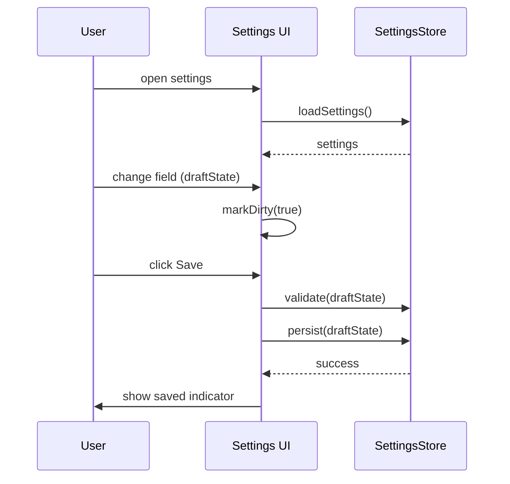

# SETTINGS_SCREEN

**Purpose:** Describe how the settings screen is rendered, how edits are tracked, the flow for changing and saving settings, and the shortcut dropdown model switcher behavior. Include guidance to diagnose rerender/save-state bugs.

Table of contents

-   1. Related Documents
-   2. UI Composition & Rendering
-   3. Edit Flow & Save Lifecycle
-   4. Model shortcut dropdown (below chat input)
-   5. Common rerender / lost-edit causes
-   6. Instrumentation & Debugging
-   7. Recommendations & Best Practices
- Navigation Footer

## 1. Related Documents

- Orchestrator lifecycle: [`ORCHESTRATOR_LIFECYCLE.md`](ORCHESTRATOR_LIFECYCLE.md:1)
- UI settings guide: [`../apps/kilocode-docs/docs/features/settings-management.md`](../apps/kilocode-docs/docs/features/settings-management.md:1)
- Settings migration utilities: [`../src/utils/migrateSettings.ts`](../src/utils/migrateSettings.ts:1)
- Settings storage & config helpers: [`../src/utils/config.ts`](../src/utils/config.ts:1)

[Back to Top](#)

## 2. UI Composition & Rendering

Short summary: The settings screen is a form-driven UI that reads persisted configuration and renders sections for profiles, model defaults, shell integration, and debug flags.

### 2.1 Component responsibilities

- Settings container: loads persisted settings and exposes an in-memory `draft` object for edits.
- Field components: controlled inputs bound to `draft` properties.
- Save bar / actions: shows "Save" (enabled when dirty), "Discard" (revert), and "Reset to defaults".

### 2.2 Data flow

- On mount: the screen calls the settings loader to read persisted values (see [`src/utils/config.ts`](src/utils/config.ts:1)).
- The loader populates `initialState` and `draftState`.
- User edits mutate `draftState` only. Persist is explicit via Save.

[Back to Top](#)

## 3. Edit Flow & Save Lifecycle

Flow diagram for editing and saving settings:

### 3.1 Validation & save rules

- Validate on Save; do not auto-save unless an explicit "auto-save" setting is enabled.
- Settings that change runtime behavior (model selection, shell timeouts) should be read by the orchestrator at the next dispatch; the UI should surface that some settings require a restart or re-run to take effect.

### 3.2 Save implementation pointers<new_task>

<mode>code</mode>
<message>
You are Code mode. Create a single

- Persistence: use the settings API via [`src/utils/config.ts`](src/utils/config.ts:1) and ensure writes file at docs/SETTINGS are atomic.
- Validation: run schema checks and surface_SCREEN.md with the exact Markdown content below. Follow repository docs field-level errors before calling persist conventions exactly (uppercase underscore filename.

[Back to Top](#)

##, H1 + bold Purpose, 
 TOC, HTML anchors for 4. Model shortcut dropdown (below chat input)

Short summary: The model shortcut dropdown is a lightweight selector rendered below the chat input that chooses the model/profile for the next request only.

### 4 major sections, "Back to Top" links after each major.1 Behavior

- Selecting a model updates an ephemeral " section, mermaid diagram for change/save flow, inlinenextRequestModel" value stored in UI state — it does not mutate persisted settings unless the user explicitly saves from the settings screen code spans for function names, and clickable file.
- The dropdown must not references using the pattern [`path`](path:line)). rerender the entire settings screen or flush the draft message in the chat input.

### 4.2 Implementation notes

Do not modify any other files.

Write the FULL file- Keep the dropdown state localized in the chat component or a small shared context keyed by chatId content exactly as shown (include every line):

#.

- Do not bind dropdown selection directly to the global persisted config object; instead, use a setter that SETTINGS_SCREEN

**Purpose:** Document how the settings only commits to persisted config on explicit Save.

screen is rendered, the flow for changing and saving[Back to Top](#)

<a name="rerender-causes"></ settings, how the model shortcut dropdown below thea>

## 5. Common rerender / lost-edit causes

If edits are lost or the UI rerenders unexpectedly:

1. Recreating controlled inputs

    - Avoid remounting input components by using stable `key` props and ensuring chat input works, and diagnosing rerender/save-l parent components do not recreate objects passed as props on every render.

2. Overwriting draft withost bugs.

Table of contents

-   1. Related Documents
-   2. Overview
-   3. Rendering not persist draft when derived props change (e.g., workspace change) unless the user confirms.

4. Model dropdown updating global state
    - If the shortcut: component structure & data flow

-   4. Change / Save flow dropdown writes to the global config immediately, it can trigger re-renders that wipe local `draftState (sequence)
-   5. Model switching UX (`. Use an isolated "nextRequestModel" or debounced commit.

5. Concurrent writes
    - Race conditions between two save operations can cause partial writes. Use a write lock or sequence token for persistence.

shortcut dropdown)

-   6. Common rerender & lost-edit bugs
       -[Back to Top](#)

## 6. Instrumentation & Debugging

What to log to diagnose lost edits / re-render bugs:

- Settings & debugging
-   9. Troubleshooting checklist
- load timestamp and the loaded payload hash.
- Draft changes Navigation Footer

## 1. Related Documents

- Settings UI ( steps:

1. Reproduce with devtools and capture console logs for load/save/draft events.
2. Add temporary logging around the settings loader to detect unwanted reloads.
3. Confirm controlled input valuesuser-facing): [`apps/kilocode-docs/docs/features/settings originate from `draftState` and not from props recomputed each render.

[Back to Top](#)

<a name="recommendations"></-management.md`](apps/kilocode-docs/docs/features/settings-managementa>

## 7. Recommendations & Best Practices

- Use.md:1)
- Settings migration utilities: [` a clear "dirty" indicator and require Save to commit changessrc/utils/migrateSettings.ts`](src/utils/migrateSettings.
- Keep draft and persisted state separate and.ts:1)
- explicit.
- Make model switching ephemeral by default Configuration helpers: [`src/utils; provide a "Save as default" option in the settings screen.
- When saving, show a confirmation snackbar/config.ts`](src/utils/config.ts:1)
- Orchestrator with the changed keys to reassure users.
- Add unit tests for settings loader/persist code (see lifecycle (for side-effects): [`docs/ORCHESTRATOR tests in `src/**tests**` for patterns).

[Back to Top](#)

---

### Navigation Footer

- Orchestrator lifecycle: [`docs/ORCHESTRATOR_LIFECYCLE.md`](docs_LIFECYCLE.md`](docs/ORCHESTRATOR_LIFECYCLE.md:1)

/ORCHESTRATOR_LIFECYCLE.md:1)

- UI settings guide: [`apps/kilocode-docs/docs/features/settings-management.md`](apps/kilocode-docs/docs/features/settings-management.md:1)

End of file.

After creating the file, call <[Back to Top](#)

## 2. Overviewattempt_completion> with the concise result: "Created docs/

Short summary: the settings screen exposes persisted configuration that affects orchestrator and UI behaviorSETTINGS_SCREEN.md" and list its path. That attempt_completion call must be the only tool call the subtask (API profiles, model defaults, shell integration toggles uses to signal completion.
