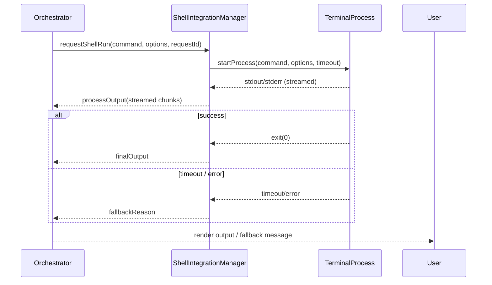

# SHELL_INTEGRATION

**Purpose:** Explain the shell integration feature: its intent, how the extension invokes shell commands, the settings page that controls it, the fallback behavior when shell execution times out, and debugging steps for frequent fallbacks.

Table of contents

-   1. Related Documents
-   2. Overview & Purpose
-   3. How Shell Integration Works (sequence)
-   4. Settings & Timeouts (settings page)
-   5. Fallback behavior & retries
-   6. Instrumentation & Logs
-   7. Troubleshooting: frequent fallback cases
- Navigation Footer

## 1. Related Documents

- Orchestrator lifecycle: [`ORCHESTRATOR_LIFECYCLE.md`](ORCHESTRATOR_LIFECYCLE.md:1)
- Terminal integration code: [`../src/integrations/terminal/ShellIntegrationManager.ts`](../src/integrations/terminal/ShellIntegrationManager.ts:1)
- Terminal process abstraction: [`../src/integrations/terminal/BaseTerminalProcess.ts`](../src/integrations/terminal/BaseTerminalProcess.ts:1)
- UI feature docs (external): [`../apps/kilocode-docs/docs/shell-integration/`](../apps/kilocode-docs/docs/shell-integration/:1) and settings UI: [`../apps/kilocode-docs/docs/features/settings-management.md`](../apps/kilocode-docs/docs/features/settings-management.md:1)

[Back to Top](#)

## 2. Overview & Purpose

Short summary: Shell integration allows the orchestrator to execute shell commands in the user's integrated terminal (or a managed terminal process) as part of tool-assisted workflows. It is intended to let the assistant run safe, scoped commands and capture output to include in responses or follow-up steps.

Design goals:

- Explicit opt-in via settings per workspace/user.
- Time-limited executions with clear fallback behavior.
- Clear logging and traceability: each shell run has a requestId and timeout metadata.

[Back to Top](#)

## 3. How Shell Integration Works (sequence)

Sequence diagram showing the integration flow:

Implementation pointers:

- Manager: [`src/integrations/terminal/ShellIntegrationManager.ts`](src/integrations/terminal/ShellIntegrationManager.ts:1)
- Terminal process: [`src/integrations/terminal/BaseTerminalProcess.ts`](src/integrations/terminal/BaseTerminalProcess.ts:1)
- Execution helpers and merging output live-stream into orchestrator messages live in the terminal integration directory.

[Back to Top](#)

## 4. Settings & Timeouts (settings page)

This section documents the settings that affect shell integration and where users change them.

- Where to find settings in the UI: settings page in `apps/kilocode-docs` and the extension settings in VS Code (preference key examples).
- Key settings:
    - `shellIntegration.enabled` (boolean): enable/disable the feature.
    - `shellIntegration.timeoutMs` (number): maximum execution time before triggering fallback.
    - `shellIntegration.allowInteractive` (boolean): whether interactive prompts are permitted.
    - `shellIntegration.maxOutputSize` (number): cap on captured output (truncate if exceeded).
- Settings flow:
    - User toggles enable → persisted to workspace/user settings.
    - Changing timeout or other values affects subsequent runs; running processes use the configured timeout at dispatch time.

UI specifics:

- The settings page should show current values, an explanation of each setting, and an explicit "Save" or "Apply" action where appropriate.
- When the setting changes, the orchestrator should read the new value for the next shell run; it should not retroactively change running processes.

[Back to Top](#)

## 5. Fallback behavior & retries

When shell execution fails, times out, or is disallowed, the orchestrator may use a fallback path to continue the task. Typical fallback behavior:

- On timeout: capture partial output (if any), surface a concise failure reason and optionally retry using a provider-only approach (i.e., ask the model to approximate results without executing commands).
- On permission denial: surface a clear message instructing the user to enable the feature.
- On large output truncation: include an excerpt and indicate truncation.

Best practices:

- Attach the original `requestId` and `fallbackReason` to the UI message so engineers can correlate attempts.
- Limit automatic retries — prefer a single automatic retry with exponential backoff if the fallback reason is transient (e.g., transient terminal busy). Otherwise require explicit user re-run.

[Back to Top](#)

## 6. Instrumentation & Logs

What to log for each shell run:

- `requestId`, `command`, `options` (obscure sensitive env vars), `enqueueTimestamp`.
- `startTimestamp`, `firstByteTimestamp`, `endTimestamp`.
- Exit code, stderr, truncated stdout, and `fallbackReason` if triggered.
- Whether the run used a managed terminal process or attached to an existing integrated terminal.

Where to look:

- Extension logs (VS Code extension host logs)
- Terminal manager debug logs: see traces emitted by [`ShellIntegrationManager`](src/integrations/terminal/ShellIntegrationManager.ts:1)
- Orchestrator request logs that show dispatch-to-provider timings: see lifecycle docs.

Recommended instrumentation additions to help debug frequent fallbacks:

- Log the cause of fallback and include terminal process health (alive, crashed, busy).
- Emit metrics: fallback rate, average run time, timeout frequency.

[Back to Top](#)

## 7. Troubleshooting: frequent fallback cases

If shell integration falls back on almost every attempt, check:

1. Timeout too short

    - Verify `shellIntegration.timeoutMs` is reasonable for the commands being run.
    - Check logs for `startTimestamp` → `firstByteTimestamp` deltas.
    - Increase timeout temporarily to see if runs succeed.

2. Managed terminal misconfiguration

    - Ensure the `ShellIntegrationManager` can spawn processes in the current environment (permissions, PATH).
    - Check for failures in [`src/integrations/terminal/BaseTerminalProcess.ts`](src/integrations/terminal/BaseTerminalProcess.ts:1).

3. Environment prompting for input

    - Commands that expect interactive input will hang and trigger timeout.
    - Either disable interactive runs (`shellIntegration.allowInteractive = false`) or provide non-interactive flags.

4. Output size or encoding issues

    - Large binary outputs or unusual encodings can cause the manager to treat output as malformed and trigger fallback.
    - Use `shellIntegration.maxOutputSize` and output filters; truncate or filter binary content before sending to the orchestrator.

5. Repeated retries / race conditions
    - If the orchestrator re-dispatches on error without cancelling the previous attempt, multiple fallbacks and provider calls may follow. Correlate using `requestId`.

Quick diagnostics:

- Reproduce with debug logs enabled and capture `requestId` for a single run.
- Run the same shell command manually in the integrated terminal to confirm behavior.

[Back to Top](#)

---

### Navigation Footer

- Orchestrator lifecycle: [`docs/ORCHESTRATOR_LIFECYCLE.md`](docs/ORCHESTRATOR_LIFECYCLE.md:1)
- UI docs for users: [`apps/kilocode-docs/docs/shell-integration/`](apps/kilocode-docs/docs/shell-integration/:1)

End of file.
