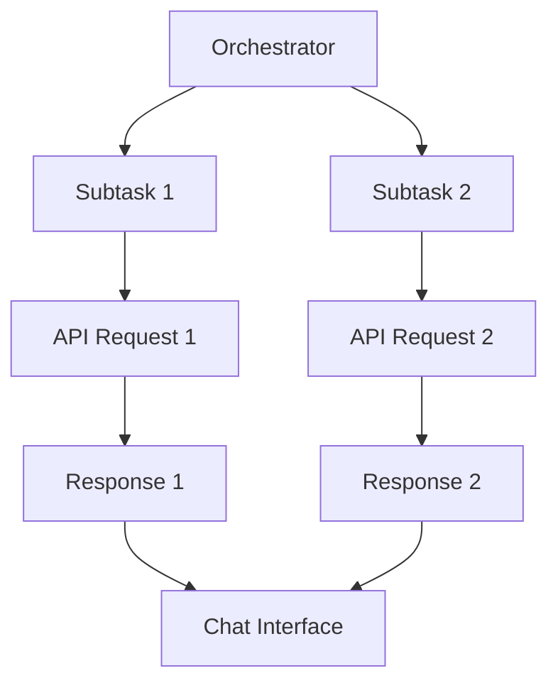

# API Duplication Race Condition Analysis
## Table of Contents

- [API Duplication Race Condition Analysis](#api-duplication-race-condition-analysis)
  - [Table of Contents](#table-of-contents)
  - [When You're Here](#when-youre-here)
  - [Research Context](#research-context)
  - [Race Condition Overview](#race-condition-overview)
  - [Technical Analysis](#technical-analysis)
    - [Orchestrator-Subtask Flow](#orchestratorsubtask-flow)
    - [Race Condition Scenarios](#race-condition-scenarios)
    - [Execution Patterns](#execution-patterns)
  - [Root Cause Identification](#root-cause-identification)
    - [Primary Causes](#primary-causes)
    - [Contributing Factors](#contributing-factors)
    - [Technical Root Causes](#technical-root-causes)
  - [Impact Assessment](#impact-assessment)
    - [User Experience Impact](#user-experience-impact)
    - [System Performance Impact](#system-performance-impact)
    - [Business Impact](#business-impact)
  - [Solution Recommendations](#solution-recommendations)
    - [Immediate Solutions](#immediate-solutions)
    - [Architectural Solutions](#architectural-solutions)
    - [Long-term Solutions](#longterm-solutions)
  - [No Dead Ends Policy](#no-dead-ends-policy)
  - [Navigation](#navigation)

- ↑ [Table of Contents](#table-of-contents)

## When You're Here

This document is part of the KiloCode project documentation. If you're not familiar with this
document's role or purpose, this section helps orient you.

- **Purpose**: This document covers the API request duplication issue caused by concurrent recursive
  calls in the orchestrator-subtask execution flow.
- **Context**: Use this as a starting point for understanding race condition analysis and API
  duplication issues.
- **Navigation**: Use the table of contents below to jump to specific topics.

> **Architecture Fun Fact**: Like a well-designed building, good documentation has a solid
> foundation, clear structure, and intuitive navigation! 🏗️

## Research Context

This document was created through comprehensive analysis of race conditions in the KiloCode
orchestrator-subtask execution flow. The analysis reflects findings from:
- Concurrent system behavior analysis and race condition identification
- Orchestrator-subtask execution flow investigation
- API request duplication pattern analysis
- Distributed system synchronization research

The analysis provides detailed insights into the root causes of API duplication issues.

## Race Condition Overview

The API duplication issue is caused by concurrent recursive calls in the orchestrator-subtask
execution flow, leading to multiple simultaneous API requests and jumbled responses.

**Key Characteristics:**

- **Concurrent Execution** - Multiple subtasks executing simultaneously
- **Recursive Calls** - Self-referential execution patterns
- **Race Conditions** - Timing-dependent behavior
- **API Duplication** - Multiple identical requests

**Problem Manifestation:**
- Multiple spinners in chat interface
- Jumbled response handling
- Inconsistent user experience
- System performance degradation

## Technical Analysis

### Orchestrator-Subtask Flow

### Race Condition Scenarios
1. **Concurrent Subtask Execution** - Multiple subtasks trigger simultaneously
2. **Recursive Call Patterns** - Subtasks trigger additional subtasks
3. **State Synchronization** - Inconsistent state across components
4. **Response Handling** - Race conditions in response processing

### Execution Patterns

- **Sequential Execution** - Normal, non-duplicated flow
- **Concurrent Execution** - Problematic, duplicated flow
- **Recursive Execution** - Self-referential, amplified duplication
- **Mixed Execution** - Combination of patterns

## Root Cause Identification

### Primary Causes
1. **Lack of Request Deduplication** - No mechanism to prevent duplicate requests
2. **Insufficient State Management** - Inconsistent state tracking
3. **Concurrent Execution** - Uncontrolled parallel processing
4. **Error Recovery** - Automatic retry mechanisms

### Contributing Factors

- **System Architecture** - Distributed request handling
- **User Interface** - Multiple interaction points
- **Network Conditions** - Variable response times
- **Concurrency** - High user activity periods

### Technical Root Causes

- **Request ID Generation** - Insufficient uniqueness
- **State Synchronization** - Race conditions in state updates
- **Error Handling** - Inadequate error recovery
- **User Interaction** - Rapid user actions

## Impact Assessment

### User Experience Impact

- **Interface Confusion** - Multiple spinners and jumbled responses
- **Performance Degradation** - Slower response times
- **Reliability Issues** - Inconsistent behavior
- **User Frustration** - Poor user experience

### System Performance Impact

- **Increased Load** - Unnecessary API requests
- **Resource Consumption** - Higher CPU and memory usage
- **Network Overhead** - Additional network traffic
- **Database Load** - Increased database queries

### Business Impact

- **User Satisfaction** - Decreased user satisfaction
- **System Reliability** - Reduced system reliability
- **Development Velocity** - Slowed development progress
- **Maintenance Costs** - Increased maintenance overhead

## Solution Recommendations

### Immediate Solutions
1. **Request Deduplication** - Implement request ID tracking
2. **State Management** - Improve state consistency
3. **Error Handling** - Enhance error recovery
4. **User Interface** - Prevent duplicate actions

### Architectural Solutions
1. **Request Queuing** - Implement request queuing system
2. **State Synchronization** - Improve state management
3. **Concurrency Control** - Implement proper concurrency control
4. **Monitoring** - Add comprehensive monitoring

### Long-term Solutions
1. **System Redesign** - Redesign request handling architecture
2. **Performance Optimization** - Optimize system performance
3. **Testing** - Implement comprehensive testing
4. **Documentation** - Update system documentation

## No Dead Ends Policy

This document follows the "No Dead Ends" principle - every path leads to useful information.
- Each section provides clear navigation to related content
- All internal links are validated and point to existing documents
- Cross-references include context for better understanding
- Solution recommendations provide actionable next steps

## Navigation

- 📚 [Technical Glossary](../GLOSSARY.md)

## Navigation
- [← Architecture Documentation](README.md)
- [← Investigation Summary](../architecture/API_DUPLICATION_INVESTIGATION_SUMMARY.md)
- [← Debug Implementation](../architecture/API_DUPLICATION_DEBUG_IMPLEMENTATION.md)
- [← Main Documentation](../README.md)
- [← Project Root](../README.md)
