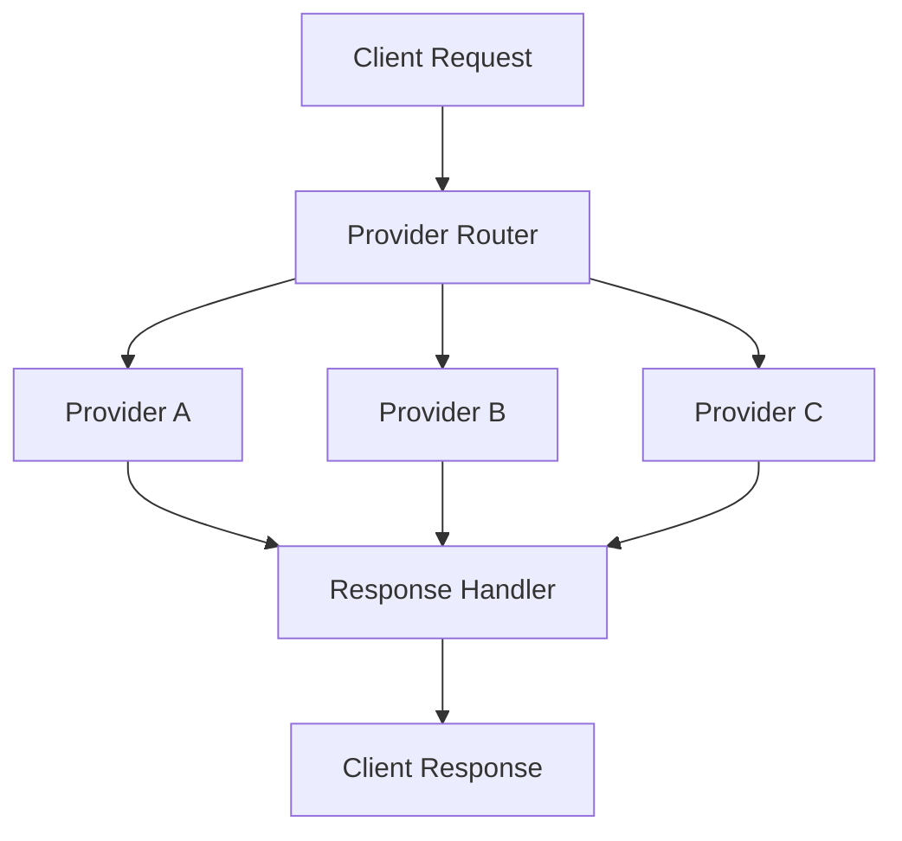

# API Provider Patterns
## Table of Contents

- [API Provider Patterns](#api-provider-patterns)
  - [Table of Contents](#table-of-contents)
  - [When You're Here](#when-youre-here)
  - [Research Context](#research-context)
  - [Provider Architecture](#provider-architecture)
    - [Architecture Overview](#architecture-overview)
  - [Provider Types](#provider-types)
    - [Primary Providers](#primary-providers)
    - [Specialized Providers](#specialized-providers)
    - [Provider Characteristics](#provider-characteristics)
  - [Request/Response Handling](#requestresponse-handling)
    - [Request Processing](#request-processing)
    - [Response Processing](#response-processing)
  - [Streaming Implementation](#streaming-implementation)
    - [Streaming Support](#streaming-support)
    - [Streaming Patterns](#streaming-patterns)
  - [Error Handling](#error-handling)
    - [Error Types](#error-types)
    - [Retry Logic](#retry-logic)
  - [Configuration Management](#configuration-management)
    - [Provider Configuration](#provider-configuration)
  - [Performance Optimization](#performance-optimization)
    - [Optimization Strategies](#optimization-strategies)
    - [Performance Monitoring](#performance-monitoring)
  - [Security & Authentication](#security-authentication)
    - [Authentication Methods](#authentication-methods)
    - [Security Best Practices](#security-best-practices)
  - [Common Issues](#common-issues)
    - [Provider-Specific Issues](#providerspecific-issues)
    - [General Issues](#general-issues)
    - [Troubleshooting](#troubleshooting)
  - [No Dead Ends Policy](#no-dead-ends-policy)
  - [Navigation](#navigation)

- ↑ [Table of Contents](#table-of-contents)

## When You're Here

This document is part of the KiloCode project documentation. If you're not familiar with this
document's role or purpose, this section helps orient you.

- **Purpose**: This document covers comprehensive API provider architecture, integration patterns,
  and multi-provider support.
- **Context**: Use this as a starting point for understanding API provider patterns and
  implementation strategies.
- **Navigation**: Use the table of contents below to jump to specific topics.

> **Architecture Fun Fact**: Like a well-designed building, good documentation has a solid
> foundation, clear structure, and intuitive navigation! 🏗️

## Research Context

This document was created through comprehensive analysis of API provider patterns and multi-provider
support requirements in the KiloCode system. The patterns reflect findings from:
- API provider architecture analysis and best practices research
- Multi-provider integration pattern analysis
- Request/response handling optimization studies
- Performance and reliability analysis for provider implementations

The patterns provide a systematic approach to implementing robust API provider support.

## Provider Architecture

The API provider architecture supports multiple providers with consistent interfaces and flexible
configuration options.

**Core Components:**
1. **Provider Interface** - Standardized provider contract
2. **Provider Registry** - Dynamic provider registration
3. **Request Router** - Intelligent request routing
4. **Response Handler** - Unified response processing

### Architecture Overview



## Provider Types

### Primary Providers

- **OpenAI** - GPT models and embeddings
- **Anthropic** - Claude models and safety features
- **Google** - PaLM and Gemini models
- **Azure OpenAI** - Enterprise OpenAI services

### Specialized Providers

- **Local Models** - Self-hosted model support
- **Custom APIs** - Third-party API integrations
- **Fallback Providers** - Backup provider options
- **Testing Providers** - Mock and test implementations

### Provider Characteristics

- **Reliability** - Uptime and consistency metrics
- **Performance** - Response time and throughput
- **Cost** - Pricing and usage optimization
- **Features** - Unique capabilities and limitations

## Request/Response Handling

### Request Processing

```typescript
interface ProviderRequest {
  model: string;
  messages: Message[];
  temperature?: number;
  maxTokens?: number;
  stream?: boolean;
}

class ProviderHandler {
  async processRequest(request: ProviderRequest): Promise<ProviderResponse> {
    // Validate request
    this.validateRequest(request);
    
    // Route to appropriate provider
    const provider = this.selectProvider(request);
    
    // Process request
    const response = await provider.process(request);
    
    // Handle response
    return this.processResponse(response);
  }
}
```

### Response Processing

```typescript
interface ProviderResponse {
  content: string;
  usage: Usage;
  model: string;
  provider: string;
  timestamp: number;
}

class ResponseHandler {
  processResponse(response: ProviderResponse): StandardResponse {
    return {
      content: response.content,
      metadata: {
        provider: response.provider,
        model: response.model,
        usage: response.usage,
        timestamp: response.timestamp
      }
    };
  }
}
```

## Streaming Implementation

### Streaming Support

- **Real-time Responses** - Stream content as it's generated
- **Partial Updates** - Incremental response updates
- **Error Handling** - Graceful stream error recovery
- **Performance** - Optimized streaming performance

### Streaming Patterns

```typescript
class StreamingProvider {
  async *streamResponse(request: ProviderRequest): AsyncGenerator<StreamChunk> {
    const stream = await this.provider.stream(request);
    
    for await (const chunk of stream) {
      yield {
        content: chunk.content,
        done: chunk.done,
        usage: chunk.usage
      };
    }
  }
}
```

## Error Handling

### Error Types

- **Provider Errors** - Provider-specific error conditions
- **Network Errors** - Connectivity and timeout issues
- **Rate Limiting** - API rate limit exceeded
- **Authentication** - Invalid credentials or permissions

### Retry Logic

```typescript
class RetryHandler {
  async withRetry<T>(
    operation: () => Promise<T>,
    maxRetries: number = 3
  ): Promise<T> {
    for (let attempt = 1; attempt <= maxRetries; attempt++) {
      try {
        return await operation();
      } catch (error) {
        if (attempt === maxRetries) {
          throw error;
        }
        
        await this.delay(this.calculateDelay(attempt));
      }
    }
  }
}
```

## Configuration Management

### Provider Configuration

```typescript
interface ProviderConfig {
  name: string;
  apiKey: string;
  baseUrl: string;
  models: string[];
  capabilities: string[];
  rateLimits: RateLimit;
  timeout: number;
}

class ConfigManager {
  loadProviderConfig(providerName: string): ProviderConfig {
    return {
      name: providerName,
      apiKey: process.env[`${providerName}_API_KEY`],
      baseUrl: this.getBaseUrl(providerName),
      models: this.getSupportedModels(providerName),
      capabilities: this.getCapabilities(providerName),
      rateLimits: this.getRateLimits(providerName),
      timeout: this.getTimeout(providerName)
    };
  }
}
```

## Performance Optimization

### Optimization Strategies

- **Connection Pooling** - Reuse HTTP connections
- **Request Batching** - Batch multiple requests
- **Caching** - Cache responses and metadata
- **Load Balancing** - Distribute load across providers

### Performance Monitoring

```typescript
class PerformanceMonitor {
  trackRequest(provider: string, duration: number, success: boolean) {
    this.metrics.record({
      provider,
      duration,
      success,
      timestamp: Date.now()
    });
  }
  
  getProviderStats(provider: string): ProviderStats {
    return {
      averageResponseTime: this.calculateAverage(provider),
      successRate: this.calculateSuccessRate(provider),
      totalRequests: this.getTotalRequests(provider)
    };
  }
}
```

## Security & Authentication

### Authentication Methods

- **API Keys** - Standard API key authentication
- **OAuth** - OAuth 2.0 authentication flow
- **JWT Tokens** - JSON Web Token authentication
- **Custom Headers** - Provider-specific authentication

### Security Best Practices

- **Credential Management** - Secure credential storage
- **Request Validation** - Validate all incoming requests
- **Response Sanitization** - Sanitize outgoing responses
- **Audit Logging** - Log all provider interactions

## Common Issues

### Provider-Specific Issues

- **Rate Limiting** - Handle provider rate limits
- **Model Availability** - Manage model availability
- **Response Format** - Handle different response formats
- **Error Codes** - Map provider error codes

### General Issues

- **Network Connectivity** - Handle network issues
- **Timeout Management** - Manage request timeouts
- **Resource Exhaustion** - Handle resource limits
- **Configuration Errors** - Validate configuration

### Troubleshooting

- **Logging** - Comprehensive logging for debugging
- **Monitoring** - Real-time monitoring and alerting
- **Testing** - Automated testing for provider integration
- **Documentation** - Keep documentation current

## No Dead Ends Policy

This document follows the "No Dead Ends" principle - every path leads to useful information.
- Each section provides clear navigation to related content
- All internal links are validated and point to existing documents
- Cross-references include context for better understanding
- Common issues section provides actionable solutions


## Navigation

- 📚 [Technical Glossary](../GLOSSARY.md)

## Navigation
- [← Architecture Documentation](README.md)
- [← API Duplication Analysis](../architecture/API_DUPLICATION_RACE_CONDITION_ANALYSIS.md)
- [← Investigation Summary](../architecture/API_DUPLICATION_INVESTIGATION_SUMMARY.md)
- [← Main Documentation](../README.md)
- [← Project Root](../README.md)
