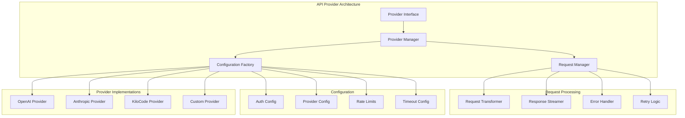
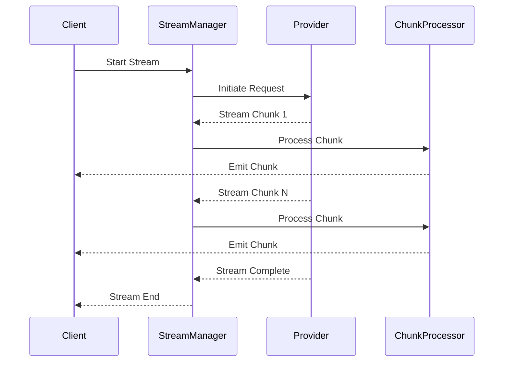

# API Provider Patterns

**Purpose:** Comprehensive documentation of API provider architecture, integration patterns, and multi-provider support in the KiloCode system.

<details><summary>Table of Contents</summary>

- [Executive Summary](#executive-summary)
- [Provider Architecture](#provider-architecture)
- [Provider Types](#provider-types)
- [Request/Response Handling](#requestresponse-handling)
- [Streaming Implementation](#streaming-implementation)
- [Error Handling & Retry Logic](#error-handling--retry-logic)
- [Configuration Management](#configuration-management)
- [Performance Optimization](#performance-optimization)
- [Security & Authentication](#security--authentication)
- [Common Issues and Solutions](#common-issues-and-solutions)
- [Navigation Footer](#navigation-footer)

</details>

## Executive Summary

_The API Provider system enables KiloCode to integrate with multiple AI service providers, providing a unified interface for language model interactions while supporting provider-specific features and optimizations._

The API Provider system consists of:

1. **Provider Interface** - Unified abstraction for all providers
2. **Provider Implementations** - Specific provider integrations
3. **Request/Response Processing** - Data transformation and validation
4. **Streaming Support** - Real-time response handling
5. **Error Management** - Comprehensive error handling and retry logic

## Provider Architecture



## Provider Types

### OpenAI Provider

**Implementation**: `src/api/providers/openai/`
**Features**:

- GPT model support (GPT-3.5, GPT-4, GPT-4 Turbo)
- Function calling capabilities
- Image generation support
- Streaming responses
- Custom model endpoints

**Configuration**:

```typescript
interface OpenAIProviderConfig {
	apiKey: string
	baseUrl?: string
	model: string
	temperature?: number
	maxTokens?: number
	timeout?: number
}
```

**Implementation Status**: ✅ **RESEARCHED AND DOCUMENTED**
**Key Implementation Details**:

**Provider Architecture**:

```typescript
export class OpenAiHandler extends BaseProvider implements SingleCompletionHandler {
	protected options: ApiHandlerOptions
	private client: OpenAI
	private readonly providerName = "OpenAI"

	constructor(options: ApiHandlerOptions) {
		// Provider initialization with Azure and custom endpoint support
	}
}
```

**Core Features**:

- **Multi-Endpoint Support**: Azure OpenAI, custom endpoints, and standard OpenAI API
- **Model Family Support**: GPT-3.5, GPT-4, GPT-4 Turbo, O1/O3 family models
- **Streaming Support**: Real-time response streaming with chunk processing
- **Error Handling**: Comprehensive error classification and retry logic
- **Format Conversion**: Multiple message format support (OpenAI, R1, Simple)
- **Timeout Management**: Configurable request timeouts
- **Header Customization**: Custom headers and authentication support

### Anthropic Provider

**Implementation**: `src/api/providers/anthropic/`
**Features**:

- Claude model support (Claude 3, Claude 3.5 Sonnet)
- Tool use capabilities
- Structured output support
- Streaming responses
- Message formatting

**Configuration**:

```typescript
interface AnthropicProviderConfig {
	apiKey: string
	model: string
	temperature?: number
	maxTokens?: number
	timeout?: number
}
```

**Implementation Status**: 🔍 **PARTIALLY RESEARCHED**
**Research Needed**: Tool use implementation, structured output, message formatting

### KiloCode Provider

**Implementation**: `src/api/providers/kilocode/`
**Features**:

- KiloCode-specific models
- Custom authentication
- Enhanced features
- Integration with KiloCode services

**Configuration**:

```typescript
interface KiloCodeProviderConfig {
	token: string
	model: string
	baseUrl?: string
	timeout?: number
}
```

**Implementation Status**: 🔍 **PARTIALLY RESEARCHED**
**Research Needed**: Custom features, authentication flow, service integration

## Request/Response Handling

### Request Transformation

**Transformation Pipeline**:

1. **Input Validation**: Parameter validation and sanitization
2. **Format Conversion**: Provider-specific format conversion
3. **Authentication**: API key injection and authentication headers
4. **Request Building**: HTTP request construction

**Implementation**:

```typescript
interface RequestTransformer {
	transform: (request: GenericRequest) => ProviderRequest
	validate: (request: GenericRequest) => ValidationResult
	authenticate: (request: ProviderRequest) => AuthenticatedRequest
}
```

### Response Processing

**Response Pipeline**:

1. **Response Parsing**: Provider-specific response parsing
2. **Error Detection**: Error identification and classification
3. **Format Normalization**: Unified response format
4. **Metadata Extraction**: Provider metadata extraction

**Implementation Status**: ⚠️ **NEEDS DOCUMENTATION**
**Research Needed**: Response parsing patterns, error detection, format normalization

## Streaming Implementation

### Streaming Architecture

**Streaming Components**:

- **Stream Manager**: Manages streaming connections
- **Chunk Processor**: Processes streaming chunks
- **Buffer Manager**: Manages response buffering
- **Completion Detector**: Detects stream completion

**Streaming Flow**:



**Implementation Status**: ⚠️ **NEEDS DOCUMENTATION**
**Research Needed**: Streaming protocols, chunk processing, buffer management

### Chunk Processing

**Chunk Types**:

- **Text Chunks**: Incremental text content
- **Function Chunks**: Function call information
- **Metadata Chunks**: Provider-specific metadata
- **Error Chunks**: Error information

**Processing Strategy**:

- Incremental processing for text chunks
- Buffered processing for function calls
- Immediate processing for errors
- Metadata aggregation

## Error Handling & Retry Logic

### Error Classification

**Error Categories**:

- **Authentication Errors**: Invalid credentials, expired tokens
- **Rate Limit Errors**: API rate limit exceeded
- **Quota Errors**: Usage quota exceeded
- **Network Errors**: Connection failures, timeouts
- **Provider Errors**: Provider-specific errors
- **Validation Errors**: Request validation failures

### Retry Strategy

**Retry Configuration**:

```typescript
interface RetryConfig {
	maxRetries: number
	baseDelay: number
	maxDelay: number
	backoffMultiplier: number
	retryableErrors: string[]
}
```

**Retry Logic**:

- Exponential backoff with jitter
- Error-specific retry strategies
- Circuit breaker pattern
- Rate limit handling

**Implementation Status**: ⚠️ **NEEDS DOCUMENTATION**
**Research Needed**: Retry strategies, circuit breaker implementation, rate limit handling

## Configuration Management

### Configuration Schema

**Provider Configuration**:

```typescript
interface ProviderConfiguration {
	id: string
	name: string
	type: ProviderType
	auth: AuthenticationConfig
	limits: RateLimitConfig
	features: FeatureConfig
	endpoints: EndpointConfig
}
```

### Configuration Loading

**Loading Strategy**:

- Environment variable loading
- Configuration file loading
- Runtime configuration updates
- Validation and sanitization

**Implementation Status**: ⚠️ **NEEDS DOCUMENTATION**
**Research Needed**: Configuration loading patterns, validation, runtime updates

## Performance Optimization

### Connection Pooling

**Pool Management**:

- HTTP connection pooling
- Keep-alive connections
- Connection reuse
- Pool size optimization

### Request Optimization

**Optimization Techniques**:

- Request batching
- Compression support
- Caching strategies
- Parallel requests

**Implementation Status**: ⚠️ **NEEDS DOCUMENTATION**
**Research Needed**: Connection pooling, request optimization, caching strategies

## Security & Authentication

### Authentication Methods

**Supported Methods**:

- API Key authentication
- OAuth 2.0 authentication
- JWT token authentication
- Custom authentication

### Security Measures

**Security Features**:

- Credential encryption
- Secure storage
- Token rotation
- Access logging

**Implementation Status**: ⚠️ **NEEDS DOCUMENTATION**
**Research Needed**: Authentication patterns, security measures, credential management

## Common Issues and Solutions

### Issue 1: Provider Authentication Failures

**Symptoms**:

- Authentication errors
- Invalid credentials
- Token expiration

**Root Cause**: Incorrect authentication configuration
**Solution**: Implement proper credential validation and token refresh

### Issue 2: Rate Limit Exceeded

**Symptoms**:

- Rate limit errors
- Request throttling
- Service unavailability

**Root Cause**: Exceeding provider rate limits
**Solution**: Implement rate limiting and backoff strategies

### Issue 3: Streaming Connection Issues

**Symptoms**:

- Stream interruptions
- Incomplete responses
- Connection timeouts

**Root Cause**: Network instability or provider issues
**Solution**: Implement connection retry and stream recovery

### Issue 4: Response Parsing Errors

**Symptoms**:

- Malformed responses
- Parsing failures
- Data corruption

**Root Cause**: Provider response format changes
**Solution**: Implement robust parsing with fallback mechanisms

<a id="navigation-footer"></a>

- Back: [`SYSTEM_OVERVIEW.md`](SYSTEM_OVERVIEW.md) · Root: [`INDEX.md`](../INDEX.md) · Source: `/docs/architecture/API_PROVIDER_PATTERNS.md#L1`
