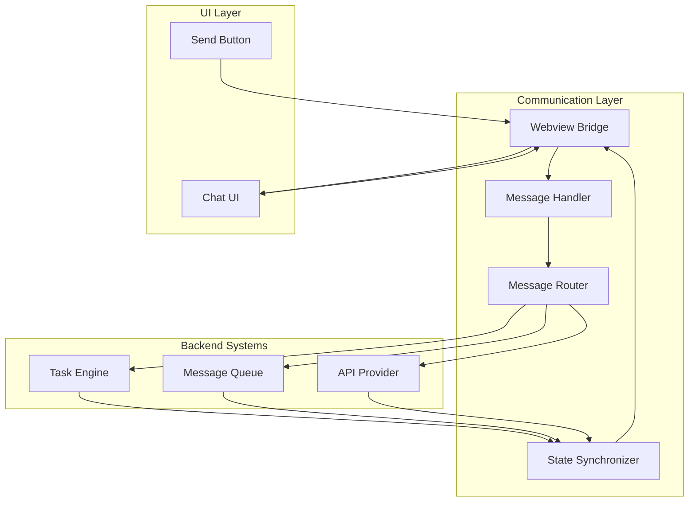

# Communication Layer System

> **System Fun Fact**: Every complex system is just a collection of simple parts working together - documentation helps us understand how! ⚙️
- *Purpose:*\* Comprehensive documentation of the Communication Layer system, including Webview Bridge
  and Message Handler components that facilitate communication between the UI and backend systems.

> **Quantum Physics Fun Fact**: The communication layer is like quantum entanglement - when the UI
> changes state, the backend instantly knows about it, just as entangled particles instantly affect
> each other regardless of distance! ⚛️

<details><summary>Table of Contents</summary>
- [Executive Summary](#executive-summary)
- [System Architecture](#system-architecture)
- [Webview Bridge](#webview-bridge)
- [Message Handler](#message-handler)
- [Message Types and Routing](#message-types-and-routing)
- [State Synchronization](#state-synchronization)
- Error Handling
- [Common Issues and Solutions](#common-issues-and-solutions)
- Navigation Footer

</details>

## Executive Summary

## Research Context
- *Purpose:*\* \[Describe the purpose and scope of this document]
- *Background:*\* \[Provide relevant background information]
- *Research Questions:*\* \[List key questions this document addresses]
- *Methodology:*\* \[Describe the approach or methodology used]
- *Findings:*\* \[Summarize key findings or conclusions]
- \*\*
- The Communication Layer system manages all communication between the UI layer and the backend
  orchestration systems. It consists of the Webview Bridge for message passing and the Message Handler
  for routing and processing incoming messages.\*

The Communication Layer consists of two main components:
1. **Webview Bridge** - Bidirectional message passing between UI and backend
2. **Message Handler** - Message routing, processing, and state synchronization

## System Architecture



## Webview Bridge

### Overview

The Webview Bridge facilitates communication between the VS Code extension (backend) and the webview
(frontend) using the `vscode.postMessage` API.
- *Location*\*: Used throughout `webview-ui/src/` components

### Message Sending
- *From UI to Backend*\*:

```typescript
// In UI components
import { vscode } from "@src/utils/vscode"

// Send message to backend
vscode.postMessage({
	type: "newTask",
	text: "Hello, world!",
	images: [],
})

// Queue message when system is busy
vscode.postMessage({
	type: "queueMessage",
	text: "Queued message",
	images: [],
})
```

### Message Receiving
- *From Backend to UI*\*:

```typescript
// In webview components
useEffect(() => {
	const handleMessage = (event: MessageEvent) => {
		const message = event.data

		switch (message.type) {
			case "state":
				// Update UI state
				updateUIState(message.state)
				break
			case "invoke":
				// Trigger UI actions
				if (message.invoke === "newChat") {
					handleChatReset()
				}
				break
			case "selectedImages":
				// Handle image selection result
				setSelectedImages(message.images)
				break
		}
	}

	window.addEventListener("message", handleMessage)
	return () => window.removeEventListener("message", handleMessage)
}, [])
```

### VSCode Integration
- *Setup in Extension*\*:

```typescript
// In extension.ts or webview provider
webviewView.webview.onDidReceiveMessage(
	async (message) => {
		await webviewMessageHandler(provider, message, marketplaceManager)
	},
	undefined,
	context.subscriptions,
)
```

## Message Handler

### Overview

The Message Handler processes incoming messages from the UI and routes them to appropriate backend
systems.
- *Location*\*: `src/core/webview/webviewMessageHandler.ts`

### Handler Structure

```typescript
export const webviewMessageHandler = async (
	provider: ClineProvider,
	message: WebviewMessage,
	marketplaceManager?: MarketplaceManager,
) => {
	// Utility functions for state management
	const getGlobalState = <K extends keyof GlobalState>(key: K) => provider.contextProxy.getValue(key)
	const updateGlobalState = async <K extends keyof GlobalState>(key: K, value: GlobalState[K]) =>
		await provider.contextProxy.setValue(key, value)

	// Message routing based on type
	switch (message.type) {
		case "newTask":
			await handleNewTask(provider, message)
			break
		case "queueMessage":
			await handleQueueMessage(provider, message)
			break
		// ... other message types
	}
}
```

### Message Processing
- *New Task Creation*\*:

```typescript
case "newTask":
  try {
  await provider.createTask(message.text, message.images)
  // Task created successfully - notify UI to reset
  await provider.postMessageToWebview({
      type: "invoke",
      invoke: "newChat",
  })
  } catch (error) {
  // For all errors, reset UI and show error
  await provider.postMessageToWebview({
      type: "invoke",
      invoke: "newChat",
  })
  }
  break
```
- *Message Queuing*\*:

```typescript
case "queueMessage": {
  provider.getCurrentTask()?.messageQueueService.addMessage(
  message.text ?? "",
  message.images
  )
  break
}
```
- *Message Removal*\*:

```typescript
case "removeQueuedMessage": {
  provider.getCurrentTask()?.messageQueueService.removeMessage(
  message.text ?? ""
  )
  break
}
```

## Message Types and Routing

### Outgoing Messages (UI → Backend)

| Message Type          | Purpose               | Payload                             |
| --------------------- | --------------------- | ----------------------------------- |
| `newTask`             | Create new task       | `{ text, images }`                  |
| `queueMessage`        | Queue message         | `{ text, images }`                  |
| `removeQueuedMessage` | Remove queued message | `{ text }`                          |
| `editQueuedMessage`   | Edit queued message   | `{ payload: { id, text, images } }` |
| `selectImages`        | Select images         | `{ context }`                       |
| `enhancePrompt`       | Enhance user prompt   | `{ text, includeTaskHistory }`      |

### Incoming Messages (Backend → UI)

| Message Type     | Purpose                | Payload                  |
| ---------------- | ---------------------- | ------------------------ |
| `state`          | Update UI state        | `{ state: GlobalState }` |
| `invoke`         | Trigger UI action      | `{ invoke: string }`     |
| `selectedImages` | Image selection result | `{ images, context }`    |
| `enhancedPrompt` | Enhanced prompt result | `{ text }`               |
| `theme`          | Theme update           | `{ text: themeJson }`    |

### Message Routing Logic

```typescript
// Message type categorization
const isTaskCreationMessage = (type: string) => ["newTask"].includes(type)

const isQueueManagementMessage = (type: string) =>
	["queueMessage", "removeQueuedMessage", "editQueuedMessage"].includes(type)

const isStateUpdateMessage = (type: string) => ["state", "theme"].includes(type)

// Route based on category
if (isTaskCreationMessage(message.type)) {
	await handleTaskCreation(provider, message)
} else if (isQueueManagementMessage(message.type)) {
	await handleQueueManagement(provider, message)
} else if (isStateUpdateMessage(message.type)) {
	await handleStateUpdate(provider, message)
}
```

## State Synchronization

### Global State Management
- *State Proxy*\*:

```typescript
// Access to global state
const getGlobalState = <K extends keyof GlobalState>(key: K) => provider.contextProxy.getValue(key)

const updateGlobalState = async <K extends keyof GlobalState>(key: K, value: GlobalState[K]) =>
	await provider.contextProxy.setValue(key, value)
```
- *State Updates*\*:

```typescript
// Update UI state
await provider.postMessageToWebview({
	type: "state",
	state: {
		// Current state snapshot
		taskId: currentTask?.taskId,
		isStreaming: currentTask?.isStreaming,
		queuedMessages: currentTask?.queuedMessages,
		// ... other state
	},
})
```

### Bidirectional Sync
- *Backend → UI State Updates*\*:

```typescript
// In ClineProvider
public postStateToWebview(): void {
  const currentTask = this.getCurrentTask()
  if (!currentTask) return

  const state = {
  taskId: currentTask.taskId,
  isStreaming: currentTask.isStreaming,
  queuedMessages: currentTask.queuedMessages,
  // ... other state
  }

  this.postMessageToWebview({ type: "state", state })
}
```
- *UI → Backend State Updates*\*:

```typescript
// In UI components
const updateBackendState = useCallback((updates: Partial<UIState>) => {
	vscode.postMessage({
		type: "updateState",
		updates,
	})
}, [])
```

## Error Handling

### Message Validation
- *Input Validation*\*:

```typescript
const validateMessage = (message: WebviewMessage): boolean => {
	// Required fields validation
	if (!message.type) {
		console.error("Message missing type field")
		return false
	}

	// Type-specific validation
	switch (message.type) {
		case "newTask":
			if (!message.text && !message.images?.length) {
				console.error("newTask message missing text and images")
				return false
			}
			break
		case "queueMessage":
			if (!message.text && !message.images?.length) {
				console.error("queueMessage missing text and images")
				return false
			}
			break
	}

	return true
}
```

### Error Recovery
- *Message Processing Errors*\*:

```typescript
try {
	await webviewMessageHandler(provider, message, marketplaceManager)
} catch (error) {
	console.error("Message handler error:", error)

	// Send error response to UI
	await provider.postMessageToWebview({
		type: "error",
		message: error.message,
		originalType: message.type,
	})
}
```
- *Connection Errors*\*:

```typescript
// Handle webview connection issues
const handleConnectionError = async (error: Error) => {
	console.error("Webview connection error:", error)

	// Attempt to reinitialize connection
	try {
		await provider.initializeWebview()
	} catch (reinitError) {
		console.error("Failed to reinitialize webview:", reinitError)
	}
}
```

## Common Issues and Solutions

### Issue 1: Message Loss
- *Symptoms*\*:
- Messages sent from UI not reaching backend
- State updates not reflected in UI
- Intermittent communication failures
- *Root Cause*\*: Message handler errors or connection issues
- *Solution*\*:

```typescript
// Implement message queuing with retry
const sendMessageWithRetry = async (message: WebviewMessage, maxRetries = 3) => {
	for (let attempt = 1; attempt <= maxRetries; attempt++) {
		try {
			await webviewMessageHandler(provider, message, marketplaceManager)
			return // Success
		} catch (error) {
			console.warn(`Message send attempt ${attempt} failed:`, error)
			if (attempt === maxRetries) {
				throw error
			}
			await new Promise((resolve) => setTimeout(resolve, 1000 * attempt))
		}
	}
}
```

### Issue 2: State Desynchronization
- *Symptoms*\*:
- UI state doesn't match backend state
- Buttons enabled when they should be disabled
- Inconsistent behavior
- *Root Cause*\*: State updates not properly synchronized
- *Solution*\*:

```typescript
// Implement state reconciliation
const reconcileState = async () => {
	const currentTask = provider.getCurrentTask()
	const uiState = getCurrentUIState()

	const discrepancies = findStateDiscrepancies(uiState, currentTask)

	if (discrepancies.length > 0) {
		console.warn("State discrepancies found:", discrepancies)
		await provider.postStateToWebview() // Force state sync
	}
}
```

### Issue 3: Message Handler Overload
- *Symptoms*\*:
- Slow message processing
- UI becoming unresponsive
- High CPU usage
- *Root Cause*\*: Too many concurrent messages or heavy processing
- *Solution*\*:

```typescript
// Implement message queuing and throttling
class MessageQueue {
	private queue: WebviewMessage[] = []
	private processing = false

	async addMessage(message: WebviewMessage) {
		this.queue.push(message)
		if (!this.processing) {
			this.processQueue()
		}
	}

	private async processQueue() {
		this.processing = true

		while (this.queue.length > 0) {
			const message = this.queue.shift()!
			try {
				await webviewMessageHandler(provider, message, marketplaceManager)
			} catch (error) {
				console.error("Message processing error:", error)
			}

			// Throttle processing
			await new Promise((resolve) => setTimeout(resolve, 10))
		}

		this.processing = false
	}
}
```

## 🔍 Research Context & Next Steps

### When You're Here, You Can:
- *Understanding Communication Architecture:*\*
- **Next**: [UI Layer System](./UI_LAYER_SYSTEM.md) →
  [Orchestration Layer System](./ORCHESTRATION_LAYER_SYSTEM.md) →
  [System Overview](./SYSTEM_OVERVIEW.md)
- **Related**: [Technical Glossary](../GLOSSARY.md) for terminology,
  [Repository Overview](../architecture/../repository/README.md) for codebase structure
- *Implementing Communication Features:*\*
- **Next**: [Repository Development Guide](../repository/DEVELOPMENT_GUIDE.md) →
  [Testing Infrastructure](../repository/TESTING_INFRASTRUCTURE.md) →
  [Build Pipelines](../architecture/../repository/BUILD_PIPELINES.md)
- **Related**: [Orchestrator Documentation](../../../../../../../orchestrator/README.md) for integration patterns
- *Troubleshooting Communication Issues:*\*
- **Next**: \[Race Condition Analysis]../race-condition/README.md) →
  \[Root Cause Analysis]race-condition/ROOT\_CAUSE\_ANALYSIS.md) →
  \[Solution Recommendations]race-condition/SOLUTION\_RECOMMENDATIONS.md)
- **Related**: [Orchestrator Error Handling](../../../../../../../orchestrator/ORCHESTRATOR_ERROR_HANDLING.md) for
  common issues
- *Understanding Current Problems:*\*
- **Next**: \[Race Condition Analysis]../race-condition/README.md) →
  \[Code Flow Analysis]race-condition/CODE\_FLOW\_ANALYSIS.md) →
  \[Solution Recommendations]race-condition/SOLUTION\_RECOMMENDATIONS.md)
- **Related**: [State Machines](README.md) for behavior analysis

### No Dead Ends Policy

Every page provides clear next steps based on your research goals. If you're unsure where to go
next, return to [Architecture Documentation](./README.md) for guidance.

<a id="navigation-footer"></a>
- *Navigation*\*: [← Back to Architecture Documentation](./README.md) ·
  [→ UI Layer System](./UI_LAYER_SYSTEM.md) · [📚 Technical Glossary](../GLOSSARY.md) ·
  [↑ Table of Contents](#-research-context--next-steps)

## No Dead Ends Policy

This document is designed to provide value and connect to the broader KiloCode ecosystem:
- **Purpose**: \[Brief description of document purpose]
- **Connections**: Links to related documents and resources
- **Next Steps**: Clear guidance on how to use this information
- **Related Documentation**: References to complementary materials

For questions or suggestions about this documentation, please refer to the [Documentation Guide](../../../../../../../DOCUMENTATION_GUIDE.md) or [Architecture Overview](../../../../../../../../architecture/README.md).

## Navigation Footer
- *Navigation*\*:
- [← Back to Documentation Overview](../../../../../../../README.md)
- [Architecture Documentation](../../../../../../../../architecture/README.md)
- [Standards Documentation](../standards////////README.md)
- *Related*\*:
- [Documentation Guide](../../../../../../../DOCUMENTATION_GUIDE.md)
- [Glossary](../GLOSSARY.md)
