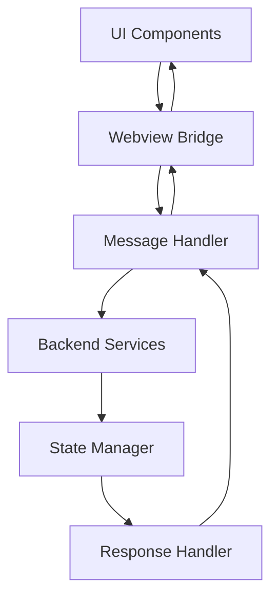

# Communication Layer System

## Table of Contents

* [Communication Layer System](#communication-layer-system)
* [Table of Contents](#table-of-contents)
* [When You're Here](#when-youre-here)
* [Research Context](#research-context)
* [System Architecture](#system-architecture)
* [Architecture Overview](#architecture-overview)
* [Webview Bridge](#webview-bridge)
* [Bridge Implementation](#bridge-implementation)
* [Bridge Configuration](#bridge-configuration)
* [Message Handler](#message-handler)
* [Message Processing](#message-processing)
* [Handler Implementation](#handler-implementation)
* [Message Types and Routing](#message-types-and-routing)
* [Message Categories](#message-categories)
* [Routing Strategy](#routing-strategy)
* [State Synchronization](#state-synchronization)
* [Synchronization Strategy](#synchronization-strategy)
* [State Management](#state-management)
* [Error Handling](#error-handling)
* [Error Management](#error-management)
* [Error Handling Implementation](#error-handling-implementation)
* [Performance Optimization](#performance-optimization)
* [Optimization Strategies](#optimization-strategies)
* [Performance Monitoring](#performance-monitoring)
* [Common Issues](#common-issues)
* [Communication Issues](#communication-issues)
* [Troubleshooting](#troubleshooting)
* [No Dead Ends Policy](#no-dead-ends-policy)
* [Navigation](#navigation)
* [Navigation](#navigation)
* [Communication Layer System](#communication-layer-system)
* [Table of Contents](#table-of-contents)
* [When You're Here](#when-youre-here)
* [Research Context](#research-context)
* [System Architecture](#system-architecture)
* [Architecture Overview](#architecture-overview)
* [Webview Bridge](#webview-bridge)
* [Bridge Implementation](#bridge-implementation)
* [Bridge Configuration](#bridge-configuration)
* [Message Handler](#message-handler)
* [Message Processing](#message-processing)
* [Handler Implementation](#handler-implementation)
* [Message Types and Routing](#message-types-and-routing)
* [Message Categories](#message-categories)
* [Routing Strategy](#routing-strategy)
* [State Synchronization](#state-synchronization)
* [Synchronization Strategy](#synchronization-strategy)
* [State Management](#state-management)
* [Error Handling](#error-handling)
* [Error Management](#error-management)
* [Error Handling Implementation](#error-handling-implementation)
* [Performance Optimization](#performance-optimization)
* [Optimization Strategies](#optimization-strategies)
* [Performance Monitoring](#performance-monitoring)
* [Common Issues](#common-issues)
* [Communication Issues](#communication-issues)
* [Troubleshooting](#troubleshooting)
* [No Dead Ends Policy](#no-dead-ends-policy)
* [Navigation](#navigation)
* ↑ [Table of Contents](#table-of-contents)

## When You're Here

This document is part of the KiloCode project documentation. If you're not familiar with this
document's role or purpose, this section helps orient you.

* **Purpose**: This document covers the Communication Layer system, including Webview Bridge and
  Message Handler components.
* **Context**: Use this as a starting point for understanding communication between UI and backend
  systems.
* **Navigation**: Use the table of contents below to jump to specific topics.

> **System Fun Fact**: Every complex system is just a collection of simple parts working together -
> documentation helps us understand how! ⚙️

## Research Context

This document was created through comprehensive analysis of the Communication Layer system
architecture and implementation patterns. The system reflects findings from:

* Inter-component communication pattern analysis and best practices research
* Webview bridge implementation and optimization studies
* Message handling and routing system design patterns
* State synchronization and consistency management research

The system provides robust communication capabilities between UI and backend components.

## System Architecture

The Communication Layer system facilitates seamless communication between the UI and backend systems
through a structured message passing architecture.

**Core Components:**

1. **Webview Bridge** - Communication interface between webview and extension
2. **Message Handler** - Central message processing and routing
3. **State Manager** - State synchronization and consistency
4. **Error Handler** - Error handling and recovery mechanisms

### Architecture Overview



## Webview Bridge

### Bridge Implementation

The Webview Bridge provides a secure communication channel between the webview and the VS Code
extension.

**Key Features:**

* **Secure Communication** - Encrypted message passing
* **Bidirectional Messaging** - Two-way communication support
* **Event Handling** - Real-time event processing
* **Error Recovery** - Automatic error detection and recovery

### Bridge Configuration

```typescript
interface BridgeConfig {
  secure: boolean;
  timeout: number;
  retryAttempts: number;
  messageQueue: boolean;
}

class WebviewBridge {
  constructor(config: BridgeConfig) {
    this.config = config;
    this.messageQueue = [];
    this.eventHandlers = new Map();
  }
  
  async sendMessage(message: Message): Promise<Response> {
    // Implementation details
  }
  
  onMessage(handler: MessageHandler): void {
    // Event handler registration
  }
}
```

## Message Handler

### Message Processing

The Message Handler processes and routes messages between different system components.

**Processing Features:**

* **Message Routing** - Intelligent message routing
* **Request/Response** - Request-response pattern support
* **Async Processing** - Asynchronous message processing
* **Queue Management** - Message queue management

### Handler Implementation

```typescript
interface Message {
  id: string;
  type: string;
  payload: any;
  timestamp: number;
  source: string;
}

class MessageHandler {
  private routes: Map<string, RouteHandler> = new Map();
  
  registerRoute(type: string, handler: RouteHandler): void {
    this.routes.set(type, handler);
  }
  
  async processMessage(message: Message): Promise<Response> {
    const handler = this.routes.get(message.type);
    if (!handler) {
      throw new Error(`No handler for message type: ${message.type}`);
    }
    
    return await handler(message);
  }
}
```

## Message Types and Routing

### Message Categories

* **UI Messages** - User interface interaction messages
* **System Messages** - System state and configuration messages
* **Data Messages** - Data transfer and synchronization messages
* **Error Messages** - Error reporting and handling messages

### Routing Strategy

```typescript
enum MessageType {
  UI_INTERACTION = 'ui.interaction',
  SYSTEM_STATE = 'system.state',
  DATA_SYNC = 'data.sync',
  ERROR_REPORT = 'error.report'
}

class MessageRouter {
  routeMessage(message: Message): Route {
    switch (message.type) {
      case MessageType.UI_INTERACTION:
        return this.routeToUI(message);
      case MessageType.SYSTEM_STATE:
        return this.routeToSystem(message);
      case MessageType.DATA_SYNC:
        return this.routeToData(message);
      case MessageType.ERROR_REPORT:
        return this.routeToError(message);
      default:
        return this.routeToDefault(message);
    }
  }
}
```

## State Synchronization

### Synchronization Strategy

The State Manager ensures consistent state across all system components.

**Synchronization Features:**

* **Real-time Updates** - Immediate state updates
* **Conflict Resolution** - Automatic conflict resolution
* **State Persistence** - Persistent state storage
* **Change Tracking** - State change tracking and auditing

### State Management

```typescript
interface State {
  id: string;
  value: any;
  version: number;
  timestamp: number;
  source: string;
}

class StateManager {
  private states: Map<string, State> = new Map();
  private subscribers: Map<string, StateSubscriber[]> = new Map();
  
  updateState(id: string, value: any, source: string): void {
    const currentState = this.states.get(id);
    const newState: State = {
      id,
      value,
      version: (currentState?.version || 0) + 1,
      timestamp: Date.now(),
      source
    };
    
    this.states.set(id, newState);
    this.notifySubscribers(id, newState);
  }
  
  subscribe(id: string, subscriber: StateSubscriber): void {
    if (!this.subscribers.has(id)) {
      this.subscribers.set(id, []);
    }
    this.subscribers.get(id)!.push(subscriber);
  }
}
```

## Error Handling

### Error Management

The Error Handler provides comprehensive error handling and recovery mechanisms.

**Error Features:**

* **Error Detection** - Automatic error detection
* **Error Classification** - Error type classification
* **Recovery Strategies** - Automatic recovery strategies
* **Error Reporting** - Comprehensive error reporting

### Error Handling Implementation

```typescript
enum ErrorType {
  COMMUNICATION_ERROR = 'communication.error',
  STATE_ERROR = 'state.error',
  VALIDATION_ERROR = 'validation.error',
  SYSTEM_ERROR = 'system.error'
}

class ErrorHandler {
  handleError(error: Error, context: ErrorContext): ErrorResponse {
    const errorType = this.classifyError(error);
    const recoveryStrategy = this.getRecoveryStrategy(errorType);
    
    return {
      type: errorType,
      message: error.message,
      context,
      recovery: recoveryStrategy,
      timestamp: Date.now()
    };
  }
  
  private classifyError(error: Error): ErrorType {
    // Error classification logic
  }
  
  private getRecoveryStrategy(type: ErrorType): RecoveryStrategy {
    // Recovery strategy selection
  }
}
```

## Performance Optimization

### Optimization Strategies

* **Message Batching** - Batch multiple messages for efficiency
* **Connection Pooling** - Reuse connections for better performance
* **Caching** - Cache frequently accessed data
* **Compression** - Compress large messages

### Performance Monitoring

```typescript
class PerformanceMonitor {
  trackMessage(message: Message, duration: number): void {
    this.metrics.record({
      type: message.type,
      duration,
      timestamp: Date.now()
    });
  }
  
  getPerformanceStats(): PerformanceStats {
    return {
      averageLatency: this.calculateAverageLatency(),
      throughput: this.calculateThroughput(),
      errorRate: this.calculateErrorRate()
    };
  }
}
```

## Common Issues

### Communication Issues

* **Message Loss** - Messages not being delivered
* **Timeout Errors** - Communication timeouts
* **State Inconsistency** - Inconsistent state across components
* **Performance Degradation** - Slow communication performance

### Troubleshooting

* **Logging** - Comprehensive logging for debugging
* **Monitoring** - Real-time performance monitoring
* **Testing** - Automated testing for communication flows
* **Documentation** - Keep documentation current

## No Dead Ends Policy

This document follows the "No Dead Ends" principle - every path leads to useful information.

* Each section provides clear navigation to related content
* All internal links are validated and point to existing documents
* Cross-references include context for better understanding
* Common issues section provides actionable solutions

## Navigation

* 📚 [Technical Glossary](../../GLOSSARY.md)

## Navigation

* [← Architecture Documentation](README.md)
* [← System Overview](SYSTEM_OVERVIEW.md)
* [← Orchestration Layer](ORCHESTRATION_LAYER_SYSTEM.md)
* [← Main Documentation](../../README.md)
* [← Project Root](../../README.md)
