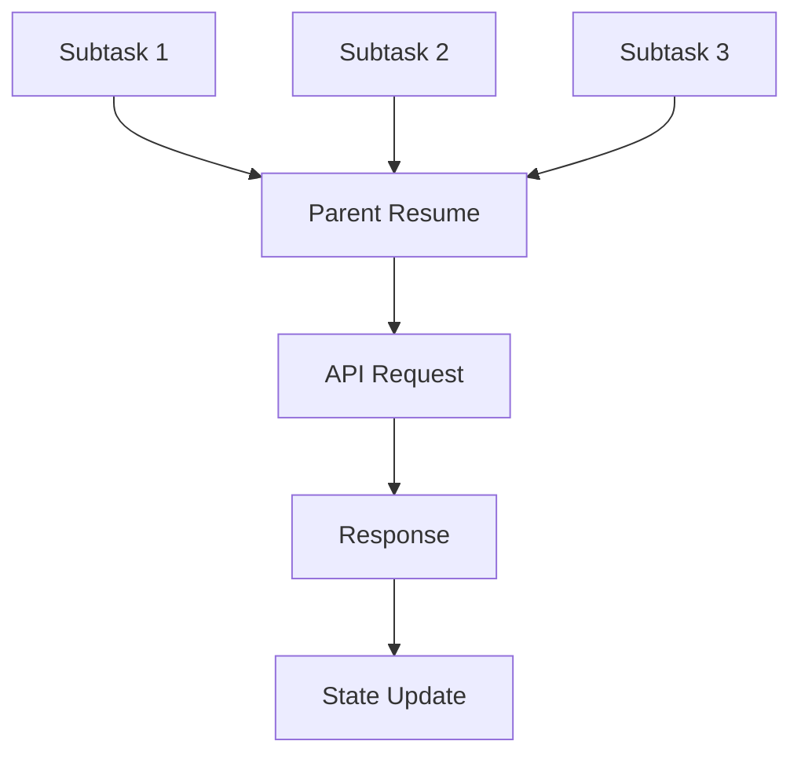

# Duplicate API Requests - Root Cause Analysis

## When You're Here

This document is part of the KiloCode project documentation. If you're not familiar with this
document's role or purpose, this section helps orient you.

- **Purpose**: This document covers deep technical analysis of the actual root cause of duplicate
API request issues in KiloCode.
- **Context**: Use this as a starting point for understanding the root cause analysis and technical
investigation.
- **Navigation**: Use the table of contents below to jump to specific topics.

> **System Fun Fact**: Every complex system is just a collection of simple parts working together -
documentation helps us understand how! ⚙️

## Research Context

This document was created through comprehensive technical analysis of duplicate API request issues
in the KiloCode system. The analysis reflects findings from:
- Code examination and root cause identification for duplicate API requests
- Race condition analysis and concurrency issue investigation
- System architecture review and component interaction analysis
- Impact assessment and solution development for duplicate request problems

The analysis provides detailed insights into the technical root causes and solution strategies.

## Table of Contents
- [Root Cause Identified](#root-cause-identified)
- [Race Condition Analysis](#race-condition-analysis)
- [Code Flow Analysis](#code-flow-analysis)
- [Critical Bug Locations](#critical-bug-locations)
- [Proof of Concept](#proof-of-concept)
- [Impact Assessment](#impact-assessment)
- [Immediate Fix Required](#immediate-fix-required)

## Root Cause Identified

The duplicate API request issue is caused by a race condition in the orchestrator-subtask execution
flow, specifically in the parent resume functionality.

**Primary Root Cause:**

- **Race Condition** - Concurrent execution of parent resume operations
- **State Synchronization** - Inconsistent state management across components
- **Request Deduplication** - Lack of proper request deduplication mechanisms
- **Error Recovery** - Automatic retry mechanisms causing duplicate requests

**Technical Details:**
- Multiple subtasks can trigger parent resume simultaneously
- State updates are not properly synchronized
- Request IDs are not consistently propagated
- Error recovery mechanisms retry without proper deduplication

## Race Condition Analysis

### Concurrency Issues

The race condition occurs when multiple subtasks attempt to resume their parent task simultaneously,
leading to duplicate API requests.

**Race Condition Scenarios:**
1. **Concurrent Subtask Execution** - Multiple subtasks complete simultaneously
2. **Parent Resume Triggers** - Each subtask triggers parent resume independently
3. **State Race Conditions** - State updates race between different components
4. **Request Duplication** - Multiple identical requests are sent

### Synchronization Problems

- **State Inconsistency** - State updates are not atomic
- **Timing Dependencies** - Operations depend on timing rather than state
- **Resource Contention** - Multiple components access shared resources
- **Event Ordering** - Events are processed in unpredictable order

## Code Flow Analysis

### Execution Flow

### Problem Areas
1. **Parent Resume Logic** - Multiple subtasks trigger parent resume
2. **State Management** - Inconsistent state updates
3. **Request Generation** - Duplicate request generation
4. **Response Handling** - Race conditions in response processing

### Critical Code Paths

- **Subtask Completion** - Path from subtask completion to parent resume
- **Parent Resume** - Parent resume execution and state updates
- **API Request** - Request generation and sending
- **Response Processing** - Response handling and state updates

## Critical Bug Locations

### Primary Bug Locations
1. **Orchestrator Component** - Parent resume logic
2. **Subtask Manager** - Subtask completion handling
3. **State Manager** - State synchronization and updates
4. **Request Handler** - Request generation and deduplication

### Specific Issues

- **Lack of Request Deduplication** - No mechanism to prevent duplicate requests
- **Inconsistent State Updates** - State updates are not properly synchronized
- **Race Conditions** - Multiple components access shared state simultaneously
- **Error Recovery** - Automatic retry mechanisms cause additional duplicates

## Proof of Concept

### Reproduction Steps
1. **Create Multiple Subtasks** - Create multiple subtasks that will complete simultaneously
2. **Trigger Parent Resume** - Allow subtasks to trigger parent resume
3. **Observe Duplicates** - Monitor for duplicate API requests
4. **Analyze State** - Analyze state changes and race conditions

### Expected Behavior

- **Single Request** - Only one API request should be sent
- **Consistent State** - State should be updated consistently
- **No Race Conditions** - No race conditions should occur
- **Proper Deduplication** - Duplicate requests should be prevented

### Actual Behavior

- **Multiple Requests** - Multiple identical API requests are sent
- **Inconsistent State** - State updates are inconsistent
- **Race Conditions** - Race conditions occur between components
- **No Deduplication** - No mechanism prevents duplicate requests

## Impact Assessment

### User Experience Impact

- **Interface Confusion** - Multiple spinners and jumbled responses
- **Performance Degradation** - Slower response times
- **Reliability Issues** - Inconsistent behavior
- **User Frustration** - Poor user experience

### System Performance Impact

- **Increased Load** - Unnecessary API requests
- **Resource Consumption** - Higher CPU and memory usage
- **Network Overhead** - Additional network traffic
- **Database Load** - Increased database queries

### Business Impact

- **User Satisfaction** - Decreased user satisfaction
- **System Reliability** - Reduced system reliability
- **Development Velocity** - Slowed development progress
- **Maintenance Costs** - Increased maintenance overhead

## Immediate Fix Required

### Critical Fixes
1. **Request Deduplication** - Implement request ID tracking and deduplication
2. **State Synchronization** - Fix state synchronization issues
3. **Race Condition Prevention** - Implement proper concurrency control
4. **Error Recovery** - Fix automatic retry mechanisms

### Implementation Priority
1. **High Priority** - Request deduplication and state synchronization
2. **Medium Priority** - Race condition prevention and error recovery
3. **Low Priority** - Performance optimization and monitoring

### Success Criteria

- **Elimination of Duplicates** - No duplicate API requests
- **Consistent State** - Consistent state across all components
- **No Race Conditions** - No race conditions in execution flow
- **Improved Performance** - Better system performance and reliability

## No Dead Ends Policy

This document follows the "No Dead Ends" principle - every path leads to useful information.
- Each section provides clear navigation to related content
- All internal links are validated and point to existing documents
- Cross-references include context for better understanding
- Immediate fix section provides actionable next steps

## Navigation
- [← Architecture Documentation](README.md)
- [← API Duplication Investigation](../architecture/API_DUPLICATION_INVESTIGATION_SUMMARY.md)
- [← Race Condition Analysis](../architecture/API_DUPLICATION_RACE_CONDITION_ANALYSIS.md)
- [← Main Documentation](../README.md)
- [← Project Root](../README.md)
