# Duplicate API Requests - Root Cause Analysis

**Purpose:** Deep technical analysis of the actual root cause of duplicate API request issues in KiloCode, based on detailed code examination.

> **Dinosaur Fun Fact**: Architecture documentation is like a dinosaur fossil record - each layer tells us about the evolution of our system, helping us understand how it grew and changed over time! 🦕

<details><summary>Table of Contents</summary>

- [Executive Summary](#executive-summary)
- [Root Cause Identified](#root-cause-identified)
- [Race Condition Analysis](#race-condition-analysis)
- [Code Flow Analysis](#code-flow-analysis)
- [Critical Bug Locations](#critical-bug-locations)
- [Proof of Concept](#proof-of-concept)
- [Impact Assessment](#impact-assessment)
- [Immediate Fix Required](#immediate-fix-required)
- [Navigation Footer](#navigation-footer)

</details>

## Executive Summary

_After deep code examination, I have identified the actual root cause of duplicate API requests in KiloCode. The issue stems from a critical race condition in the `ask` method of `Task.ts` where message queue processing can trigger multiple concurrent API calls._

## Root Cause Identified

### The Core Issue

The duplicate API request issue is caused by a **race condition in the `ask` method** of `Task.ts` at lines 883-903. Here's what happens:

1. **Multiple concurrent `ask` calls** can occur during task execution
2. **Each `ask` call checks for queued messages** using `isMessageQueued = !this.messageQueueService.isEmpty()`
3. **Multiple `ask` calls can see the same queued message** and process it simultaneously
4. **Each processing triggers `submitUserMessage`** which creates new API requests
5. **Result: Multiple API calls for the same user input**

### Critical Code Location

```typescript
// src/core/task/Task.ts lines 883-903
} else if (isMessageQueued) {
    console.log("Task#ask will process message queue")

    const message = this.messageQueueService.dequeueMessage()

    if (message) {
        // Check if this is a tool approval ask that needs to be handled
        if (
            type === "tool" ||
            type === "command" ||
            type === "browser_action_launch" ||
            type === "use_mcp_server"
        ) {
            // For tool approvals, we need to approve first, then send the message if there's text/images
            this.handleWebviewAskResponse("yesButtonClicked", message.text, message.images)
        } else {
            // For other ask types (like followup), fulfill the ask directly
            this.setMessageResponse(message.text, message.images)
        }
    }
}
```

## Race Condition Analysis

### The Race Window

```mermaid
sequenceDiagram
    participant Ask1 as Ask Call #1
    participant Ask2 as Ask Call #2
    participant MQ as Message Queue
    participant API as API Provider

    Note over Ask1,API: Race Condition Window
    Ask1->>MQ: isEmpty() → false (message exists)
    Ask2->>MQ: isEmpty() → false (same message exists)
    Ask1->>MQ: dequeueMessage() → gets message
    Ask2->>MQ: dequeueMessage() → gets undefined (already dequeued)
    Ask1->>API: submitUserMessage() → API Call #1
    Ask2->>API: submitUserMessage() → API Call #2 (if message exists)

    Note over Ask1,API: Result: Duplicate API calls
```



### Why This Happens

1. **Concurrent `ask` calls**: Multiple parts of the system can call `ask` simultaneously
2. **Non-atomic queue check**: `isEmpty()` and `dequeueMessage()` are separate operations
3. **No synchronization**: No locks or mutexes prevent concurrent access
4. **Timing-dependent**: The race condition is timing-dependent and intermittent

## Code Flow Analysis

### Normal Flow (No Race Condition)

```typescript
// Single ask call
const isMessageQueued = !this.messageQueueService.isEmpty() // true
const message = this.messageQueueService.dequeueMessage() // gets message
// Process message → single API call
```

### Race Condition Flow

```typescript
// Concurrent ask calls
// Ask Call #1:
const isMessageQueued = !this.messageQueueService.isEmpty() // true
// Ask Call #2 (concurrent):
const isMessageQueued = !this.messageQueueService.isEmpty() // true (same message)

// Ask Call #1:
const message = this.messageQueueService.dequeueMessage() // gets message
// Ask Call #2:
const message = this.messageQueueService.dequeueMessage() // gets undefined

// But both calls proceed to process, potentially creating duplicate API calls
```

### Where Concurrent `ask` Calls Come From

1. **Tool execution completion**: Tools call `processQueuedMessages()` which can trigger `ask`
2. **Multiple tool executions**: When multiple tools complete simultaneously
3. **Streaming completion**: When streaming completes and triggers follow-up asks
4. **Error handling**: Error recovery paths that trigger additional asks

## Critical Bug Locations

### 1. Primary Race Condition

**File**: `src/core/task/Task.ts`  
**Lines**: 883-903  
**Issue**: Non-atomic message queue processing

```typescript
// BUG: Race condition here
const isMessageQueued = !this.messageQueueService.isEmpty()
// ... other code ...
const message = this.messageQueueService.dequeueMessage()
```

### 2. Message Queue Service

**File**: `src/core/message-queue/MessageQueueService.ts`  
**Lines**: 80-84  
**Issue**: No synchronization for concurrent access

```typescript
public dequeueMessage(): QueuedMessage | undefined {
    const message = this._messages.shift()  // Not thread-safe
    this.emit("stateChanged", this._messages)
    return message
}
```

### 3. Process Queued Messages

**File**: `src/core/task/Task.ts`  
**Lines**: 3297-3312  
**Issue**: Async processing without synchronization

```typescript
public processQueuedMessages(): void {
    if (!this.messageQueueService.isEmpty()) {
        const queued = this.messageQueueService.dequeueMessage()
        if (queued) {
            setTimeout(() => {
                this.submitUserMessage(queued.text, queued.images)  // Can create duplicates
            }, 0)
        }
    }
}
```

### 4. Tool Completion Triggers

**Files**: Multiple tool files (applyDiffTool.ts, writeToFileTool.ts, etc.)  
**Lines**: Various  
**Issue**: Tools call `processQueuedMessages()` without coordination

```typescript
// In multiple tool files:
await cline.diffViewProvider.reset()
cline.processQueuedMessages() // Can be called concurrently
```

## Proof of Concept

### Scenario That Triggers the Bug

1. **User sends message** → UI queues it (sendingDisabled = true)
2. **Task starts processing** → calls `ask("tool", ...)`
3. **Tool executes** → calls `cline.processQueuedMessages()`
4. **Tool completes** → triggers another `ask` call
5. **Both ask calls** see the queued message and process it
6. **Result**: Two API calls for the same user message

### Reproducible Test Case

```typescript
// This scenario will trigger the race condition:
describe("Duplicate API Request Race Condition", () => {
	it("should not create duplicate API calls", async () => {
		// 1. Queue a message
		task.messageQueueService.addMessage("test message")

		// 2. Simulate concurrent ask calls
		const ask1 = task.ask("tool", "tool request 1")
		const ask2 = task.ask("followup", "followup request")

		// 3. Both should process the same queued message
		await Promise.all([ask1, ask2])

		// 4. Verify only one API call was made
		expect(apiCallCount).toBe(1) // This will fail due to the bug
	})
})
```

## Impact Assessment

### Severity: **CRITICAL**

1. **User Experience**: Multiple spinning animations, confusing responses
2. **Resource Waste**: Unnecessary API calls consume credits/quotas
3. **Data Corruption**: Interleaved responses can corrupt conversation state
4. **Performance**: Multiple concurrent requests slow down the system
5. **Debugging Difficulty**: Intermittent nature makes it hard to reproduce

### Affected Components

1. **UI Layer**: Multiple spinning animations
2. **API Layer**: Duplicate HTTP requests
3. **Task Engine**: Corrupted conversation state
4. **Message Queue**: Inconsistent queue state
5. **Laminar Service**: Duplicate spans and observability data

## Immediate Fix Required

### Fix 1: Atomic Message Queue Processing

```typescript
// Fix the race condition in Task.ts
public async ask(type: string, text?: string, images?: string[], ...): Promise<AskResult> {
    // ... existing code ...

    // ATOMIC: Check and dequeue in single operation
    const queuedMessage = this.messageQueueService.dequeueMessageIfAvailable()

    if (queuedMessage) {
        console.log("Task#ask processing queued message atomically")

        if (isToolApprovalAsk(type)) {
            this.handleWebviewAskResponse("yesButtonClicked", queuedMessage.text, queuedMessage.images)
        } else {
            this.setMessageResponse(queuedMessage.text, queuedMessage.images)
        }
    }

    // ... rest of method ...
}
```

### Fix 2: Thread-Safe Message Queue Service

```typescript
// Add atomic dequeue operation
public dequeueMessageIfAvailable(): QueuedMessage | undefined {
    // Use a simple lock mechanism
    if (this._isProcessing) {
        return undefined
    }

    this._isProcessing = true
    try {
        const message = this._messages.shift()
        if (message) {
            this.emit("stateChanged", this._messages)
        }
        return message
    } finally {
        this._isProcessing = false
    }
}
```

### Fix 3: Synchronized Process Queued Messages

```typescript
// Prevent concurrent processing
private _isProcessingQueue = false

public processQueuedMessages(): void {
    if (this._isProcessingQueue) {
        console.log("Queue processing already in progress, skipping")
        return
    }

    this._isProcessingQueue = true
    try {
        if (!this.messageQueueService.isEmpty()) {
            const queued = this.messageQueueService.dequeueMessageIfAvailable()
            if (queued) {
                setTimeout(() => {
                    this.submitUserMessage(queued.text, queued.images)
                        .finally(() => {
                            this._isProcessingQueue = false
                        })
                }, 0)
            }
        }
    } catch (e) {
        this._isProcessingQueue = false
        console.error(`[Task] Queue processing error:`, e)
    }
}
```

### Fix 4: Coordination Between Tool Completions

```typescript
// In tool files, coordinate processQueuedMessages calls
// Instead of:
cline.processQueuedMessages()

// Use:
if (!cline._isProcessingQueue) {
	cline.processQueuedMessages()
}
```

## Testing Strategy

### Unit Tests

```typescript
describe("Race Condition Fixes", () => {
	it("should handle concurrent ask calls atomically", async () => {
		// Test concurrent access to message queue
	})

	it("should prevent duplicate API calls from queued messages", async () => {
		// Test the specific race condition scenario
	})

	it("should maintain queue consistency under concurrent access", async () => {
		// Test message queue thread safety
	})
})
```

### Integration Tests

```typescript
describe("End-to-End Race Condition Tests", () => {
	it("should not create duplicate API requests during tool execution", async () => {
		// Test the full scenario from UI to API
	})
})
```

### Load Tests

```typescript
describe("Concurrent Load Tests", () => {
	it("should handle multiple simultaneous tool completions", async () => {
		// Test under high concurrency
	})
})
```

## Conclusion

The duplicate API request issue is caused by a **critical race condition** in the message queue processing logic of the `ask` method. This is a **high-priority bug** that requires immediate attention as it affects core functionality, user experience, and system reliability.

The fix requires:

1. **Atomic message queue operations**
2. **Thread-safe synchronization**
3. **Coordinated tool completion handling**
4. **Comprehensive testing**

This analysis provides the exact locations and fixes needed to resolve the issue permanently.

<a id="navigation-footer"></a>

- Back: [`DUPLICATE_API_REQUESTS_TROUBLESHOOTING.md`](DUPLICATE_API_REQUESTS_TROUBLESHOOTING.md) · Root: [`INDEX.md`](INDEX.md) · Source: `/docs/DUPLICATE_API_REQUESTS_ROOT_CAUSE_ANALYSIS.md#L1`
