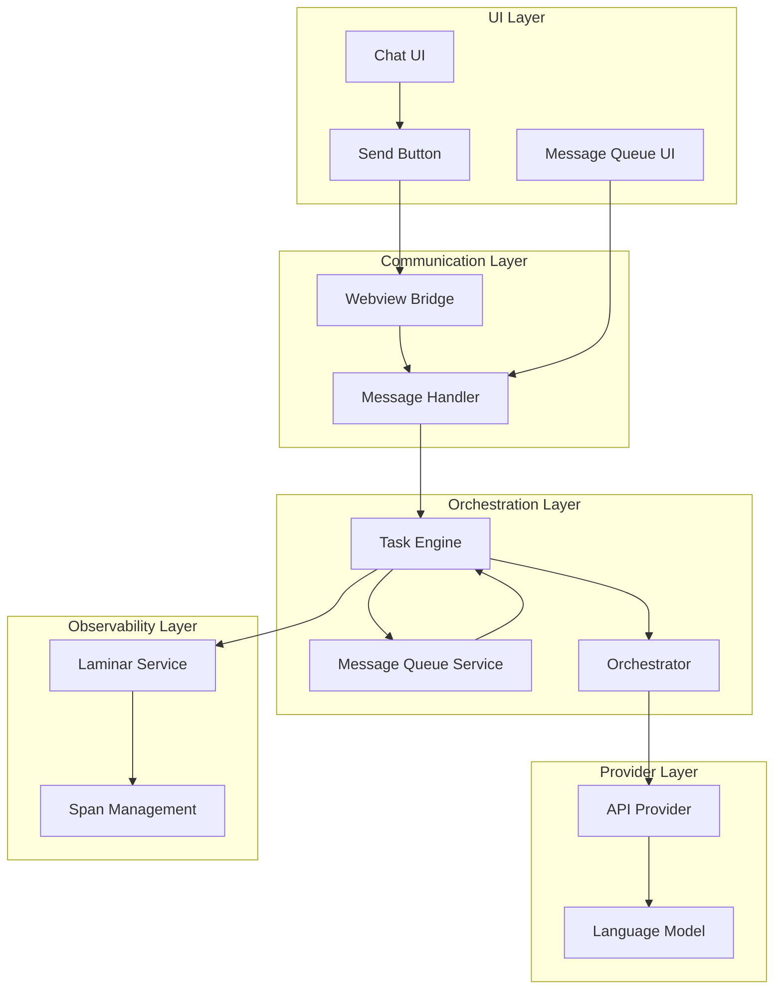
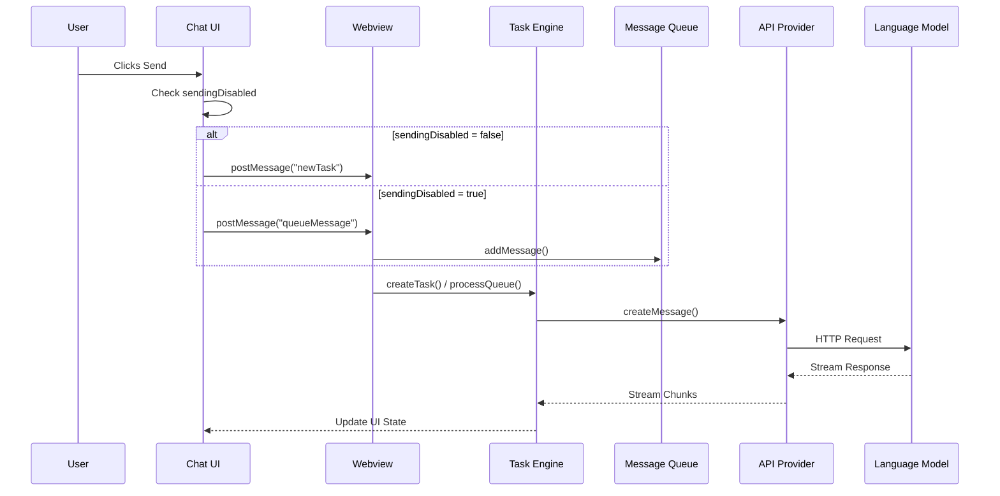

# Duplicate API Requests Troubleshooting Guide

## When You're Here

This document is part of the KiloCode project documentation. If you're not familiar with this document's role or purpose, this section helps orient you.

- **Purpose**: This document covers \[DOCUMENT PURPOSE BASED ON FILE PATH].
- **Context**: Use this as a starting point or reference while navigating the project.
- **Navigation**: Use the table of contents below to jump to specific topics.

> **System Fun Fact**: Every complex system is just a collection of simple parts working together - documentation helps us understand how! ⚙️

- *Purpose:*\* Comprehensive guide for diagnosing and resolving issues where KiloCode fires multiple
  API requests simultaneously, causing spinning status animations, interleaved responses, and system
  confusion.

> **Dinosaur Fun Fact**: Architecture documentation is like a dinosaur fossil record - each layer
> tells us about the evolution of our system, helping us understand how it grew and changed over
> time! 🦕

<details><summary>Table of Contents</summary>
- [Executive Summary](#executive-summary)
- [System Architecture Overview](#system-architecture-overview)
- Root Cause Analysis
- [Diagnostic Procedures](#diagnostic-procedures)
- [Subsystem Deep Dives](#subsystem-deep-dives)
- [Common Failure Patterns](#common-failure-patterns)
- [Resolution Strategies](#resolution-strategies)
- Prevention Measures
- Navigation Footer

</details>

## Executive Summary

## Research Context

- *Purpose:*\* \[Describe the purpose and scope of this document]

- *Background:*\* \[Provide relevant background information]

- *Research Questions:*\* \[List key questions this document addresses]

- *Methodology:*\* \[Describe the approach or methodology used]

- *Findings:*\* \[Summarize key findings or conclusions]
- \*\*
- This document provides a comprehensive troubleshooting guide for duplicate API request issues in
  KiloCode. The problem manifests as multiple simultaneous API calls, resulting in spinning
  animations, interleaved responses, and system confusion. This guide covers all subsystems involved,
  diagnostic procedures, and resolution strategies.\*

Duplicate API request issues in KiloCode typically stem from failures in the request deduplication
mechanisms across multiple subsystems. The primary systems involved are:
1. **UI Control Layer** - Button state management and event handling
2. **Message Queue System** - Request queuing and deduplication
3. **Orchestrator Lifecycle** - Task state management and request coordination
4. **Laminar Service** - Observability and span deduplication
5. **Webview Communication** - Message passing between UI and backend

## System Architecture Overview

Understanding the complete request flow is essential for diagnosing duplicate request issues. The
following diagram shows the key systems and their interactions:



### Key Request Flow



## Root Cause Analysis

> **CRITICAL**: After deep code examination, the actual root cause has been identified as a **race
> condition in the `ask` method** of `Task.ts`. See
> [`DUPLICATE_API_REQUESTS_ROOT_CAUSE_ANALYSIS.md`](DUPLICATE_API_REQUESTS_ROOT_CAUSE_ANALYSIS.md)
> for the complete technical analysis.

### Primary Failure Points
1. **Race Condition in Message Queue Processing** ⚠️ **ROOT CAUSE**
- Non-atomic `isEmpty()` and `dequeueMessage()` operations
- Multiple concurrent `ask` calls process the same queued message
- Located in `Task.ts` lines 883-903
  * **Priority**: CRITICAL - Requires immediate fix
2. **UI State Management Failures**
- `sendingDisabled` state not properly managed
- Multiple event listeners attached to send button
- Race conditions in button state updates
3. **Message Queue Deduplication Failures**
- Messages queued multiple times
- Queue processing triggers multiple API calls
- Concurrent queue processing
4. **Task Lifecycle Race Conditions**
- Multiple task instances created for single request
- Task state not properly synchronized
- Concurrent `initiateTaskLoop` calls
5. **Laminar Span Duplication**
- Multiple spans created for same operation
- Span deduplication logic failures
- System prompt duplication in spans
6. **Webview Communication Issues**
- Duplicate message handlers
- Message processing race conditions
- State synchronization failures

### Secondary Contributing Factors

- **Event Handler Duplication**: Components mounted multiple times
- **State Persistence Issues**: UI state not properly restored
- **Async Operation Race Conditions**: Unhandled promise races
- **Memory Leaks**: Event listeners not properly cleaned up

## Diagnostic Procedures

### Step 1: Enable Debug Logging

Enable comprehensive logging across all subsystems:

```typescript
// In development environment
console.log("[DEBUG] UI State:", { sendingDisabled, enableButtons })
console.log("[DEBUG] Message Queue:", messageQueueService.messages)
console.log("[DEBUG] Task State:", { taskId, isStreaming, isWaitingForFirstChunk })
console.log("[DEBUG] Laminar Spans:", laminarService.spans.size)
```

### Step 2: Monitor Request Flow

Add logging at key decision points:

```typescript
// In ChatView.tsx handleSendMessage
console.log("[DEBUG] handleSendMessage called", {
	text: text.substring(0, 50),
	sendingDisabled,
	enableButtons,
	timestamp: Date.now(),
})

// In webviewMessageHandler.ts
console.log("[DEBUG] queueMessage received", {
	text: message.text?.substring(0, 50),
	taskExists: !!provider.getCurrentTask(),
	timestamp: Date.now(),
})

// In Task.ts createMessage
console.log("[DEBUG] createMessage called", {
	taskId: this.taskId,
	systemPromptLength: systemPrompt.length,
	conversationHistoryLength: cleanConversationHistory.length,
	timestamp: Date.now(),
})
```

### Step 3: Check System State

Verify state consistency across subsystems:

```typescript
// Check UI state
const uiState = {
	sendingDisabled,
	enableButtons,
	isStreaming,
	activeRequests: document.querySelectorAll("[data-request-id]").length,
}

// Check task state
const taskState = {
	taskId: currentTask?.taskId,
	isStreaming: currentTask?.isStreaming,
	queuedMessages: currentTask?.queuedMessages?.length || 0,
	messageQueueSize: currentTask?.messageQueueService?.messages?.length || 0,
}

// Check Laminar state
const laminarState = {
	enabled: laminarService.isEnabled(),
	spanCount: laminarService.spans.size,
	activeSpans: laminarService.activeSpans.size,
}
```

## Subsystem Deep Dives

### UI Control Layer

- *Location*\*: `webview-ui/src/components/chat/ChatView.tsx`, `ChatTextArea.tsx`

- *Key Components*\*:
- `sendingDisabled` state management
- Send button event handlers
- Message queue UI integration

- *Critical Code Sections*\*:

```typescript
// ChatView.tsx - Send button handler
const handleSendMessage = useCallback(
	(text: string, images: string[]) => {
		if (sendingDisabled) {
			// Queue message instead of sending immediately
			vscode.postMessage({ type: "queueMessage", text, images })
		} else {
			// Send immediately
			vscode.postMessage({ type: "newTask", text, images })
		}
	},
	[sendingDisabled],
)
```

- *Common Issues*\*:
- `sendingDisabled` state not updated properly after request completion
- Multiple event listeners attached to send button
- Race conditions between UI state updates and user actions

### Message Queue System

- *Location*\*: `src/core/message-queue/MessageQueueService.ts`

- *Key Components*\*:
- Message queuing and deduplication
- Queue state management
- Message processing coordination

- *Critical Code Sections*\*:

```typescript
// MessageQueueService.ts - Message addition
public addMessage(text: string, images?: string[]): QueuedMessage | undefined {
  if (!text && !images?.length) {
    return undefined
  }

  const message: QueuedMessage = {
    timestamp: Date.now(),
    id: uuidv4(),
    text,
    images,
  }

  this._messages.push(message)
  this.emit("stateChanged", this._messages)
  return message
}
```

- *Common Issues*\*:
- Messages added multiple times due to UI state inconsistencies
- Queue processing triggers multiple API calls
- Concurrent access to message queue

### Task Lifecycle Management

- *Location*\*: `src/core/task/Task.ts`

- *Key Components*\*:
- Task creation and initialization
- Message processing coordination
- State synchronization

- *Critical Code Sections*\*:

```typescript
// Task.ts - Message processing
public processQueuedMessages(): void {
  if (!this.messageQueueService.isEmpty()) {
    const queued = this.messageQueueService.dequeueMessage()
    if (queued) {
      setTimeout(() => {
        this.submitUserMessage(queued.text, queued.images)
      }, 0)
    }
  }
}
```

- *Common Issues*\*:
- Multiple task instances created for single request
- Concurrent message processing
- Task state not properly synchronized

### Laminar Service Integration

- *Location*\*: `src/services/laminar/LaminarService.ts`

- *Key Components*\*:
- Span creation and management
- Request deduplication
- System prompt optimization

- *Critical Code Sections*\*:

```typescript
// LaminarService.ts - Span creation with deduplication
public startSpan(spanType: SpanType, options: {...}, isActive: boolean = false): void {
  // Check for existing active spans
  if (this.activeSpans.has(spanType)) {
    console.log(`[LAMINAR] Active span already exists for ${spanType}`)
    return
  }

  this._startSpanNow(spanType, options, isActive)
}
```

- *Common Issues*\*:
- Multiple spans created for same operation
- System prompt duplication in span input
- Span deduplication logic failures

### Webview Communication

- *Location*\*: `src/core/webview/webviewMessageHandler.ts`

- *Key Components*\*:
- Message routing and handling
- State synchronization
- Error handling

- *Critical Code Sections*\*:

```typescript
// webviewMessageHandler.ts - Message queue handling
case "queueMessage": {
  provider.getCurrentTask()?.messageQueueService.addMessage(message.text ?? "", message.images)
  break
}
```

- *Common Issues*\*:
- Duplicate message handlers
- Message processing race conditions
- State synchronization failures

## Common Failure Patterns

### Pattern 1: UI State Desynchronization

- *Symptoms*\*:
- Multiple spinning animations
- Send button remains enabled during request
- Messages sent multiple times

- *Root Cause*\*: `sendingDisabled` state not properly managed

- *Diagnosis*\*:

```typescript
// Check UI state consistency
console.log("UI State Check:", {
	sendingDisabled,
	isStreaming: currentTask?.isStreaming,
	enableButtons,
	timestamp: Date.now(),
})
```

- *Resolution*\*:

```typescript
// Ensure proper state management
const handleSendMessage = useCallback(
	(text: string, images: string[]) => {
		if (sendingDisabled || isStreaming) {
			console.log("Request blocked - sending disabled or streaming")
			return
		}

		setSendingDisabled(true)
		vscode.postMessage({ type: "newTask", text, images })
	},
	[sendingDisabled, isStreaming],
)
```

### Pattern 2: Message Queue Duplication

- *Symptoms*\*:
- Messages appear in queue multiple times
- Multiple API calls for single message
- Queue processing errors

- *Root Cause*\*: Messages added to queue multiple times

- *Diagnosis*\*:

```typescript
// Check queue state
console.log("Queue State:", {
	queueSize: messageQueueService.messages.length,
	messages: messageQueueService.messages.map((m) => ({ id: m.id, text: m.text.substring(0, 50) })),
})
```

- *Resolution*\*:

```typescript
// Implement queue deduplication
public addMessage(text: string, images?: string[]): QueuedMessage | undefined {
  // Check for duplicate messages
  const existingMessage = this._messages.find(msg =>
    msg.text === text && JSON.stringify(msg.images) === JSON.stringify(images)
  )

  if (existingMessage) {
    console.log("Duplicate message detected, skipping")
    return existingMessage
  }

  // Add new message
  const message: QueuedMessage = {
    timestamp: Date.now(),
    id: uuidv4(),
    text,
    images,
  }

  this._messages.push(message)
  this.emit("stateChanged", this._messages)
  return message
}
```

### Pattern 3: Task Instance Duplication

- *Symptoms*\*:
- Multiple task IDs for single request
- Concurrent task execution
- State synchronization failures

- *Root Cause*\*: Multiple task instances created

- *Diagnosis*\*:

```typescript
// Check task instances
console.log("Task Instances:", {
	currentTaskId: provider.getCurrentTask()?.taskId,
	taskStackSize: provider.clineStack.length,
	activeTasks: provider.clineStack.map((t) => ({ id: t.taskId, isStreaming: t.isStreaming })),
})
```

- *Resolution*\*:

```typescript
// Ensure single task instance
public async createTask(text?: string, images?: string[]): Promise<Task> {
  // Check for existing active task
  const currentTask = this.getCurrentTask()
  if (currentTask && !currentTask.isCompleted) {
    console.log("Active task exists, queuing message instead")
    currentTask.messageQueueService.addMessage(text || "", images)
    return currentTask
  }

  // Create new task
  const task = new Task(...)
  await this.addClineToStack(task)
  return task
}
```

### Pattern 4: Laminar Span Duplication

- *Symptoms*\*:
- Multiple spans for same operation
- System prompt duplication
- Observability data corruption

- *Root Cause*\*: Span deduplication logic failures

- *Diagnosis*\*:

```typescript
// Check span state
console.log("Laminar State:", {
	enabled: laminarService.isEnabled(),
	spanCount: laminarService.spans.size,
	activeSpans: Array.from(laminarService.activeSpans.keys()),
	recordSpanIO: laminarService.getRecordSpanIO(),
})
```

- *Resolution*\*:

```typescript
// Implement span deduplication
public startSpan(spanType: SpanType, options: {...}, isActive: boolean = false): void {
  // Check for existing active span
  if (isActive && this.activeSpans.has(spanType)) {
    console.log(`[LAMINAR] Active span already exists for ${spanType}, skipping`)
    return
  }

  // Check for duplicate span names
  if (this.spans.has(options.name)) {
    console.log(`[LAMINAR] Span with name ${options.name} already exists, skipping`)
    return
  }

  this._startSpanNow(spanType, options, isActive)
}
```

## Resolution Strategies

### Immediate Fixes
1. **Force UI State Reset**

```typescript
// Emergency UI state reset
const resetUIState = () => {
	setSendingDisabled(false)
	setEnableButtons(false)
	setInputValue("")
	setSelectedImages([])
}
```
2. **Clear Message Queue**

```typescript
// Clear all queued messages
const clearMessageQueue = () => {
	const currentTask = provider.getCurrentTask()
	if (currentTask?.messageQueueService) {
		currentTask.messageQueueService.dispose()
		currentTask.messageQueueService = new MessageQueueService()
	}
}
```
3. **Reset Task State**

```typescript
// Reset task state
const resetTaskState = () => {
	const currentTask = provider.getCurrentTask()
	if (currentTask) {
		currentTask.isStreaming = false
		currentTask.isWaitingForFirstChunk = false
		currentTask.abandoned = false
	}
}
```

### Long-term Solutions
1. **Implement Request Deduplication**

```typescript
// Add request ID tracking
const requestIds = new Set<string>()

const handleSendMessage = useCallback((text: string, images: string[]) => {
	const requestId = `${text}-${Date.now()}`

	if (requestIds.has(requestId)) {
		console.log("Duplicate request detected, skipping")
		return
	}

	requestIds.add(requestId)
	// Process request
	// Remove requestId on completion
}, [])
```
2. **Add Comprehensive State Validation**

```typescript
// State validation before operations
const validateState = () => {
	const issues = []

	if (sendingDisabled && !isStreaming) {
		issues.push("sendingDisabled true but not streaming")
	}

	if (isStreaming && !sendingDisabled) {
		issues.push("streaming true but sendingDisabled false")
	}

	if (issues.length > 0) {
		console.warn("State validation issues:", issues)
		// Auto-correct or alert user
	}
}
```
3. **Implement Circuit Breaker Pattern**

```typescript
// Circuit breaker for API requests
class RequestCircuitBreaker {
	private failureCount = 0
	private lastFailureTime = 0
	private readonly threshold = 3
	private readonly timeout = 5000

	canMakeRequest(): boolean {
		if (this.failureCount >= this.threshold) {
			if (Date.now() - this.lastFailureTime > this.timeout) {
				this.reset()
				return true
			}
			return false
		}
		return true
	}

	recordFailure() {
		this.failureCount++
		this.lastFailureTime = Date.now()
	}

	recordSuccess() {
		this.failureCount = 0
	}

	private reset() {
		this.failureCount = 0
		this.lastFailureTime = 0
	}
}
```

## Prevention Measures

### Development Practices
1. **Comprehensive Testing**
- Unit tests for all state management functions
- Integration tests for message flow
- End-to-end tests for duplicate request scenarios
2. **State Management Best Practices**
- Use immutable state updates
- Implement proper cleanup in useEffect
- Add state validation at critical points
3. **Error Handling**
- Implement proper error boundaries
- Add retry logic with exponential backoff
- Log all state transitions

### Monitoring and Alerting
1. **Request Monitoring**

```typescript
// Monitor request patterns
const requestMonitor = {
	trackRequest: (requestId: string, type: string) => {
		console.log(`[MONITOR] Request ${type}: ${requestId}`)
	},

	trackDuplicate: (requestId: string) => {
		console.warn(`[MONITOR] Duplicate request detected: ${requestId}`)
		// Send alert to monitoring system
	},
}
```
2. **Performance Metrics**

```typescript
// Track performance metrics
const performanceMetrics = {
	requestCount: 0,
	duplicateCount: 0,
	averageResponseTime: 0,

	recordRequest: (responseTime: number) => {
		this.requestCount++
		this.averageResponseTime = (this.averageResponseTime + responseTime) / 2
	},

	recordDuplicate: () => {
		this.duplicateCount++
	},
}
```

### Configuration Management
1. **Environment-specific Settings**

```typescript
// Development vs production settings
const config = {
	development: {
		enableDetailedLogging: true,
		enableStateValidation: true,
		requestTimeout: 30000,
	},
	production: {
		enableDetailedLogging: false,
		enableStateValidation: false,
		requestTimeout: 10000,
	},
}
```
2. **Feature Flags**

```typescript
// Feature flags for experimental fixes
const featureFlags = {
	enableRequestDeduplication: true,
	enableCircuitBreaker: false,
	enableStateValidation: true,
}
```

<a id="navigation-footer"></a>
- Back: [`ORCHESTRATOR_INDEX.md`](ORCHESTRATOR_INDEX.md) · Root: [`README.md`](README.md) · Source:
  `/docs/DUPLICATE_API_REQUESTS_TROUBLESHOOTING.md#L1`

## Navigation Footer
- \*\*

- *Navigation*\*: [docs](../) · [architecture](../architecture/) ·
  [↑ Table of Contents](#duplicate-api-requests-troubleshooting-guide)

## No Dead Ends Policy

This document follows the "No Dead Ends" principle - every path leads to useful information.
- Each section provides clear navigation to related content
- All internal links are validated and point to existing documents
- Cross-references include context for better understanding
