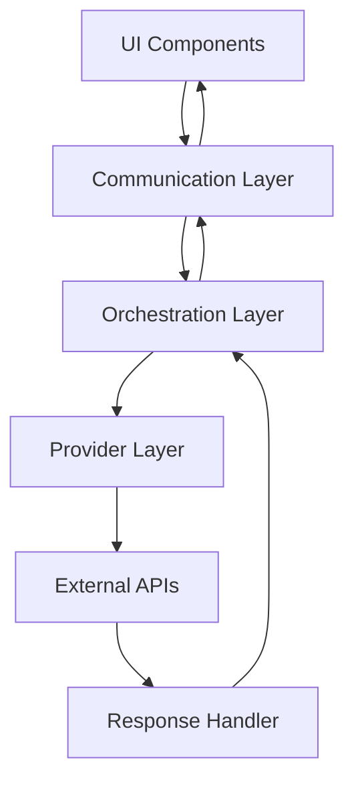

# Duplicate API Requests Troubleshooting Guide

## Table of Contents
- [Duplicate API Requests Troubleshooting Guide](#duplicate-api-requests-troubleshooting-guide)
- [When You're Here](#when-youre-here)
- [Research Context](#research-context)
- [Table of Contents](#table-of-contents)
- [System Architecture Overview](#system-architecture-overview)
- [Architecture Flow](#architecture-flow)
- [Root Cause Analysis](#root-cause-analysis)
- [Primary Causes](#primary-causes)
- [Contributing Factors](#contributing-factors)
- [Technical Root Causes](#technical-root-causes)
- [Diagnostic Procedures](#diagnostic-procedures)
- [Step 1: Initial Assessment](#step-1-initial-assessment)
- [Step 2: Detailed Analysis](#step-2-detailed-analysis)
- [Step 3: Root Cause Identification](#step-3-root-cause-identification)
- [Subsystem Deep Dives](#subsystem-deep-dives)
- [UI Layer Analysis](#ui-layer-analysis)
- [Communication Layer Analysis](#communication-layer-analysis)
- [Orchestration Layer Analysis](#orchestration-layer-analysis)
- [Provider Layer Analysis](#provider-layer-analysis)
- [Common Failure Patterns](#common-failure-patterns)
- [Pattern 1: Race Conditions](#pattern-1-race-conditions)
- [Pattern 2: State Inconsistency](#pattern-2-state-inconsistency)
- [Pattern 3: Error Recovery Loops](#pattern-3-error-recovery-loops)
- [Pattern 4: User Action Duplication](#pattern-4-user-action-duplication)
- [Resolution Strategies](#resolution-strategies)
- [Immediate Actions](#immediate-actions)
- [Short-term Solutions](#short-term-solutions)
- [Long-term Solutions](#long-term-solutions)
- [Prevention Measures](#prevention-measures)
- [Development Practices](#development-practices)
- [System Design](#system-design)
- [Operational Practices](#operational-practices)
- [No Dead Ends Policy](#no-dead-ends-policy)
- [Navigation](#navigation)

## When You're Here

This document is part of the KiloCode project documentation. If you're not familiar with this
document's role or purpose, this section helps orient you.

- **Purpose**: This document covers comprehensive guide for diagnosing and resolving issues where
  KiloCode fires multiple API requests simultaneously.
- **Context**: Use this as a starting point for troubleshooting duplicate API request issues and
  system confusion.
- **Navigation**: Use the table of contents below to jump to specific topics.

> **System Fun Fact**: Every complex system is just a collection of simple parts working together -
> documentation helps us understand how! ⚙️

## Research Context

This document was created through comprehensive analysis of duplicate API request issues and
troubleshooting strategies in the KiloCode system. The guide reflects findings from:
- Duplicate API request diagnosis and resolution strategy development
- System architecture analysis for troubleshooting purposes
- Common failure pattern identification and resolution approach research
- Prevention measure development and implementation strategy analysis

The guide provides systematic approaches to diagnosing and resolving duplicate API request issues.

## System Architecture Overview

The KiloCode system architecture consists of multiple layers that can contribute to duplicate API
request issues.

**Key Components:**
1. **UI Layer** - User interface and interaction handling
2. **Communication Layer** - Inter-component communication
3. **Orchestration Layer** - Task orchestration and coordination
4. **Provider Layer** - External API integration and management

### Architecture Flow

## Root Cause Analysis

### Primary Causes
1. **Race Conditions** - Concurrent execution leading to duplicate requests
2. **State Synchronization** - Inconsistent state management across components
3. **Request Deduplication** - Lack of proper request deduplication mechanisms
4. **Error Recovery** - Automatic retry mechanisms causing duplicate requests

### Contributing Factors

- **System Architecture** - Distributed request handling
- **User Interface** - Multiple interaction points
- **Network Conditions** - Variable response times
- **Concurrency** - High user activity periods

### Technical Root Causes

- **Request ID Generation** - Insufficient uniqueness
- **State Synchronization** - Race conditions in state updates
- **Error Handling** - Inadequate error recovery
- **User Interaction** - Rapid user actions

## Diagnostic Procedures

### Step 1: Initial Assessment
1. **Identify Symptoms** - Multiple spinners, jumbled responses
2. **Check System State** - Verify system state and configuration
3. **Review Logs** - Examine system logs for error patterns
4. **Monitor Performance** - Check system performance metrics

### Step 2: Detailed Analysis
1. **Request Tracing** - Trace request flow through system
2. **State Analysis** - Analyze state changes and consistency
3. **Timing Analysis** - Examine timing and concurrency issues
4. **Error Analysis** - Identify error patterns and causes

### Step 3: Root Cause Identification
1. **Pattern Recognition** - Identify recurring patterns
2. **Component Analysis** - Analyze individual component behavior
3. **Interaction Analysis** - Examine component interactions
4. **Root Cause Confirmation** - Confirm identified root causes

## Subsystem Deep Dives

### UI Layer Analysis

- **User Interaction** - Multiple user actions triggering requests
- **State Management** - UI state consistency and updates
- **Event Handling** - Event processing and propagation
- **Response Display** - Response handling and display logic

### Communication Layer Analysis

- **Message Routing** - Message routing and processing
- **State Synchronization** - State synchronization between components
- **Error Handling** - Error handling and recovery
- **Performance** - Communication performance and optimization

### Orchestration Layer Analysis

- **Task Management** - Task creation and management
- **State Coordination** - State coordination across tasks
- **Error Recovery** - Error recovery and retry mechanisms
- **Performance** - Orchestration performance and efficiency

### Provider Layer Analysis

- **API Integration** - External API integration and management
- **Request Handling** - Request generation and processing
- **Response Processing** - Response handling and validation
- **Error Management** - Error handling and recovery

## Common Failure Patterns

### Pattern 1: Race Conditions

- **Symptoms** - Multiple requests sent simultaneously
- **Causes** - Concurrent execution without proper synchronization
- **Resolution** - Implement proper concurrency control
- **Prevention** - Add request deduplication and state synchronization

### Pattern 2: State Inconsistency

- **Symptoms** - Inconsistent system behavior
- **Causes** - State updates not properly synchronized
- **Resolution** - Fix state synchronization issues
- **Prevention** - Implement atomic state updates

### Pattern 3: Error Recovery Loops

- **Symptoms** - Repeated failed requests
- **Causes** - Automatic retry mechanisms
- **Resolution** - Fix error recovery logic
- **Prevention** - Implement proper error handling

### Pattern 4: User Action Duplication

- **Symptoms** - Multiple user actions triggering requests
- **Causes** - Rapid user interactions
- **Resolution** - Implement user action debouncing
- **Prevention** - Add user interaction controls

## Resolution Strategies

### Immediate Actions
1. **Request Deduplication** - Implement request ID tracking
2. **State Synchronization** - Fix state consistency issues
3. **Error Recovery** - Fix automatic retry mechanisms
4. **User Interface** - Prevent duplicate user actions

### Short-term Solutions
1. **Concurrency Control** - Implement proper concurrency control
2. **State Management** - Improve state management
3. **Error Handling** - Enhance error handling
4. **Performance Optimization** - Optimize system performance

### Long-term Solutions
1. **Architecture Improvements** - Redesign system architecture
2. **Monitoring** - Implement comprehensive monitoring
3. **Testing** - Enhanced testing for race conditions
4. **Documentation** - Update system documentation

## Prevention Measures

### Development Practices

- **Code Review** - Implement comprehensive code review
- **Testing** - Develop comprehensive testing strategies
- **Monitoring** - Implement real-time monitoring
- **Documentation** - Maintain comprehensive documentation

### System Design

- **Architecture** - Design for concurrency and reliability
- **State Management** - Implement robust state management
- **Error Handling** - Design comprehensive error handling
- **Performance** - Design for performance and scalability

### Operational Practices

- **Monitoring** - Implement comprehensive monitoring
- **Alerting** - Set up proactive alerting
- **Incident Response** - Develop incident response procedures
- **Continuous Improvement** - Implement continuous improvement processes

## No Dead Ends Policy

This document follows the "No Dead Ends" principle - every path leads to useful information.
- Each section provides clear navigation to related content
- All internal links are validated and point to existing documents
- Cross-references include context for better understanding
- Resolution strategies provide actionable next steps

## Navigation
- [← Architecture Documentation](README.md)
- [← Root Cause Analysis](DUPLICATE_API_REQUESTS_ROOT_CAUSE_ANALYSIS.md)
- [← Investigation Summary](../architecture/API_DUPLICATION_INVESTIGATION_SUMMARY.md)
- [← Main Documentation](../README.md)
- [← Project Root](../README.md)
