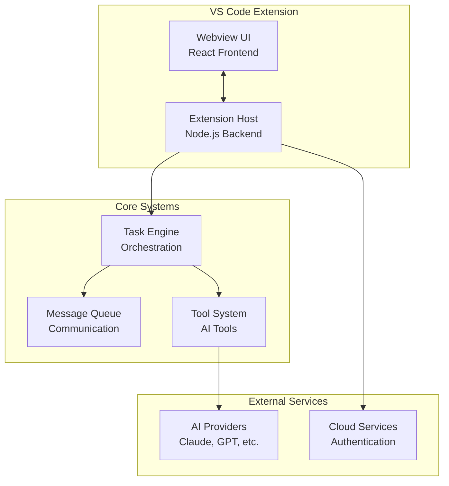
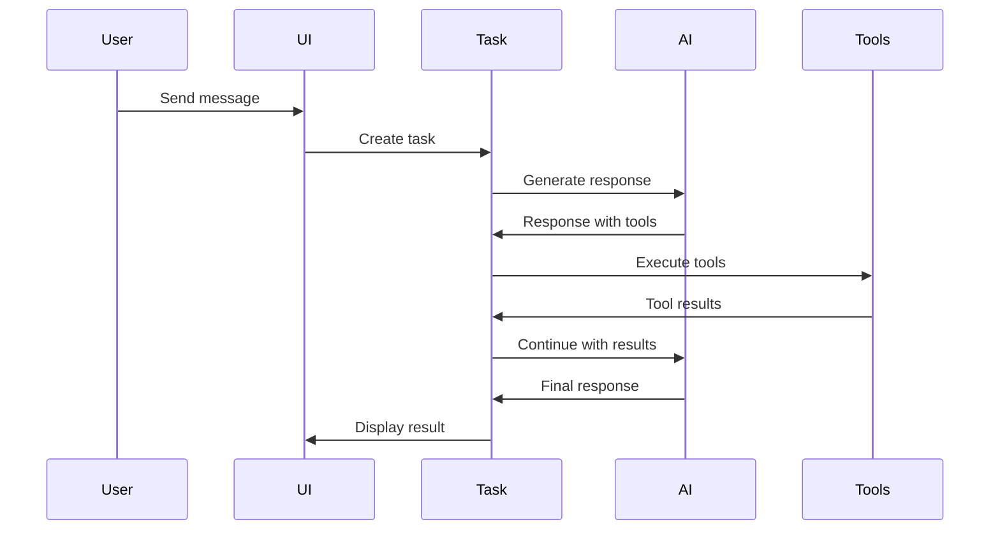

# Getting Started Guide

> **Engineering Fun Fact**: Just as engineers use systematic approaches to solve complex problems, this documentation provides structured guidance for understanding and implementing solutions! 🔧

**Purpose:** Comprehensive guide for new developers, contributors, and users to understand and get
started with KiloCode development.

> **Cartography Fun Fact**: Getting started with KiloCode is like learning to read a map - once you
> understand the landmarks (core concepts), routes (development workflow), and compass (testing),
> you can navigate anywhere in the codebase! 🗺️

<details><summary>Table of Contents</summary>

- [Executive Summary](#executive-summary)
- [Prerequisites](#prerequisites)
- [Quick Start](#quick-start)
- [Development Environment Setup](#development-environment-setup)
- [Understanding the Codebase](#understanding-the-codebase)
- [Core Concepts](#core-concepts)
- [Development Workflow](#development-workflow)
- [Testing & Quality](#testing--quality)
- [Contributing](#contributing)
- [Troubleshooting](#troubleshooting)
- [Next Steps](#next-steps)
- Navigation Footer

</details>

## Executive Summary

## Research Context

**Purpose:** \[Describe the purpose and scope of this document]

**Background:** \[Provide relevant background information]

**Research Questions:** \[List key questions this document addresses]

**Methodology:** \[Describe the approach or methodology used]

**Findings:** \[Summarize key findings or conclusions]

---

_KiloCode is a comprehensive VS Code extension for AI-powered coding assistance. This guide provides
everything needed to understand, set up, and contribute to the project._

**What You'll Learn:**

- How to set up a development environment
- Core architecture and key concepts
- Development workflow and best practices
- How to contribute effectively

**Time to Complete:** 30-45 minutes

## Prerequisites

### Required Knowledge

- **JavaScript/TypeScript** - Intermediate level
- **Node.js** - Basic understanding
- **VS Code Extension Development** - Helpful but not required
- **Git** - Basic version control

### System Requirements

- **Node.js**: 20.19.2 (see `.nvmrc`)
- **pnpm**: 10.8.1+ (package manager)
- **Git**: Latest stable version
- **VS Code**: 1.84.0+ (for extension development)

### Development Environment Options

#### Option 1: Native Development (Recommended)

```bash
# Install Node.js 20.19.2

> **Engineering Fun Fact**: Just as engineers use systematic approaches to solve complex problems, this documentation provides structured guidance for understanding and implementing solutions! 🔧

nvm install 20.19.2
nvm use 20.19.2

# Install pnpm

> **Architecture Fun Fact**: Like a well-designed building, good documentation has a solid foundation, clear structure, and intuitive navigation! 🏗️

npm install -g pnpm@10.8.1

# Verify installations

> **System Fun Fact**: Every complex system is just a collection of simple parts working together - documentation helps us understand how! ⚙️

node --version  # Should be 20.19.2
pnpm --version  # Should be 10.8.1+
```

#### Option 2: Dev Container (Windows/Cross-platform)

```bash
# Prerequisites: Docker Desktop + VS Code + Dev Containers extension

> **Development Fun Fact**: Documentation is like code comments for humans - it explains the "why" behind the "what"! 💻
# Clone repository

> **System Fun Fact**: Every complex system is just a collection of simple parts working together - documentation helps us understand how! ⚙️

git clone https://github.com/Kilo-Org/kilocode.git
cd kilocode

# Open in VS Code and select "Reopen in Container"

> **Architecture Fun Fact**: Like a well-designed building, good documentation has a solid foundation, clear structure, and intuitive navigation! 🏗️
# All dependencies automatically installed

> **Architecture Fun Fact**: Like a well-designed building, good documentation has a solid foundation, clear structure, and intuitive navigation! 🏗️

```

#### Option 3: Nix Flake (NixOS/Nix users)

```bash
# Prerequisites: Nix with flakes + direnv

> **Development Fun Fact**: Documentation is like code comments for humans - it explains the "why" behind the "what"! 💻

git clone https://github.com/Kilo-Org/kilocode.git
cd kilocode

# Automatic environment setup

> **Engineering Fun Fact**: Just as engineers use systematic approaches to solve complex problems, this documentation provides structured guidance for understanding and implementing solutions! 🔧

direnv allow
```

## Quick Start

### 1. Clone and Setup

```bash
# Fork and clone the repository

> **Engineering Fun Fact**: Just as engineers use systematic approaches to solve complex problems, this documentation provides structured guidance for understanding and implementing solutions! 🔧

git clone https://github.com/YOUR-USERNAME/kilocode.git
cd kilocode

# Install dependencies

> **System Fun Fact**: Every complex system is just a collection of simple parts working together - documentation helps us understand how! ⚙️

pnpm install

# Build the extension

> **Development Fun Fact**: Documentation is like code comments for humans - it explains the "why" behind the "what"! 💻

pnpm build
```

### 2. Run in Development Mode

```bash
# Open in VS Code

> **Engineering Fun Fact**: Just as engineers use systematic approaches to solve complex problems, this documentation provides structured guidance for understanding and implementing solutions! 🔧

code .

# Press F5 to start debugging

> **Engineering Fun Fact**: Just as engineers use systematic approaches to solve complex problems, this documentation provides structured guidance for understanding and implementing solutions! 🔧
# This opens a new VS Code window with KiloCode loaded

> **Development Fun Fact**: Documentation is like code comments for humans - it explains the "why" behind the "what"! 💻

```

### 3. Verify Installation

1. **Open the new VS Code window** (Extension Development Host)
2. **Open Command Palette** (`Ctrl+Shift+P` / `Cmd+Shift+P`)
3. **Type "Kilo Code"** - you should see KiloCode commands
4. **Click the KiloCode icon** in the Activity Bar to open the sidebar

## Development Environment Setup

### VS Code Extensions (Recommended)

**Required Extensions:**

- [ESBuild Problem Matchers](https://marketplace.visualstudio.com/items?itemName=connor4312.esbuild-problem-matchers)

**Recommended Extensions:**

```json
{
	"recommendations": [
		"dbaeumer.vscode-eslint",
		"esbenp.prettier-vscode",
		"bradlc.vscode-tailwindcss",
		"ms-vscode.vscode-typescript-next"
	]
}
```

### Environment Configuration

**Development Configuration:**

```bash
# .env.development

> **Development Fun Fact**: Documentation is like code comments for humans - it explains the "why" behind the "what"! 💻

NODE_ENV=development
ENABLE_DEBUG_LOGGING=true
ENABLE_HOT_RELOAD=true
```

**Git Configuration:**

```bash
# Setup Git hooks

> **Architecture Fun Fact**: Like a well-designed building, good documentation has a solid foundation, clear structure, and intuitive navigation! 🏗️

git config core.hooksPath .husky

# Configure remotes (if contributing)

> **Development Fun Fact**: Documentation is like code comments for humans - it explains the "why" behind the "what"! 💻

git remote add upstream https://github.com/Kilo-Org/kilocode.git
```

### Workspace Structure

```
kilocode/
├── src/                    # Core extension code
│   ├── core/              # Core functionality
│   ├── services/          # Service implementations
│   └── api/               # API integrations
├── webview-ui/            # React frontend
├── packages/              # Shared libraries
├── apps/                  # Applications (docs, tests)
├── docs/                  # Documentation
└── scripts/               # Utility scripts
```

## Understanding the Codebase

### Architecture Overview



### Key Components

#### 1. Extension Host (`src/extension.ts`)

```typescript
// Main entry point
export async function activate(context: ExtensionContext) {
	// Initialize core services
	const clineProvider = new ClineProvider(context)

	// Register providers
	context.subscriptions.push(vscode.window.registerWebviewViewProvider("kilo-code.SidebarProvider", clineProvider))
}
```

#### 2. Task Engine (`src/core/task/Task.ts`)

```typescript
// Core orchestration engine
export class Task {
	async initiateTaskLoop() {
		// Main execution loop
		while (this.state === TaskState.RUNNING) {
			await this.recursivelyMakeClineRequests()
		}
	}
}
```

#### 3. Webview UI (`webview-ui/src/components/`)

```typescript
// React frontend components
export function ChatView() {
  const [messages, setMessages] = useState<Message[]>([])

  return (
    <div className="chat-container">
      <MessageList messages={messages} />
      <ChatInput onSend={handleSend} />
    </div>
  )
}
```

### File Organization

**Core Extension Files:**

- `src/extension.ts` - Main extension entry point
- `src/core/webview/ClineProvider.ts` - Webview management
- `src/core/task/Task.ts` - Task orchestration
- `src/core/webview/webviewMessageHandler.ts` - Message handling

**Frontend Files:**

- `webview-ui/src/components/chat/ChatView.tsx` - Main chat interface
- `webview-ui/src/components/settings/SettingsView.tsx` - Settings UI
- `webview-ui/src/utils/` - Utility functions

**Service Files:**

- `src/services/laminar/LaminarService.ts` - Observability
- `src/services/cloud/CloudService.ts` - Cloud integration
- `src/api/providers/` - AI provider implementations

## Core Concepts

### 1. Task Lifecycle



### 2. Message Flow

**UI to Extension:**

```typescript
// Webview sends message
vscode.postMessage({
	type: "newTask",
	text: userInput,
	images: selectedImages,
})
```

**Extension to UI:**

```typescript
// Extension responds
webview.postMessage({
	type: "taskUpdate",
	taskId: task.id,
	state: task.state,
	messages: task.messages,
})
```

### 3. Tool System

**Tool Definition:**

```typescript
export async function writeToFileTool(
	cline: Task,
	block: ToolUse,
	askApproval: AskApproval,
	handleError: HandleError,
	pushToolResult: PushToolResult,
) {
	// Tool implementation
	const { path, content } = block.input
	await fs.writeFile(path, content)
	pushToolResult("File written successfully")
}
```

### 4. AI Provider Integration

**Provider Abstraction:**

```typescript
interface AIProvider {
	generateResponse(prompt: string, options: GenerationOptions): Promise<AIResponse>
	streamResponse(prompt: string, options: GenerationOptions): AsyncIterable<AIChunk>
}

// Usage
const provider = new AnthropicProvider(apiKey)
const response = await provider.generateResponse(prompt, options)
```

## Development Workflow

### 1. Making Changes

**Hot Reloading:**

- **Webview changes**: Automatically reload
- **Extension changes**: Auto-reload extension host
- **Configuration changes**: Restart required

**Development Commands:**

```bash
# Watch mode for webview

> **Development Fun Fact**: Documentation is like code comments for humans - it explains the "why" behind the "what"! 💻

cd webview-ui && pnpm dev

# Watch mode for extension

> **Development Fun Fact**: Documentation is like code comments for humans - it explains the "why" behind the "what"! 💻

cd src && pnpm watch:tsc

# Full development build

> **System Fun Fact**: Every complex system is just a collection of simple parts working together - documentation helps us understand how! ⚙️

pnpm build
```

### 2. Debugging

**Extension Debugging:**

```typescript
// Use console.log for debugging
console.log("Task state:", task.state)
console.log("Message received:", message)

// Check VS Code Developer Tools
// Help > Toggle Developer Tools
```

**Webview Debugging:**

```typescript
// Right-click in webview > "Inspect Element"
// Use browser developer tools
console.log("UI state:", uiState)
```

**Debug Configuration:**

```json
{
	"type": "extensionHost",
	"request": "launch",
	"name": "Launch Extension",
	"runtimeExecutable": "${execPath}",
	"args": ["--extensionDevelopmentPath=${workspaceFolder}"]
}
```

### 3. Testing Changes

**Unit Tests:**

```bash
# Run all tests

> **System Fun Fact**: Every complex system is just a collection of simple parts working together - documentation helps us understand how! ⚙️

pnpm test

# Run specific test file

> **Engineering Fun Fact**: Just as engineers use systematic approaches to solve complex problems, this documentation provides structured guidance for understanding and implementing solutions! 🔧

pnpm test src/core/task/Task.test.ts

# Watch mode

> **Engineering Fun Fact**: Just as engineers use systematic approaches to solve complex problems, this documentation provides structured guidance for understanding and implementing solutions! 🔧

pnpm test --watch
```

**Integration Tests:**

```bash
# Run E2E tests

> **Engineering Fun Fact**: Just as engineers use systematic approaches to solve complex problems, this documentation provides structured guidance for understanding and implementing solutions! 🔧

pnpm playwright

# Run VS Code extension tests

> **Engineering Fun Fact**: Just as engineers use systematic approaches to solve complex problems, this documentation provides structured guidance for understanding and implementing solutions! 🔧

pnpm test:extension
```

### 4. Building and Packaging

**Development Build:**

```bash
pnpm build
# Creates development .vsix file

> **Architecture Fun Fact**: Like a well-designed building, good documentation has a solid foundation, clear structure, and intuitive navigation! 🏗️

```

**Production Build:**

```bash
pnpm build:production
# Creates optimized .vsix file

> **Engineering Fun Fact**: Just as engineers use systematic approaches to solve complex problems, this documentation provides structured guidance for understanding and implementing solutions! 🔧

```

**Install Locally:**

```bash
# Install the built extension

> **Engineering Fun Fact**: Just as engineers use systematic approaches to solve complex problems, this documentation provides structured guidance for understanding and implementing solutions! 🔧

code --install-extension bin/kilo-code-*.vsix
```

## Testing & Quality

### Test Structure

**Unit Tests:**

- `src/**/*.test.ts` - Core functionality tests
- `webview-ui/src/**/*.test.tsx` - UI component tests

**Integration Tests:**

- `apps/playwright-e2e/` - End-to-end browser tests
- `apps/vscode-e2e/` - VS Code extension tests

**Test Commands:**

```bash
# Run all tests

> **Engineering Fun Fact**: Just as engineers use systematic approaches to solve complex problems, this documentation provides structured guidance for understanding and implementing solutions! 🔧

pnpm test

# Run with coverage

> **Architecture Fun Fact**: Like a well-designed building, good documentation has a solid foundation, clear structure, and intuitive navigation! 🏗️

pnpm test:coverage

# Run E2E tests

> **Architecture Fun Fact**: Like a well-designed building, good documentation has a solid foundation, clear structure, and intuitive navigation! 🏗️

pnpm playwright

# Run specific test suite

> **Architecture Fun Fact**: Like a well-designed building, good documentation has a solid foundation, clear structure, and intuitive navigation! 🏗️

pnpm test --grep "Task lifecycle"
```

### Code Quality

**Linting:**

```bash
# Run ESLint

> **Engineering Fun Fact**: Just as engineers use systematic approaches to solve complex problems, this documentation provides structured guidance for understanding and implementing solutions! 🔧

pnpm lint

# Fix auto-fixable issues

> **System Fun Fact**: Every complex system is just a collection of simple parts working together - documentation helps us understand how! ⚙️

pnpm lint --fix
```

**Type Checking:**

```bash
# Check TypeScript types

> **Engineering Fun Fact**: Just as engineers use systematic approaches to solve complex problems, this documentation provides structured guidance for understanding and implementing solutions! 🔧

pnpm check-types

# Watch mode

> **Architecture Fun Fact**: Like a well-designed building, good documentation has a solid foundation, clear structure, and intuitive navigation! 🏗️

pnpm watch:types
```

**Formatting:**

```bash
# Format code with Prettier

> **Architecture Fun Fact**: Like a well-designed building, good documentation has a solid foundation, clear structure, and intuitive navigation! 🏗️

pnpm format

# Check formatting

> **Architecture Fun Fact**: Like a well-designed building, good documentation has a solid foundation, clear structure, and intuitive navigation! 🏗️

pnpm format:check
```

### Quality Gates

**Pre-commit Hooks:**

- Type generation
- Linting and formatting
- Basic tests

**Pre-push Hooks:**

- Full type checking
- Test suite
- Changeset validation

## Contributing

### 1. Fork and Clone

```bash
# Fork on GitHub, then clone

> **Development Fun Fact**: Documentation is like code comments for humans - it explains the "why" behind the "what"! 💻

git clone https://github.com/YOUR-USERNAME/kilocode.git
cd kilocode

# Add upstream remote

> **Architecture Fun Fact**: Like a well-designed building, good documentation has a solid foundation, clear structure, and intuitive navigation! 🏗️

git remote add upstream https://github.com/Kilo-Org/kilocode.git
```

### 2. Create Feature Branch

```bash
# Create and switch to feature branch

> **Development Fun Fact**: Documentation is like code comments for humans - it explains the "why" behind the "what"! 💻

git checkout -b feature/your-feature-name

# Make your changes

> **Architecture Fun Fact**: Like a well-designed building, good documentation has a solid foundation, clear structure, and intuitive navigation! 🏗️
# ... edit files ...

> **Development Fun Fact**: Documentation is like code comments for humans - it explains the "why" behind the "what"! 💻

# Commit changes

> **Development Fun Fact**: Documentation is like code comments for humans - it explains the "why" behind the "what"! 💻

git add .
git commit -m "feat: add your feature description"
```

### 3. Submit Pull Request

```bash
# Push to your fork

> **Engineering Fun Fact**: Just as engineers use systematic approaches to solve complex problems, this documentation provides structured guidance for understanding and implementing solutions! 🔧

git push origin feature/your-feature-name

# Create PR on GitHub

> **Architecture Fun Fact**: Like a well-designed building, good documentation has a solid foundation, clear structure, and intuitive navigation! 🏗️
# Fill out PR template

> **Development Fun Fact**: Documentation is like code comments for humans - it explains the "why" behind the "what"! 💻
# Request review

> **Development Fun Fact**: Documentation is like code comments for humans - it explains the "why" behind the "what"! 💻

```

### 4. Code Review Process

**Review Checklist:**

- [ ] Code follows project conventions
- [ ] Tests added/updated
- [ ] Documentation updated
- [ ] No breaking changes (or properly documented)
- [ ] Performance impact considered

### 5. Contribution Guidelines

**Commit Message Format:**

```
type(scope): description

- Detailed description
- Breaking changes (if any)
- Resolves #issue-number
```

**Types:**

- `feat`: New feature
- `fix`: Bug fix
- `docs`: Documentation
- `style`: Code style changes
- `refactor`: Code refactoring
- `test`: Test additions/changes
- `chore`: Maintenance tasks

## Troubleshooting

### Common Issues

#### 1. Extension Not Loading

```bash
# Check VS Code Developer Tools

> **System Fun Fact**: Every complex system is just a collection of simple parts working together - documentation helps us understand how! ⚙️
# Help > Toggle Developer Tools > Console

> **Development Fun Fact**: Documentation is like code comments for humans - it explains the "why" behind the "what"! 💻

# Common causes:

> **Development Fun Fact**: Documentation is like code comments for humans - it explains the "why" behind the "what"! 💻
# - Missing dependencies

> **System Fun Fact**: Every complex system is just a collection of simple parts working together - documentation helps us understand how! ⚙️
# - TypeScript errors

> **Architecture Fun Fact**: Like a well-designed building, good documentation has a solid foundation, clear structure, and intuitive navigation! 🏗️
# - VS Code version incompatibility

> **Architecture Fun Fact**: Like a well-designed building, good documentation has a solid foundation, clear structure, and intuitive navigation! 🏗️

```

#### 2. Webview Not Updating

```bash
# Check webview developer tools

> **Development Fun Fact**: Documentation is like code comments for humans - it explains the "why" behind the "what"! 💻
# Right-click in webview > Inspect Element

> **Development Fun Fact**: Documentation is like code comments for humans - it explains the "why" behind the "what"! 💻

# Common causes:

> **Engineering Fun Fact**: Just as engineers use systematic approaches to solve complex problems, this documentation provides structured guidance for understanding and implementing solutions! 🔧
# - Message handler errors

> **Engineering Fun Fact**: Just as engineers use systematic approaches to solve complex problems, this documentation provides structured guidance for understanding and implementing solutions! 🔧
# - React component errors

> **Development Fun Fact**: Documentation is like code comments for humans - it explains the "why" behind the "what"! 💻
# - State management issues

> **System Fun Fact**: Every complex system is just a collection of simple parts working together - documentation helps us understand how! ⚙️

```

#### 3. Build Failures

```bash
# Clear build cache

> **Architecture Fun Fact**: Like a well-designed building, good documentation has a solid foundation, clear structure, and intuitive navigation! 🏗️

pnpm clean
rm -rf node_modules
pnpm install

# Check Node.js version

> **Development Fun Fact**: Documentation is like code comments for humans - it explains the "why" behind the "what"! 💻

node --version  # Should be 20.19.2
```

#### 4. Test Failures

```bash
# Run tests with verbose output

> **Development Fun Fact**: Documentation is like code comments for humans - it explains the "why" behind the "what"! 💻

pnpm test --verbose

# Check test environment

> **Architecture Fun Fact**: Like a well-designed building, good documentation has a solid foundation, clear structure, and intuitive navigation! 🏗️

pnpm test --run --reporter=verbose
```

### Debugging Tips

**Enable Debug Logging:**

```typescript
// In development mode
process.env.NODE_ENV = "development"
console.log("Debug info:", debugData)
```

**Use VS Code Debugger:**

```json
// .vscode/launch.json
{
	"type": "extensionHost",
	"request": "launch",
	"name": "Launch Extension",
	"runtimeExecutable": "${execPath}",
	"args": ["--extensionDevelopmentPath=${workspaceFolder}"]
}
```

**Check Extension Logs:**

```bash
# VS Code extension logs

> **Architecture Fun Fact**: Like a well-designed building, good documentation has a solid foundation, clear structure, and intuitive navigation! 🏗️
# Help > Toggle Developer Tools > Console

> **System Fun Fact**: Every complex system is just a collection of simple parts working together - documentation helps us understand how! ⚙️
# Look for "KiloCode" or "kilo-code" messages

> **Engineering Fun Fact**: Just as engineers use systematic approaches to solve complex problems, this documentation provides structured guidance for understanding and implementing solutions! 🔧

```

### Getting Help

**Documentation:**

- [System Overview](SYSTEM_OVERVIEW.md) - Architecture details
- [Repository Overview](REPOSITORY_OVERVIEW.md) - Codebase structure
- [API Provider Patterns](API_PROVIDER_PATTERNS.md) - AI integration

**Community:**

- [GitHub Issues](https://github.com/Kilo-Org/kilocode/issues) - Bug reports
- [GitHub Discussions](https://github.com/Kilo-Org/kilocode/discussions) - Questions
- [Discord](https://discord.gg/Ja6BkfyTzJ) - Real-time chat

## Next Steps

### Immediate Next Steps

1. **Explore the Codebase:**

    - Read [System Overview](SYSTEM_OVERVIEW.md)
    - Review [Repository Overview](REPOSITORY_OVERVIEW.md)
    - Check [External Dependencies](EXTERNAL_DEPENDENCIES.md)

2. **Try Development:**

    - Make a small change (e.g., update a UI text)
    - Run tests to verify
    - Build and test locally

3. **Understand Architecture:**
    - Study the [Task Engine](README.md)
    - Review [Tool System](tools/TOOL_SYSTEM_ARCHITECTURE.md)
    - Explore [Service Layer](README.md)

### Learning Paths

#### For New Contributors

1. [Getting Started Guide](GETTING_STARTED.md) ← You are here
2. [System Overview](SYSTEM_OVERVIEW.md)
3. [Repository Overview](REPOSITORY_OVERVIEW.md)
4. [Tool System Architecture](tools/TOOL_SYSTEM_ARCHITECTURE.md)
5. [Documentation Guide](../DOCUMENTATION_GUIDE.md) - Contribution standards

#### For Experienced Developers

1. [System Overview](SYSTEM_OVERVIEW.md)
2. [API Provider Patterns](API_PROVIDER_PATTERNS.md)
3. [External Dependencies](EXTERNAL_DEPENDENCIES.md)
4. [Upstream/Downstream Integration](UPSTREAM_DOWNSTREAM_INTEGRATION.md)
5. [Priority Improvements](../improvements/PRIORITY_IMPROVEMENTS.md)

#### For System Administrators

1. [Repository Overview](REPOSITORY_OVERVIEW.md)
2. [Build Pipeline Architecture](../build/BUILD_PIPELINE_ARCHITECTURE.md)
3. [Testing Strategy](../testing/TESTING_STRATEGY.md)
4. [External Dependencies](EXTERNAL_DEPENDENCIES.md)

### Recommended Reading

**Essential Documents:**

- [System Overview](SYSTEM_OVERVIEW.md) - Complete architecture
- [Repository Overview](REPOSITORY_OVERVIEW.md) - Codebase structure
- [External Dependencies](EXTERNAL_DEPENDENCIES.md) - Dependencies and libraries

**Advanced Topics:**

- [Upstream/Downstream Integration](UPSTREAM_DOWNSTREAM_INTEGRATION.md) - Code transfer processes
- [Priority Improvements](../improvements/PRIORITY_IMPROVEMENTS.md) - Development roadmap
- [Technical Debt](../improvements/TECHNICAL_DEBT.md) - Known issues and solutions

**Troubleshooting:**

- [Duplicate API Requests Root Cause Analysis](DUPLICATE_API_REQUESTS_ROOT_CAUSE_ANALYSIS.md)
- [Error Handling](../orchestrator/ORCHESTRATOR_ERROR_HANDLING.md)

---

**🎉 Congratulations!** You're now ready to start developing with KiloCode. Remember to:

- Follow the development workflow
- Write tests for your changes
- Update documentation as needed
- Ask questions in the community channels

Happy coding! 🚀

## 🔍 Research Context & Next Steps

### When You're Here, You Can:

**New to KiloCode Development:**

- **Next**: [System Overview](./SYSTEM_OVERVIEW.md) →
  [Repository Overview](./REPOSITORY_OVERVIEW.md) → [Core Systems](../architecture/repository/CORE_SYSTEMS.md)
- **Related**: [Technical Glossary](../GLOSSARY.md) for terminology,
  [Repository Development Guide](../architecture/repository/DEVELOPMENT_GUIDE.md) for advanced topics

**Setting Up Development Environment:**

- **Next**: [Repository Development Guide](../architecture/repository/DEVELOPMENT_GUIDE.md) →
  [Testing Infrastructure](../architecture/repository/TESTING_INFRASTRUCTURE.md) →
  [Build Pipelines](../architecture/repository/BUILD_PIPELINES.md)
- **Related**: [External Dependencies](./EXTERNAL_DEPENDENCIES.md) for dependency management

**Understanding Current Issues:**

- **Next**: [Race Condition Analysis]race-condition/README.md) →
  [Root Cause Analysis]race-condition/ROOT_CAUSE_ANALYSIS.md) →
  [Solution Recommendations]race-condition/SOLUTION_RECOMMENDATIONS.md)
- **Related**: [Orchestrator Documentation](../orchestrator/README.md) for execution patterns

**Contributing to KiloCode:**

- **Next**: [Orchestrator Best Practices](../orchestrator/ORCHESTRATOR_BEST_PRACTICES.md) →
  [Testing Strategy]race-condition/TESTING_STRATEGY.md) →
  [Implementation Guide](./API_DUPLICATION_DEBUG_IMPLEMENTATION.md)
- **Related**: [Investigation Plans](../plans/README.md) for active development work

### No Dead Ends Policy

Every page provides clear next steps based on your research goals. If you're unsure where to go
next, return to [Architecture Documentation](./README.md) for guidance.

<a id="navigation-footer"></a>

**Navigation**: [← Back to Architecture Documentation](./README.md) ·
[→ System Overview](./SYSTEM_OVERVIEW.md) · [📚 Technical Glossary](../GLOSSARY.md) ·
[↑ Table of Contents](#-research-context--next-steps)
