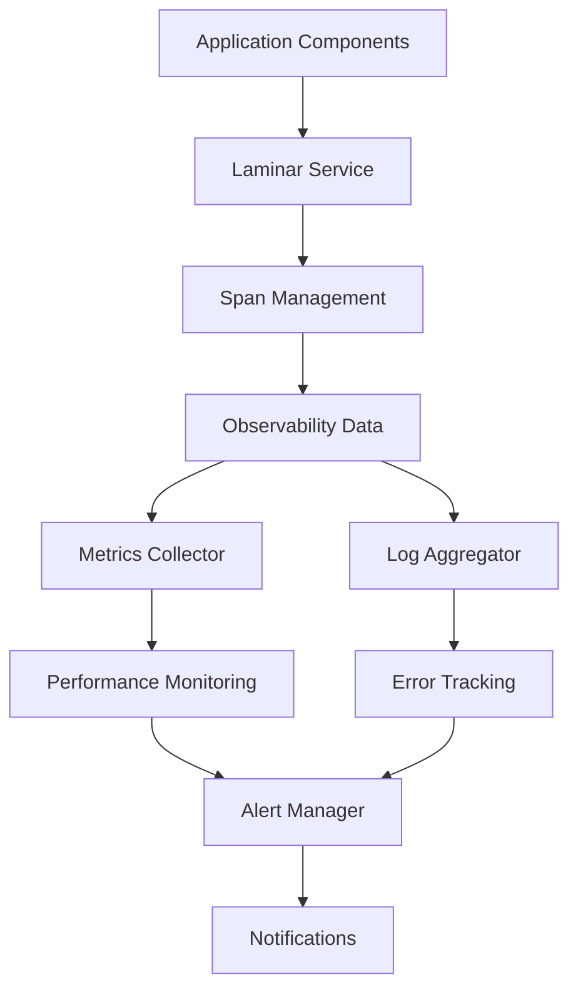

# Observability Layer System

## Table of Contents

* [Observability Layer System](#observability-layer-system)
* [Table of Contents](#table-of-contents)
* [When You're Here](#when-youre-here)
* [Research Context](#research-context)
* [System Architecture](#system-architecture)
* [Architecture Overview](#architecture-overview)
* [Laminar Service](#laminar-service)
* [Service Overview](#service-overview)
* [Service Implementation](#service-implementation)
* [Span Management](#span-management)
* [Span Lifecycle](#span-lifecycle)
* [Span Operations](#span-operations)
* [Observability Data Collection](#observability-data-collection)
* [Data Types](#data-types)
* [Collection Strategy](#collection-strategy)
* [Performance Monitoring](#performance-monitoring)
* [Performance Metrics](#performance-metrics)
* [Monitoring Implementation](#monitoring-implementation)
* [Error Tracking](#error-tracking)
* [Error Management](#error-management)
* [Error Tracking Implementation](#error-tracking-implementation)
* [Alerting and Notifications](#alerting-and-notifications)
* [Alert Configuration](#alert-configuration)
* [Alert Management](#alert-management)
* [Common Issues](#common-issues)
* [Performance Issues](#performance-issues)
* [Monitoring Issues](#monitoring-issues)
* [Troubleshooting](#troubleshooting)
* [No Dead Ends Policy](#no-dead-ends-policy)
* [Navigation](#navigation)
* [Navigation](#navigation)
* [Observability Layer System](#observability-layer-system)
* [Table of Contents](#table-of-contents)
* [When You're Here](#when-youre-here)
* [Research Context](#research-context)
* [System Architecture](#system-architecture)
* [Architecture Overview](#architecture-overview)
* [Laminar Service](#laminar-service)
* [Service Overview](#service-overview)
* [Service Implementation](#service-implementation)
* [Span Management](#span-management)
* [Span Lifecycle](#span-lifecycle)
* [Span Operations](#span-operations)
* [Observability Data Collection](#observability-data-collection)
* [Data Types](#data-types)
* [Collection Strategy](#collection-strategy)
* [Performance Monitoring](#performance-monitoring)
* [Performance Metrics](#performance-metrics)
* [Monitoring Implementation](#monitoring-implementation)
* [Error Tracking](#error-tracking)
* [Error Management](#error-management)
* [Error Tracking Implementation](#error-tracking-implementation)
* [Alerting and Notifications](#alerting-and-notifications)
* [Alert Configuration](#alert-configuration)
* [Alert Management](#alert-management)
* [Common Issues](#common-issues)
* [Performance Issues](#performance-issues)
* [Monitoring Issues](#monitoring-issues)
* [Troubleshooting](#troubleshooting)
* [No Dead Ends Policy](#no-dead-ends-policy)
* [Navigation](#navigation)
* ↑ [Table of Contents](#table-of-contents)

## When You're Here

This document is part of the KiloCode project documentation. If you're not familiar with this
document's role or purpose, this section helps orient you.

* **Purpose**: This document covers the Observability Layer system, including Laminar Service and
  Span Management components for system monitoring, tracing, and performance tracking.
* **Context**: Use this as a starting point for understanding system observability and monitoring
  capabilities.
* **Navigation**: Use the table of contents below to jump to specific topics.

> **Architecture Fun Fact**: Like a well-designed building, good documentation has a solid
> foundation, clear structure, and intuitive navigation! 🏗️

## Research Context

This document was created through comprehensive analysis of observability requirements and
monitoring system architecture in the KiloCode project. The system reflects findings from:

* Observability system architecture analysis and monitoring strategy development
* Laminar service implementation and span management research
* Performance monitoring and error tracking system design
* System health monitoring and alerting strategy development

The system provides comprehensive observability capabilities for monitoring and troubleshooting.

## System Architecture

The Observability Layer system provides comprehensive monitoring, tracing, and performance tracking
capabilities across the entire KiloCode system.

**Core Components:**

1. **Laminar Service** - Distributed tracing and span management
2. **Metrics Collector** - Performance metrics collection
3. **Log Aggregator** - Centralized log collection and processing
4. **Alert Manager** - Alerting and notification management

### Architecture Overview



## Laminar Service

### Service Overview

The Laminar Service provides distributed tracing capabilities for monitoring request flow across
system components.

**Key Features:**

* **Distributed Tracing** - End-to-end request tracing
* **Span Management** - Span creation and management
* **Context Propagation** - Trace context propagation
* **Performance Tracking** - Request performance monitoring

### Service Implementation

```typescript
interface LaminarService {
  createSpan(name: string, context?: SpanContext): Span;
  startSpan(name: string, parent?: Span): Span;
  finishSpan(span: Span): void;
  setSpanAttributes(span: Span, attributes: Record<string, any>): void;
}

class LaminarServiceImpl implements LaminarService {
  createSpan(name: string, context?: SpanContext): Span {
    return new Span(name, context);
  }
  
  startSpan(name: string, parent?: Span): Span {
    const span = this.createSpan(name, parent?.context);
    span.start();
    return span;
  }
  
  finishSpan(span: Span): void {
    span.finish();
    this.recordSpan(span);
  }
}
```

## Span Management

### Span Lifecycle

Spans represent individual operations within a distributed trace, providing detailed timing and
context information.

**Span Properties:**

* **Name** - Operation name
* **Start Time** - Operation start timestamp
* **End Time** - Operation end timestamp
* **Duration** - Operation duration
* **Attributes** - Additional context information

### Span Operations

```typescript
interface Span {
  name: string;
  startTime: number;
  endTime?: number;
  duration?: number;
  attributes: Record<string, any>;
  context: SpanContext;
  
  start(): void;
  finish(): void;
  setAttribute(key: string, value: any): void;
  addEvent(name: string, attributes?: Record<string, any>): void;
}

class SpanImpl implements Span {
  start(): void {
    this.startTime = Date.now();
  }
  
  finish(): void {
    this.endTime = Date.now();
    this.duration = this.endTime - this.startTime;
  }
  
  setAttribute(key: string, value: any): void {
    this.attributes[key] = value;
  }
}
```

## Observability Data Collection

### Data Types

The observability system collects various types of data for comprehensive system monitoring.

**Data Categories:**

* **Traces** - Distributed tracing data
* **Metrics** - Performance and system metrics
* **Logs** - Application and system logs
* **Events** - System events and alerts

### Collection Strategy

```typescript
interface DataCollector {
  collectTraces(): Trace[];
  collectMetrics(): Metric[];
  collectLogs(): Log[];
  collectEvents(): Event[];
}

class ObservabilityDataCollector implements DataCollector {
  collectTraces(): Trace[] {
    return this.laminarService.getTraces();
  }
  
  collectMetrics(): Metric[] {
    return this.metricsCollector.getMetrics();
  }
  
  collectLogs(): Log[] {
    return this.logAggregator.getLogs();
  }
  
  collectEvents(): Event[] {
    return this.eventCollector.getEvents();
  }
}
```

## Performance Monitoring

### Performance Metrics

Performance monitoring tracks key system performance indicators and trends.

**Key Metrics:**

* **Response Time** - Request response times
* **Throughput** - Request processing rate
* **Error Rate** - Error occurrence rate
* **Resource Usage** - CPU, memory, and disk usage

### Monitoring Implementation

```typescript
interface PerformanceMonitor {
  recordResponseTime(operation: string, duration: number): void;
  recordThroughput(operation: string, count: number): void;
  recordError(operation: string, error: Error): void;
  recordResourceUsage(metrics: ResourceMetrics): void;
}

class PerformanceMonitorImpl implements PerformanceMonitor {
  recordResponseTime(operation: string, duration: number): void {
    this.metrics.record({
      type: 'response_time',
      operation,
      value: duration,
      timestamp: Date.now()
    });
  }
  
  recordError(operation: string, error: Error): void {
    this.metrics.record({
      type: 'error',
      operation,
      error: error.message,
      timestamp: Date.now()
    });
  }
}
```

## Error Tracking

### Error Management

Error tracking provides comprehensive error monitoring and analysis capabilities.

**Error Categories:**

* **Application Errors** - Application-level errors
* **System Errors** - System-level errors
* **Network Errors** - Network connectivity errors
* **Performance Errors** - Performance-related errors

### Error Tracking Implementation

```typescript
interface ErrorTracker {
  trackError(error: Error, context: ErrorContext): void;
  getErrorStats(): ErrorStats;
  getErrorTrends(): ErrorTrend[];
}

class ErrorTrackerImpl implements ErrorTracker {
  trackError(error: Error, context: ErrorContext): void {
    const errorRecord = {
      message: error.message,
      stack: error.stack,
      context,
      timestamp: Date.now(),
      severity: this.calculateSeverity(error)
    };
    
    this.errorStore.record(errorRecord);
    this.alertManager.checkAlerts(errorRecord);
  }
  
  private calculateSeverity(error: Error): ErrorSeverity {
    // Calculate error severity based on error type and context
    return ErrorSeverity.MEDIUM;
  }
}
```

## Alerting and Notifications

### Alert Configuration

Alerting system provides proactive monitoring and notification capabilities.

**Alert Types:**

* **Performance Alerts** - Performance threshold alerts
* **Error Alerts** - Error rate and severity alerts
* **Resource Alerts** - Resource usage alerts
* **System Alerts** - System health alerts

### Alert Management

```typescript
interface AlertManager {
  createAlert(alert: Alert): void;
  checkAlerts(data: any): void;
  sendNotification(alert: Alert): void;
}

class AlertManagerImpl implements AlertManager {
  checkAlerts(data: any): void {
    for (const alert of this.alerts) {
      if (alert.condition(data)) {
        this.sendNotification(alert);
      }
    }
  }
  
  sendNotification(alert: Alert): void {
    this.notificationService.send({
      type: alert.type,
      message: alert.message,
      severity: alert.severity,
      timestamp: Date.now()
    });
  }
}
```

## Common Issues

### Performance Issues

* **High Latency** - Slow response times
* **Memory Leaks** - Memory usage growth
* **CPU Spikes** - High CPU usage
* **Resource Exhaustion** - Resource limit exceeded

### Monitoring Issues

* **Data Loss** - Missing observability data
* **False Alerts** - Incorrect alert triggers
* **Performance Impact** - Observability overhead
* **Storage Issues** - Data storage problems

### Troubleshooting

* **Log Analysis** - Analyze logs for issues
* **Metric Investigation** - Investigate performance metrics
* **Trace Analysis** - Analyze distributed traces
* **Alert Investigation** - Investigate alert triggers

## No Dead Ends Policy

This document follows the "No Dead Ends" principle - every path leads to useful information.

* Each section provides clear navigation to related content
* All internal links are validated and point to existing documents
* Cross-references include context for better understanding
* Common issues section provides actionable solutions

## Navigation

* 📚 [Technical Glossary](../GLOSSARY.md)

## Navigation

* [← Architecture Documentation](README.md)
* [← System Overview](SYSTEM_OVERVIEW.md)
* [← Laminar Documentation](../laminar/README.md)
* [← Main Documentation](../../README.md)
* [← Project Root](../../README.md)
