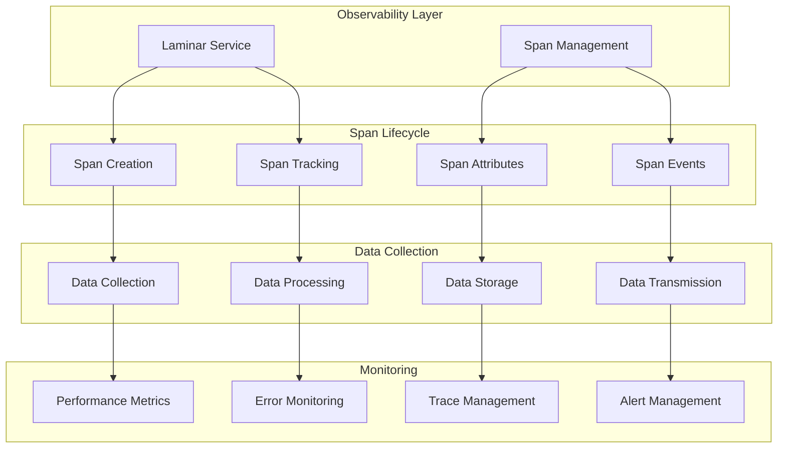

# Observability Layer System

> **Architecture Fun Fact**: Like a well-designed building, good documentation has a solid foundation, clear structure, and intuitive navigation! 🏗️
- *Purpose:*\* Comprehensive documentation of the Observability Layer system, including Laminar
  Service and Span Management components that handle system monitoring, tracing, and performance
  tracking.

> **Dinosaur Fun Fact**: Architecture documentation is like a dinosaur fossil record - each layer
> tells us about the evolution of our system, helping us understand how it grew and changed over
> time! 🦕

<details><summary>Table of Contents</summary>
- [Executive Summary](#executive-summary)
- [System Architecture](#system-architecture)
- [Laminar Service](#laminar-service)
- [Span Management](#span-management)
- [Observability Data Collection](#observability-data-collection)
- [Performance Monitoring](#performance-monitoring)
- [Error Tracking](#error-tracking)
- [Common Issues and Solutions](#common-issues-and-solutions)
- Navigation Footer

</details>

## Executive Summary

## Research Context
- *Purpose:*\* \[Describe the purpose and scope of this document]
- *Background:*\* \[Provide relevant background information]
- *Research Questions:*\* \[List key questions this document addresses]
- *Methodology:*\* \[Describe the approach or methodology used]
- *Findings:*\* \[Summarize key findings or conclusions]
- \*\*
- The Observability Layer system manages system monitoring, tracing, and performance tracking through
  the Laminar Service and Span Management components. It provides comprehensive observability into
  system behavior, performance metrics, and error tracking.\*

The Observability Layer consists of two main components:
1. **Laminar Service** - Core observability service and span lifecycle management
2. **Span Management** - Span creation, tracking, and data collection

## System Architecture



## Laminar Service

### Overview

The Laminar Service is the core observability service that manages span creation, lifecycle, and
data collection.
- *Location*\*: `src/services/laminar/LaminarService.ts`

### Service Architecture
- *Service Implementation*\*:

```typescript
class LaminarService {
	private static instance: LaminarService | undefined
	private enabled: boolean = false
	private isInitialized: boolean = false
	private recordSpanIO: boolean = false
	private userId?: string
	private spans = new Map<string, Span>()
	private activeSpans = new Map<string, Span>()
	private pendingSpanRequests: Array<{
		spanType: SpanType
		options: { name: string; spanType?: string; input?: any; sessionId?: string }
		isActive: boolean
	}> = []

	public static getInstance(): LaminarService {
		if (!LaminarService.instance) {
			LaminarService.instance = new LaminarService()
		}
		return LaminarService.instance
	}
}
```

### Service Initialization
- *Initialization Process*\*:

```typescript
public async initialize(): Promise<void> {
  const operationId = `initialize-${Date.now()}-${Math.random().toString(36).substr(2, 9)}`

  if (this.isInitialized) {
  return
  }

  if (this.isInitializing) {
  return
  }

  this.isInitializing = true
  try {
  // Check configuration
  if (!laminarConfig.enabled || !laminarConfig.apiKey) {
      this.enabled = false
      this.isInitialized = true
      return
  }

  // Initialize Laminar with custom server configuration
  Laminar.initialize({
      projectApiKey: laminarConfig.apiKey,
      baseUrl: laminarConfig.baseUrl,
      httpPort: laminarConfig.httpPort,
      grpcPort: laminarConfig.grpcPort,
  })

  this.enabled = laminarConfig.enabled
  this.recordSpanIO = laminarConfig.recordSpanIO
  this.isInitialized = true

  // Process any pending span requests
  if (this.pendingSpanRequests.length > 0) {
      const queued = this.pendingSpanRequests.splice(0)
      for (const req of queued) {
          this._startSpanNow(req.spanType, req.options, req.isActive)
      }
  }
  } catch (error) {
  logger.error("Failed to initialize Laminar service:", error)
  this.enabled = false
  this.isInitialized = true
  } finally {
  this.isInitializing = false
  }
}
```

### Span Creation
- *Span Creation Process*\*:

```typescript
public startSpan(
  spanType: SpanType,
  options: {
  name: string
  spanType?: string
  input?: any
  sessionId?: string
  },
  isActive: boolean = false,
): void {
  const operationId = `startSpan-${Date.now()}-${Math.random().toString(36).substr(2, 9)}`

  // If service is disabled, skip
  if (!laminarConfig.enabled && !this.enabled) {
  return
  }

  // If not initialized, queue the request
  if (!this.isInitialized) {
  this.pendingSpanRequests.push({ spanType, options, isActive })
  if (!this.isInitializing) {
      this.initialize().catch((err) =>
          console.error("[LAMINAR] Failed to initialize while processing pending span requests:", err),
      )
  }
  return
  }

  try {
  this._startSpanNow(spanType, options, isActive)
  } catch (error) {
  logger.error("Failed to start span:", error)
  }
}

private _startSpanNow(
  spanType: SpanType,
  options: { name: string; spanType?: string; input?: any; sessionId?: string },
  isActive: boolean = false,
): void {
  const span = Laminar.startSpan({
  name: options.name,
  spanType: (options.spanType || spanType) as "LLM" | "DEFAULT" | "TOOL",
  input: this.recordSpanIO ? options.input : undefined,
  userId: this.userId,
  sessionId: options.sessionId,
  })

  this.spans.set(options.name, span)

  if (isActive) {
  this.activeSpans.set(spanType, span)
  }
}
```

## Span Management

### Span Types
- *Supported Span Types*\*:

```typescript
type SpanType = "LLM" | "DEFAULT" | "TOOL"

// LLM spans - for language model interactions
const llmSpan = laminarService.startSpan(
	"LLM",
	{
		name: `${taskId}-llm_call`,
		spanType: "LLM",
		sessionId: taskId,
		input: conversationHistory,
	},
	true,
)

// DEFAULT spans - for general operations
const defaultSpan = laminarService.startSpan("DEFAULT", {
	name: `${taskId}-operation`,
	spanType: "DEFAULT",
	sessionId: taskId,
})

// TOOL spans - for tool executions
const toolSpan = laminarService.startSpan("TOOL", {
	name: `${taskId}-tool_${toolName}`,
	spanType: "TOOL",
	sessionId: taskId,
	input: toolInput,
})
```

### Span Lifecycle
- *Span Lifecycle Management*\*:

```typescript
// Span creation with lifecycle tracking
public startSpan(spanType: SpanType, options: {...}, isActive: boolean = false): void {
  // Create span
  const span = this._startSpanNow(spanType, options, isActive)

  // Track span lifecycle
  this.trackSpanLifecycle(span, options.name)
}

private trackSpanLifecycle(span: Span, spanName: string): void {
  const startTime = Date.now()

  // Store span metadata
  this.spanMetadata.set(spanName, {
  startTime,
  spanType: span.type,
  isActive: this.activeSpans.has(span.type)
  })

  // Set up cleanup on span end
  const originalEnd = span.end.bind(span)
  span.end = () => {
  const endTime = Date.now()
  const duration = endTime - startTime

  // Record performance metrics
  this.recordSpanMetrics(spanName, duration)

  // Clean up span references
  this.spans.delete(spanName)
  this.activeSpans.delete(span.type)
  this.spanMetadata.delete(spanName)

  // Call original end method
  originalEnd()
  }
}
```

### Span Attributes
- *Attribute Management*\*:

```typescript
// Add attributes to spans
public addAttributesToSpan(spanName: string, attributes: Record<string, any>): void {
  const span = this.spans.get(spanName)
  if (span) {
  span.setAttributes(attributes)
  }
}

// Add LLM-specific attributes
public addLlmAttributesToSpan(spanName: string, attributes: Record<string, any>): void {
  const span = this.spans.get(spanName)
  if (span) {
  Laminar.withSpan(span, () => {
      Laminar.setSpanAttributes(attributes as any)
  })
  }
}

// Example usage in Task.ts
laminarService.addAttributesToSpan(`${this.taskId}-task.step`, {
  "task.id": this.taskId,
  "task.rootId": this.rootTaskId || this.taskId,
  "task.parentId": this.parentTaskId,
  "task.number": this.taskNumber,
  "task.type": this.parentTask ? "subtask" : "root",
  "task.mode": this._taskMode || "default",
  "task.timestamp": new Date().toISOString(),
})
```

## Observability Data Collection

### Data Collection Strategy
- *System Prompt Optimization*\*:

```typescript
// Optimize system prompt storage in spans
const spanInput = laminarService.getRecordSpanIO()
	? [{ role: "system", content: `[SYSTEM_PROMPT:${systemPrompt.length} chars]` }, ...cleanConversationHistory]
	: undefined

// Benefits:
// - Reduces span data size by ~99% for large system prompts
// - Maintains observability without storing full prompts
// - Improves performance and reduces storage costs
```

### Performance Metrics
- *Metrics Collection*\*:

```typescript
// Performance metrics tracking
interface SpanMetrics {
  duration: number
  startTime: number
  endTime: number
  spanType: SpanType
  isActive: boolean
  attributes: Record<string, any>
}

// Record span performance
private recordSpanMetrics(spanName: string, duration: number): void {
  const metadata = this.spanMetadata.get(spanName)
  if (metadata) {
  const metrics: SpanMetrics = {
      duration,
      startTime: metadata.startTime,
      endTime: Date.now(),
      spanType: metadata.spanType,
      isActive: metadata.isActive,
      attributes: this.getSpanAttributes(spanName)
  }

  // Store metrics for analysis
  this.performanceMetrics.push(metrics)

  // Emit metrics event
  this.emit('spanCompleted', metrics)
  }
}
```

### Error Tracking
- *Error Recording*\*:

```typescript
// Record exceptions on spans
public recordExceptionOnSpan(spanName: string, error: Error): void {
  const span = this.spans.get(spanName)
  if (span) {
  span.recordException(error)

  // Also record error metrics
  this.recordErrorMetrics(spanName, error)
  }
}

// Error metrics tracking
private recordErrorMetrics(spanName: string, error: Error): void {
  const errorMetrics = {
  spanName,
  errorType: error.name,
  errorMessage: error.message,
  stackTrace: error.stack,
  timestamp: Date.now()
  }

  this.errorMetrics.push(errorMetrics)
  this.emit('errorRecorded', errorMetrics)
}
```

## Performance Monitoring

### Monitoring Metrics
- *Key Performance Indicators*\*:

```typescript
// Performance monitoring
interface PerformanceMetrics {
  spanCreationTime: number
  spanProcessingTime: number
  activeSpanCount: number
  totalSpanCount: number
  errorRate: number
  averageSpanDuration: number
}

// Calculate performance metrics
public getPerformanceMetrics(): PerformanceMetrics {
  const now = Date.now()
  const recentSpans = this.performanceMetrics.filter(
  m => now - m.endTime < 60000 // Last minute
  )

  return {
  spanCreationTime: this.calculateAverageCreationTime(recentSpans),
  spanProcessingTime: this.calculateAverageProcessingTime(recentSpans),
  activeSpanCount: this.activeSpans.size,
  totalSpanCount: this.spans.size,
  errorRate: this.calculateErrorRate(recentSpans),
  averageSpanDuration: this.calculateAverageDuration(recentSpans)
  }
}
```

### Resource Usage Tracking
- *Resource Monitoring*\*:

```typescript
// Resource usage tracking
interface ResourceUsage {
  memoryUsage: number
  cpuUsage: number
  spanCount: number
  activeSpanCount: number
  pendingSpanCount: number
}

// Monitor resource usage
public getResourceUsage(): ResourceUsage {
  return {
  memoryUsage: process.memoryUsage().heapUsed,
  cpuUsage: process.cpuUsage().user,
  spanCount: this.spans.size,
  activeSpanCount: this.activeSpans.size,
  pendingSpanCount: this.pendingSpanRequests.length
  }
}
```

## Error Tracking

### Error Classification
- *Error Types*\*:

```typescript
// Error classification
enum ErrorType {
	SPAN_CREATION_ERROR = "span_creation_error",
	SPAN_PROCESSING_ERROR = "span_processing_error",
	LAMINAR_INITIALIZATION_ERROR = "laminar_initialization_error",
	SPAN_CLEANUP_ERROR = "span_cleanup_error",
	ATTRIBUTE_SETTING_ERROR = "attribute_setting_error",
}

// Error tracking
interface ErrorRecord {
	type: ErrorType
	message: string
	stackTrace: string
	timestamp: number
	spanName?: string
	context: Record<string, any>
}
```

### Error Recovery
- *Error Recovery Strategies*\*:

```typescript
// Error recovery implementation
private handleError(error: Error, context: string): void {
  const errorRecord: ErrorRecord = {
  type: this.classifyError(error),
  message: error.message,
  stackTrace: error.stack || '',
  timestamp: Date.now(),
  context: { operation: context }
  }

  // Log error
  logger.error(`Laminar error in ${context}:`, error)

  // Record error
  this.errorRecords.push(errorRecord)

  // Attempt recovery based on error type
  this.attemptErrorRecovery(errorRecord)
}

private attemptErrorRecovery(errorRecord: ErrorRecord): void {
  switch (errorRecord.type) {
  case ErrorType.SPAN_CREATION_ERROR:
      // Retry span creation with exponential backoff
      this.retrySpanCreation(errorRecord)
      break
  case ErrorType.LAMINAR_INITIALIZATION_ERROR:
      // Reinitialize Laminar service
      this.reinitializeLaminar()
      break
  default:
      // Log error and continue
      console.warn('Unrecoverable error:', errorRecord)
  }
}
```

## Common Issues and Solutions

### Issue 1: Span Duplication
- *Symptoms*\*:
- Multiple spans for same operation
- Duplicate observability data
- Performance degradation
- *Root Cause*\*: Active span check not working properly
- *Solution*\*:

```typescript
// Enhanced active span check
public startSpan(spanType: SpanType, options: {...}, isActive: boolean = false): void {
  // Check for existing active span
  if (isActive && this.activeSpans.has(spanType)) {
  const existingSpan = this.activeSpans.get(spanType)
  console.log(`[LAMINAR] Active span already exists for ${spanType}, reusing existing span`)
  return existingSpan
  }

  // Check for duplicate span name
  if (this.spans.has(options.name)) {
  console.log(`[LAMINAR] Span with name ${options.name} already exists, skipping`)
  return this.spans.get(options.name)
  }

  this._startSpanNow(spanType, options, isActive)
}
```

### Issue 2: System Prompt Duplication
- *Symptoms*\*:
- Large system prompts still stored in spans
- High memory usage
- Slow span processing
- *Root Cause*\*: `recordSpanIO` flag not properly checked
- *Solution*\*:

```typescript
// Ensure proper recordSpanIO check
const spanInput = laminarService.getRecordSpanIO()
	? [{ role: "system", content: `[SYSTEM_PROMPT:${systemPrompt.length} chars]` }, ...cleanConversationHistory]
	: undefined

// Add validation
if (laminarService.getRecordSpanIO() && spanInput) {
	console.log(`[LAMINAR] Span input size: ${JSON.stringify(spanInput).length} bytes`)
	console.log(`[LAMINAR] System prompt metadata: [SYSTEM_PROMPT:${systemPrompt.length} chars]`)
}
```

### Issue 3: Span Cleanup Issues
- *Symptoms*\*:
- Spans not properly cleaned up
- Memory leaks
- Active span count growing
- *Root Cause*\*: Span disposal not handled properly
- *Solution*\*:

```typescript
// Enhanced span cleanup
public endSpan(spanName: string): void {
  const span = this.spans.get(spanName)
  if (span) {
  try {
      span.end()
  } catch (endErr) {
      console.warn(`[LAMINAR] span.end() threw: ${endErr}`)
  }

  this.spans.delete(spanName)

  // Remove from active spans
  for (const [key, value] of this.activeSpans.entries()) {
      if (value === span) {
          this.activeSpans.delete(key)
          console.log(`[LAMINAR] Removed active span: ${key}`)
      }
  }
  }
}

// Cleanup all spans
public cleanupAllSpans(): void {
  for (const [name, span] of this.spans.entries()) {
  try {
      span.end()
  } catch (error) {
      console.error(`[LAMINAR] Error ending span ${name}:`, error)
  }
  }

  this.spans.clear()
  this.activeSpans.clear()
}
```

<a id="navigation-footer"></a>
- Back: [`DUPLICATE_API_REQUESTS_TROUBLESHOOTING.md`](DUPLICATE_API_REQUESTS_TROUBLESHOOTING.md) ·
  Root: [`README.md`](README.md) · Source: `/docs/OBSERVABILITY_LAYER_SYSTEM.md#L1`

## No Dead Ends Policy

This document is designed to provide value and connect to the broader KiloCode ecosystem:
- **Purpose**: \[Brief description of document purpose]
- **Connections**: Links to related documents and resources
- **Next Steps**: Clear guidance on how to use this information
- **Related Documentation**: References to complementary materials

For questions or suggestions about this documentation, please refer to the [Documentation Guide](../../../../../../../DOCUMENTATION_GUIDE.md) or [Architecture Overview](../../../../../../../../architecture/README.md).

## Navigation Footer
- \*\*
- *Navigation*\*: [docs](../) · [architecture](../../docs/architecture/) ·
  [↑ Table of Contents](#observability-layer-system)
