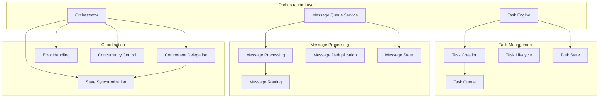
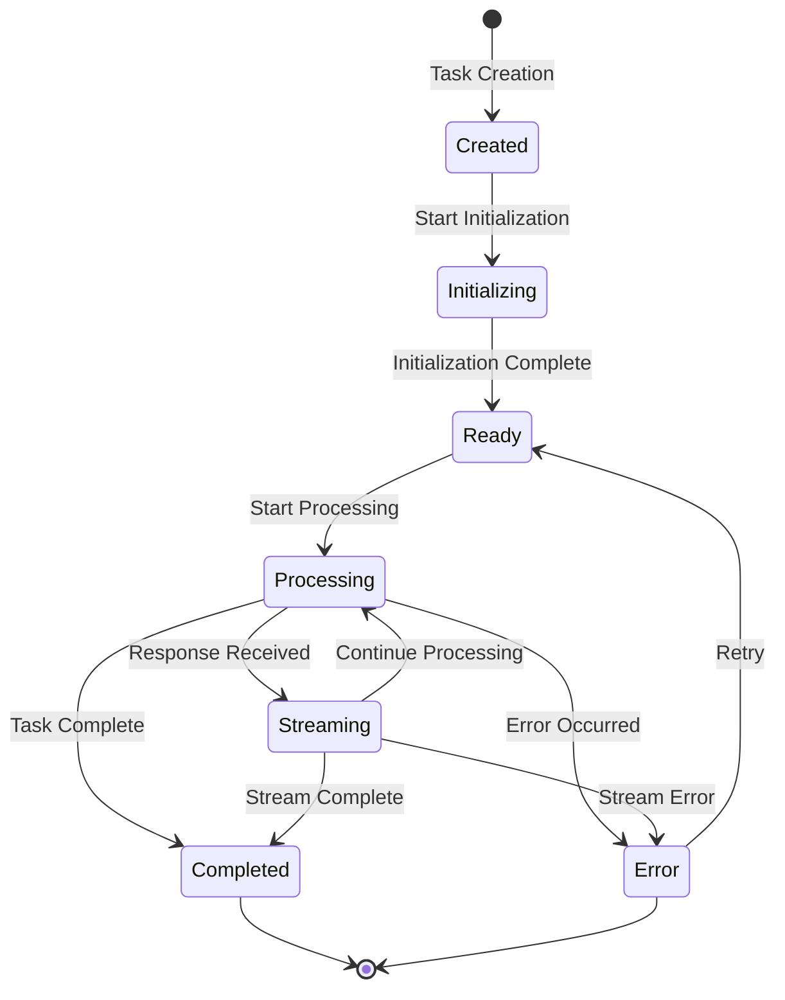

# Orchestration Layer System

**Purpose:** Comprehensive documentation of the Orchestration Layer system, including Task Engine, Message Queue Service, and Orchestrator components that manage task execution and coordination.

> **Dinosaur Fun Fact**: Architecture documentation is like a dinosaur fossil record - each layer tells us about the evolution of our system, helping us understand how it grew and changed over time! 🦕

<details><summary>Table of Contents</summary>

- [Executive Summary](#executive-summary)
- [System Architecture](#system-architecture)
- [Task Engine](#task-engine)
- [Message Queue Service](#message-queue-service)
- [Orchestrator](#orchestrator)
- [Task Lifecycle Management](#task-lifecycle-management)
- [State Coordination](#state-coordination)
- [Common Issues and Solutions](#common-issues-and-solutions)
- [Navigation Footer](#navigation-footer)

</details>

## Executive Summary

_The Orchestration Layer system manages the core task execution engine, message queue processing, and overall system coordination. It is responsible for task lifecycle management, request deduplication, and coordinating between different system components._

The Orchestration Layer consists of three main components:

1. **Task Engine** - Core task execution and lifecycle management
2. **Message Queue Service** - Message queuing and deduplication
3. **Orchestrator** - System-wide coordination and task delegation

## System Architecture



## Task Engine

### Overview

The Task Engine is the core component responsible for task execution, lifecycle management, and API request coordination.

**Location**: `src/core/task/Task.ts`

### Task Creation

**Task Constructor**:

```typescript
export class Task extends EventEmitter {
	public readonly taskId: string
	public readonly instanceId: string
	public readonly parentTask?: Task
	public readonly rootTask?: Task

	// Message Queue Service
	public readonly messageQueueService: MessageQueueService
	private messageQueueStateChangedHandler: (() => void) | undefined

	// Streaming state
	public isStreaming = false
	public isWaitingForFirstChunk = false

	constructor(options: TaskOptions) {
		super()

		this.taskId = options.taskId || crypto.randomUUID()
		this.instanceId = crypto.randomUUID()

		// Initialize message queue service
		this.messageQueueService = new MessageQueueService()

		this.messageQueueStateChangedHandler = () => {
			this.emit(RooCodeEventName.TaskUserMessage, this.taskId)
			this.providerRef.deref()?.postStateToWebview()
		}

		this.messageQueueService.on("stateChanged", this.messageQueueStateChangedHandler)
	}
}
```

### Task Lifecycle

**Lifecycle States**:



**Lifecycle Methods**:

```typescript
// Task initiation
public async submitUserMessage(text: string, images?: string[]): Promise<void> {
    // Add user message to conversation
    // Trigger task processing
}

// Task processing loop
private async initiateTaskLoop(userContent: ContentBlockParam[]): Promise<void> {
    // Main task execution loop
    while (!this.abort) {
        const didEndLoop = await this.recursivelyMakeClineRequests(userContent, includeFileDetails)
        // Continue until completion
    }
}

// Task completion
public async completeTask(): Promise<void> {
    // Finalize task state
    // Clean up resources
}
```

### API Request Management

**Request Creation**:

```typescript
public async *attemptApiRequest(retryAttempt: number = 0): ApiStream {
    // Initialize request variables
    let cacheWriteTokens = 0
    let cacheReadTokens = 0
    let inputTokens = 0
    let outputTokens = 0

    // Create API request
    const stream = await Laminar.withSpan(laminarService.getActiveSpan("DEFAULT")!, async () => {
        laminarService.startSpan("LLM", {
            name: `${this.taskId}-llm_call`,
            spanType: "LLM",
            sessionId: this.rootTaskId || this.taskId,
            input: laminarService.getRecordSpanIO()
                ? [{ role: "system", content: `[SYSTEM_PROMPT:${systemPrompt.length} chars]` }, ...cleanConversationHistory]
                : undefined,
        })
        return this.api.createMessage(systemPrompt, cleanConversationHistory, metadata)
    })

    // Process streaming response
    const iterator = stream[Symbol.asyncIterator]()

    try {
        this.isWaitingForFirstChunk = true
        const firstChunk = await iterator.next()
        yield firstChunk.value
        this.isWaitingForFirstChunk = false
    } catch (error) {
        this.isWaitingForFirstChunk = false
        // Handle error
    }
}
```

## Message Queue Service

### Overview

The Message Queue Service manages queued messages and provides deduplication mechanisms to prevent duplicate processing.

**Location**: `src/core/message-queue/MessageQueueService.ts`

### Service Implementation

**Core Service**:

```typescript
export class MessageQueueService extends EventEmitter<QueueEvents> {
	private _messages: QueuedMessage[]

	constructor() {
		super()
		this._messages = []
	}

	public addMessage(text: string, images?: string[]): QueuedMessage | undefined {
		if (!text && !images?.length) {
			return undefined
		}

		// Check for duplicate messages
		const existingMessage = this._messages.find(
			(msg) => msg.text === text && JSON.stringify(msg.images) === JSON.stringify(images),
		)

		if (existingMessage) {
			console.log("Duplicate message detected, skipping")
			return existingMessage
		}

		const message: QueuedMessage = {
			timestamp: Date.now(),
			id: uuidv4(),
			text,
			images,
		}

		this._messages.push(message)
		this.emit("stateChanged", this._messages)
		return message
	}

	public dequeueMessage(): QueuedMessage | undefined {
		const message = this._messages.shift()
		this.emit("stateChanged", this._messages)
		return message
	}
}
```

### Message Processing

**Queue Processing Logic**:

```typescript
// In Task.ts
public processQueuedMessages(): void {
    try {
        if (!this.messageQueueService.isEmpty()) {
            const queued = this.messageQueueService.dequeueMessage()
            if (queued) {
                setTimeout(() => {
                    this.submitUserMessage(queued.text, queued.images).catch((err) =>
                        console.error(`[Task] Failed to submit queued message:`, err),
                    )
                }, 0)
            }
        }
    } catch (error) {
        console.error("[Task] Error processing queued messages:", error)
    }
}
```

### Deduplication Mechanisms

**Message Deduplication**:

```typescript
// Enhanced deduplication
public addMessage(text: string, images?: string[]): QueuedMessage | undefined {
    if (!text && !images?.length) {
        return undefined
    }

    // Create message signature for duplicate detection
    const messageSignature = this.createMessageSignature(text, images)

    const existingMessage = this._messages.find(msg =>
        this.createMessageSignature(msg.text, msg.images) === messageSignature
    )

    if (existingMessage) {
        console.log("Duplicate message detected, updating timestamp instead")
        existingMessage.timestamp = Date.now()
        this.emit("stateChanged", this._messages)
        return existingMessage
    }

    // Add new message
    const message: QueuedMessage = {
        timestamp: Date.now(),
        id: uuidv4(),
        text,
        images,
    }

    this._messages.push(message)
    this.emit("stateChanged", this._messages)
    return message
}

private createMessageSignature(text: string, images?: string[]): string {
    return `${text.trim()}-${JSON.stringify(images || [])}`
}
```

## Orchestrator

### Overview

The Orchestrator manages system-wide coordination, task delegation, and component interaction.

**Location**: `src/core/webview/ClineProvider.ts`

### Task Coordination

**Task Stack Management**:

```typescript
export class ClineProvider {
	private clineStack: Task[] = []

	public async createTask(
		text?: string,
		images?: string[],
		parentTask?: Task,
		options: CreateTaskOptions = {},
		configuration: RooCodeSettings = {},
	): Promise<Task> {
		// Check for existing active task
		const currentTask = this.getCurrentTask()

		if (currentTask && !currentTask.isCompleted && !currentTask.abandoned) {
			// If there's an active task, queue the message instead of creating new task
			console.log(`[ClineProvider] Active task exists (${currentTask.taskId}), queuing message`)
			currentTask.messageQueueService.addMessage(text || "", images)
			return currentTask
		}

		// Create new task
		const task = new Task({
			provider: this,
			context: this.context,
			apiConfiguration,
			enableDiff,
			enableCheckpoints,
			fuzzyMatchThreshold,
			consecutiveMistakeLimit: apiConfiguration.consecutiveMistakeLimit,
			task: text,
			images,
			experiments,
			rootTask: this.clineStack.length > 0 ? this.clineStack[0] : undefined,
			parentTask,
			taskNumber: this.clineStack.length + 1,
			onCreated: this.taskCreationCallback,
			enableBridge: BridgeOrchestrator.isEnabled(cloudUserInfo, remoteControlEnabled),
			initialTodos: options.initialTodos,
			...options,
		})

		await this.addClineToStack(task)

		return task
	}
}
```

### Component Delegation

**Task Stack Operations**:

```typescript
private async addClineToStack(task: Task): Promise<void> {
    // Remove any abandoned tasks from the stack
    this.clineStack = this.clineStack.filter(t => !t.abandoned)

    // Add new task to stack
    this.clineStack.push(task)

    // Ensure only one task is active at a time
    if (this.clineStack.length > 1) {
        // Pause previous tasks
        for (let i = 0; i < this.clineStack.length - 1; i++) {
            this.clineStack[i].isPaused = true
        }
    }
}

public getCurrentTask(): Task | undefined {
    return this.clineStack[this.clineStack.length - 1]
}
```

### State Coordination

**Global State Management**:

```typescript
public postStateToWebview(): void {
    const currentTask = this.getCurrentTask()
    if (!currentTask) return

    const state = {
        taskId: currentTask.taskId,
        isStreaming: currentTask.isStreaming,
        isWaitingForFirstChunk: currentTask.isWaitingForFirstChunk,
        queuedMessages: currentTask.queuedMessages,
        // ... other state
    }

    this.postMessageToWebview({ type: "state", state })
}
```

## Task Lifecycle Management

### Lifecycle Coordination

**Task State Transitions**:

```typescript
// Task state management
export class Task extends EventEmitter {
	public isStreaming = false
	public isWaitingForFirstChunk = false
	public isPaused = false
	public abandoned = false

	// Check if task can process new requests
	public canProcessRequests(): boolean {
		return !this.isStreaming && !this.isWaitingForFirstChunk && !this.isPaused && !this.abandoned
	}

	// Update task state
	private async updateTaskState(newState: Partial<TaskState>): Promise<void> {
		const oldState = { ...this.getCurrentState() }

		// Update state atomically
		Object.assign(this, newState)

		// Emit state change event
		this.emit(RooCodeEventName.TaskStateChanged, {
			oldState,
			newState: this.getCurrentState(),
			taskId: this.taskId,
		})

		// Notify provider of state change
		this.providerRef.deref()?.postStateToWebview()
	}
}
```

### Request Processing

**Ask Method Coordination**:

```typescript
public async ask(type: string, text?: string, images?: string[]): Promise<AskResult> {
    // ... message setup ...

    // Check for queued messages
    const isMessageQueued = !this.messageQueueService.isEmpty()
    const isBlocking = !(this.askResponse !== undefined || this.lastMessageTs !== askTs)
    const isStatusMutable = !partial && isBlocking && !isMessageQueued

    if (isMessageQueued) {
        console.log("Task#ask will process message queue")

        const message = this.messageQueueService.dequeueMessage()
        if (message) {
            // Check if this is a tool approval ask
            if (isToolApprovalAsk(type)) {
                this.handleWebviewAskResponse("yesButtonClicked", message.text, message.images)
            } else {
                this.setMessageResponse(message.text, message.images)
            }
        }
    }

    // Wait for response
    await pWaitFor(() => this.askResponse !== undefined || this.lastMessageTs !== askTs, { interval: 100 })

    // Return result
    const result = {
        response: this.askResponse!,
        text: this.askResponseText,
        images: this.askResponseImages
    }

    // Clean up
    this.askResponse = undefined
    this.askResponseText = undefined
    this.askResponseImages = undefined

    return result
}
```

## State Coordination

### Cross-Component State Sync

**State Synchronization**:

```typescript
// Provider state coordination
public async syncState(): Promise<void> {
    const currentTask = this.getCurrentTask()
    if (!currentTask) return

    // Update all dependent components
    await this.updateUIState(currentTask)
    await this.updateMessageQueueState(currentTask)
    await this.updateLaminarState(currentTask)
}

private async updateUIState(task: Task): Promise<void> {
    await this.postMessageToWebview({
        type: "state",
        state: {
            taskId: task.taskId,
            isStreaming: task.isStreaming,
            queuedMessages: task.queuedMessages,
        }
    })
}
```

### Concurrency Control

**Request Deduplication**:

```typescript
// Prevent concurrent request processing
private _isProcessingRequest = false

public async processRequest(request: Request): Promise<Response> {
    if (this._isProcessingRequest) {
        console.log("Request already being processed, queuing")
        return this.queueRequest(request)
    }

    this._isProcessingRequest = true
    try {
        return await this.executeRequest(request)
    } finally {
        this._isProcessingRequest = false
    }
}
```

## Common Issues and Solutions

### Issue 1: Task Stack Corruption

**Symptoms**:

- Multiple active tasks
- Tasks not properly cleaned up
- Memory leaks

**Root Cause**: Task stack not properly managed

**Solution**:

```typescript
// Enhanced task stack management
private async addClineToStack(task: Task): Promise<void> {
    // Clean up abandoned tasks
    this.clineStack = this.clineStack.filter(t => !t.abandoned && !t.isCompleted)

    // Add new task
    this.clineStack.push(task)

    // Ensure only one active task
    for (let i = 0; i < this.clineStack.length - 1; i++) {
        this.clineStack[i].isPaused = true
    }

    // Set up cleanup handlers
    task.on('completed', () => this.cleanupTask(task))
    task.on('abandoned', () => this.cleanupTask(task))
}

private cleanupTask(task: Task): void {
    this.clineStack = this.clineStack.filter(t => t !== task)
    task.removeAllListeners()
}
```

### Issue 2: Message Queue Race Conditions

**Symptoms**:

- Messages processed multiple times
- Queue state inconsistencies
- Duplicate API requests

**Root Cause**: Non-atomic queue operations

**Solution**:

```typescript
// Atomic queue operations
export class MessageQueueService extends EventEmitter<QueueEvents> {
	private _isProcessing = false

	public dequeueMessageIfAvailable(): QueuedMessage | undefined {
		if (this._isProcessing) {
			return undefined
		}

		this._isProcessing = true
		try {
			const message = this._messages.shift()
			if (message) {
				this.emit("stateChanged", this._messages)
			}
			return message
		} finally {
			this._isProcessing = false
		}
	}
}
```

### Issue 3: State Desynchronization

**Symptoms**:

- UI state doesn't match backend state
- Inconsistent behavior across components
- Race conditions in state updates

**Root Cause**: State updates not properly coordinated

**Solution**:

```typescript
// Centralized state management
class StateManager {
	private state: GlobalState
	private subscribers: Set<(state: GlobalState) => void> = new Set()

	public updateState(updates: Partial<GlobalState>): void {
		const oldState = { ...this.state }
		this.state = { ...this.state, ...updates }

		// Notify all subscribers
		this.subscribers.forEach((callback) => callback(this.state))

		// Log state changes for debugging
		console.log("State updated:", { oldState, newState: this.state })
	}

	public subscribe(callback: (state: GlobalState) => void): () => void {
		this.subscribers.add(callback)
		return () => this.subscribers.delete(callback)
	}
}
```

<a id="navigation-footer"></a>

- Back: [`DUPLICATE_API_REQUESTS_TROUBLESHOOTING.md`](DUPLICATE_API_REQUESTS_TROUBLESHOOTING.md) · Root: [`INDEX.md`](INDEX.md) · Source: `/docs/ORCHESTRATION_LAYER_SYSTEM.md#L1`
