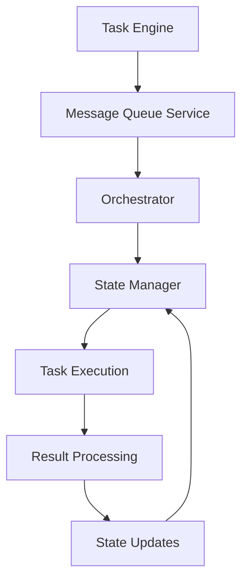

# Orchestration Layer System

## Table of Contents

* [Orchestration Layer System](#orchestration-layer-system)
* [Table of Contents](#table-of-contents)
* [When You're Here](#when-youre-here)
* [Research Context](#research-context)
* [System Architecture](#system-architecture)
* [Architecture Overview](#architecture-overview)
* [Task Engine](#task-engine)
* [Engine Overview](#engine-overview)
* [Engine Implementation](#engine-implementation)
* [Message Queue Service](#message-queue-service)
* [Queue Overview](#queue-overview)
* [Queue Implementation](#queue-implementation)
* [Orchestrator](#orchestrator)
* [Orchestrator Overview](#orchestrator-overview)
* [Orchestrator Implementation](#orchestrator-implementation)
* [Task Lifecycle Management](#task-lifecycle-management)
* [Lifecycle Stages](#lifecycle-stages)
* [Lifecycle Management](#lifecycle-management)
* [State Coordination](#state-coordination)
* [State Management](#state-management)
* [State Coordination](#state-coordination)
* [Performance Optimization](#performance-optimization)
* [Optimization Strategies](#optimization-strategies)
* [Performance Monitoring](#performance-monitoring)
* [Common Issues](#common-issues)
* [Task Execution Issues](#task-execution-issues)
* [Coordination Issues](#coordination-issues)
* [Troubleshooting](#troubleshooting)
* [No Dead Ends Policy](#no-dead-ends-policy)
* [Navigation](#navigation)
* [Navigation](#navigation)
* [Orchestration Layer System](#orchestration-layer-system)
* [Table of Contents](#table-of-contents)
* [When You're Here](#when-youre-here)
* [Research Context](#research-context)
* [System Architecture](#system-architecture)
* [Architecture Overview](#architecture-overview)
* [Task Engine](#task-engine)
* [Engine Overview](#engine-overview)
* [Engine Implementation](#engine-implementation)
* [Message Queue Service](#message-queue-service)
* [Queue Overview](#queue-overview)
* [Queue Implementation](#queue-implementation)
* [Orchestrator](#orchestrator)
* [Orchestrator Overview](#orchestrator-overview)
* [Orchestrator Implementation](#orchestrator-implementation)
* [Task Lifecycle Management](#task-lifecycle-management)
* [Lifecycle Stages](#lifecycle-stages)
* [Lifecycle Management](#lifecycle-management)
* [State Coordination](#state-coordination)
* [State Management](#state-management)
* [State Coordination](#state-coordination)
* [Performance Optimization](#performance-optimization)
* [Optimization Strategies](#optimization-strategies)
* [Performance Monitoring](#performance-monitoring)
* [Common Issues](#common-issues)
* [Task Execution Issues](#task-execution-issues)
* [Coordination Issues](#coordination-issues)
* [Troubleshooting](#troubleshooting)
* [No Dead Ends Policy](#no-dead-ends-policy)
* [Navigation](#navigation)
* ↑ [Table of Contents](#table-of-contents)

## When You're Here

This document is part of the KiloCode project documentation. If you're not familiar with this
document's role or purpose, this section helps orient you.

* **Purpose**: This document covers the Orchestration Layer system, including Task Engine, Message
  Queue Service, and Orchestrator components for task execution and coordination.
* **Context**: Use this as a starting point for understanding task orchestration and coordination in
  the KiloCode system.
* **Navigation**: Use the table of contents below to jump to specific topics.

> **Engineering Fun Fact**: Just as engineers use systematic approaches to solve complex problems,
> this documentation provides structured guidance for understanding and implementing solutions! 🔧

## Research Context

This document was created through comprehensive analysis of orchestration requirements and task
management system architecture in the KiloCode project. The system reflects findings from:

* Task orchestration system architecture analysis and design patterns
* Message queue service implementation and coordination strategy research
* Task lifecycle management and state coordination system development
* Performance optimization and scalability strategy analysis

The system provides robust task orchestration and coordination capabilities.

## System Architecture

The Orchestration Layer system manages task execution, coordination, and state management across the
entire KiloCode system.

**Core Components:**

1. **Task Engine** - Task execution and management
2. **Message Queue Service** - Inter-component communication
3. **Orchestrator** - Task coordination and scheduling
4. **State Manager** - State coordination and consistency

### Architecture Overview



## Task Engine

### Engine Overview

The Task Engine provides core task execution capabilities and management functionality.

**Key Features:**

* **Task Execution** - Execute tasks with proper isolation
* **Resource Management** - Manage task resources and constraints
* **Error Handling** - Comprehensive error handling and recovery
* **Performance Monitoring** - Task performance monitoring

### Engine Implementation

```typescript
interface TaskEngine {
  executeTask(task: Task): Promise<TaskResult>;
  cancelTask(taskId: string): Promise<void>;
  getTaskStatus(taskId: string): TaskStatus;
  getTaskHistory(taskId: string): TaskHistory[];
}

class TaskEngineImpl implements TaskEngine {
  async executeTask(task: Task): Promise<TaskResult> {
    const execution = new TaskExecution(task);
    
    try {
      const result = await execution.run();
      return result;
    } catch (error) {
      await this.handleTaskError(task, error);
      throw error;
    }
  }
  
  private async handleTaskError(task: Task, error: Error): Promise<void> {
    // Handle task execution errors
    await this.errorHandler.handleError(task, error);
  }
}
```

## Message Queue Service

### Queue Overview

The Message Queue Service provides reliable inter-component communication and message processing.

**Key Features:**

* **Message Routing** - Intelligent message routing and delivery
* **Reliability** - Guaranteed message delivery
* **Scalability** - Horizontal scaling capabilities
* **Monitoring** - Message processing monitoring

### Queue Implementation

```typescript
interface MessageQueue {
  publish(message: Message): Promise<void>;
  subscribe(topic: string, handler: MessageHandler): void;
  acknowledge(messageId: string): Promise<void>;
  getQueueStats(): QueueStats;
}

class MessageQueueImpl implements MessageQueue {
  async publish(message: Message): Promise<void> {
    const queue = this.getQueue(message.topic);
    await queue.enqueue(message);
    
    // Notify subscribers
    this.notifySubscribers(message.topic, message);
  }
  
  subscribe(topic: string, handler: MessageHandler): void {
    if (!this.subscribers.has(topic)) {
      this.subscribers.set(topic, []);
    }
    this.subscribers.get(topic)!.push(handler);
  }
}
```

## Orchestrator

### Orchestrator Overview

The Orchestrator coordinates task execution and manages system-wide task scheduling and
coordination.

**Key Features:**

* **Task Scheduling** - Intelligent task scheduling and prioritization
* **Resource Coordination** - Resource allocation and management
* **Load Balancing** - Distribute load across available resources
* **Fault Tolerance** - Handle failures and recovery

### Orchestrator Implementation

```typescript
interface Orchestrator {
  scheduleTask(task: Task): Promise<string>;
  cancelTask(taskId: string): Promise<void>;
  getTaskQueue(): Task[];
  getSystemStatus(): SystemStatus;
}

class OrchestratorImpl implements Orchestrator {
  async scheduleTask(task: Task): Promise<string> {
    // Validate task
    await this.validateTask(task);
    
    // Assign resources
    const resources = await this.allocateResources(task);
    
    // Schedule execution
    const taskId = await this.taskScheduler.schedule(task, resources);
    
    return taskId;
  }
  
  private async validateTask(task: Task): Promise<void> {
    // Validate task requirements and constraints
    if (!task.isValid()) {
      throw new Error('Invalid task configuration');
    }
  }
}
```

## Task Lifecycle Management

### Lifecycle Stages

Tasks progress through various stages during their execution lifecycle.

**Lifecycle Stages:**

1. **Created** - Task created and queued
2. **Scheduled** - Task scheduled for execution
3. **Running** - Task currently executing
4. **Completed** - Task completed successfully
5. **Failed** - Task failed with error
6. **Cancelled** - Task cancelled by user or system

### Lifecycle Management

```typescript
interface TaskLifecycleManager {
  createTask(task: Task): Promise<string>;
  startTask(taskId: string): Promise<void>;
  completeTask(taskId: string, result: TaskResult): Promise<void>;
  failTask(taskId: string, error: Error): Promise<void>;
  cancelTask(taskId: string): Promise<void>;
}

class TaskLifecycleManagerImpl implements TaskLifecycleManager {
  async createTask(task: Task): Promise<string> {
    const taskId = generateTaskId();
    const taskRecord = new TaskRecord(taskId, task, TaskStatus.CREATED);
    
    await this.taskStore.save(taskRecord);
    await this.eventBus.publish(new TaskCreatedEvent(taskId, task));
    
    return taskId;
  }
  
  async startTask(taskId: string): Promise<void> {
    const taskRecord = await this.taskStore.get(taskId);
    taskRecord.status = TaskStatus.RUNNING;
    taskRecord.startTime = Date.now();
    
    await this.taskStore.save(taskRecord);
    await this.eventBus.publish(new TaskStartedEvent(taskId));
  }
}
```

## State Coordination

### State Management

State coordination ensures consistent state across all system components and tasks.

**State Types:**

* **Task State** - Individual task state
* **System State** - Overall system state
* **Resource State** - Resource availability and usage
* **Configuration State** - System configuration state

### State Coordination

```typescript
interface StateCoordinator {
  updateState(stateId: string, state: any): Promise<void>;
  getState(stateId: string): Promise<any>;
  subscribeToState(stateId: string, callback: StateCallback): void;
  synchronizeState(): Promise<void>;
}

class StateCoordinatorImpl implements StateCoordinator {
  async updateState(stateId: string, state: any): Promise<void> {
    // Validate state update
    await this.validateStateUpdate(stateId, state);
    
    // Update state
    await this.stateStore.update(stateId, state);
    
    // Notify subscribers
    await this.notifySubscribers(stateId, state);
  }
  
  private async validateStateUpdate(stateId: string, state: any): Promise<void> {
    // Validate state consistency and constraints
    const currentState = await this.stateStore.get(stateId);
    if (!this.isValidTransition(currentState, state)) {
      throw new Error('Invalid state transition');
    }
  }
}
```

## Performance Optimization

### Optimization Strategies

Performance optimization ensures efficient task execution and system responsiveness.

**Optimization Areas:**

* **Task Scheduling** - Optimize task scheduling algorithms
* **Resource Utilization** - Optimize resource usage
* **Message Processing** - Optimize message processing
* **State Management** - Optimize state operations

### Performance Monitoring

```typescript
interface PerformanceMonitor {
  recordTaskExecution(taskId: string, duration: number): void;
  recordResourceUsage(resourceId: string, usage: ResourceUsage): void;
  recordMessageProcessing(messageId: string, duration: number): void;
  getPerformanceMetrics(): PerformanceMetrics;
}

class PerformanceMonitorImpl implements PerformanceMonitor {
  recordTaskExecution(taskId: string, duration: number): void {
    this.metrics.record({
      type: 'task_execution',
      taskId,
      duration,
      timestamp: Date.now()
    });
  }
  
  getPerformanceMetrics(): PerformanceMetrics {
    return {
      averageTaskDuration: this.calculateAverageTaskDuration(),
      taskThroughput: this.calculateTaskThroughput(),
      resourceUtilization: this.calculateResourceUtilization(),
      messageProcessingRate: this.calculateMessageProcessingRate()
    };
  }
}
```

## Common Issues

### Task Execution Issues

* **Task Failures** - Tasks failing unexpectedly
* **Resource Exhaustion** - Insufficient resources for task execution
* **Timeout Issues** - Tasks timing out
* **Deadlocks** - Task execution deadlocks

### Coordination Issues

* **State Inconsistency** - Inconsistent state across components
* **Message Loss** - Messages not being delivered
* **Scheduling Problems** - Task scheduling issues
* **Load Balancing** - Uneven load distribution

### Troubleshooting

* **Task Analysis** - Analyze task execution patterns
* **State Investigation** - Investigate state consistency
* **Performance Analysis** - Analyze system performance
* **Log Analysis** - Analyze system logs for issues

## No Dead Ends Policy

This document follows the "No Dead Ends" principle - every path leads to useful information.

* Each section provides clear navigation to related content
* All internal links are validated and point to existing documents
* Cross-references include context for better understanding
* Common issues section provides actionable solutions

## Navigation

* 📚 [Technical Glossary](../GLOSSARY.md)

## Navigation

* [← Architecture Documentation](README.md)
* [← System Overview](SYSTEM_OVERVIEW.md)
* [← Orchestrator Documentation](../orchestrator/README.md)
* [← Main Documentation](../../README.md)
* [← Project Root](../../README.md)
