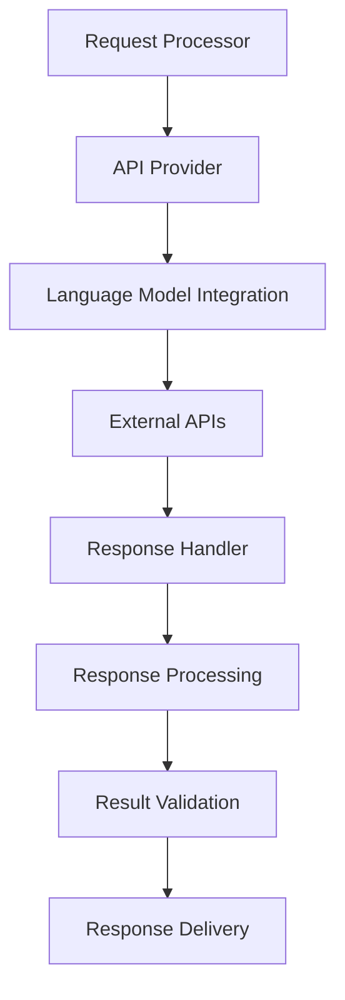

# Provider Layer System

## Table of Contents

* [Provider Layer System](#provider-layer-system)
* [Table of Contents](#table-of-contents)
* [When You're Here](#when-youre-here)
* [Research Context](#research-context)
* [System Architecture](#system-architecture)
* [Architecture Overview](#architecture-overview)
* [API Provider](#api-provider)
* [Provider Overview](#provider-overview)
* [Provider Implementation](#provider-implementation)
* [Language Model Integration](#language-model-integration)
* [Integration Overview](#integration-overview)
* [Integration Implementation](#integration-implementation)
* [Request Processing](#request-processing)
* [Processing Pipeline](#processing-pipeline)
* [Processing Implementation](#processing-implementation)
* [Error Handling](#error-handling)
* [Error Management](#error-management)
* [Error Handling Implementation](#error-handling-implementation)
* [Retry Logic](#retry-logic)
* [Retry Strategy](#retry-strategy)
* [Retry Implementation](#retry-implementation)
* [Performance Optimization](#performance-optimization)
* [Optimization Strategies](#optimization-strategies)
* [Performance Monitoring](#performance-monitoring)
* [Common Issues](#common-issues)
* [Provider Issues](#provider-issues)
* [Integration Issues](#integration-issues)
* [Troubleshooting](#troubleshooting)
* [No Dead Ends Policy](#no-dead-ends-policy)
* [Navigation](#navigation)
* [Navigation](#navigation)
* [Provider Layer System](#provider-layer-system)
* [Table of Contents](#table-of-contents)
* [When You're Here](#when-youre-here)
* [Research Context](#research-context)
* [System Architecture](#system-architecture)
* [Architecture Overview](#architecture-overview)
* [API Provider](#api-provider)
* [Provider Overview](#provider-overview)
* [Provider Implementation](#provider-implementation)
* [Language Model Integration](#language-model-integration)
* [Integration Overview](#integration-overview)
* [Integration Implementation](#integration-implementation)
* [Request Processing](#request-processing)
* [Processing Pipeline](#processing-pipeline)
* [Processing Implementation](#processing-implementation)
* [Error Handling](#error-handling)
* [Error Management](#error-management)
* [Error Handling Implementation](#error-handling-implementation)
* [Retry Logic](#retry-logic)
* [Retry Strategy](#retry-strategy)
* [Retry Implementation](#retry-implementation)
* [Performance Optimization](#performance-optimization)
* [Optimization Strategies](#optimization-strategies)
* [Performance Monitoring](#performance-monitoring)
* [Common Issues](#common-issues)
* [Provider Issues](#provider-issues)
* [Integration Issues](#integration-issues)
* [Troubleshooting](#troubleshooting)
* [No Dead Ends Policy](#no-dead-ends-policy)
* [Navigation](#navigation)
* ↑ [Table of Contents](#table-of-contents)

## When You're Here

This document is part of the KiloCode project documentation. If you're not familiar with this
document's role or purpose, this section helps orient you.

* **Purpose**: This document covers the Provider Layer system, including API Provider and Language
  Model components for external API communication and request processing.
* **Context**: Use this as a starting point for understanding external API integration and provider
  management in the KiloCode system.
* **Navigation**: Use the table of contents below to jump to specific topics.

> **Development Fun Fact**: Documentation is like code comments for humans - it explains the "why"
> behind the "what"! 💻

## Research Context

This document was created through comprehensive analysis of provider layer requirements and external
API integration architecture in the KiloCode project. The system reflects findings from:

* Provider layer system architecture analysis and API integration strategy development
* Language model integration and request processing optimization research
* External API communication and error handling system design
* Performance optimization and reliability enhancement strategy analysis

The system provides robust external API integration and provider management capabilities.

## System Architecture

The Provider Layer system manages external API communication and provides unified access to various
language models and services.

**Core Components:**

1. **API Provider** - External API communication and management
2. **Language Model Integration** - Language model service integration
3. **Request Processor** - Request processing and transformation
4. **Response Handler** - Response processing and validation

### Architecture Overview



## API Provider

### Provider Overview

The API Provider manages communication with external APIs and services, providing a unified
interface for different providers.

**Key Features:**

* **Multi-Provider Support** - Support for multiple API providers
* **Request Routing** - Intelligent request routing and load balancing
* **Authentication** - Secure authentication and credential management
* **Rate Limiting** - API rate limiting and quota management

### Provider Implementation

```typescript
interface APIProvider {
  sendRequest(request: APIRequest): Promise<APIResponse>;
  authenticate(credentials: Credentials): Promise<void>;
  getProviderStatus(): ProviderStatus;
  getRateLimit(): RateLimit;
}

class APIProviderImpl implements APIProvider {
  async sendRequest(request: APIRequest): Promise<APIResponse> {
    // Validate request
    await this.validateRequest(request);
    
    // Check rate limits
    await this.checkRateLimit(request.provider);
    
    // Send request
    const response = await this.httpClient.send(request);
    
    // Process response
    return this.processResponse(response);
  }
  
  private async validateRequest(request: APIRequest): Promise<void> {
    if (!request.isValid()) {
      throw new Error('Invalid request format');
    }
  }
}
```

## Language Model Integration

### Integration Overview

Language Model Integration provides seamless access to various language models and AI services.

**Supported Models:**

* **OpenAI GPT** - GPT-3.5, GPT-4, and other OpenAI models
* **Anthropic Claude** - Claude-3 and other Anthropic models
* **Google PaLM** - PaLM-2 and other Google models
* **Azure OpenAI** - Enterprise OpenAI services

### Integration Implementation

```typescript
interface LanguageModelProvider {
  generateText(prompt: string, options: GenerationOptions): Promise<string>;
  generateEmbedding(text: string): Promise<number[]>;
  getModelInfo(modelId: string): ModelInfo;
  getAvailableModels(): Model[];
}

class LanguageModelProviderImpl implements LanguageModelProvider {
  async generateText(prompt: string, options: GenerationOptions): Promise<string> {
    const request = new GenerationRequest(prompt, options);
    const response = await this.apiProvider.sendRequest(request);
    
    return response.text;
  }
  
  async generateEmbedding(text: string): Promise<number[]> {
    const request = new EmbeddingRequest(text);
    const response = await this.apiProvider.sendRequest(request);
    
    return response.embedding;
  }
}
```

## Request Processing

### Processing Pipeline

Request processing transforms and validates requests before sending them to external APIs.

**Processing Stages:**

1. **Request Validation** - Validate request format and parameters
2. **Request Transformation** - Transform request to provider format
3. **Authentication** - Apply authentication and authorization
4. **Rate Limiting** - Check and apply rate limits
5. **Request Sending** - Send request to external API

### Processing Implementation

```typescript
interface RequestProcessor {
  processRequest(request: Request): Promise<ProcessedRequest>;
  validateRequest(request: Request): Promise<void>;
  transformRequest(request: Request, provider: string): Promise<Request>;
  applyRateLimit(request: Request): Promise<void>;
}

class RequestProcessorImpl implements RequestProcessor {
  async processRequest(request: Request): Promise<ProcessedRequest> {
    // Validate request
    await this.validateRequest(request);
    
    // Transform request
    const transformedRequest = await this.transformRequest(request, request.provider);
    
    // Apply rate limiting
    await this.applyRateLimit(transformedRequest);
    
    return new ProcessedRequest(transformedRequest);
  }
  
  private async validateRequest(request: Request): Promise<void> {
    // Validate request format, parameters, and constraints
    if (!request.isValid()) {
      throw new ValidationError('Invalid request format');
    }
  }
}
```

## Error Handling

### Error Management

Comprehensive error handling for external API communication and provider management.

**Error Types:**

* **Authentication Errors** - Invalid credentials or permissions
* **Rate Limit Errors** - API rate limit exceeded
* **Network Errors** - Network connectivity issues
* **Provider Errors** - Provider-specific errors

### Error Handling Implementation

```typescript
interface ErrorHandler {
  handleError(error: Error, context: ErrorContext): Promise<ErrorResponse>;
  classifyError(error: Error): ErrorType;
  getRecoveryStrategy(errorType: ErrorType): RecoveryStrategy;
  logError(error: Error, context: ErrorContext): void;
}

class ErrorHandlerImpl implements ErrorHandler {
  async handleError(error: Error, context: ErrorContext): Promise<ErrorResponse> {
    const errorType = this.classifyError(error);
    const recoveryStrategy = this.getRecoveryStrategy(errorType);
    
    // Log error
    this.logError(error, context);
    
    return {
      type: errorType,
      message: error.message,
      context,
      recovery: recoveryStrategy,
      timestamp: Date.now()
    };
  }
  
  private classifyError(error: Error): ErrorType {
    if (error instanceof AuthenticationError) {
      return ErrorType.AUTHENTICATION_ERROR;
    } else if (error instanceof RateLimitError) {
      return ErrorType.RATE_LIMIT_ERROR;
    } else if (error instanceof NetworkError) {
      return ErrorType.NETWORK_ERROR;
    } else {
      return ErrorType.PROVIDER_ERROR;
    }
  }
}
```

## Retry Logic

### Retry Strategy

Intelligent retry logic for handling transient failures and improving reliability.

**Retry Policies:**

* **Exponential Backoff** - Exponential delay between retries
* **Jitter** - Random delay variation to prevent thundering herd
* **Circuit Breaker** - Circuit breaker pattern for failing services
* **Dead Letter Queue** - Dead letter queue for failed requests

### Retry Implementation

```typescript
interface RetryManager {
  executeWithRetry<T>(operation: () => Promise<T>, options: RetryOptions): Promise<T>;
  shouldRetry(error: Error, attempt: number): boolean;
  calculateDelay(attempt: number, baseDelay: number): number;
  getCircuitBreakerStatus(provider: string): CircuitBreakerStatus;
}

class RetryManagerImpl implements RetryManager {
  async executeWithRetry<T>(operation: () => Promise<T>, options: RetryOptions): Promise<T> {
    let lastError: Error;
    
    for (let attempt = 1; attempt <= options.maxRetries; attempt++) {
      try {
        return await operation();
      } catch (error) {
        lastError = error as Error;
        
        if (!this.shouldRetry(lastError, attempt)) {
          throw lastError;
        }
        
        if (attempt < options.maxRetries) {
          const delay = this.calculateDelay(attempt, options.baseDelay);
          await this.sleep(delay);
        }
      }
    }
    
    throw lastError!;
  }
  
  private shouldRetry(error: Error, attempt: number): boolean {
    // Don't retry on authentication errors
    if (error instanceof AuthenticationError) {
      return false;
    }
    
    // Don't retry on rate limit errors
    if (error instanceof RateLimitError) {
      return false;
    }
    
    // Retry on network errors and provider errors
    return error instanceof NetworkError || error instanceof ProviderError;
  }
}
```

## Performance Optimization

### Optimization Strategies

Performance optimization for external API communication and provider management.

**Optimization Areas:**

* **Connection Pooling** - Reuse HTTP connections
* **Request Batching** - Batch multiple requests
* **Caching** - Cache responses and metadata
* **Load Balancing** - Distribute load across providers

### Performance Monitoring

```typescript
interface PerformanceMonitor {
  recordRequest(provider: string, duration: number, success: boolean): void;
  recordRateLimit(provider: string, limit: number, remaining: number): void;
  getProviderStats(provider: string): ProviderStats;
  getOverallStats(): OverallStats;
}

class PerformanceMonitorImpl implements PerformanceMonitor {
  recordRequest(provider: string, duration: number, success: boolean): void {
    this.metrics.record({
      provider,
      duration,
      success,
      timestamp: Date.now()
    });
  }
  
  getProviderStats(provider: string): ProviderStats {
    return {
      averageResponseTime: this.calculateAverageResponseTime(provider),
      successRate: this.calculateSuccessRate(provider),
      totalRequests: this.getTotalRequests(provider),
      rateLimitUtilization: this.getRateLimitUtilization(provider)
    };
  }
}
```

## Common Issues

### Provider Issues

* **Authentication Failures** - Invalid credentials or expired tokens
* **Rate Limit Exceeded** - API rate limits exceeded
* **Service Unavailable** - External service downtime
* **Response Format Changes** - Changes in API response format

### Integration Issues

* **Model Availability** - Language model availability issues
* **Response Quality** - Poor response quality from models
* **Latency Issues** - High latency in API responses
* **Cost Management** - API usage cost management

### Troubleshooting

* **Log Analysis** - Analyze logs for error patterns
* **Performance Monitoring** - Monitor performance metrics
* **Provider Status** - Check provider status and health
* **Configuration Review** - Review provider configuration

## No Dead Ends Policy

This document follows the "No Dead Ends" principle - every path leads to useful information.

* Each section provides clear navigation to related content
* All internal links are validated and point to existing documents
* Cross-references include context for better understanding
* Common issues section provides actionable solutions

## Navigation

* 📚 [Technical Glossary](../GLOSSARY.md)

## Navigation

* [← Architecture Documentation](README.md)
* [← System Overview](SYSTEM_OVERVIEW.md)
* [← API Provider Patterns](API_PROVIDER_PATTERNS.md)
* [← Main Documentation](../../README.md)
* [← Project Root](../../README.md)
