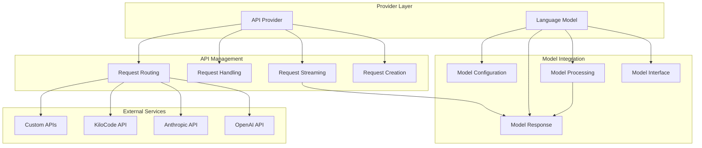

# Provider Layer System

> **Development Fun Fact**: Documentation is like code comments for humans - it explains the "why" behind the "what"! 💻

**Purpose:** Comprehensive documentation of the Provider Layer system, including API Provider and
Language Model components that handle external API communication and request processing.

> **Dinosaur Fun Fact**: Architecture documentation is like a dinosaur fossil record - each layer
> tells us about the evolution of our system, helping us understand how it grew and changed over
> time! 🦕

<details><summary>Table of Contents</summary>

- [Executive Summary](#executive-summary)
- [System Architecture](#system-architecture)
- [API Provider](#api-provider)
- [Language Model Integration](#language-model-integration)
- [Request Processing](#request-processing)
- Error Handling
- [Retry Logic](#retry-logic)
- [Common Issues and Solutions](#common-issues-and-solutions)
- Navigation Footer

</details>

## Executive Summary

## Research Context

**Purpose:** \[Describe the purpose and scope of this document]

**Background:** \[Provide relevant background information]

**Research Questions:** \[List key questions this document addresses]

**Methodology:** \[Describe the approach or methodology used]

**Findings:** \[Summarize key findings or conclusions]

---

_The Provider Layer system manages external API communication, request processing, and language
model integration. It handles API requests, streaming responses, error recovery, and retry logic for
reliable communication with external services._

The Provider Layer consists of two main components:

1. **API Provider** - External API communication and request management
2. **Language Model** - Language model integration and response processing

## System Architecture



## API Provider

### Overview

The API Provider manages communication with external APIs, handling request creation, streaming, and
response processing.

**Location**: `src/api/providers/`

### Provider Interface

**Base Provider Interface**:

```typescript
export interface ApiProvider {
	createMessage(
		systemPrompt: string,
		conversationHistory: ApiMessage[],
		metadata: RequestMetadata,
	): AsyncGenerator<StreamChunk, void, unknown>

	getModels(): Promise<ModelRecord[]>
	validateConfiguration(config: ApiConfiguration): Promise<boolean>
}
```

### Request Creation

**Message Creation Process**:

```typescript
// In Task.ts - attemptApiRequest method
public async *attemptApiRequest(retryAttempt: number = 0): ApiStream {
    // Get system prompt and conversation history
    const systemPrompt = await this.getSystemPrompt()
    const cleanConversationHistory = this.getCleanConversationHistory()

    // Create request metadata
    const metadata: RequestMetadata = {
        taskId: this.taskId,
        timestamp: new Date().toISOString(),
        retryAttempt,
        model: this.apiConfiguration.model,
        temperature: this.apiConfiguration.temperature,
        maxTokens: this.apiConfiguration.maxTokens,
    }

    // Create API request with Laminar span
    const stream = await Laminar.withSpan(laminarService.getActiveSpan("DEFAULT")!, async () => {
        laminarService.startSpan("LLM", {
            name: `${this.taskId}-llm_call`,
            spanType: "LLM",
            sessionId: this.rootTaskId || this.taskId,
            input: laminarService.getRecordSpanIO()
                ? [{ role: "system", content: `[SYSTEM_PROMPT:${systemPrompt.length} chars]` }, ...cleanConversationHistory]
                : undefined,
        })
        return this.api.createMessage(systemPrompt, cleanConversationHistory, metadata)
    })

    // Process streaming response
    const iterator = stream[Symbol.asyncIterator]()

    try {
        this.isWaitingForFirstChunk = true
        const firstChunk = await iterator.next()
        yield firstChunk.value
        this.isWaitingForFirstChunk = false

        // Continue processing remaining chunks
        let item = await iterator.next()
        while (!item.done) {
            yield item.value
            item = await iterator.next()
        }
    } catch (error) {
        this.isWaitingForFirstChunk = false
        // Handle error and potentially retry
        yield* this.handleApiError(error, retryAttempt)
    }
}
```

### Request Metadata

**Request Configuration**:

```typescript
interface RequestMetadata {
	taskId: string
	timestamp: string
	retryAttempt: number
	model: string
	temperature?: number
	maxTokens?: number
	streaming?: boolean
	userId?: string
	sessionId?: string
}
```

## Language Model Integration

### Model Interface

**Model Abstraction**:

```typescript
export interface LanguageModel {
	id: string
	name: string
	provider: string
	capabilities: ModelCapabilities
	configuration: ModelConfiguration
}

interface ModelCapabilities {
	supportsStreaming: boolean
	supportsImages: boolean
	maxTokens: number
	supportedFormats: string[]
}

interface ModelConfiguration {
	temperature: number
	topP?: number
	frequencyPenalty?: number
	presencePenalty?: number
}
```

### Model Processing

**Response Processing**:

```typescript
// Stream processing in recursivelyMakeClineRequests
const stream = this.attemptApiRequest()
let assistantMessage = ""
let reasoningMessage = ""
let pendingGroundingSources: GroundingSource[] = []

this.isStreaming = true

try {
	const iterator = stream[Symbol.asyncIterator]()
	let item = await iterator.next()

	while (!item.done) {
		const chunk = item.value
		item = await iterator.next()

		if (!chunk) {
			continue
		}

		// Process different chunk types
		if (chunk.type === "text") {
			assistantMessage += chunk.content
		} else if (chunk.type === "reasoning") {
			reasoningMessage += chunk.content
		} else if (chunk.type === "grounding_source") {
			pendingGroundingSources.push(chunk.source)
		}

		// Update UI with streaming content
		this.updateStreamingContent(assistantMessage, reasoningMessage)
	}

	// Finalize the response
	await this.finalizeResponse(assistantMessage, reasoningMessage, pendingGroundingSources)
} finally {
	this.isStreaming = false
}
```

### Model Configuration

**Configuration Management**:

```typescript
// API Configuration
interface ApiConfiguration {
	apiProvider: string
	model: string
	apiKey: string
	baseUrl?: string
	temperature: number
	maxTokens: number
	consecutiveMistakeLimit: number

	// Provider-specific configuration
	openaiApiKey?: string
	anthropicApiKey?: string
	kilocodeToken?: string
	kilocodeModel?: string
}
```

## Request Processing

### Streaming Response Handling

**Stream Processing**:

```typescript
// Stream chunk processing
interface StreamChunk {
	type: "text" | "reasoning" | "grounding_source" | "error"
	content?: string
	source?: GroundingSource
	error?: Error
	metadata?: Record<string, any>
}

// Process streaming chunks
const processStreamChunk = (chunk: StreamChunk) => {
	switch (chunk.type) {
		case "text":
			// Add text content to assistant message
			assistantMessage += chunk.content
			break

		case "reasoning":
			// Add reasoning content (for models that support it)
			reasoningMessage += chunk.content
			break

		case "grounding_source":
			// Add grounding source information
			pendingGroundingSources.push(chunk.source)
			break

		case "error":
			// Handle streaming error
			throw chunk.error
	}
}
```

### Request Routing

**Provider Selection**:

```typescript
// Provider routing based on configuration
const routeRequest = (config: ApiConfiguration): ApiProvider => {
	switch (config.apiProvider) {
		case "openai":
			return new OpenAIProvider(config)
		case "anthropic":
			return new AnthropicProvider(config)
		case "kilocode":
			return new KiloCodeProvider(config)
		default:
			throw new Error(`Unsupported provider: ${config.apiProvider}`)
	}
}
```

## Error Handling

### API Error Types

**Error Classification**:

```typescript
// API Error types
interface ApiError extends Error {
    status?: number
    code?: string
    retryable?: boolean
    rateLimited?: boolean
    quotaExceeded?: boolean
}

// Error handling in attemptApiRequest
const handleApiError = async (error: ApiError, retryAttempt: number) => {
    // Log error details
    console.error(`API request failed (attempt ${retryAttempt}):`, {
        error: error.message,
        status: error.status,
        code: error.code,
        taskId: this.taskId
    })

    // Determine if error is retryable
    if (error.retryable && retryAttempt < MAX_RETRIES) {
        // Implement exponential backoff
        const delay = Math.pow(2, retryAttempt) * 1000
        await new Promise(resolve => setTimeout(resolve, delay))

        // Retry the request
        yield* this.attemptApiRequest(retryAttempt + 1)
    } else {
        // Non-retryable error - handle appropriately
        yield {
            type: 'error',
            error: error,
            content: `Request failed: ${error.message}`
        }
    }
}
```

### Error Recovery

**Recovery Strategies**:

```typescript
// Error recovery strategies
const implementErrorRecovery = async (error: ApiError) => {
	if (error.rateLimited) {
		// Rate limit - implement backoff
		await this.handleRateLimit(error)
	} else if (error.quotaExceeded) {
		// Quota exceeded - notify user
		await this.handleQuotaExceeded(error)
	} else if (error.status >= 500) {
		// Server error - retry with backoff
		await this.handleServerError(error)
	} else {
		// Client error - don't retry
		await this.handleClientError(error)
	}
}
```

## Retry Logic

### Retry Implementation

**Exponential Backoff**:

```typescript
// Retry logic with exponential backoff
const retryWithBackoff = async <T>(
	operation: () => Promise<T>,
	maxRetries: number = 3,
	baseDelay: number = 1000,
): Promise<T> => {
	let lastError: Error

	for (let attempt = 0; attempt <= maxRetries; attempt++) {
		try {
			return await operation()
		} catch (error) {
			lastError = error as Error

			if (attempt === maxRetries) {
				break
			}

			// Calculate delay with jitter
			const delay = baseDelay * Math.pow(2, attempt) + Math.random() * 1000
			console.log(`Retry attempt ${attempt + 1} after ${delay}ms delay`)

			await new Promise((resolve) => setTimeout(resolve, delay))
		}
	}

	throw lastError!
}
```

### Circuit Breaker Pattern

**Circuit Breaker Implementation**:

```typescript
class CircuitBreaker {
	private failureCount = 0
	private lastFailureTime = 0
	private state: "CLOSED" | "OPEN" | "HALF_OPEN" = "CLOSED"

	private readonly threshold = 5
	private readonly timeout = 60000 // 1 minute

	async execute<T>(operation: () => Promise<T>): Promise<T> {
		if (this.state === "OPEN") {
			if (Date.now() - this.lastFailureTime > this.timeout) {
				this.state = "HALF_OPEN"
			} else {
				throw new Error("Circuit breaker is OPEN")
			}
		}

		try {
			const result = await operation()
			this.onSuccess()
			return result
		} catch (error) {
			this.onFailure()
			throw error
		}
	}

	private onSuccess(): void {
		this.failureCount = 0
		this.state = "CLOSED"
	}

	private onFailure(): void {
		this.failureCount++
		this.lastFailureTime = Date.now()

		if (this.failureCount >= this.threshold) {
			this.state = "OPEN"
		}
	}
}
```

## Common Issues and Solutions

### Issue 1: API Rate Limiting

**Symptoms**:

- Frequent 429 errors
- Requests being throttled
- Inconsistent response times

**Root Cause**: Exceeding API rate limits

**Solution**:

```typescript
// Rate limiting implementation
class RateLimiter {
	private requests: number[] = []
	private readonly limit: number
	private readonly window: number

	constructor(limit: number, windowMs: number) {
		this.limit = limit
		this.window = windowMs
	}

	async waitForSlot(): Promise<void> {
		const now = Date.now()

		// Remove old requests outside the window
		this.requests = this.requests.filter((time) => now - time < this.window)

		if (this.requests.length >= this.limit) {
			const oldestRequest = Math.min(...this.requests)
			const waitTime = this.window - (now - oldestRequest)

			if (waitTime > 0) {
				await new Promise((resolve) => setTimeout(resolve, waitTime))
			}
		}

		this.requests.push(now)
	}
}
```

### Issue 2: Connection Timeouts

**Symptoms**:

- Requests timing out
- Incomplete responses
- Network errors

**Root Cause**: Network connectivity issues or slow responses

**Solution**:

```typescript
// Timeout handling
const createTimeoutPromise = <T>(promise: Promise<T>, timeoutMs: number): Promise<T> => {
	const timeoutPromise = new Promise<never>((_, reject) => {
		setTimeout(() => reject(new Error("Request timeout")), timeoutMs)
	})

	return Promise.race([promise, timeoutPromise])
}

// Usage in API requests
const response = await createTimeoutPromise(
	apiProvider.createMessage(systemPrompt, history, metadata),
	30000, // 30 second timeout
)
```

### Issue 3: Stream Interruption

**Symptoms**:

- Incomplete responses
- Partial message content
- Streaming errors

**Root Cause**: Network interruptions or API issues during streaming

**Solution**:

```typescript
// Stream recovery
const processStreamWithRecovery = async function* (stream: AsyncGenerator<StreamChunk>): AsyncGenerator<StreamChunk> {
	let buffer = ""
	let isRecovering = false

	try {
		for await (const chunk of stream) {
			if (chunk.type === "text") {
				buffer += chunk.content
			}

			yield chunk
		}
	} catch (error) {
		// Stream interrupted - attempt recovery
		console.warn("Stream interrupted, attempting recovery:", error)

		if (buffer.length > 0) {
			// Yield buffered content
			yield {
				type: "text",
				content: buffer,
				metadata: { recovered: true },
			}
		}

		// Attempt to resume from last position
		yield* attemptStreamRecovery(buffer)
	}
}
```

<a id="navigation-footer"></a>

- Back: [`DUPLICATE_API_REQUESTS_TROUBLESHOOTING.md`](DUPLICATE_API_REQUESTS_TROUBLESHOOTING.md) ·
  Root: [`README.md`](README.md) · Source: `/docs/PROVIDER_LAYER_SYSTEM.md#L1`

## Navigation Footer

---

**Navigation**: [docs](../) · [architecture](../docs/architecture/) ·
[↑ Table of Contents](#provider-layer-system)
