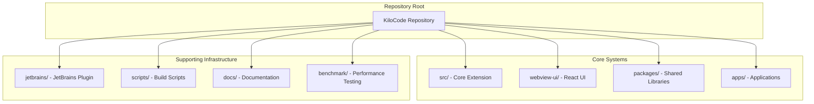

# Repository Overview

**Purpose:** Comprehensive catalog of all subsystems, tools, testing infrastructure, and build pipelines in the KiloCode repository with research status indicators.

Table of Contents

- [Executive Summary](#executive-summary)
- [Repository Structure](#repository-structure)
- [Core Systems](#core-systems)
- [Workspace Packages](#workspace-packages)
- [Applications](#applications)
- [Testing Infrastructure](#testing-infrastructure)
- [Build & CI/CD Pipelines](#build--cicd-pipelines)
- [Development Tools](#development-tools)
- [External Integrations](#external-integrations)
- [Research Status Legend](#research-status-legend)
- [Navigation Footer](#navigation-footer)

## Executive Summary

_The KiloCode repository is a comprehensive VS Code extension for AI-powered coding assistance, featuring a multi-layered architecture with extensive tooling, testing, and deployment infrastructure. The codebase spans over 1,120 TypeScript files across multiple workspace packages, applications, and services._

**Key Statistics:**

- **Total Files**: 1,120+ TypeScript files
- **Workspace Packages**: 7 core packages
- **Applications**: 8 applications (docs, testing, web interfaces)
- **Core Services**: 15+ specialized services
- **Tools**: 25+ AI-powered tools
- **Test Coverage**: Extensive unit, integration, and E2E testing

## Repository Structure

## Core Systems

### Main Extension (`src/`) 🔍 **RESEARCHED**

**Status**: ✅ **FULLY DOCUMENTED**
**Files**: 840+ TypeScript files
**Purpose**: Core VS Code extension functionality

**Key Components**:

- **Activation System** (`activate/`): Extension lifecycle management
- **API Layer** (`api/`): External API integrations and transformations
- **Core Engine** (`core/`): Task orchestration, tools, and business logic
- **Services** (`services/`): Specialized service implementations
- **Integrations** (`integrations/`): VS Code extension integrations
- **Webview Bridge** (`webview/`): Communication between extension and UI

**Documentation Status**:

- ✅ Task Engine: [`ORCHESTRATION_LAYER_SYSTEM.md`](ORCHESTRATION_LAYER_SYSTEM.md)
- ✅ Laminar Service: [`OBSERVABILITY_LAYER_SYSTEM.md`](OBSERVABILITY_LAYER_SYSTEM.md)
- ✅ Message Queue: [`TASK_LIFECYCLE_DEDUPLICATION.md`](TASK_LIFECYCLE_DEDUPLICATION.md)
- ✅ Duplicate API Requests: [`DUPLICATE_API_REQUESTS_ROOT_CAUSE_ANALYSIS.md`](DUPLICATE_API_REQUESTS_ROOT_CAUSE_ANALYSIS.md)

### Webview UI (`webview-ui/`) 🔍 **RESEARCHED**

**Status**: ✅ **FULLY DOCUMENTED**
**Files**: 686+ files (333 TSX, 246 JSON, 101 TS)
**Purpose**: React-based user interface for the extension

**Key Components**:

- **Chat Interface** (`components/chat/`): Main chat UI and message handling
- **Settings** (`components/settings/`): Configuration and preferences
- **Cloud Integration** (`components/cloud/`): Cloud service integration
- **Marketplace** (`components/marketplace/`): MCP server marketplace
- **MCP Integration** (`components/mcp/`): Model Context Protocol support

**Documentation Status**:

- ✅ UI Layer: [`UI_LAYER_SYSTEM.md`](UI_LAYER_SYSTEM.md)
- ✅ Communication Layer: [`COMMUNICATION_LAYER_SYSTEM.md`](COMMUNICATION_LAYER_SYSTEM.md)
- ✅ Message Flow: [`UI_MESSAGE_FLOW_SYSTEM.md`](UI_MESSAGE_FLOW_SYSTEM.md)

## Workspace Packages

### 1. Build Package (`packages/build/`) 🔍 **PARTIALLY RESEARCHED**

**Status**: ⚠️ **NEEDS DOCUMENTATION**
**Purpose**: Build system utilities and configuration
**Files**: 9 files

**Components**:

- `esbuild.ts`: ESBuild configuration and utilities
- `git.ts`: Git operations for build process
- `types.ts`: Build-related type definitions

**Research Needed**:

- Build pipeline integration
- ESBuild configuration details
- Git operations in build context

### 2. Cloud Package (`packages/cloud/`) 🔍 **PARTIALLY RESEARCHED**

**Status**: ⚠️ **NEEDS DOCUMENTATION**
**Purpose**: Cloud service integration and authentication
**Files**: 37 files (34 TS, 2 JSON, 1 MJS)

**Components**:

- `CloudService.ts`: Main cloud service implementation
- `CloudAPI.ts`: Cloud API client
- `WebAuthService.ts`: Web authentication
- `TelemetryClient.ts`: Telemetry and analytics
- `bridge/`: Bridge orchestrator for cloud communication

**Research Needed**:

- Cloud authentication flow
- Bridge orchestrator architecture
- Telemetry implementation details

### 3. Configuration Packages (`packages/config-*/`) 🔍 **PARTIALLY RESEARCHED**

**Status**: ⚠️ **NEEDS DOCUMENTATION**

#### ESLint Config (`packages/config-eslint/`)

- `base.js`: Base ESLint configuration
- `react.js`: React-specific ESLint rules
- `node.js`: Node.js-specific ESLint rules
- `next.js`: Next.js-specific ESLint rules

#### TypeScript Config (`packages/config-typescript/`)

- `base.json`: Base TypeScript configuration
- `cjs.json`: CommonJS configuration
- `nextjs.json`: Next.js TypeScript configuration
- `vscode-library.json`: VS Code library configuration

**Research Needed**:

- Configuration inheritance patterns
- Project-specific configurations

### 4. Evaluations Package (`packages/evals/`) 🔍 **PARTIALLY RESEARCHED**

**Status**: ⚠️ **NEEDS DOCUMENTATION**
**Purpose**: AI model evaluation and testing framework
**Files**: 41 files (23 TS, 6 JSON, 4 SQL)

**Components**:

- `cli/`: Command-line interface for evaluations
- `db/`: Database schema and queries for evaluation data
- `exercises/`: Evaluation exercises and test cases

**Research Needed**:

- Evaluation framework architecture
- Database schema design
- CLI interface functionality

### 5. IPC Package (`packages/ipc/`) 🔍 **PARTIALLY RESEARCHED**

**Status**: ⚠️ **NEEDS DOCUMENTATION**
**Purpose**: Inter-process communication utilities
**Files**: 7 files (3 TS, 2 JSON, 1 MD)

**Components**:

- `ipc-client.ts`: IPC client implementation
- `ipc-server.ts`: IPC server implementation

**Research Needed**:

- IPC protocol design
- Client-server communication patterns

### 6. Telemetry Package (`packages/telemetry/`) 🔍 **PARTIALLY RESEARCHED**

**Status**: ⚠️ **NEEDS DOCUMENTATION**
**Purpose**: Telemetry and analytics collection
**Files**: 9 files (6 TS, 2 JSON, 1 MJS)

**Components**:

- `PostHogTelemetryClient.ts`: PostHog integration
- `BaseTelemetryClient.ts`: Base telemetry implementation
- `TelemetryService.ts`: Telemetry service orchestration

**Research Needed**:

- Telemetry data collection patterns
- PostHog integration details
- Privacy and data handling

### 7. Types Package (`packages/types/`) 🔍 **PARTIALLY RESEARCHED**

**Status**: ⚠️ **NEEDS DOCUMENTATION**
**Purpose**: Shared type definitions across the monorepo
**Files**: 72 files (67 TS, 3 JSON, 1 CJS)

**Components**:

- Type definitions for all major systems
- Provider-specific types
- API and message types
- Event and state types

**Research Needed**:

- Type system architecture
- Provider type patterns
- Event system types

## Applications

### 1. Documentation Site (`apps/kilocode-docs/`) 🔍 **PARTIALLY RESEARCHED**

**Status**: ⚠️ **NEEDS DOCUMENTATION**
**Purpose**: Docusaurus-based documentation website
**Files**: 360 files (188 MD, 129 PNG, 8 JSON)

**Components**:

- `docs/`: Comprehensive documentation
- `blog-posts/`: Blog content
- `i18n/`: Internationalization support
- `static/`: Static assets and images

**Research Needed**:

- Documentation architecture
- Internationalization setup
- Content management workflow

### 2. Playwright E2E Tests (`apps/playwright-e2e/`) 🔍 **PARTIALLY RESEARCHED**

**Status**: ⚠️ **NEEDS DOCUMENTATION**
**Purpose**: End-to-end testing with Playwright
**Files**: 24 files (17 TS, 2 JS, 2 JSON)

**Components**:

- `tests/`: E2E test suites
- `helpers/`: Test helper utilities
- `scripts/`: Test automation scripts
- Docker configuration for CI

**Research Needed**:

- E2E testing strategy
- Test helper architecture
- CI integration patterns

### 3. Storybook (`apps/storybook/`) 🔍 **PARTIALLY RESEARCHED**

**Status**: ⚠️ **NEEDS DOCUMENTATION**
**Purpose**: Component development and documentation
**Files**: 40 files (27 TSX, 7 TS, 2 CSS)

**Components**:

- `stories/`: Component stories
- `src/`: Storybook configuration and utilities
- Theme generation scripts

**Research Needed**:

- Component documentation strategy
- Theme generation process
- Story development workflow

### 4. VS Code E2E Tests (`apps/vscode-e2e/`) 🔍 **PARTIALLY RESEARCHED**

**Status**: ⚠️ **NEEDS DOCUMENTATION**
**Purpose**: VS Code extension-specific E2E testing
**Files**: 23 files (19 TS, 3 JSON, 1 MJS)

**Components**:

- `suite/`: VS Code extension test suites
- Extension-specific test utilities

**Research Needed**:

- VS Code extension testing patterns
- Extension lifecycle testing

### 5. VS Code Nightly (`apps/vscode-nightly/`) 🔍 **PARTIALLY RESEARCHED**

**Status**: ⚠️ **NEEDS DOCUMENTATION**
**Purpose**: Nightly build configuration
**Files**: 5 files (4 JSON, 1 MJS)

**Research Needed**:

- Nightly build process
- Release automation

### 6. Web Documentation (`apps/web-docs/`) 🔍 **PARTIALLY RESEARCHED**

**Status**: ⚠️ **NEEDS DOCUMENTATION**
**Purpose**: Web-based documentation
**Files**: 1 MD file

**Research Needed**:

- Web documentation strategy
- Integration with main docs

### 7. Web Evaluations (`apps/web-evals/`) 🔍 **PARTIALLY RESEARCHED**

**Status**: ⚠️ **NEEDS DOCUMENTATION**
**Purpose**: Web interface for evaluation system
**Files**: 68 files (36 TSX, 23 TS, 4 JSON)

**Components**:

- Next.js web application
- Evaluation management interface
- Results visualization

**Research Needed**:

- Web evaluation interface design
- Results visualization patterns

### 8. Web Roo Code (`apps/web-roo-code/`) 🔍 **PARTIALLY RESEARCHED**

**Status**: ⚠️ **NEEDS DOCUMENTATION**
**Purpose**: Web interface for Roo Code functionality
**Files**: 73 files (32 TSX, 21 TS, 6 PNG)

**Components**:

- Next.js web application
- Roo Code-specific features
- Marketing and landing pages

**Research Needed**:

- Roo Code web integration
- Marketing site architecture

## Testing Infrastructure

### Unit Testing 🔍 **PARTIALLY RESEARCHED**

**Status**: ⚠️ **NEEDS DOCUMENTATION**
**Framework**: Vitest
**Coverage**: Extensive across all packages

**Test Locations**:

- `src/__tests__/`: Core extension tests
- `webview-ui/__tests__/`: UI component tests
- `packages/*/__tests__/`: Package-specific tests
- `apps/*/__tests__/`: Application-specific tests

**Research Needed**:

- Testing strategy documentation
- Test coverage analysis
- Mock and fixture patterns

### Integration Testing 🔍 **PARTIALLY RESEARCHED**

**Status**: ⚠️ **NEEDS DOCUMENTATION**
**Framework**: Custom integration test utilities

**Components**:

- API integration tests
- Service integration tests
- Database integration tests

**Research Needed**:

- Integration testing patterns
- Test data management
- Service mocking strategies

### End-to-End Testing 🔍 **PARTIALLY RESEARCHED**

**Status**: ⚠️ **NEEDS DOCUMENTATION**
**Framework**: Playwright + VS Code E2E

**Components**:

- `apps/playwright-e2e/`: Browser-based E2E tests
- `apps/vscode-e2e/`: VS Code extension E2E tests

**Research Needed**:

- E2E testing strategy
- Test environment setup
- CI/CD integration

## Build & CI/CD Pipelines

### Build System 🔍 **PARTIALLY RESEARCHED**

**Status**: ⚠️ **NEEDS DOCUMENTATION**
**Tools**: Turbo, ESBuild, Vite, TypeScript

**Build Targets**:

- VS Code extension bundle
- Webview UI bundle
- Package builds
- Documentation site

**Research Needed**:

- Build pipeline architecture
- Dependency management
- Bundle optimization strategies

### Package Management 🔍 **PARTIALLY RESEARCHED**

**Status**: ⚠️ **NEEDS DOCUMENTATION**
**Tool**: pnpm with workspace configuration

**Configuration**:

- `pnpm-workspace.yaml`: Workspace definition
- `package.json`: Root package configuration
- Workspace-specific package.json files

**Research Needed**:

- Monorepo architecture
- Package dependency patterns
- Version management strategy

### CI/CD Pipeline 🔍 **PARTIALLY RESEARCHED**

**Status**: ⚠️ **NEEDS DOCUMENTATION**
**Tools**: GitHub Actions, Docker, Turbo

**Pipeline Stages**:

- Linting and type checking
- Testing (unit, integration, E2E)
- Building and bundling
- Publishing and deployment

**Research Needed**:

- CI/CD workflow documentation
- Deployment strategies
- Release automation

## Development Tools

### Code Quality 🔍 **PARTIALLY RESEARCHED**

**Status**: ⚠️ **NEEDS DOCUMENTATION**
**Tools**: ESLint, Prettier, TypeScript, Knip

**Configuration**:

- Shared ESLint configurations
- TypeScript strict mode
- Code formatting rules
- Dead code detection

**Research Needed**:

- Code quality standards
- Linting configuration patterns
- Code review guidelines

### Development Environment 🔍 **PARTIALLY RESEARCHED**

**Status**: ⚠️ **NEEDS DOCUMENTATION**
**Options**: Native, DevContainer, Nix Flake

**Setup**:

- Node.js 20.19.2
- pnpm package manager
- VS Code with extensions
- Docker for containerized development

**Research Needed**:

- Development environment setup
- Container configuration
- Nix flake usage

## External Integrations

### JetBrains Plugin (`jetbrains/`) 🔍 **PARTIALLY RESEARCHED**

**Status**: ⚠️ **NEEDS DOCUMENTATION**
**Purpose**: JetBrains IDE integration
**Files**: 167 files (133 KT, 7 SVG, 3 CSS)

**Components**:

- `host/`: Host application (TypeScript)
- `plugin/`: JetBrains plugin (Kotlin)

**Research Needed**:

- JetBrains plugin architecture
- Host-plugin communication
- IDE integration patterns

### Context Portal (`context_portal/`) 🔍 **PARTIALLY RESEARCHED**

**Status**: ⚠️ **NEEDS DOCUMENTATION**
**Purpose**: Context management and database
**Files**: Alembic migrations, database files

**Components**:

- Database schema management
- Context tracking
- Logging infrastructure

**Research Needed**:

- Context management architecture
- Database schema design
- Logging strategy

## Research Status Legend

| Status                      | Description                          | Action Required               |
| --------------------------- | ------------------------------------ | ----------------------------- |
| ✅ **FULLY DOCUMENTED**     | Comprehensive documentation exists   | None                          |
| ⚠️ **NEEDS DOCUMENTATION**  | Partial research, documentation gaps | Create detailed documentation |
| 🔍 **PARTIALLY RESEARCHED** | Basic understanding, needs deep dive | Conduct thorough research     |
| ❌ **NOT RESEARCHED**       | No investigation performed           | Start from scratch            |
| 🚧 **IN PROGRESS**          | Currently being researched           | Continue investigation        |

## Priority Research Areas

### High Priority

1. **Build & CI/CD Pipelines** - Critical for understanding deployment
2. **Testing Infrastructure** - Essential for code quality
3. **Cloud Package** - Core functionality for cloud features
4. **Evaluations Package** - Important for AI model testing

### Medium Priority

1. **Workspace Packages** - Understanding shared libraries
2. **Applications** - Documentation and web interfaces
3. **Development Tools** - Code quality and environment setup

### Low Priority

1. **External Integrations** - JetBrains plugin and context portal
2. **Configuration Packages** - Build and lint configurations

- Back: [`INDEX.md`](INDEX.md) · Root: [`INDEX.md`](INDEX.md) · Source: `/docs/REPOSITORY_OVERVIEW.md#L1`
