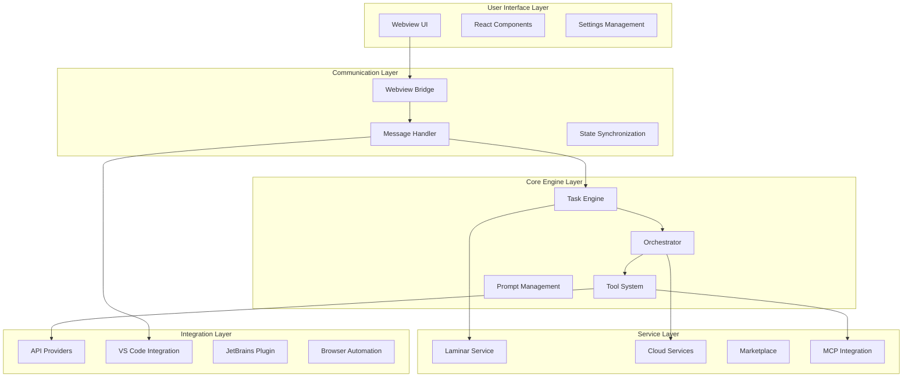

# System Overview

**Purpose:** Detailed technical analysis of all subsystems, components, and architectural patterns in the KiloCode system with comprehensive research status and implementation details.

Table of Contents

- [Executive Summary](#executive-summary)
- [System Architecture](#system-architecture)
- [Core Subsystems](#core-subsystems)
- [Service Layer](#service-layer)
- [Tool Ecosystem](#tool-ecosystem)
- [API Integration Layer](#api-integration-layer)
- [UI/UX Components](#uiux-components)
- [Testing & Quality Assurance](#testing--quality-assurance)
- [Build & Deployment Systems](#build--deployment-systems)
- [External Integrations](#external-integrations)
- [Research Status Matrix](#research-status-matrix)
- [Navigation Footer](#navigation-footer)

## Executive Summary

_The KiloCode system is a sophisticated AI-powered coding assistant built as a VS Code extension with a comprehensive ecosystem of tools, services, and integrations. The architecture follows a layered approach with clear separation of concerns between the core engine, service layer, UI components, and external integrations._

**Architecture Highlights**:

- **Modular Design**: Clear separation between core engine, services, and UI
- **Extensible Tool System**: Plugin-based architecture for AI tools
- **Multi-Provider Support**: Flexible API provider system
- **Comprehensive Testing**: Unit, integration, and E2E testing coverage
- **Cloud Integration**: Built-in cloud services and telemetry
- **Cross-Platform**: VS Code extension with JetBrains plugin support

## System Architecture

## Core Subsystems

### 1. Task Engine (`src/core/task/`) ✅ **FULLY DOCUMENTED**

**Status**: ✅ **COMPREHENSIVE DOCUMENTATION**
**Research Level**: Complete
**Files**: 7 TypeScript files

**Components**:

- **Task.ts**: Core task lifecycle management and execution
- **TaskPersistence**: Task state persistence and recovery
- **TaskContext**: Context management for task execution

**Key Features**:

- Task lifecycle management (creation, execution, completion)
- Message queue processing with deduplication
- API request coordination and streaming
- Error handling and retry logic
- State synchronization with UI

**Documentation**:

- [`ORCHESTRATION_LAYER_SYSTEM.md`](ORCHESTRATION_LAYER_SYSTEM.md)
- [`DUPLICATE_API_REQUESTS_ROOT_CAUSE_ANALYSIS.md`](DUPLICATE_API_REQUESTS_ROOT_CAUSE_ANALYSIS.md)

### 2. Webview System (`src/core/webview/`) ✅ **FULLY DOCUMENTED**

**Status**: ✅ **COMPREHENSIVE DOCUMENTATION**
**Research Level**: Complete
**Files**: 18 TypeScript files

**Components**:

- **ClineProvider.ts**: Main provider for webview communication
- **WebviewMessageHandler.ts**: Message routing and processing
- **State Management**: UI state synchronization

**Key Features**:

- Bidirectional communication between extension and UI
- Message routing and validation
- State synchronization mechanisms
- Error handling and recovery

**Documentation**:

- [`COMMUNICATION_LAYER_SYSTEM.md`](COMMUNICATION_LAYER_SYSTEM.md)
- [`UI_LAYER_SYSTEM.md`](UI_LAYER_SYSTEM.md)

### 3. Message Queue System (`src/core/message-queue/`) ✅ **FULLY DOCUMENTED**

**Status**: ✅ **COMPREHENSIVE DOCUMENTATION**
**Research Level**: Complete
**Files**: 1 TypeScript file

**Components**:

- **MessageQueueService.ts**: Queue management and deduplication

**Key Features**:

- Message queuing when system is busy
- Deduplication to prevent duplicate requests
- Event-driven state updates
- Thread-safe operations

**Documentation**:

- [`TASK_LIFECYCLE_DEDUPLICATION.md`](TASK_LIFECYCLE_DEDUPLICATION.md)

### 4. Tool System (`src/core/tools/`) 🔍 **PARTIALLY RESEARCHED**

**Status**: ⚠️ **NEEDS COMPREHENSIVE DOCUMENTATION**
**Research Level**: Moderate
**Files**: 48 TypeScript files

**Components**:

- **Core Tools**: File operations, command execution, search
- **AI Tools**: Code generation, completion, refactoring
- **Integration Tools**: MCP, browser automation, marketplace
- **Validation Tools**: Tool use validation, repetition detection

**Key Tools**:

- `writeToFileTool.ts`: File writing operations
- `applyDiffTool.ts`: Diff application and file editing
- `executeCommandTool.ts`: Terminal command execution
- `codebaseSearchTool.ts`: Codebase search functionality
- `useMcpToolTool.ts`: MCP server integration
- `browserActionTool.ts`: Browser automation

**Research Needed**:

- Tool execution architecture
- Tool validation and safety mechanisms
- Tool composition and chaining patterns
- Error handling and rollback strategies

### 5. Prompt Management (`src/core/prompts/`) 🔍 **PARTIALLY RESEARCHED**

**Status**: ⚠️ **NEEDS DOCUMENTATION**
**Research Level**: Basic
**Files**: 89 files (62 TS, 27 snapshots)

**Components**:

- Prompt templates and strategies
- Context-aware prompt generation
- Mode-specific prompts (Architect, Developer, etc.)
- System prompt optimization

**Research Needed**:

- Prompt engineering strategies
- Context injection patterns
- Mode-specific prompt variations
- System prompt optimization techniques

## Service Layer

### 1. Laminar Service (`src/services/laminar/`) ✅ **FULLY DOCUMENTED**

**Status**: ✅ **COMPREHENSIVE DOCUMENTATION**
**Research Level**: Complete
**Files**: 4 TypeScript files

**Components**:

- **LaminarService.ts**: Core observability service
- **TypedObserveDecorator.ts**: Type-safe observation decorators

**Key Features**:

- Span creation and lifecycle management
- Performance monitoring and metrics
- Error tracking and recovery
- System prompt deduplication

**Documentation**:

- [`OBSERVABILITY_LAYER_SYSTEM.md`](OBSERVABILITY_LAYER_SYSTEM.md)
- [`LAMINAR_DEDUPLICATION_SYSTEM.md`](LAMINAR_DEDUPLICATION_SYSTEM.md)

### 2. Cloud Services (`packages/cloud/`) 🔍 **PARTIALLY RESEARCHED**

**Status**: ⚠️ **NEEDS DOCUMENTATION**
**Research Level**: Moderate
**Files**: 37 files (34 TS, 2 JSON, 1 MJS)

**Components**:

- **CloudService.ts**: Main cloud service implementation
- **CloudAPI.ts**: Cloud API client and authentication
- **WebAuthService.ts**: Web-based authentication
- **TelemetryClient.ts**: Analytics and telemetry collection
- **BridgeOrchestrator.ts**: Bridge communication orchestrator

**Key Features**:

- Cloud authentication and authorization
- API key management and validation
- Telemetry and analytics collection
- Bridge communication for cloud features

**Research Needed**:

- Cloud authentication flow architecture
- API key management security
- Telemetry data collection and privacy
- Bridge orchestrator communication patterns

### 3. Marketplace System (`src/services/marketplace/`) 🔍 **PARTIALLY RESEARCHED**

**Status**: ⚠️ **NEEDS DOCUMENTATION**
**Research Level**: Basic
**Files**: 10 TypeScript files

**Components**:

- **MarketplaceManager.ts**: Marketplace management
- **RemoteConfigLoader.ts**: Remote configuration loading
- **SimpleInstaller.ts**: Package installation

**Key Features**:

- MCP server discovery and installation
- Remote configuration management
- Package dependency resolution
- Installation and update mechanisms

**Research Needed**:

- Marketplace architecture and security
- MCP server discovery protocols
- Package management and updates
- Configuration synchronization

### 4. MCP Integration (`src/services/mcp/`) 🔍 **PARTIALLY RESEARCHED**

**Status**: ⚠️ **NEEDS DOCUMENTATION**
**Research Level**: Basic
**Files**: 4 TypeScript files

**Components**:

- **McpHub.ts**: MCP server hub management
- **McpServerManager.ts**: Individual server management

**Key Features**:

- MCP server lifecycle management
- Tool and resource discovery
- Server communication protocols
- Error handling and recovery

**Research Needed**:

- MCP protocol implementation
- Server lifecycle management
- Tool discovery and registration
- Communication error handling

### 5. Code Index Service (`src/services/code-index/`) 🔍 **PARTIALLY RESEARCHED**

**Status**: ⚠️ **NEEDS DOCUMENTATION**
**Research Level**: Basic
**Files**: 47 TypeScript files

**Components**:

- **Manager.ts**: Code indexing orchestration
- **Embedders/**: Multiple embedding providers
- **Vector Store/**: Vector database integration
- **Processors/**: File processing and parsing

**Key Features**:

- Code embedding and vectorization
- Semantic search capabilities
- Multi-provider embedding support
- File watching and incremental updates

**Research Needed**:

- Embedding architecture and providers
- Vector database integration
- Semantic search implementation
- File processing and indexing strategies

### 6. Tree Sitter Service (`src/services/tree-sitter/`) 🔍 **PARTIALLY RESEARCHED**

**Status**: ⚠️ **NEEDS DOCUMENTATION**
**Research Level**: Basic
**Files**: 124 TypeScript files

**Components**:

- **LanguageParser.ts**: Multi-language parsing
- **MarkdownParser.ts**: Markdown-specific parsing
- **Queries/**: Language-specific query files

**Key Features**:

- Multi-language code parsing
- AST-based code analysis
- Language-specific queries
- Syntax highlighting support

**Research Needed**:

- Tree-sitter integration architecture
- Language parser configuration
- AST query system design
- Performance optimization strategies

## Tool Ecosystem

### Core AI Tools 🔍 **PARTIALLY RESEARCHED**

**Status**: ⚠️ **NEEDS COMPREHENSIVE DOCUMENTATION**

#### File Operations

- **writeToFileTool.ts**: File creation and writing
- **readFileTool.ts**: File reading with context
- **editFileTool.ts**: File editing operations
- **applyDiffTool.ts**: Diff application
- **multiApplyDiffTool.ts**: Batch diff operations
- **searchAndReplaceTool.ts**: Search and replace operations
- **insertContentTool.ts**: Content insertion

#### Code Analysis

- **codebaseSearchTool.ts**: Semantic codebase search
- **listFilesTool.ts**: File listing and filtering
- **searchFilesTool.ts**: File search operations
- **listCodeDefinitionNamesTool.ts**: Code definition discovery

#### Command Execution

- **executeCommandTool.ts**: Terminal command execution
- **runSlashCommandTool.ts**: Slash command execution

#### AI Integration

- **useMcpToolTool.ts**: MCP tool integration
- **accessMcpResourceTool.ts**: MCP resource access
- **generateImageTool.ts**: Image generation
- **askFollowupQuestionTool.ts**: Interactive questioning

**Research Needed**:

- Tool execution architecture
- Safety and validation mechanisms
- Tool composition patterns
- Error handling and rollback
- Performance optimization

## API Integration Layer

### Provider System (`src/api/providers/`) 🔍 **PARTIALLY RESEARCHED**

**Status**: ⚠️ **NEEDS DOCUMENTATION**
**Research Level**: Basic
**Files**: 122 files (118 TS, 4 JSON)

**Components**:

- Multiple API provider implementations
- Provider configuration and validation
- Request/response transformation
- Streaming support

**Key Providers**:

- OpenAI API integration
- Anthropic API integration
- KiloCode API integration
- Custom provider support

**Research Needed**:

- Provider architecture and patterns
- API request/response handling
- Streaming implementation
- Error handling and retry logic
- Provider configuration management

### Transform Layer (`src/api/transform/`) 🔍 **PARTIALLY RESEARCHED**

**Status**: ⚠️ **NEEDS DOCUMENTATION**
**Research Level**: Basic
**Files**: 34 TypeScript files

**Components**:

- Request transformation utilities
- Response processing
- Data format conversion
- Provider-specific adaptations

**Research Needed**:

- Transformation architecture
- Data format handling
- Provider-specific adaptations
- Performance optimization

## UI/UX Components

### React Component System (`webview-ui/src/components/`) ✅ **FULLY DOCUMENTED**

**Status**: ✅ **COMPREHENSIVE DOCUMENTATION**
**Research Level**: Complete

#### Chat Interface (`components/chat/`)

- **ChatView.tsx**: Main chat interface
- **ChatTextArea.tsx**: Input area with send button
- **ChatRow.tsx**: Message display components
- **QueuedMessages.tsx**: Message queue display

#### Settings Management (`components/settings/`)

- **Comprehensive settings interface**: 107 files
- **Configuration panels**: API, providers, preferences
- **Validation and error handling**: Form validation

#### Cloud Integration (`components/cloud/`)

- **CloudView.tsx**: Cloud service interface
- **CloudUpsellDialog.tsx**: Upgrade prompts

#### Marketplace (`components/marketplace/`)

- **MCP server discovery and installation**
- **Package management interface**

**Documentation**:

- [`UI_LAYER_SYSTEM.md`](UI_LAYER_SYSTEM.md)
- [`UI_MESSAGE_FLOW_SYSTEM.md`](UI_MESSAGE_FLOW_SYSTEM.md)

## Testing & Quality Assurance

### Unit Testing 🔍 **PARTIALLY RESEARCHED**

**Status**: ⚠️ **NEEDS DOCUMENTATION**
**Framework**: Vitest
**Coverage**: Extensive across all packages

**Test Categories**:

- Core engine tests
- Service layer tests
- Tool execution tests
- UI component tests
- Integration tests

**Research Needed**:

- Testing strategy and patterns
- Mock and fixture architecture
- Test coverage analysis
- Performance testing

### Integration Testing 🔍 **PARTIALLY RESEARCHED**

**Status**: ⚠️ **NEEDS DOCUMENTATION**

**Components**:

- API integration tests
- Service integration tests
- Database integration tests
- External service mocking

**Research Needed**:

- Integration testing architecture
- Test data management
- Service mocking strategies
- End-to-end test scenarios

### End-to-End Testing 🔍 **PARTIALLY RESEARCHED**

**Status**: ⚠️ **NEEDS DOCUMENTATION**
**Frameworks**: Playwright, VS Code E2E

**Components**:

- Browser-based E2E tests
- VS Code extension E2E tests
- User workflow testing
- Cross-platform testing

**Research Needed**:

- E2E testing strategy
- Test environment setup
- CI/CD integration
- Cross-platform testing

## Build & Deployment Systems

### Build Pipeline 🔍 **PARTIALLY RESEARCHED**

**Status**: ⚠️ **NEEDS DOCUMENTATION**
**Tools**: Turbo, ESBuild, Vite, TypeScript

**Build Targets**:

- VS Code extension bundle
- Webview UI bundle
- Package builds
- Documentation site
- JetBrains plugin

**Research Needed**:

- Build pipeline architecture
- Dependency management
- Bundle optimization
- Multi-target builds

### Package Management 🔍 **PARTIALLY RESEARCHED**

**Status**: ⚠️ **NEEDS DOCUMENTATION**
**Tool**: pnpm with workspace configuration

**Configuration**:

- Monorepo workspace setup
- Package dependency management
- Version synchronization
- Build orchestration

**Research Needed**:

- Monorepo architecture
- Package dependency patterns
- Version management strategy
- Build orchestration

### CI/CD Pipeline 🔍 **PARTIALLY RESEARCHED**

**Status**: ⚠️ **NEEDS DOCUMENTATION**
**Tools**: GitHub Actions, Docker, Turbo

**Pipeline Stages**:

- Code quality checks
- Testing (unit, integration, E2E)
- Building and bundling
- Publishing and deployment
- Release automation

**Research Needed**:

- CI/CD workflow documentation
- Deployment strategies
- Release automation
- Quality gates

## External Integrations

### JetBrains Plugin (`jetbrains/`) 🔍 **PARTIALLY RESEARCHED**

**Status**: ⚠️ **NEEDS DOCUMENTATION**
**Files**: 167 files (133 KT, 7 SVG, 3 CSS)

**Components**:

- **Host Application** (`host/`): TypeScript host implementation
- **Plugin** (`plugin/`): Kotlin JetBrains plugin
- **Scripts** (`scripts/`): Build and deployment scripts

**Research Needed**:

- JetBrains plugin architecture
- Host-plugin communication
- IDE integration patterns
- Build and deployment

### Browser Automation (`src/services/browser/`) 🔍 **PARTIALLY RESEARCHED**

**Status**: ⚠️ **NEEDS DOCUMENTATION**
**Files**: 5 TypeScript files

**Components**:

- **BrowserSession.ts**: Browser session management
- **UrlContentFetcher.ts**: Web content fetching
- **BrowserDiscovery.ts**: Browser detection

**Research Needed**:

- Browser automation architecture
- Session management
- Content fetching strategies
- Security considerations

## Research Status Matrix

| Subsystem                  | Documentation Status | Research Level | Priority | Next Actions                     |
| -------------------------- | -------------------- | -------------- | -------- | -------------------------------- |
| **Task Engine**            | ✅ Complete          | Complete       | High     | None                             |
| **Webview System**         | ✅ Complete          | Complete       | High     | None                             |
| **Message Queue**          | ✅ Complete          | Complete       | High     | None                             |
| **Laminar Service**        | ✅ Complete          | Complete       | High     | None                             |
| **Tool System**            | ⚠️ Partial           | Moderate       | Critical | Comprehensive documentation      |
| **Cloud Services**         | ⚠️ Partial           | Moderate       | High     | Architecture documentation       |
| **API Providers**          | ⚠️ Partial           | Basic          | High     | Provider patterns documentation  |
| **Testing Infrastructure** | ⚠️ Partial           | Basic          | Medium   | Testing strategy documentation   |
| **Build Pipeline**         | ⚠️ Partial           | Basic          | Medium   | Build architecture documentation |
| **Marketplace**            | ⚠️ Partial           | Basic          | Medium   | Marketplace architecture         |
| **MCP Integration**        | ⚠️ Partial           | Basic          | Medium   | MCP protocol documentation       |
| **Code Index**             | ⚠️ Partial           | Basic          | Medium   | Embedding architecture           |
| **Tree Sitter**            | ⚠️ Partial           | Basic          | Low      | Parser architecture              |
| **JetBrains Plugin**       | ⚠️ Partial           | Basic          | Low      | Plugin architecture              |
| **Browser Automation**     | ⚠️ Partial           | Basic          | Low      | Automation patterns              |

## Priority Research Areas

### Critical Priority

1. **Tool System Architecture** - Core functionality for AI operations
2. **API Provider Patterns** - Essential for multi-provider support

### High Priority

3. **Cloud Services Architecture** - Core cloud functionality
4. **Testing Strategy** - Code quality and reliability
5. **Build Pipeline** - Development and deployment

### Medium Priority

6. **Marketplace System** - MCP server management
7. **MCP Integration** - External tool integration
8. **Code Index Service** - Semantic search capabilities

### Low Priority

9. **Tree Sitter Service** - Code parsing and analysis
10. **JetBrains Plugin** - Cross-IDE support
11. **Browser Automation** - Web integration features

- Back: [`REPOSITORY_OVERVIEW.md`](REPOSITORY_OVERVIEW.md) · Root: [`INDEX.md`](INDEX.md) · Source: `/docs/SYSTEM_OVERVIEW.md#L1`
