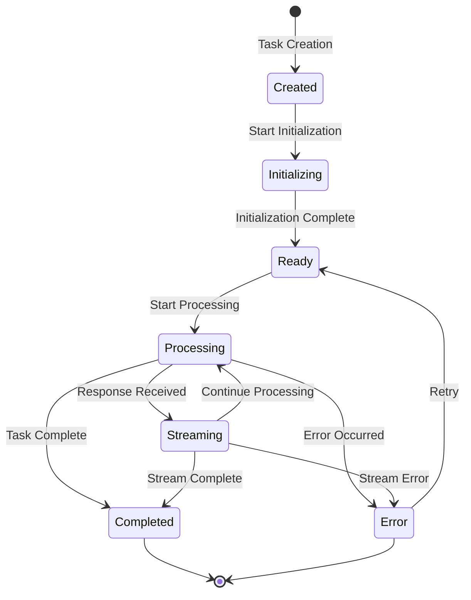
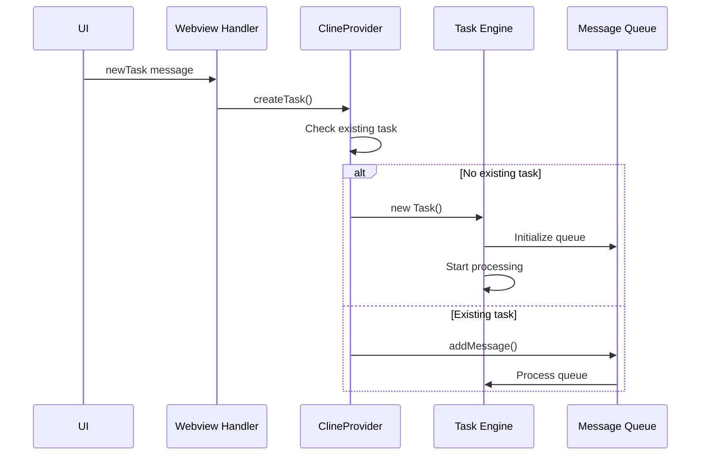

# Task Lifecycle Deduplication

**Purpose:** Detailed documentation of task lifecycle management, message queue processing, and deduplication mechanisms to prevent duplicate task creation and concurrent execution issues.

> **Dinosaur Fun Fact**: Architecture documentation is like a dinosaur fossil record - each layer tells us about the evolution of our system, helping us understand how it grew and changed over time! 🦕

<details><summary>Table of Contents</summary>

- [Executive Summary](#executive-summary)
- [Task Lifecycle Overview](#task-lifecycle-overview)
- [Message Queue Integration](#message-queue-integration)
- [Task Creation Deduplication](#task-creation-deduplication)
- [Concurrent Execution Prevention](#concurrent-execution-prevention)
- [State Synchronization](#state-synchronization)
- [Common Issues and Solutions](#common-issues-and-solutions)
- [Performance Monitoring](#performance-monitoring)
- [Navigation Footer](#navigation-footer)

</details>

## Executive Summary

_The Task Lifecycle Deduplication system manages task creation, message queue processing, and prevents duplicate task execution. This system is critical for maintaining system stability and preventing resource conflicts in the KiloCode orchestrator._

The Task Lifecycle system implements several deduplication mechanisms:

1. **Task Creation Deduplication** - Prevents multiple task instances for single request
2. **Message Queue Processing** - Coordinates message processing to prevent duplicates
3. **State Synchronization** - Ensures consistent state across task lifecycle
4. **Concurrent Execution Prevention** - Prevents multiple tasks from running simultaneously

## Task Lifecycle Overview

### Lifecycle States



### Task Creation Flow



## Message Queue Integration

### Message Queue Service

The `MessageQueueService` manages queued messages and prevents duplicate processing:

```typescript
// MessageQueueService.ts
export class MessageQueueService extends EventEmitter<QueueEvents> {
	private _messages: QueuedMessage[]

	constructor() {
		super()
		this._messages = []
	}

	public addMessage(text: string, images?: string[]): QueuedMessage | undefined {
		if (!text && !images?.length) {
			return undefined
		}

		// Check for duplicate messages
		const existingMessage = this._messages.find(
			(msg) => msg.text === text && JSON.stringify(msg.images) === JSON.stringify(images),
		)

		if (existingMessage) {
			console.log("Duplicate message detected, skipping")
			return existingMessage
		}

		const message: QueuedMessage = {
			timestamp: Date.now(),
			id: uuidv4(),
			text,
			images,
		}

		this._messages.push(message)
		this.emit("stateChanged", this._messages)
		return message
	}
}
```

### Queue Processing in Task

The Task class integrates with the message queue service:

```typescript
// Task.ts - Message queue integration
export class Task extends EventEmitter {
  public readonly messageQueueService: MessageQueueService
  private messageQueueStateChangedHandler: (() => void) | undefined

  constructor(...) {
    // Initialize message queue service
    this.messageQueueService = new MessageQueueService()

    this.messageQueueStateChangedHandler = () => {
      this.emit(RooCodeEventName.TaskUserMessage, this.taskId)
      this.providerRef.deref()?.postStateToWebview()
    }

    this.messageQueueService.on("stateChanged", this.messageQueueStateChangedHandler)
  }
}
```

### Queue Processing Logic

```typescript
// Task.ts - Queue processing
public processQueuedMessages(): void {
  try {
    if (!this.messageQueueService.isEmpty()) {
      const queued = this.messageQueueService.dequeueMessage()
      if (queued) {
        setTimeout(() => {
          this.submitUserMessage(queued.text, queued.images).catch((err) =>
            console.error(`[Task] Failed to submit queued message:`, err),
          )
        }, 0)
      }
    }
  } catch (error) {
    console.error("[Task] Error processing queued messages:", error)
  }
}
```

## Task Creation Deduplication

### ClineProvider Task Creation

The `ClineProvider` implements task creation deduplication:

```typescript
// ClineProvider.ts - createTask method
public async createTask(
  text?: string,
  images?: string[],
  parentTask?: Task,
  options: CreateTaskOptions = {},
  configuration: RooCodeSettings = {},
): Promise<Task> {
  // Check for existing active task
  const currentTask = this.getCurrentTask()

  if (currentTask && !currentTask.isCompleted && !currentTask.abandoned) {
    // If there's an active task, queue the message instead of creating new task
    console.log(`[ClineProvider] Active task exists (${currentTask.taskId}), queuing message`)
    currentTask.messageQueueService.addMessage(text || "", images)
    return currentTask
  }

  // Create new task
  const task = new Task(
    this,
    text,
    images,
    parentTask,
    options,
    configuration,
  )

  await this.addClineToStack(task)

  this.log(`[createTask] ${task.parentTask ? "child" : "parent"} task ${task.taskId}.${task.instanceId} instantiated`)

  return task
}
```

### Task Stack Management

```typescript
// ClineProvider.ts - Task stack management
private async addClineToStack(task: Task): Promise<void> {
  // Remove any abandoned tasks from the stack
  this.clineStack = this.clineStack.filter(t => !t.abandoned)

  // Add new task to stack
  this.clineStack.push(task)

  // Ensure only one task is active at a time
  if (this.clineStack.length > 1) {
    // Pause previous tasks
    for (let i = 0; i < this.clineStack.length - 1; i++) {
      this.clineStack[i].isPaused = true
    }
  }
}
```

## Concurrent Execution Prevention

### Task State Management

```typescript
// Task.ts - State management
export class Task extends EventEmitter {
	public isStreaming = false
	public isWaitingForFirstChunk = false
	public isPaused = false
	public abandoned = false

	// Check if task can process new requests
	public canProcessRequests(): boolean {
		return !this.isStreaming && !this.isWaitingForFirstChunk && !this.isPaused && !this.abandoned
	}
}
```

### Request Processing Guard

```typescript
// Task.ts - Request processing guard
public async ask(type: string, text?: string, images?: string[]): Promise<void> {
  // Check if task can process requests
  if (!this.canProcessRequests()) {
    console.log(`[Task] Cannot process request - streaming: ${this.isStreaming}, waiting: ${this.isWaitingForFirstChunk}`)
    return
  }

  // Set processing state
  this.isWaitingForFirstChunk = true

  try {
    // Process request
    await this.processRequest(type, text, images)
  } finally {
    this.isWaitingForFirstChunk = false
  }
}
```

### Message Queue State Check

```typescript
// Task.ts - Message queue state check
public async ask(type: string, text?: string, images?: string[]): Promise<void> {
  // Check if there are queued messages
  const isMessageQueued = !this.messageQueueService.isEmpty()
  const isStatusMutable = !partial && isBlocking && !isMessageQueued

  if (isMessageQueued) {
    console.log("Task#ask will process message queue")

    const message = this.messageQueueService.dequeueMessage()
    if (message) {
      // Process queued message
      setTimeout(() => {
        this.submitUserMessage(message.text, message.images).catch((err) =>
          console.error(`[Task] Failed to submit queued message:`, err),
        )
      }, 0)
    }
  }
}
```

## State Synchronization

### State Update Coordination

```typescript
// Task.ts - State synchronization
private async updateTaskState(newState: Partial<TaskState>): Promise<void> {
  const oldState = { ...this.getCurrentState() }

  // Update state atomically
  Object.assign(this, newState)

  // Emit state change event
  this.emit(RooCodeEventName.TaskStateChanged, {
    oldState,
    newState: this.getCurrentState(),
    taskId: this.taskId
  })

  // Notify provider of state change
  this.providerRef.deref()?.postStateToWebview()
}
```

### Cross-Component State Sync

```typescript
// ClineProvider.ts - Cross-component state sync
public postStateToWebview(): void {
  const currentTask = this.getCurrentTask()
  if (!currentTask) return

  const state = {
    taskId: currentTask.taskId,
    isStreaming: currentTask.isStreaming,
    isWaitingForFirstChunk: currentTask.isWaitingForFirstChunk,
    queuedMessages: currentTask.queuedMessages,
    // ... other state
  }

  this.postMessageToWebview({ type: "state", state })
}
```

## Common Issues and Solutions

### Issue 1: Multiple Task Instances

**Symptoms**:

- Multiple task IDs for single request
- Concurrent task execution
- Resource conflicts

**Root Cause**: Task creation not properly checking for existing tasks

**Solution**:

```typescript
// Enhanced task creation check
public async createTask(text?: string, images?: string[]): Promise<Task> {
  const currentTask = this.getCurrentTask()

  // More comprehensive check
  if (currentTask &&
      !currentTask.isCompleted &&
      !currentTask.abandoned &&
      !currentTask.isPaused) {

    console.log(`[ClineProvider] Active task exists, queuing message instead`)
    currentTask.messageQueueService.addMessage(text || "", images)
    return currentTask
  }

  // Check for any pending tasks in stack
  const hasPendingTasks = this.clineStack.some(task =>
    !task.isCompleted && !task.abandoned
  )

  if (hasPendingTasks) {
    console.log(`[ClineProvider] Pending tasks exist, queuing message`)
    const activeTask = this.clineStack.find(task => !task.isPaused)
    if (activeTask) {
      activeTask.messageQueueService.addMessage(text || "", images)
      return activeTask
    }
  }

  // Create new task
  return this.createNewTask(text, images)
}
```

### Issue 2: Message Queue Duplication

**Symptoms**:

- Same message processed multiple times
- Queue growing indefinitely
- Duplicate API requests

**Root Cause**: Message deduplication not working properly

**Solution**:

```typescript
// Enhanced message deduplication
public addMessage(text: string, images?: string[]): QueuedMessage | undefined {
  if (!text && !images?.length) {
    return undefined
  }

  // More sophisticated duplicate detection
  const messageSignature = this.createMessageSignature(text, images)

  const existingMessage = this._messages.find(msg =>
    this.createMessageSignature(msg.text, msg.images) === messageSignature
  )

  if (existingMessage) {
    console.log("Duplicate message detected, updating timestamp instead")
    existingMessage.timestamp = Date.now()
    this.emit("stateChanged", this._messages)
    return existingMessage
  }

  const message: QueuedMessage = {
    timestamp: Date.now(),
    id: uuidv4(),
    text,
    images,
  }

  this._messages.push(message)
  this.emit("stateChanged", this._messages)
  return message
}

private createMessageSignature(text: string, images?: string[]): string {
  return `${text.trim()}-${JSON.stringify(images || [])}`
}
```

### Issue 3: State Desynchronization

**Symptoms**:

- UI state doesn't match task state
- Buttons enabled when they should be disabled
- Inconsistent behavior

**Root Cause**: State updates not properly synchronized

**Solution**:

```typescript
// Comprehensive state validation
public validateState(): { isValid: boolean; issues: string[] } {
  const issues: string[] = []

  // Check streaming state consistency
  if (this.isStreaming && this.isWaitingForFirstChunk) {
    issues.push("Cannot be streaming and waiting for first chunk simultaneously")
  }

  // Check queue state consistency
  if (!this.messageQueueService.isEmpty() && !this.canProcessRequests()) {
    issues.push("Messages queued but task cannot process requests")
  }

  // Check paused state consistency
  if (this.isPaused && this.isStreaming) {
    issues.push("Cannot be paused and streaming simultaneously")
  }

  return {
    isValid: issues.length === 0,
    issues
  }
}

// Auto-correct state issues
public autoCorrectState(): void {
  const validation = this.validateState()

  if (!validation.isValid) {
    console.warn("State validation issues detected, auto-correcting:", validation.issues)

    // Auto-correct common issues
    if (this.isStreaming && this.isWaitingForFirstChunk) {
      this.isWaitingForFirstChunk = false
    }

    if (this.isPaused && this.isStreaming) {
      this.isStreaming = false
    }
  }
}
```

## Performance Monitoring

### Task Creation Metrics

```typescript
// Task creation monitoring
const taskMetrics = {
	tasksCreated: 0,
	tasksDeduplicated: 0,
	messagesQueued: 0,
	messagesProcessed: 0,

	recordTaskCreation: (isNew: boolean) => {
		if (isNew) {
			this.tasksCreated++
		} else {
			this.tasksDeduplicated++
		}
	},

	recordMessageQueued: () => {
		this.messagesQueued++
	},

	recordMessageProcessed: () => {
		this.messagesProcessed++
	},

	getEfficiency: () => {
		const total = this.tasksCreated + this.tasksDeduplicated
		return {
			deduplicationRate: (this.tasksDeduplicated / total) * 100,
			queueUtilization: (this.messagesQueued / this.messagesProcessed) * 100,
		}
	},
}
```

### State Transition Tracking

```typescript
// State transition monitoring
const stateMetrics = {
	transitions: new Map<string, number>(),

	recordTransition: (from: string, to: string) => {
		const key = `${from}->${to}`
		this.transitions.set(key, (this.transitions.get(key) || 0) + 1)
	},

	getTransitionStats: () => {
		return Object.fromEntries(this.transitions)
	},

	detectAnomalies: () => {
		const anomalies = []

		// Check for unexpected transitions
		if (this.transitions.get("streaming->waiting") > 0) {
			anomalies.push("Unexpected transition from streaming to waiting")
		}

		return anomalies
	},
}
```

<a id="navigation-footer"></a>

- Back: [`DUPLICATE_API_REQUESTS_TROUBLESHOOTING.md`](DUPLICATE_API_REQUESTS_TROUBLESHOOTING.md) · Root: [`INDEX.md`](INDEX.md) · Source: `/docs/TASK_LIFECYCLE_DEDUPLICATION.md#L1`
