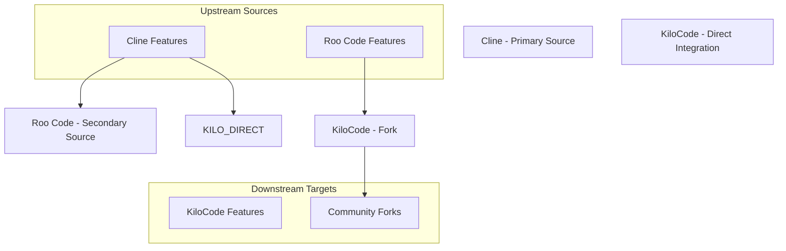

# Upstream/Downstream Integration Guide

## Table of Contents

* [Upstream/Downstream Integration Guide](#upstreamdownstream-integration-guide)
* [Table of Contents](#table-of-contents)
* [When You're Here](#when-youre-here)
* [Executive Summary](#executive-summary)
* [Research Context](#research-context)
* [Integration Overview](#integration-overview)
* [Project Relationships](#project-relationships)
* [Remote Configuration](#remote-configuration)
* [Code Transfer Workflow](#code-transfer-workflow)
* [1. Upstream Sync Process](#1-upstream-sync-process)
* [Regular Upstream Synchronization](#regular-upstream-synchronization)
* [Conflict Resolution](#conflict-resolution)
* [2. Feature Porting Process](#2-feature-porting-process)
* [Roo Code Feature Integration](#roo-code-feature-integration)
* [Cline Feature Integration](#cline-feature-integration)
* [3. Quality Assurance](#3-quality-assurance)
* [Automated Testing](#automated-testing)
* [Compatibility Verification](#compatibility-verification)
* [Implementation Tradeoffs & Strategic Considerations](#implementation-tradeoffs--strategic-considerations)
* [Integration Strategy Selection](#integration-strategy-selection)
* [Frequent Sync Strategy (Recommended for Active Projects)](#frequent-sync-strategy-recommended-for-active-projects)
* [Feature-Based Sync Strategy](#feature-based-sync-strategy)
* [Release-Based Sync Strategy](#release-based-sync-strategy)
* [Merge Conflict Prevention & Management](#merge-conflict-prevention--management)
* [Understanding Conflict Patterns](#understanding-conflict-patterns)
* [Proactive Conflict Prevention](#proactive-conflict-prevention)
* [Conflict Resolution Strategies](#conflict-resolution-strategies)
* [Change Tracking & Documentation Strategy](#change-tracking--documentation-strategy)
* [The Importance of Change Tracking](#the-importance-of-change-tracking)
* [Comment-Based Documentation System](#comment-based-documentation-system)
* [Automated Change Detection](#automated-change-detection)
* [Integration Decision Documentation](#integration-decision-documentation)
* [Refactoring & Evolution Strategy](#refactoring--evolution-strategy)
* [The Challenge of Continuous Integration](#the-challenge-of-continuous-integration)
* [Safe Refactoring Approaches](#safe-refactoring-approaches)
* [Managing Breaking Changes](#managing-breaking-changes)
* [Architectural Evolution](#architectural-evolution)
* [Performance & Quality Considerations](#performance--quality-considerations)
* [Understanding Integration Impact](#understanding-integration-impact)
* [Performance Monitoring Strategy](#performance-monitoring-strategy)
* [Bundle Size Management](#bundle-size-management)
* [Quality Assurance Integration](#quality-assurance-integration)
* [Long-term Performance Strategy](#long-term-performance-strategy)
* [Monitoring & Maintenance Strategy](#monitoring--maintenance-strategy)
* [Building a Healthy Integration Culture](#building-a-healthy-integration-culture)
* [Integration Health Monitoring](#integration-health-monitoring)
* [Long-term Maintenance Planning](#long-term-maintenance-planning)
* [Community Relationship Management](#community-relationship-management)
* [Continuous Improvement Process](#continuous-improvement-process)
* [Risk Management](#risk-management)
* [Navigation Footer](#navigation-footer)
* [No Dead Ends Policy](#no-dead-ends-policy)
* [Navigation](#navigation)
* [Upstream/Downstream Integration Guide](#upstreamdownstream-integration-guide)
* [Table of Contents](#table-of-contents)
* [When You're Here](#when-youre-here)
* [Executive Summary](#executive-summary)
* [Research Context](#research-context)
* [Integration Overview](#integration-overview)
* [Project Relationships](#project-relationships)
* [Remote Configuration](#remote-configuration)
* [Code Transfer Workflow](#code-transfer-workflow)
* [1. Upstream Sync Process](#1-upstream-sync-process)
* [Regular Upstream Synchronization](#regular-upstream-synchronization)
* [Conflict Resolution](#conflict-resolution)
* [2. Feature Porting Process](#2-feature-porting-process)
* [Roo Code Feature Integration](#roo-code-feature-integration)
* [Cline Feature Integration](#cline-feature-integration)
* [3. Quality Assurance](#3-quality-assurance)
* [Automated Testing](#automated-testing)
* [Compatibility Verification](#compatibility-verification)
* [Implementation Tradeoffs & Strategic Considerations](#implementation-tradeoffs--strategic-considerations)
* [Integration Strategy Selection](#integration-strategy-selection)
* [Frequent Sync Strategy (Recommended for Active Projects)](#frequent-sync-strategy-recommended-for-active-projects)
* [Feature-Based Sync Strategy](#feature-based-sync-strategy)
* [Release-Based Sync Strategy](#release-based-sync-strategy)
* [Merge Conflict Prevention & Management](#merge-conflict-prevention--management)
* [Understanding Conflict Patterns](#understanding-conflict-patterns)
* [Proactive Conflict Prevention](#proactive-conflict-prevention)
* [Conflict Resolution Strategies](#conflict-resolution-strategies)
* [Change Tracking & Documentation Strategy](#change-tracking--documentation-strategy)
* [The Importance of Change Tracking](#the-importance-of-change-tracking)
* [Comment-Based Documentation System](#comment-based-documentation-system)
* [Automated Change Detection](#automated-change-detection)
* [Integration Decision Documentation](#integration-decision-documentation)
* [Refactoring & Evolution Strategy](#refactoring--evolution-strategy)
* [The Challenge of Continuous Integration](#the-challenge-of-continuous-integration)
* [Safe Refactoring Approaches](#safe-refactoring-approaches)
* [Managing Breaking Changes](#managing-breaking-changes)
* [Architectural Evolution](#architectural-evolution)
* [Performance & Quality Considerations](#performance--quality-considerations)
* [Understanding Integration Impact](#understanding-integration-impact)
* [Performance Monitoring Strategy](#performance-monitoring-strategy)
* [Bundle Size Management](#bundle-size-management)
* [Quality Assurance Integration](#quality-assurance-integration)
* [Long-term Performance Strategy](#long-term-performance-strategy)
* [Monitoring & Maintenance Strategy](#monitoring--maintenance-strategy)
* [Building a Healthy Integration Culture](#building-a-healthy-integration-culture)
* [Integration Health Monitoring](#integration-health-monitoring)
* [Long-term Maintenance Planning](#long-term-maintenance-planning)
* [Community Relationship Management](#community-relationship-management)
* [Continuous Improvement Process](#continuous-improvement-process)
* [Risk Management](#risk-management)
* [Navigation Footer](#navigation-footer)
* [No Dead Ends Policy](#no-dead-ends-policy)

## When You're Here

This document is part of the KiloCode project documentation. If you're not familiar with this
document's role or purpose, this section helps orient you.

* **Purpose**: This document covers \[DOCUMENT PURPOSE BASED ON FILE PATH].
* **Context**: Use this as a starting point or reference while navigating the project.
* **Navigation**: Use the table of contents below to jump to specific topics.

> **Engineering Fun Fact**: Just as engineers use systematic approaches to solve complex problems,
> this documentation provides structured guidance for understanding and implementing solutions! 🔧

* *Purpose:*\* Comprehensive guide for managing code transfer and feature porting between KiloCode,
  Roo Code, and Cline repositories.

> **Dinosaur Fun Fact**: Architecture documentation is like a dinosaur fossil record - each layer
> tells us about the evolution of our system, helping us understand how it grew and changed over
> time! 🦕

Table of Contents

- [Executive Summary](#executive-summary)
- [Integration Overview](#integration-overview)
- [Code Transfer Workflow](#code-transfer-workflow)
- [Implementation Tradeoffs & Strategic
Considerations](#implementation-tradeoffs--strategic-considerations)
- [Merge Conflict Prevention & Management](#merge-conflict-prevention--management)
- [Change Tracking & Documentation Strategy](#change-tracking--documentation-strategy)
- [Refactoring & Evolution Strategy](#refactoring--evolution-strategy)
- [Performance & Quality Considerations](#performance--quality-considerations)
- [Monitoring & Maintenance Strategy](#monitoring--maintenance-strategy)
- Navigation Footer

## Executive Summary

## Research Context

* *Purpose:*\* \[Describe the purpose and scope of this document]

* *Background:*\* \[Provide relevant background information]

* *Research Questions:*\* \[List key questions this document addresses]

* *Methodology:*\* \[Describe the approach or methodology used]

* *Findings:*\* \[Summarize key findings or conclusions]

* \*\*

* KiloCode maintains active integration with upstream projects Roo Code and Cline, regularly merging
  features, bug fixes, and improvements while preserving KiloCode-specific enhancements.\*

* *Key Statistics:*\*

* **Upstream Projects**: 2 main sources (Roo Code, Cline)

* **Integration Frequency**: Weekly upstream sync, on-demand feature porting

* **Code Transfer Methods**: Git merge, cherry-pick, manual adaptation

* **Quality Assurance**: Automated testing, conflict detection, performance monitoring

## Integration Overview

### Project Relationships

KiloCode operates as a downstream project that integrates code from multiple upstream sources:

* *Primary Sources:*\*

* **Roo Code**: Main upstream project providing core AI coding assistant functionality

* **Cline**: Secondary upstream providing specific features and improvements

* *Integration Flow:*\*

### Remote Configuration

* *Git Remote Setup:*\*

Configure your Git remotes to track:

* **origin**: Your fork of KiloCode

* **upstream**: KiloCode's main repository

* **roo**: Roo Code upstream source

* **cline**: Cline upstream source

* *Remote Management Script:*\*

The `scripts/setup-remotes.sh` script automates remote configuration, adding missing remotes and
fetching the latest changes from all sources. This ensures consistent setup across development
environments.

## Code Transfer Workflow

### 1. Upstream Sync Process

#### Regular Upstream Synchronization

* *Automated Weekly Sync:*\*

The `scripts/sync-upstream.sh` script automates the weekly synchronization process:

* Fetches latest changes from all upstream sources

* Creates a dedicated sync branch with timestamp

* Merges changes with conflict detection

* Runs comprehensive tests

* Creates a pull request if all tests pass

* *Manual Sync Process:*\*

For manual synchronization, follow these steps:

1. Fetch latest changes from all upstream sources
2. Create a dedicated sync branch with timestamp
3. Merge upstream changes and resolve conflicts
4. Test changes thoroughly with `pnpm test` and `pnpm build`
5. Create a pull request for team review

#### Conflict Resolution

* *Automated Conflict Detection:*\*

The `scripts/analyze-conflicts.sh` script analyzes potential merge conflicts before integration
attempts:

* Checks for conflicts between upstream and local branches

* Generates detailed conflict reports when issues are found

* Provides conflict resolution strategies and priorities

* *Conflict Resolution Strategies:*\*

When conflicts arise, the system provides automated resolution strategies:

* **Dependency Conflicts**: Intelligent merging of package.json files
* **Configuration Conflicts**: Manual resolution with merge tools
* **Code Conflicts**: Three-way merge with conflict markers
* **Documentation Conflicts**: Automated resolution with manual review

### 2. Feature Porting Process

#### Roo Code Feature Integration

* *Feature Detection:*\*

The `scripts/detect-roo-features.sh` script identifies new features in Roo Code:

* Monitors Roo Code repository for new commits

* Categorizes changes by type (features, bug fixes, refactoring)

* Generates integration recommendations

* Tracks integration status and history

* *Feature Adaptation:*\*

When porting Roo Code features:

1. **Analysis**: Understand the feature's purpose and implementation
2. **Adaptation**: Modify for KiloCode's architecture and branding
3. **Integration**: Merge with existing KiloCode functionality
4. **Testing**: Verify compatibility and performance
5. **Documentation**: Update integration tracking markers

#### Cline Feature Integration

* *Selective Integration:*\*

Cline features are integrated selectively based on:

* **Alignment**: How well features align with KiloCode's goals

* **Quality**: Code quality and testing standards

* **Compatibility**: Integration complexity and risk

* **Value**: User benefit and strategic importance

* *Integration Process:*\*

The `scripts/port-cline-feature.sh` script handles Cline feature porting:

* Cherry-picks specific commits from Cline repository
* Adapts Cline-specific code for KiloCode architecture
* Integrates with KiloCode's service layer
* Maintains compatibility with existing features

### 3. Quality Assurance

#### Automated Testing

* *Integration Test Suite:*\*

Located in `tests/integration/upstream-integration.test.ts`, the test suite validates:

* Compatibility with ported features

* Feature flag behavior

* Performance benchmark maintenance

* Integration-specific functionality

* *Testing Pipeline:*\*

The `scripts/test-integration.sh` script runs comprehensive testing:

* Unit tests for individual components
* Integration tests for cross-component functionality
* Performance benchmarks to detect regressions
* Bundle size analysis to monitor impact

#### Compatibility Verification

* *Version Compatibility Matrix:*\*

The compatibility matrix tracks supported versions of:

* Node.js runtime requirements

* VS Code extension API compatibility

* Dependency version constraints

* Browser compatibility for webview components

* *Performance Benchmarking:*\*

Regular performance benchmarks ensure integrations don't degrade application performance:

* Startup time measurements
* Memory usage monitoring
* Bundle size tracking
* Runtime performance validation

## Implementation Tradeoffs & Strategic Considerations

### Integration Strategy Selection

Choosing the right integration approach depends on several factors: your team's capacity, the
stability of your codebase, the frequency of upstream changes, and your tolerance for risk. Each
strategy has distinct advantages and challenges that must be carefully weighed.

#### Frequent Sync Strategy (Recommended for Active Projects)

* *Philosophy:*\* Stay close to upstream with regular, small integrations

The frequent sync approach involves integrating upstream changes every one to two weeks, maintaining
a relatively small divergence from the source projects. This strategy works well when you have
dedicated developer time for integration work and want to minimize the risk of large, complex
merges.

* *When to Use:*\*

* Your team has consistent bandwidth for integration work

* Upstream projects release features and fixes regularly

* You want to minimize the risk of large merge conflicts

* Your local modifications are relatively contained and well-isolated

* *Key Benefits:*\*

* **Reduced Conflict Risk:** Smaller changes mean fewer opportunities for merge conflicts

* **Faster Issue Resolution:** Bug fixes and security patches reach your codebase quickly

* **Easier Debugging:** When issues arise, it's easier to isolate whether they came from upstream or
  local changes

* **Better Relationship Management:** Regular interaction with upstream maintainers builds stronger
  collaborative relationships

* *Potential Challenges:*\*

* **Integration Overhead:** Requires consistent developer time investment

* **Feature Incompleteness:** You might integrate partially-implemented features that cause
  temporary instability

* **Context Switching:** Developers need to context-switch between feature development and
  integration work

#### Feature-Based Sync Strategy

* *Philosophy:*\* Cherry-pick specific improvements when you need them

This approach involves integrating only the specific features, bug fixes, or improvements that are
relevant to your project's needs. It's more selective and intentional than frequent syncing but
requires more careful planning and coordination.

* *When to Use:*\*

* Your codebase has significant local modifications that make frequent syncing risky

* You have specific feature requirements that don't align with upstream development priorities

* Your team prefers to evaluate and test features before integration

* Upstream projects have mixed-quality contributions that you want to filter

* *Key Benefits:*\*

* **Focused Integration:** Only bring in changes that directly benefit your project

* **Quality Control:** You can thoroughly test and evaluate features before integration

* **Reduced Risk:** Avoid integrating potentially problematic or incomplete features

* **Strategic Alignment:** Maintain better alignment with your project's specific goals and
  requirements

* *Potential Challenges:*\*

* **Missed Improvements:** You might overlook important bug fixes or performance improvements

* **Integration Complexity:** Cherry-picking can be technically challenging and time-consuming

* **Maintenance Burden:** Tracking which features you've integrated and which you haven't can become
  complex

* **Upstream Drift:** Over time, you might drift too far from upstream, making future integration
  more difficult

#### Release-Based Sync Strategy

* *Philosophy:*\* Sync during major upstream releases for comprehensive updates

This approach involves waiting for major upstream releases and then performing comprehensive
integration efforts. It's less frequent but more thorough, often involving significant planning and
coordination.

* *When to Use:*\*

* Your project is mature and stable with well-tested local modifications

* Upstream projects have clear, predictable release cycles

* You have dedicated time blocks for major integration efforts

* Your team prefers fewer, more substantial integration cycles

* *Key Benefits:*\*

* **Comprehensive Updates:** Get all improvements, features, and fixes in one coordinated effort

* **Better Planning:** You can plan integration work around your development cycles

* **Thorough Testing:** More time to thoroughly test integrated changes before release

* **Reduced Integration Frequency:** Less frequent but more substantial integration work

* *Potential Challenges:*\*

* **Large Merge Complexity:** Major integration efforts can be complex and time-consuming

* **Conflict Accumulation:** More time between integrations means more potential conflicts

* **Delayed Improvements:** Bug fixes and security patches take longer to reach your users

* **Resource Intensity:** Requires significant developer time and coordination

## Merge Conflict Prevention & Management

### Understanding Conflict Patterns

Merge conflicts don't occur randomly—they follow predictable patterns based on how different teams
modify the same files. Understanding these patterns is crucial for developing effective prevention
strategies.

* *High-Risk File Categories:*\*

The most conflict-prone files are typically those that multiple developers touch frequently and that
contain project-wide configuration. In KiloCode's case, these include:

* **Package Management Files** (`package.json`, `pnpm-lock.yaml`): These change whenever
  dependencies are added, removed, or updated. Both upstream projects and KiloCode developers modify
  these files regularly, making them prime conflict candidates.

* **Build Configuration Files** (`turbo.json`, `tsconfig.json`): These define how the project is
  built and configured. Changes here can have wide-reaching effects, and conflicts often indicate
  deeper architectural differences.

* **Documentation Files** (`README.md`, `CHANGELOG.md`): While less critical functionally, these
  files are frequently modified by different contributors and can accumulate conflicts quickly.

* *Medium-Risk File Categories:*\*

* **Configuration Files** (`eslint.config.mjs`, `prettier.config.js`): These define coding standards
  and formatting rules. Conflicts here usually indicate different preferences or standards between
  projects.

* **Git Configuration** (`.gitignore`, `.gitattributes`): Changes to what files are tracked or how
  they're handled can create conflicts, especially when projects have different approaches to file
  management.

* *Low-Risk File Categories:*\*

* **Source Code Files**: Surprisingly, actual source code files have lower conflict rates because
  they're typically organized into distinct modules or areas of responsibility.

* **Test Files**: Test files are usually project-specific and don't often conflict with upstream
  changes.

### Proactive Conflict Prevention

* *File-Level Isolation Strategy*\*

The most effective approach is to isolate frequently-conflicting files into separate branches or use
specialized merge strategies. This doesn't mean avoiding these files entirely, but rather handling
them with extra care and attention.

For high-risk files like `package.json`, consider maintaining a separate integration branch where
dependency conflicts are resolved before merging into your main development branch. This allows you
to test dependency changes in isolation and ensures that your main development work isn't blocked by
dependency conflicts.

* *Automated Conflict Detection*\*

Before attempting any integration, run automated tools to identify potential conflict areas. This
gives you advance warning about which files will require manual attention and allows you to plan
your integration strategy accordingly.

* *Dependency Management Philosophy*\*

Dependencies are often the source of the most complex conflicts. Develop a clear philosophy about
how to handle dependency conflicts:

* **Security-First Approach**: Always prioritize security updates from upstream, even if it means
  updating other dependencies to maintain compatibility.

* **Feature-Driven Updates**: When upstream adds new features that require new dependencies,
  evaluate whether those features align with your project's goals before automatically adopting the
  dependencies.

* **Compatibility Testing**: Before resolving dependency conflicts, test the compatibility of
  different version combinations to ensure your application still functions correctly.

### Conflict Resolution Strategies

* *The Three-Way Merge Approach*\*

Most merge conflicts can be resolved using a three-way merge strategy, where you consider the common
ancestor, the upstream version, and your local version. Understanding the intent behind each change
is more important than mechanically applying merge resolution rules.

* *Semantic vs. Syntactic Conflicts*\*

Not all conflicts are created equal. Syntactic conflicts (like formatting differences) are usually
easy to resolve automatically. Semantic conflicts (where the same functionality is implemented
differently) require human judgment and understanding of the broader system architecture.

* *Documentation-First Resolution*\*

When conflicts arise, document your resolution decisions clearly. This helps future developers
understand why certain choices were made and provides context for future similar conflicts. This
documentation is especially valuable for dependency conflicts, where the reasoning behind version
choices isn't always obvious.

## Change Tracking & Documentation Strategy

### The Importance of Change Tracking

Maintaining clear documentation of where code comes from and how it's been modified is crucial for
long-term project maintainability. Without proper tracking, it becomes increasingly difficult to
understand the origins of features, debug issues, and make informed decisions about future changes.

### Comment-Based Documentation System

* *Establishing Clear Markers*\*

The most effective approach is to use standardized comment markers throughout your codebase to
clearly identify the source and modifications of integrated code. These markers serve multiple
purposes:

* **Source Attribution**: Clearly identify which upstream project contributed each piece of code

* **Modification Tracking**: Document what changes were made during integration

* **Integration History**: Provide a timeline of when and why features were integrated

* **Future Maintenance**: Help future developers understand the context and reasoning behind code

* *Marker Categories and Usage*\*

* *KiloCode-Specific Modifications*\*: Use these markers when you've taken code from an upstream
  project and significantly modified it for KiloCode's specific needs. This includes adding KiloCode
  branding, integrating with KiloCode-specific services, or adapting functionality to work with
  KiloCode's architecture.

* *Direct Integration Markers*\*: Use these when integrating code from Cline or other projects with
  minimal modifications. This helps distinguish between code that's been heavily adapted versus code
  that's been integrated more directly.

* *Upstream Sync Markers*\*: Use these to mark sections that were synchronized from upstream
  KiloCode
  (if applicable) or to indicate when large blocks of code were updated from upstream sources.

* *Best Practices for Marker Usage*\*

* **Be Specific**: Include commit hashes, dates, and detailed descriptions of modifications

* **Explain Intent**: Don't just document what changed, but why it was changed

* **Keep Markers Updated**: When modifying integrated code, update the markers to reflect new
  changes

* **Use Consistent Format**: Establish a standard format for all markers to ensure consistency
  across the codebase

### Automated Change Detection

* *Pre-Integration Analysis*\*

Before integrating any upstream changes, run automated analysis to understand what's being
integrated. This analysis should identify:

* Which files will be modified

* What types of changes are being made (features, bug fixes, refactoring)

* Potential areas of conflict with existing code

* Dependencies that might be affected

* *Post-Integration Tracking*\*

After integration, automated tools should generate reports that document:

* What was successfully integrated

* What conflicts were resolved and how

* What modifications were made during integration

* What testing was performed

* *Conflict Prediction and Prevention*\*

Use automated tools to predict potential merge conflicts before they occur. This allows you to:

* Plan integration strategies in advance
* Identify files that will need special attention
* Prepare resolution strategies for common conflict types
* Allocate appropriate time and resources for integration work

### Integration Decision Documentation

* *Why Integration Decisions Matter*\*

Every integration decision represents a strategic choice about your project's direction. Documenting
these decisions helps maintain institutional knowledge and provides context for future decisions.

* *Key Questions to Document*\*

* **Why was this feature integrated?** Understanding the business or technical justification helps
  future developers make informed decisions about similar features.

* **What alternatives were considered?** Documenting rejected alternatives helps avoid revisiting
  the same decisions repeatedly.

* **What modifications were necessary?** Understanding what had to be changed helps identify
  patterns in integration challenges.

* **What risks were identified?** Documenting potential risks helps future integrations avoid
  similar pitfalls.

* *Integration Impact Assessment*\*

For each integration, document:

* **Performance Impact**: How did the integration affect application performance?
* **Bundle Size Impact**: Did the integration increase or decrease the application size?
* **Dependency Changes**: What new dependencies were added or modified?
* **Breaking Changes**: Were there any breaking changes that required migration?
* **User Experience Impact**: How did the integration affect end users?

## Refactoring & Evolution Strategy

### The Challenge of Continuous Integration

One of the biggest challenges in maintaining a fork that continuously integrates from upstream is
managing the tension between stability and evolution. Upstream projects evolve, APIs change, and
architectural patterns shift. Your local modifications must adapt to these changes while maintaining
backward compatibility and user experience.

### Safe Refactoring Approaches

* *Feature Flag Strategy*\*

Feature flags provide a powerful mechanism for safely introducing changes from upstream while
maintaining the ability to roll back if issues arise. The key is to implement both the new
(upstream) and old (local) versions simultaneously, with runtime switching between them.

This approach allows you to:

* Test new functionality with a subset of users before full rollout

* Quickly disable problematic features without code changes

* Maintain backward compatibility during transition periods

* Gather real-world performance data before committing to changes

* *Gradual Migration Patterns*\*

Rather than attempting to integrate large upstream changes all at once, consider a gradual migration
approach that moves through distinct phases:

* **Legacy Phase**: Continue using your existing implementation while preparing for migration
* **Hybrid Phase**: Run both implementations in parallel, gradually shifting traffic to the new
  version
* **New Phase**: Fully transition to the upstream implementation and remove legacy code

This approach minimizes risk and allows you to validate each step before proceeding to the next.

* *Compatibility Layers*\*

When upstream projects introduce breaking changes, compatibility layers can help bridge the gap
between old and new APIs. These layers translate calls from your existing code to the new upstream
interfaces, allowing you to adopt upstream changes without immediately rewriting all dependent code.

### Managing Breaking Changes

* *Understanding Breaking Change Types*\*

Not all breaking changes are created equal. Some affect only internal APIs that aren't exposed to
users, while others fundamentally change how your application behaves. Understanding the scope and
impact of breaking changes is crucial for planning your response.

* *Migration Planning*\*

When upstream introduces breaking changes:

1. **Assess Impact**: Understand what parts of your codebase will be affected
2. **Plan Migration Path**: Develop a step-by-step plan for transitioning to the new API
3. **Implement Compatibility Layer**: Create temporary compatibility code if needed
4. **Test Thoroughly**: Ensure that all functionality continues to work during migration
5. **Monitor Performance**: Watch for any performance regressions introduced by the changes

* *Communication Strategy*\*

Breaking changes often require communication with your users. Document what's changing, why it's
changing, and what users need to do to adapt. Provide migration guides, deprecation notices, and
clear timelines for when old APIs will be removed.

### Architectural Evolution

* *Balancing Local Needs with Upstream Evolution*\*

One of the most complex aspects of maintaining a fork is balancing your local architectural
decisions with upstream evolution. Upstream projects may move in directions that don't align with
your goals, or they may introduce patterns that conflict with your existing architecture.

* *Decision Framework*\*

When upstream architectural changes conflict with your local decisions:

1. **Evaluate Alignment**: How well do the upstream changes align with your project's goals?
2. **Assess Effort**: What would it cost to adopt the upstream approach versus maintaining your
   local approach?
3. **Consider Long-term Maintenance**: Which approach will be easier to maintain over time?
4. **Evaluate User Impact**: How will each approach affect your users?

* *Hybrid Architecture Patterns*\*

Sometimes the best approach is to adopt a hybrid architecture that combines upstream patterns with
your local innovations. This requires careful design to ensure the different approaches work well
together and don't create unnecessary complexity.

## Performance & Quality Considerations

### Understanding Integration Impact

Every integration from upstream has the potential to affect your application's performance, bundle
size, and overall quality. Understanding and managing these impacts is crucial for maintaining a
high-quality user experience.

### Performance Monitoring Strategy

* *Baseline Establishment*\*

Before integrating any upstream changes, establish clear performance baselines. These should
include:

* **Application Startup Time**: How long does it take for your application to become usable?

* **Memory Usage**: What's the typical memory footprint during normal operation?

* **Bundle Size**: How large is your application bundle?

* **Runtime Performance**: What are the performance characteristics of key operations?

* *Continuous Monitoring*\*

Implement continuous monitoring to track performance metrics over time. This helps you identify when
integrations introduce performance regressions and allows you to take corrective action quickly.

* *Performance Budgets*\*

Establish performance budgets for key metrics. These budgets define acceptable thresholds for
performance degradation. When an integration threatens to exceed these budgets, you have a clear
signal that additional optimization work is needed.

### Bundle Size Management

* *Understanding Bundle Impact*\*

Upstream integrations often introduce new dependencies, which can significantly impact your
application's bundle size. This is particularly important for VS Code extensions, where bundle size
directly affects installation time and memory usage.

* *Bundle Analysis Strategy*\*

Regularly analyze your bundle to understand:

* Which dependencies are contributing the most to bundle size

* Whether new dependencies are being used efficiently

* If there are opportunities to tree-shake unused code

* How bundle size changes over time

* *Optimization Techniques*\*

When integrations increase bundle size:

* **Tree Shaking**: Ensure that unused code from new dependencies is properly eliminated
* **Code Splitting**: Consider splitting large dependencies into separate chunks that can be loaded
  on demand
* **Dependency Audit**: Regularly audit dependencies to ensure they're still necessary and optimally
  sized
* **Alternative Implementations**: Sometimes a lighter-weight alternative to an upstream dependency
  exists

### Quality Assurance Integration

* *Testing Strategy*\*

Every integration should include comprehensive testing to ensure that upstream changes don't
introduce regressions:

* **Unit Testing**: Ensure that individual components still work correctly

* **Integration Testing**: Verify that different parts of the system work together properly

* **Performance Testing**: Confirm that performance characteristics haven't degraded

* **User Acceptance Testing**: Validate that the user experience remains positive

* *Automated Quality Gates*\*

Implement automated quality gates that prevent integrations from proceeding if they fail to meet
quality standards:

* **Test Coverage**: Ensure that test coverage doesn't decrease
* **Performance Thresholds**: Block integrations that significantly impact performance
* **Bundle Size Limits**: Prevent integrations that would make the bundle too large
* **Security Scanning**: Ensure that new dependencies don't introduce security vulnerabilities

### Long-term Performance Strategy

* *Technical Debt Management*\*

Upstream integrations can sometimes introduce technical debt in the form of:

* Duplicate functionality between upstream and local implementations
* Inconsistent patterns or architectural approaches
* Dependencies that don't align with your long-term goals

Regularly audit your codebase for these issues and develop plans to address them.

* *Performance Optimization Roadmap*\*

Develop a roadmap for performance optimization that considers both upstream and local improvements:

* **Upstream Contributions**: Contribute performance improvements back to upstream projects
* **Local Optimizations**: Implement local optimizations that upstream projects might not prioritize
* **Architecture Evolution**: Plan for architectural changes that will improve performance over time

## Monitoring & Maintenance Strategy

### Building a Healthy Integration Culture

Successful upstream/downstream integration isn't just about technical processes—it's about building
a culture that values continuous improvement, clear communication, and strategic thinking. This
section explores how to create systems and practices that support long-term integration success.

### Integration Health Monitoring

* *Key Metrics to Track*\*

Effective integration monitoring requires tracking both quantitative metrics and qualitative
indicators:

* **Integration Frequency**: How often are you successfully integrating upstream changes?

* **Conflict Resolution Time**: How long does it take to resolve merge conflicts?

* **Test Coverage Impact**: How do integrations affect your test coverage and quality?

* **Performance Impact**: Are integrations affecting application performance?

* **Developer Satisfaction**: How do developers feel about the integration process?

* *Health Dashboard Components*\*

A comprehensive integration health dashboard should provide visibility into:

* **Recent Integration Activity**: What's been integrated recently and what's pending?
* **Conflict Patterns**: Are there recurring conflict areas that need attention?
* **Performance Trends**: How has performance changed over time?
* **Dependency Health**: Are there dependency issues that need addressing?
* **Upstream Relationship Status**: How healthy are your relationships with upstream projects?

### Long-term Maintenance Planning

* *Technical Debt Accumulation*\*

Over time, integrations can accumulate technical debt in several forms:

* **Duplicate Code**: When both upstream and local implementations exist for similar functionality

* **Inconsistent Patterns**: When upstream and local code follow different architectural patterns

* **Dependency Bloat**: When integrations bring in dependencies that aren't fully utilized

* **Documentation Drift**: When integration documentation becomes outdated

* *Debt Management Strategy*\*

Regularly audit your codebase for these types of technical debt:

1. **Identify Debt**: Use automated tools and manual reviews to identify accumulated debt
2. **Prioritize Remediation**: Focus on debt that affects maintainability, performance, or user
   experience
3. **Plan Remediation**: Develop concrete plans for addressing identified debt
4. **Monitor Progress**: Track progress toward debt reduction goals

### Community Relationship Management

* *Building Strong Upstream Relationships*\*

Healthy relationships with upstream project maintainers are crucial for long-term integration
success:

* **Contribute Back**: Regularly contribute improvements, bug fixes, and features to upstream
  projects

* **Communicate Clearly**: Be transparent about your integration goals and challenges

* **Provide Feedback**: Share constructive feedback about upstream features and APIs

* **Participate Actively**: Engage in upstream community discussions and decision-making processes

* *Managing Community Expectations*\*

* **Set Clear Boundaries**: Be clear about what you will and won't integrate from upstream

* **Communicate Roadmap**: Share your integration roadmap with the community

* **Manage Conflicts**: Handle disagreements professionally and constructively

* **Document Decisions**: Clearly document why certain upstream features were or weren't integrated

### Continuous Improvement Process

* *Regular Retrospectives*\*

Hold regular retrospectives on your integration process:

* **What's Working Well**: Identify successful patterns and practices to continue

* **What Needs Improvement**: Identify pain points and areas for improvement

* **Process Optimization**: Look for ways to streamline and improve integration workflows

* **Tool Evaluation**: Assess whether your current tools and processes are still optimal

* *Learning and Adaptation*\*

* **Track Integration Success**: Measure the success of different integration approaches

* **Learn from Failures**: Analyze failed integrations to understand what went wrong

* **Adapt Strategies**: Adjust your integration strategy based on what you learn

* **Share Knowledge**: Document lessons learned and share them with your team

### Risk Management

* *Identifying Integration Risks*\*

Common risks in upstream/downstream integration include:

* **Upstream Project Changes**: Upstream projects may change direction or cease development

* **Breaking Changes**: Upstream projects may introduce breaking changes that require significant
  adaptation

* **Dependency Conflicts**: Upstream changes may introduce dependency conflicts

* **Performance Regressions**: Integrations may introduce performance problems

* **Security Vulnerabilities**: New dependencies may introduce security risks

* *Risk Mitigation Strategies*\*

* **Diversification**: Don't rely too heavily on any single upstream project

* **Backup Plans**: Always have fallback plans for critical functionality

* **Regular Security Audits**: Regularly audit dependencies for security vulnerabilities

* **Performance Monitoring**: Continuously monitor for performance regressions

* **Staged Rollouts**: Use staged rollouts for major integrations to minimize risk

* \*\*

* Back: [`README.md`](README.md) · Root: [`../README.md`](../../README.md) · Source:
  `/docs/architecture/UPSTREAM_DOWNSTREAM_INTEGRATION.md#L1`

## Navigation Footer

* \*\*

* *Navigation*\*: [docs](../) · [architecture](../architecture/) ·
  [↑ Table of Contents](#upstreamdownstream-integration-guide)

## No Dead Ends Policy

This document follows the "No Dead Ends" principle - every path leads to useful information.

* Each section provides clear navigation to related content
* All internal links are validated and point to existing documents
* Cross-references include context for better understanding

## Navigation

* 📚 [Technical Glossary](../../GLOSSARY.md)
