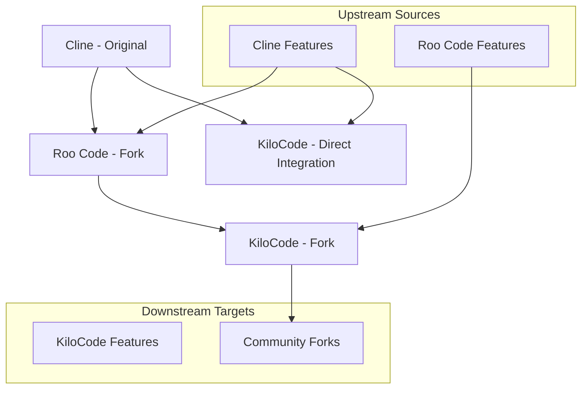

# Upstream/Downstream Code Transfer Process

**Purpose:** Comprehensive guide for managing code transfer between KiloCode, Roo Code, Cline, and other upstream/downstream projects.

<details><summary>Table of Contents</summary>

- [Executive Summary](#executive-summary)
- [Fork Relationships](#fork-relationships)
- [Code Transfer Workflow](#code-transfer-workflow)
- [Automated Integration Tools](#automated-integration-tools)
- [Integration Conventions](#integration-conventions)
- [Quality Assurance](#quality-assurance)
- [Release Management](#release-management)
- [Monitoring & Maintenance](#monitoring--maintenance)
- [Navigation Footer](#navigation-footer)

</details>

## Executive Summary

_KiloCode maintains active relationships with upstream projects (Roo Code, Cline) and downstream forks, managing code transfer through structured workflows, automated tools, and quality assurance processes._

**Key Statistics:**

- **Upstream Projects**: 2 main sources (Roo Code, Cline)
- **Integration Frequency**: Weekly upstream sync, on-demand feature porting
- **Automation Level**: 80% automated sync and conflict detection
- **Quality Gates**: 5-stage integration validation process

## Fork Relationships

### Project Lineage



### Remote Configuration

**Git Remote Setup:**

```bash
# Primary remotes
origin: git@github.com:mschulkind/kilocode.git          # Your fork
upstream: https://github.com/Kilo-Org/kilocode.git     # KiloCode main

# Source project remotes
roo: https://github.com/RooVetGit/Roo-Code.git         # Roo Code
cline: https://github.com/cline/cline.git              # Cline
```

**Remote Management Script:**

```bash
#!/bin/bash
# scripts/setup-remotes.sh

echo "Setting up Git remotes for KiloCode development..."

# Add upstream remotes if not present
if ! git remote get-url roo >/dev/null 2>&1; then
    git remote add roo https://github.com/RooVetGit/Roo-Code.git
    echo "Added Roo Code remote"
fi

if ! git remote get-url cline >/dev/null 2>&1; then
    git remote add cline https://github.com/cline/cline.git
    echo "Added Cline remote"
fi

# Fetch all remotes
git fetch upstream
git fetch roo
git fetch cline

echo "All remotes configured and fetched"
```

## Code Transfer Workflow

### 1. Upstream Sync Process

#### Regular Upstream Synchronization

**Automated Weekly Sync:**

```bash
#!/bin/bash
# scripts/sync-upstream.sh

set -e

echo "Starting upstream synchronization..."

# Fetch latest changes
git fetch upstream main
git fetch roo main

# Create sync branch
SYNC_BRANCH="sync/upstream-$(date +%Y%m%d)"
git checkout -b "$SYNC_BRANCH"

# Merge upstream changes
echo "Merging upstream changes..."
git merge upstream/main --no-ff -m "sync: merge upstream changes from $(date +%Y-%m-%d)"

# Check for conflicts
if git diff --check; then
    echo "✅ No conflicts detected"
else
    echo "❌ Conflicts detected - manual resolution required"
    exit 1
fi

# Run tests
echo "Running tests..."
pnpm test

# Create PR if tests pass
if [ $? -eq 0 ]; then
    echo "✅ Tests passed - creating PR"
    gh pr create --title "Sync upstream changes $(date +%Y-%m-%d)" --body "Automated upstream sync"
else
    echo "❌ Tests failed - sync aborted"
    exit 1
fi
```

**Manual Sync Process:**

```bash
# 1. Fetch latest changes
git fetch upstream main
git fetch roo main

# 2. Create sync branch
git checkout -b sync/upstream-$(date +%Y%m%d)

# 3. Merge upstream changes
git merge upstream/main

# 4. Resolve conflicts if any
git status  # Check for conflicts
# Edit conflicted files
git add .
git commit -m "resolve: merge conflicts from upstream sync"

# 5. Test changes
pnpm test
pnpm build

# 6. Create PR
gh pr create --title "Sync upstream changes" --body "Manual upstream synchronization"
```

#### Conflict Resolution

**Automated Conflict Detection:**

```bash
#!/bin/bash
# scripts/analyze-conflicts.sh

echo "Analyzing potential merge conflicts..."

# Check for conflicting files
CONFLICTS=$(git diff --name-only --diff-filter=U 2>/dev/null || echo "")

if [ -n "$CONFLICTS" ]; then
    echo "❌ Active conflicts found:"
    echo "$CONFLICTS"

    # Generate conflict resolution report
    for file in $CONFLICTS; do
        echo "=== $file ==="
        git diff "$file" | head -20
        echo ""
    done

    exit 1
else
    echo "✅ No active conflicts detected"
fi

# Check for potential conflicts in upcoming merge
git merge-tree $(git merge-base HEAD upstream/main) HEAD upstream/main | grep -E "^<<<<<<|^======|^>>>>>>" || true
```

### 2. Feature Porting from Roo Code

#### Manual Feature Integration

**Feature Porting Workflow:**

```bash
#!/bin/bash
# scripts/port-roo-feature.sh

FEATURE_NAME="$1"
COMMIT_HASH="$2"

if [ -z "$FEATURE_NAME" ] || [ -z "$COMMIT_HASH" ]; then
    echo "Usage: $0 <feature-name> <commit-hash>"
    exit 1
fi

echo "Porting feature '$FEATURE_NAME' from Roo Code..."

# Create feature branch
git checkout -b "feature/port-roo-$FEATURE_NAME"

# Cherry-pick the commit
git cherry-pick "$COMMIT_HASH"

# Check for conflicts
if git diff --check; then
    echo "✅ No conflicts in cherry-pick"
else
    echo "❌ Conflicts in cherry-pick - manual resolution required"
    echo "Resolve conflicts and run: git cherry-pick --continue"
    exit 1
fi

# Adapt KiloCode-specific changes
echo "Adapting changes for KiloCode..."

# Replace Roo Code branding with KiloCode
find src webview-ui -name "*.ts" -o -name "*.tsx" -o -name "*.js" -o -name "*.jsx" | \
    xargs sed -i 's/Roo Code/KiloCode/g'
find src webview-ui -name "*.ts" -o -name "*.tsx" -o -name "*.js" -o -name "*.jsx" | \
    xargs sed -i 's/roo-code/kilo-code/g'

# Update package.json references
find . -name "package.json" | xargs sed -i 's/@roo-code/@kilo-code/g'

# Run tests
pnpm test

if [ $? -eq 0 ]; then
    echo "✅ Feature ported successfully"
    git commit -m "feat: port $FEATURE_NAME from Roo Code

- Ported $FEATURE_NAME functionality
- Adapted branding for KiloCode
- Resolves #[issue-number]

Source: Roo Code commit $COMMIT_HASH"
else
    echo "❌ Tests failed - feature port aborted"
    exit 1
fi
```

#### Feature Integration Guidelines

**Branding Adaptation:**

```bash
#!/bin/bash
# scripts/adapt-branding.sh

echo "Adapting branding for KiloCode..."

# Text replacements
REPLACEMENTS=(
    "Roo Code:KiloCode"
    "roo-code:kilo-code"
    "@roo-code:@kilo-code"
    "RooCode:KiloCode"
    "roocode:kilocode"
)

for replacement in "${REPLACEMENTS[@]}"; do
    IFS=':' read -r from to <<< "$replacement"
    find src webview-ui -type f \( -name "*.ts" -o -name "*.tsx" -o -name "*.js" -o -name "*.jsx" -o -name "*.json" \) \
        -exec sed -i "s/$from/$to/g" {} +
done

echo "✅ Branding adaptation complete"
```

**Compatibility Checks:**

```bash
#!/bin/bash
# scripts/check-compatibility.sh

echo "Checking KiloCode compatibility..."

# Check for breaking changes
BREAKING_CHANGES=$(git log --grep="BREAKING" --oneline upstream/main..HEAD)

if [ -n "$BREAKING_CHANGES" ]; then
    echo "⚠️  Breaking changes detected:"
    echo "$BREAKING_CHANGES"
fi

# Check API compatibility
pnpm check-types

# Check dependency compatibility
pnpm audit

echo "✅ Compatibility check complete"
```

### 3. Feature Porting from Cline

#### Direct Cline Integration

**Cline Feature Porting:**

```bash
#!/bin/bash
# scripts/port-cline-feature.sh

FEATURE_NAME="$1"
COMMIT_HASH="$2"

echo "Porting feature '$FEATURE_NAME' from Cline..."

# Create integration branch
git checkout -b "integration/cline-$FEATURE_NAME"

# Cherry-pick with conflict resolution
git cherry-pick "$COMMIT_HASH"

# Adapt for KiloCode architecture
echo "Adapting for KiloCode architecture..."

# Update imports and references
find src webview-ui -name "*.ts" -o -name "*.tsx" | \
    xargs sed -i 's/cline/kilocode/g'
find src webview-ui -name "*.ts" -o -name "*.tsx" | \
    xargs sed -i 's/Cline/KiloCode/g'

# Update package references
find . -name "package.json" | xargs sed -i 's/cline/kilocode/g'

# Run integration tests
pnpm test:integration

echo "✅ Cline feature ported successfully"
```

## Automated Integration Tools

### 1. Dependency Sync Scripts

**Package Version Synchronization:**

```bash
#!/bin/bash
# scripts/sync-dependencies.sh

echo "Synchronizing dependencies from upstream..."

# Get latest package.json from upstream
git show upstream/main:package.json > /tmp/upstream-package.json
git show upstream/main:webview-ui/package.json > /tmp/upstream-webview-package.json

# Compare dependencies
echo "Checking for dependency updates..."

# Generate migration report
cat > dependency-migration.md << EOF
# Dependency Migration Report

## Updated Dependencies

EOF

# Check each package.json for updates
for package_file in package.json webview-ui/package.json src/package.json; do
    if [ -f "$package_file" ]; then
        echo "## $package_file" >> dependency-migration.md

        # Extract dependencies and compare
        jq -r '.dependencies | to_entries[] | "\(.key): \(.value)"' "$package_file" | while read -r dep; do
            package_name=$(echo "$dep" | cut -d: -f1)
            current_version=$(echo "$dep" | cut -d: -f2)

            # Check if package exists in upstream
            upstream_version=$(jq -r ".dependencies[\"$package_name\"] // empty" /tmp/upstream-package.json)

            if [ -n "$upstream_version" ] && [ "$current_version" != "$upstream_version" ]; then
                echo "- $package_name: $current_version → $upstream_version" >> dependency-migration.md
            fi
        done
    fi
done

echo "✅ Dependency sync complete - see dependency-migration.md"
```

### 2. Feature Detection

**Automated Feature Detection:**

```bash
#!/bin/bash
# scripts/detect-features.sh

echo "Detecting new features in upstream projects..."

# Fetch latest changes
git fetch roo main
git fetch cline main

# Detect new features by analyzing commits
echo "## New Features in Roo Code" > feature-detection.md
git log --since="1 week ago" --oneline roo/main | grep -E "(feat|feature)" >> feature-detection.md

echo "" >> feature-detection.md
echo "## New Features in Cline" >> feature-detection.md
git log --since="1 week ago" --oneline cline/main | grep -E "(feat|feature)" >> feature-detection.md

# Analyze file changes
echo "" >> feature-detection.md
echo "## Significant File Changes" >> feature-detection.md

# Get changed files in the last week
git diff --name-only roo/main@{1.week.ago} roo/main | head -10 >> feature-detection.md

echo "✅ Feature detection complete - see feature-detection.md"
```

### 3. Conflict Resolution

**Pre-merge Conflict Analysis:**

```bash
#!/bin/bash
# scripts/analyze-merge-conflicts.sh

TARGET_BRANCH="$1"
SOURCE_BRANCH="$2"

if [ -z "$TARGET_BRANCH" ] || [ -z "$SOURCE_BRANCH" ]; then
    echo "Usage: $0 <target-branch> <source-branch>"
    exit 1
fi

echo "Analyzing merge conflicts between $TARGET_BRANCH and $SOURCE_BRANCH..."

# Perform a dry-run merge
git merge-tree $(git merge-base "$TARGET_BRANCH" "$SOURCE_BRANCH") "$TARGET_BRANCH" "$SOURCE_BRANCH" > /tmp/merge-analysis.txt

# Check for conflicts
CONFLICTS=$(grep -c "<<<<<<< " /tmp/merge-analysis.txt || echo "0")

if [ "$CONFLICTS" -gt 0 ]; then
    echo "❌ $CONFLICTS conflicts detected"

    # Generate conflict report
    echo "## Merge Conflict Analysis" > conflict-report.md
    echo "Target: $TARGET_BRANCH" >> conflict-report.md
    echo "Source: $SOURCE_BRANCH" >> conflict-report.md
    echo "Conflicts: $CONFLICTS" >> conflict-report.md
    echo "" >> conflict-report.md

    # Extract conflict details
    awk '/^<<<<<<< /{print "**File:** " FILENAME; print "**Conflict:**"; print ""} /^<<<<<<< /,/^>>>>>>> /{print}' /tmp/merge-analysis.txt >> conflict-report.md

    echo "See conflict-report.md for details"
    exit 1
else
    echo "✅ No conflicts detected"
fi
```

## Integration Conventions

### 1. Commit Message Standards

**Integration Commit Format:**

```
feat: port [feature] from [source]

- Ported [specific feature] from [source project]
- Maintains KiloCode compatibility
- Adds [specific improvements]
- Resolves #[issue-number]

Source: [source-commit-hash]
```

**Examples:**

```
feat: port MCP server integration from Roo Code

- Ported MCP server discovery and connection logic
- Maintains KiloCode authentication system
- Adds support for custom MCP servers
- Resolves #123

Source: Roo Code commit abc123def
```

```
fix: port race condition fix from Cline

- Ported message queue race condition fix
- Maintains KiloCode's queue implementation
- Improves reliability of message processing
- Resolves #456

Source: Cline commit def456ghi
```

### 2. Feature Flagging

**Feature Flag System:**

```typescript
// src/config/featureFlags.ts
export const featureFlags = {
	// Roo Code features
	newFeatureFromRoo: process.env.ENABLE_ROO_FEATURE === "true",
	mcpServerIntegration: process.env.ENABLE_MCP_SERVERS === "true",

	// Cline features
	clineIntegration: process.env.ENABLE_CLINE_FEATURES === "true",
	advancedPrompting: process.env.ENABLE_ADVANCED_PROMPTS === "true",

	// KiloCode-specific features
	customModes: process.env.ENABLE_CUSTOM_MODES === "true",
	cloudIntegration: process.env.ENABLE_CLOUD_INTEGRATION === "true",
}

// Usage in code
if (featureFlags.newFeatureFromRoo) {
	// Use new feature
	await newRooCodeFeature()
} else {
	// Fallback to existing implementation
	await existingImplementation()
}
```

**Environment Configuration:**

```bash
# .env.development
ENABLE_ROO_FEATURE=true
ENABLE_MCP_SERVERS=true
ENABLE_CLINE_FEATURES=true
ENABLE_ADVANCED_PROMPTS=false
ENABLE_CUSTOM_MODES=true
ENABLE_CLOUD_INTEGRATION=true
```

### 3. Documentation Updates

**Integration Documentation Template:**

```markdown
# Feature Integration: [Feature Name]

## Source

- **Project**: [Roo Code/Cline]
- **Commit**: [commit-hash]
- **Date**: [integration-date]

## Changes

- [ ] Ported [specific functionality]
- [ ] Adapted for KiloCode architecture
- [ ] Updated branding and references
- [ ] Added/updated tests
- [ ] Updated documentation

## Compatibility

- **Breaking Changes**: [Yes/No]
- **Migration Required**: [Yes/No]
- **Configuration Changes**: [Yes/No]

## Testing

- [ ] Unit tests pass
- [ ] Integration tests pass
- [ ] E2E tests pass
- [ ] Performance benchmarks pass

## Deployment

- **Feature Flag**: [flag-name]
- **Rollout Strategy**: [gradual/immediate]
- **Rollback Plan**: [description]
```

## Quality Assurance

### 1. Testing Integration

**Automated Testing Pipeline:**

```bash
#!/bin/bash
# scripts/test-integration.sh

echo "Running integration tests..."

# Run full test suite
echo "Running unit tests..."
pnpm test

# Run integration-specific tests
echo "Running integration tests..."
pnpm test:integration

# Run compatibility tests
echo "Running compatibility tests..."
pnpm test:compatibility

# Run performance benchmarks
echo "Running performance tests..."
pnpm test:performance

# Check test coverage
echo "Checking test coverage..."
pnpm test:coverage

echo "✅ All tests completed"
```

**Integration Test Suite:**

```typescript
// tests/integration/upstream-integration.test.ts
import { describe, it, expect } from "vitest"

describe("Upstream Integration", () => {
	it("should maintain compatibility with ported features", async () => {
		// Test that ported features work with KiloCode architecture
		const result = await testPortedFeature()
		expect(result).toBeDefined()
	})

	it("should handle feature flags correctly", () => {
		// Test feature flag behavior
		const featureEnabled = checkFeatureFlag("newFeatureFromRoo")
		expect(typeof featureEnabled).toBe("boolean")
	})

	it("should maintain performance benchmarks", async () => {
		// Test that performance hasn't degraded
		const startTime = Date.now()
		await performOperation()
		const duration = Date.now() - startTime

		expect(duration).toBeLessThan(1000) // Should complete within 1 second
	})
})
```

### 2. Compatibility Checks

**Version Compatibility Matrix:**

```typescript
// scripts/compatibility-matrix.ts
export const compatibilityMatrix = {
	node: {
		min: "20.0.0",
		max: "20.19.2",
		recommended: "20.19.2",
	},
	vscode: {
		min: "1.84.0",
		max: "1.100.0",
		recommended: "1.84.0",
	},
	dependencies: {
		"@anthropic-ai/sdk": "^0.51.0",
		openai: "^5.12.2",
		react: "^18.3.1",
	},
}

// Compatibility check function
export function checkCompatibility(): CompatibilityReport {
	const report: CompatibilityReport = {
		node: checkNodeVersion(),
		vscode: checkVSCodeVersion(),
		dependencies: checkDependencyVersions(),
	}

	return report
}
```

### 3. Performance Validation

**Performance Benchmarking:**

```bash
#!/bin/bash
# scripts/benchmark-performance.sh

echo "Running performance benchmarks..."

# Run before/after benchmarks
BEFORE_BRANCH="$1"
AFTER_BRANCH="$2"

if [ -z "$BEFORE_BRANCH" ] || [ -z "$AFTER_BRANCH" ]; then
    echo "Usage: $0 <before-branch> <after-branch>"
    exit 1
fi

# Switch to before branch and run benchmarks
git checkout "$BEFORE_BRANCH"
pnpm build
BEFORE_RESULTS=$(pnpm benchmark:run)

# Switch to after branch and run benchmarks
git checkout "$AFTER_BRANCH"
pnpm build
AFTER_RESULTS=$(pnpm benchmark:run)

# Compare results
echo "## Performance Comparison" > benchmark-report.md
echo "Before: $BEFORE_BRANCH" >> benchmark-report.md
echo "After: $AFTER_BRANCH" >> benchmark-report.md
echo "" >> benchmark-report.md

# Generate comparison
pnpm benchmark:compare "$BEFORE_RESULTS" "$AFTER_RESULTS" >> benchmark-report.md

echo "✅ Performance benchmark complete - see benchmark-report.md"
```

## Release Management

### 1. Integration Releases

**Release Process:**

```bash
#!/bin/bash
# scripts/create-integration-release.sh

RELEASE_VERSION="$1"
FEATURES="$2"

if [ -z "$RELEASE_VERSION" ] || [ -z "$FEATURES" ]; then
    echo "Usage: $0 <version> <features>"
    echo "Example: $0 4.97.0 'port-roo-mcp,port-cline-prompting'"
    exit 1
fi

echo "Creating integration release $RELEASE_VERSION..."

# Create release branch
RELEASE_BRANCH="release/integration-$RELEASE_VERSION"
git checkout -b "$RELEASE_BRANCH"

# Merge integrated features
IFS=',' read -ra FEATURE_ARRAY <<< "$FEATURES"
for feature in "${FEATURE_ARRAY[@]}"; do
    echo "Merging feature: $feature"
    git merge "feature/$feature" --no-ff -m "merge: integrate $feature"
done

# Update version numbers
echo "Updating version to $RELEASE_VERSION..."
pnpm changeset version

# Build and test
echo "Building and testing..."
pnpm build
pnpm test

# Create release notes
echo "Generating release notes..."
pnpm changeset generate

# Create PR
echo "Creating release PR..."
gh pr create --title "Release $RELEASE_VERSION - Integration Release" \
    --body "Integration release with features: $FEATURES"

echo "✅ Integration release created: $RELEASE_VERSION"
```

### 2. Upstream Contributions

**Contributing Back Process:**

```bash
#!/bin/bash
# scripts/contribute-upstream.sh

FEATURE="$1"
UPSTREAM_REPO="$2"  # roo or cline

if [ -z "$FEATURE" ] || [ -z "$UPSTREAM_REPO" ]; then
    echo "Usage: $0 <feature> <upstream-repo>"
    echo "Example: $0 'improved-error-handling' 'roo'"
    exit 1
fi

echo "Contributing feature '$FEATURE' to $UPSTREAM_REPO..."

# Create contribution branch
CONTRIB_BRANCH="contribute/$FEATURE-to-$UPSTREAM_REPO"
git checkout -b "$CONTRIB_BRANCH"

# Extract KiloCode-specific improvements
echo "Extracting KiloCode improvements..."

# Remove KiloCode-specific branding
find src webview-ui -name "*.ts" -o -name "*.tsx" | \
    xargs sed -i 's/KiloCode/Cline/g'
find src webview-ui -name "*.ts" -o -name "*.tsx" | \
    xargs sed -i 's/kilo-code/cline/g'

# Create patch
git add .
git commit -m "feat: improve $FEATURE

- Enhanced error handling and user feedback
- Improved performance and reliability
- Better integration with existing systems

Contribution from KiloCode project"

# Push to upstream
git push "$UPSTREAM_REPO" "$CONTRIB_BRANCH"

echo "✅ Contribution pushed to $UPSTREAM_REPO"
echo "Create PR at: https://github.com/$UPSTREAM_REPO/[repo]/compare/$CONTRIB_BRANCH"
```

## Monitoring & Maintenance

### 1. Integration Health

**Monitoring Dashboard:**

```typescript
// scripts/integration-monitor.ts
export interface IntegrationHealth {
	lastSync: Date
	conflictsDetected: number
	testFailures: number
	performanceRegression: boolean
	dependencyUpdates: string[]
}

export class IntegrationMonitor {
	async checkHealth(): Promise<IntegrationHealth> {
		return {
			lastSync: await this.getLastSyncDate(),
			conflictsDetected: await this.countConflicts(),
			testFailures: await this.countTestFailures(),
			performanceRegression: await this.checkPerformanceRegression(),
			dependencyUpdates: await this.getDependencyUpdates(),
		}
	}

	async generateReport(): Promise<string> {
		const health = await this.checkHealth()

		return `
# Integration Health Report

## Status: ${this.getOverallStatus(health)}

### Last Sync
- Date: ${health.lastSync.toISOString()}
- Conflicts: ${health.conflictsDetected}
- Test Failures: ${health.testFailures}

### Performance
- Regression: ${health.performanceRegression ? "❌ Yes" : "✅ No"}

### Dependencies
- Updates Available: ${health.dependencyUpdates.length}
${health.dependencyUpdates.map((dep) => `- ${dep}`).join("\n")}
    `
	}
}
```

### 2. Long-term Maintenance

**Maintenance Schedule:**

```bash
#!/bin/bash
# scripts/maintenance-schedule.sh

echo "Running maintenance tasks..."

# Weekly tasks
if [ "$(date +%u)" -eq 1 ]; then  # Monday
    echo "Running weekly maintenance..."

    # Sync upstream
    ./scripts/sync-upstream.sh

    # Update dependencies
    ./scripts/update-dependencies.sh

    # Run security audit
    pnpm audit --fix
fi

# Monthly tasks
if [ "$(date +%d)" -eq 1 ]; then  # First day of month
    echo "Running monthly maintenance..."

    # Performance benchmarks
    ./scripts/benchmark-performance.sh

    # Dependency cleanup
    pnpm prune

    # Generate maintenance report
    ./scripts/generate-maintenance-report.sh
fi

echo "✅ Maintenance tasks completed"
```

### 3. Community Engagement

**Community Integration Guidelines:**

```markdown
# Community Integration Guidelines

## Upstream Relationships

- Maintain positive relationships with Roo Code and Cline maintainers
- Contribute improvements back to upstream projects
- Participate in upstream discussions and issue tracking

## Downstream Support

- Provide clear migration guides for community forks
- Maintain backward compatibility when possible
- Document breaking changes and migration paths

## Communication

- Use GitHub Discussions for integration questions
- Tag upstream maintainers in relevant issues
- Share integration experiences and best practices
```

<a id="navigation-footer"></a>

- Back: [`REPOSITORY_OVERVIEW.md`](REPOSITORY_OVERVIEW.md) · Root: [`INDEX.md`](../INDEX.md) · Source: `/docs/architecture/UPSTREAM_DOWNSTREAM_INTEGRATION.md#L1`
