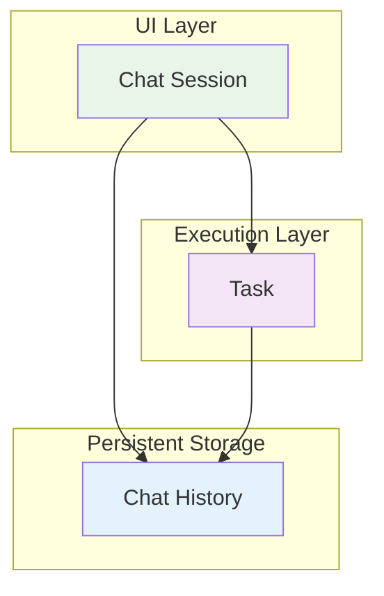

# Architectural Clarification: The Real Issues Behind the "Race Condition"

> **Engineering Fun Fact**: Sometimes the best way to solve a problem is to first understand what the problem actually is! 🔍

**Purpose:** Address fundamental architectural questions and clarify the real issues behind the API duplication problem.

## Table of Contents

- [Question 1: Why Call ClineRequest When Parent is Already Initialized?](#question-1-why-call-clinerequest-when-parent-is-already-initialized)
- [Question 2: Why Does Subtask Handler Initialize Parent?](#question-2-why-does-subtask-handler-initialize-parent)
- [Question 3: What's the Difference Between Task and Session?](#question-3-whats-the-difference-between-task-and-session)
- [Question 4: Is This Really a Race Condition?](#question-4-is-this-really-a-race-condition)
- [Question 5: Why Doesn't CompleteSubtask Continue Execution?](#question-5-why-doesnt-completesubtask-continue-execution)
- [The Real Architectural Problems](#the-real-architectural-problems)
- [Better Solutions](#better-solutions)

---

## Question 1: Why Call ClineRequest When Parent is Already Initialized?

### The Confusing Logic

You're absolutely right to question this. The current logic is:

```typescript
if (!parentTask.isPaused && parentTask.isInitialized) {
    await parentTask.recursivelyMakeClineRequests([], false)
}
```

**The Problem**: This condition passes in **both scenarios**:
- **Navigation scenario**: Parent gets initialized, then condition passes ✅
- **Active execution scenario**: Parent is already initialized, condition passes ❌

### Why This Happens

**The condition was designed for navigation scenarios only**, but it doesn't distinguish between:

1. **"Parent needs to be restarted"** (navigation scenario)
2. **"Parent is already running"** (active execution scenario)

### The Real Issue

**The condition is too broad**. It should be:

```typescript
// BETTER: Only restart if parent is not already executing
if (!parentTask.isPaused && parentTask.isInitialized && !parentTask.isExecuting) {
    await parentTask.recursivelyMakeClineRequests([], false)
}
```

**Or even better**: The subtask completion shouldn't be responsible for restarting the parent at all.

---

## Question 2: Why Does Subtask Handler Initialize Parent?

### The Architectural Problem

You're absolutely correct - **this is a design flaw**. The subtask handler shouldn't be responsible for initializing the parent.

### Current (Bad) Design

```typescript
// In ClineProvider.ts - subtask completion handler
private async continueParentTask(lastMessage: string): Promise<void> {
    const parentTask = this.getCurrentTask()
    if (parentTask) {
        // WHY IS THE SUBTASK HANDLER DOING THIS?
        if (!parentTask.isInitialized) {
            parentTask.clineMessages = await parentTask.getSavedClineMessages()
            parentTask.apiConversationHistory = await parentTask.getSavedApiConversationHistory()
            parentTask.isInitialized = true
        }
        // ... rest of logic
    }
}
```

### Why This is Wrong

1. **Separation of Concerns**: Subtask completion shouldn't manage parent initialization
2. **Single Responsibility**: Each component should have one clear responsibility
3. **Coupling**: This creates tight coupling between subtask and parent lifecycle
4. **Confusion**: It's unclear who's responsible for what

### Better Design

**Parent initialization should happen in the parent's own lifecycle**:

```typescript
// In Task.ts - parent task should handle its own initialization
class Task {
    async resumeFromNavigation(): Promise<void> {
        if (!this.isInitialized) {
            this.clineMessages = await this.getSavedClineMessages()
            this.apiConversationHistory = await this.getSavedApiConversationHistory()
            this.isInitialized = true
        }
        // Continue execution
        await this.recursivelyMakeClineRequests([], false)
    }
}

// In ClineProvider.ts - subtask completion is simple
async finishSubTask(lastMessage: string) {
    await this.removeClineFromStack()
    await this.getCurrentTask()?.completeSubtask(lastMessage)
    
    // Let the parent handle its own continuation
    const parentTask = this.getCurrentTask()
    if (parentTask && parentTask.needsResumeFromNavigation()) {
        await parentTask.resumeFromNavigation()
    }
}
```

---

## Question 3: What's the Difference Between Task and Session?

### Task vs Session Clarification

**Task**: An active execution context that processes work
- **Active**: Currently running and processing
- **Dynamic**: State changes during execution  
- **Temporary**: Exists only while running
- **Stateful**: Maintains execution state and context

**Session**: An active UI view that displays a chat history
- **UI Context**: What the user is currently viewing
- **Interactive**: Handles user input and displays responses
- **Temporary**: Exists only while the UI is open
- **Stateful**: Maintains UI state and user interaction context

### The Relationship



### Key Differences

| Aspect | Task | Session |
|--------|------|---------|
| **Purpose** | Execute work | Display UI |
| **Lifecycle** | Created → Running → Completed | Created → Active → Closed |
| **State** | Execution state (isPaused, isInitialized) | UI state (isActive, currentView) |
| **Persistence** | Temporary (in memory) | Temporary (UI only) |
| **Navigation** | Can be paused/resumed | Can be switched between |

### The Confusion

**The problem**: The current code mixes task and session concerns:
- Task initialization happens in session-level code
- Session navigation affects task execution
- Task state affects session behavior

**Better separation**: Tasks should manage their own execution, sessions should manage their own UI.

---

## Question 4: Is This Really a Race Condition?

### You're Absolutely Right - It's Not Really a Race Condition

**What it actually is**: **Duplicate API calls from the same execution path**

### True Race Condition vs Duplicate Calls

**True Race Condition**:
```typescript
// Two different threads/processes accessing shared state
Thread 1: if (counter === 0) counter++  // Reads 0, increments to 1
Thread 2: if (counter === 0) counter++  // Also reads 0, increments to 1
// Result: counter = 1 (should be 2)
```

**This Situation**:
```typescript
// Same execution path calling the same method twice
Main Loop: await parentTask.recursivelyMakeClineRequests([], false)  // Call 1
Subtask Completion: await parentTask.recursivelyMakeClineRequests([], false)  // Call 2
// Result: Two API calls instead of one
```

### Why It's Called a "Race Condition"

**Misleading terminology**: The documentation calls it a "race condition" because:
1. **Timing dependency**: The outcome depends on which call starts first
2. **Concurrent execution**: Both calls happen "at the same time"
3. **Unpredictable results**: Responses come back jumbled

**But it's really**: **Unintended duplicate execution** from poor architectural design.

### The Real Problem

**The issue isn't concurrency** - it's that **the same logical operation is being triggered twice**:

1. **Main task loop**: "Continue processing"
2. **Subtask completion**: "Continue processing" (unintended duplicate)

**Solution**: Ensure only one "continue processing" happens, not prevent concurrency.

---

## Question 5: Why Doesn't CompleteSubtask Continue Execution?

### The Design Philosophy

**`completeSubtask()` is intentionally simple** - it only adds the subtask result to the parent's conversation history.

```typescript
async completeSubtask(lastMessage: string) {
    // Just add the result to conversation
    this.clineMessages.push({
        role: 'assistant',
        content: lastMessage
    })
    // That's it - no execution continuation
}
```

### Why This Design Exists

**Separation of concerns**:
- **`completeSubtask()`**: Handle subtask result
- **Execution continuation**: Separate responsibility

**Flexibility**: Parent can decide whether/how to continue:
- Maybe parent wants to pause after subtask
- Maybe parent needs to process the result first
- Maybe parent has other logic to run

### The Problem

**In navigation scenarios**, the parent **doesn't know** it needs to continue execution because:
1. Parent was reconstructed from history
2. Parent's execution loop was interrupted
3. Parent is just sitting there waiting

**The missing piece**: Something needs to tell the parent "you should continue executing now."

### Better Design

**Option 1**: Make `completeSubtask()` smarter
```typescript
async completeSubtask(lastMessage: string, shouldContinue: boolean = false) {
    // Add result to conversation
    this.clineMessages.push({
        role: 'assistant', 
        content: lastMessage
    })
    
    // Continue execution if needed
    if (shouldContinue && !this.isExecuting) {
        await this.recursivelyMakeClineRequests([], false)
    }
}
```

**Option 2**: Separate continuation logic
```typescript
async completeSubtask(lastMessage: string) {
    // Just add result to conversation
    this.clineMessages.push({
        role: 'assistant',
        content: lastMessage
    })
}

async continueExecutionIfNeeded(): Promise<void> {
    if (!this.isExecuting && this.shouldContinueAfterSubtask()) {
        await this.recursivelyMakeClineRequests([], false)
    }
}
```

---

## The Real Architectural Problems

### 1. Mixed Responsibilities

**Current**: Subtask completion handles parent initialization, execution continuation, and state management.

**Better**: Each component handles its own responsibilities.

### 2. Unclear Lifecycle Management

**Current**: Unclear when tasks should continue execution vs pause.

**Better**: Clear state machine with explicit transitions.

### 3. Tight Coupling

**Current**: Subtask completion is tightly coupled to parent execution.

**Better**: Loose coupling with clear interfaces.

### 4. Misleading Terminology

**Current**: Called "race condition" when it's really "duplicate execution."

**Better**: Accurate terminology that describes the real problem.

---

## Better Solutions

### Solution 1: Clear State Machine

```typescript
enum TaskExecutionState {
    RUNNING = "running",
    PAUSED_FOR_SUBTASK = "paused_for_subtask", 
    WAITING_FOR_RESUME = "waiting_for_resume",
    COMPLETED = "completed"
}

class Task {
    private executionState: TaskExecutionState = TaskExecutionState.RUNNING
    
    async completeSubtask(lastMessage: string) {
        // Add result to conversation
        this.clineMessages.push({
            role: 'assistant',
            content: lastMessage
        })
        
        // Determine next state
        if (this.executionState === TaskExecutionState.PAUSED_FOR_SUBTASK) {
            this.executionState = TaskExecutionState.WAITING_FOR_RESUME
            await this.resumeExecution()
        }
    }
    
    async resumeExecution() {
        if (this.executionState === TaskExecutionState.WAITING_FOR_RESUME) {
            this.executionState = TaskExecutionState.RUNNING
            await this.recursivelyMakeClineRequests([], false)
        }
    }
}
```

### Solution 2: Event-Driven Architecture

```typescript
class Task {
    private eventEmitter = new EventEmitter()
    
    constructor() {
        this.eventEmitter.on('subtaskCompleted', this.handleSubtaskCompletion.bind(this))
    }
    
    async completeSubtask(lastMessage: string) {
        // Add result to conversation
        this.clineMessages.push({
            role: 'assistant',
            content: lastMessage
        })
        
        // Emit event for continuation logic
        this.eventEmitter.emit('subtaskCompleted', { lastMessage })
    }
    
    private async handleSubtaskCompletion(data: { lastMessage: string }) {
        if (this.shouldContinueAfterSubtask()) {
            await this.recursivelyMakeClineRequests([], false)
        }
    }
}
```

### Solution 3: Explicit Continuation

```typescript
class Task {
    async completeSubtask(lastMessage: string) {
        // Just add result to conversation
        this.clineMessages.push({
            role: 'assistant',
            content: lastMessage
        })
    }
    
    async continueAfterSubtask(): Promise<void> {
        if (!this.isExecuting) {
            await this.recursivelyMakeClineRequests([], false)
        }
    }
}

// In ClineProvider.ts
async finishSubTask(lastMessage: string) {
    await this.removeClineFromStack()
    await this.getCurrentTask()?.completeSubtask(lastMessage)
    
    // Explicit continuation - no magic
    const parentTask = this.getCurrentTask()
    if (parentTask && parentTask.needsContinuationAfterSubtask()) {
        await parentTask.continueAfterSubtask()
    }
}
```

---

## Summary

### The Real Issues

1. **Not a race condition** - it's duplicate execution from poor design
2. **Mixed responsibilities** - subtask completion shouldn't manage parent lifecycle  
3. **Unclear state management** - when should tasks continue vs pause?
4. **Tight coupling** - components are too interdependent
5. **Misleading terminology** - calling it a "race condition" obscures the real problem

### The Real Solution

**Fix the architecture**, not just add synchronization:

1. **Clear separation of concerns** - each component handles its own responsibilities
2. **Explicit state management** - clear when tasks should continue execution
3. **Loose coupling** - components communicate through clear interfaces
4. **Accurate terminology** - call it "duplicate execution" not "race condition"

The current "race condition" is really a symptom of deeper architectural issues that need to be addressed at the design level, not just patched with synchronization.

---

**Navigation**: [← Back to Race Condition Home](README.md) · [↑ Table of Contents](#architectural-clarification-the-real-issues-behind-the-race-condition)
