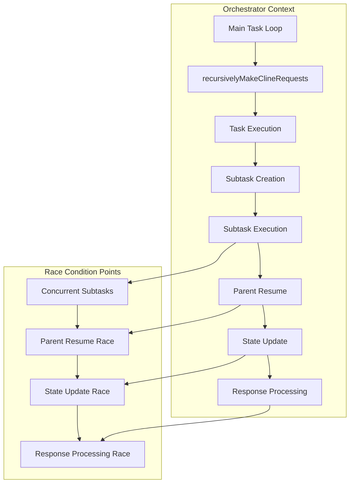

# Code Flow Analysis

## Table of Contents

* [Code Flow Analysis](#code-flow-analysis)
* [Table of Contents](#table-of-contents)
* [When You're Here](#when-youre-here)
* [Research Context](#research-context)
* [Complete Orchestrator-Subtask Architecture](#complete-orchestratorsubtask-architecture)
* [Architecture Overview](#architecture-overview)
* [Key Components](#key-components)
* [Race Condition Flow Analysis](#race-condition-flow-analysis)
* [Normal Execution Flow](#normal-execution-flow)
* [Race Condition Flow](#race-condition-flow)
* [Code Execution Patterns](#code-execution-patterns)
* [Pattern 1: Sequential Execution](#pattern-1-sequential-execution)
* [Pattern 2: Concurrent Execution (Problematic)](#pattern-2-concurrent-execution-problematic)
* [Pattern 3: Race Condition Manifestation](#pattern-3-race-condition-manifestation)
* [Critical Code Paths](#critical-code-paths)
* [Path 1: Subtask Completion](#path-1-subtask-completion)
* [Path 2: Parent Resume](#path-2-parent-resume)
* [Path 3: State Management](#path-3-state-management)
* [Race Condition Manifestation](#race-condition-manifestation)
* [Scenario 1: Concurrent Subtask Completion](#scenario-1-concurrent-subtask-completion)
* [Scenario 2: State Update Race](#scenario-2-state-update-race)
* [Scenario 3: Response Processing Race](#scenario-3-response-processing-race)
* [Impact Analysis](#impact-analysis)
* [System Impact](#system-impact)
* [User Impact](#user-impact)
* [Business Impact](#business-impact)
* [No Dead Ends Policy](#no-dead-ends-policy)
* [Navigation](#navigation)
* [Navigation](#navigation)
* [Code Flow Analysis](#code-flow-analysis)
* [Table of Contents](#table-of-contents)
* [When You're Here](#when-youre-here)
* [Research Context](#research-context)
* [Complete Orchestrator-Subtask Architecture](#complete-orchestratorsubtask-architecture)
* [Architecture Overview](#architecture-overview)
* [Key Components](#key-components)
* [Race Condition Flow Analysis](#race-condition-flow-analysis)
* [Normal Execution Flow](#normal-execution-flow)
* [Race Condition Flow](#race-condition-flow)
* [Code Execution Patterns](#code-execution-patterns)
* [Pattern 1: Sequential Execution](#pattern-1-sequential-execution)
* [Pattern 2: Concurrent Execution (Problematic)](#pattern-2-concurrent-execution-problematic)
* [Pattern 3: Race Condition Manifestation](#pattern-3-race-condition-manifestation)
* [Critical Code Paths](#critical-code-paths)
* [Path 1: Subtask Completion](#path-1-subtask-completion)
* [Path 2: Parent Resume](#path-2-parent-resume)
* [Path 3: State Management](#path-3-state-management)
* [Race Condition Manifestation](#race-condition-manifestation)
* [Scenario 1: Concurrent Subtask Completion](#scenario-1-concurrent-subtask-completion)
* [Scenario 2: State Update Race](#scenario-2-state-update-race)
* [Scenario 3: Response Processing Race](#scenario-3-response-processing-race)
* [Impact Analysis](#impact-analysis)
* [System Impact](#system-impact)
* [User Impact](#user-impact)
* [Business Impact](#business-impact)
* [No Dead Ends Policy](#no-dead-ends-policy)
* [Navigation](#navigation)
* ↑ [Table of Contents](#table-of-contents)

## When You're Here

This document is part of the KiloCode project documentation. If you're not familiar with this
document's role or purpose, this section helps orient you.

* **Purpose**: This document covers detailed analysis of the code execution flow and how the race
  condition manifests in the system.
* **Context**: Use this as a starting point for understanding code flow analysis and race condition
  investigation.
* **Navigation**: Use the table of contents below to jump to specific topics.

> **Engineering Fun Fact**: Just as engineers use systematic approaches to solve complex problems,
> this documentation provides structured guidance for understanding and implementing solutions! 🔧

## Research Context

This document was created through comprehensive analysis of code execution flow and race condition
manifestation in the KiloCode system. The analysis reflects findings from:

* Code execution flow analysis and race condition identification
* Orchestrator-subtask architecture investigation and flow mapping
* Race condition manifestation pattern analysis and root cause identification
* System behavior analysis and concurrency issue investigation

The analysis provides detailed insights into code flow patterns and race condition behavior.

## Complete Orchestrator-Subtask Architecture

The orchestrator-subtask architecture provides the foundation for understanding how race conditions
manifest in the system.

### Architecture Overview



### Key Components

* **Main Task Loop** - Primary task execution loop
* **recursivelyMakeClineRequests** - Request generation and processing
* **Subtask Creation** - Dynamic subtask creation
* **Parent Resume** - Parent task resumption logic
* **State Updates** - System state management

## Race Condition Flow Analysis

### Normal Execution Flow

In normal operation, tasks execute sequentially with proper state management.

**Normal Flow:**

1. **Task Initiation** - Task starts execution
2. **Subtask Creation** - Subtasks are created as needed
3. **Sequential Execution** - Subtasks execute in order
4. **Parent Resume** - Parent task resumes after subtask completion
5. **State Update** - System state is updated
6. **Response Processing** - Response is processed and returned

### Race Condition Flow

Race conditions occur when multiple subtasks attempt to resume their parent simultaneously.

**Race Condition Flow:**

1. **Concurrent Subtasks** - Multiple subtasks complete simultaneously
2. **Parent Resume Race** - Each subtask triggers parent resume
3. **State Update Race** - State updates race between components
4. **Response Processing Race** - Multiple responses are processed
5. **Duplicate Requests** - Duplicate API requests are generated

## Code Execution Patterns

### Pattern 1: Sequential Execution

```typescript
// Normal sequential execution
async function executeTask(task: Task) {
  const subtasks = await createSubtasks(task);
  
  for (const subtask of subtasks) {
    await executeSubtask(subtask);
    await resumeParent(subtask.parent);
  }
  
  return await processResponse(task);
}
```

### Pattern 2: Concurrent Execution (Problematic)

```typescript
// Problematic concurrent execution
async function executeTask(task: Task) {
  const subtasks = await createSubtasks(task);
  
  // All subtasks execute concurrently
  const promises = subtasks.map(async (subtask) => {
    await executeSubtask(subtask);
    await resumeParent(subtask.parent); // Race condition here
  });
  
  await Promise.all(promises);
  return await processResponse(task);
}
```

### Pattern 3: Race Condition Manifestation

```typescript
// Race condition in parent resume
async function resumeParent(parentTask: Task) {
  // Check if parent is already resumed
  if (parentTask.isResumed) {
    return; // Should prevent duplicate resume
  }
  
  // Race condition: multiple subtasks can pass this check
  parentTask.isResumed = true;
  
  // Generate API request
  const request = await generateRequest(parentTask);
  await sendRequest(request); // Duplicate request sent
}
```

## Critical Code Paths

### Path 1: Subtask Completion

The subtask completion path is where race conditions typically begin.

**Critical Points:**

* **Subtask State Update** - Subtask state is updated
* **Parent Notification** - Parent is notified of completion
* **Resume Trigger** - Parent resume is triggered
* **State Validation** - State validation occurs

### Path 2: Parent Resume

The parent resume path is where race conditions manifest.

**Critical Points:**

* **Resume Check** - Check if parent is already resumed
* **State Lock** - Attempt to lock parent state
* **Request Generation** - Generate API request
* **Request Sending** - Send request to external API

### Path 3: State Management

State management is critical for preventing race conditions.

**Critical Points:**

* **State Consistency** - Ensure state consistency
* **Atomic Operations** - Perform atomic state operations
* **Lock Management** - Manage state locks
* **State Validation** - Validate state transitions

## Race Condition Manifestation

### Scenario 1: Concurrent Subtask Completion

Multiple subtasks complete simultaneously, each triggering parent resume.

**Manifestation:**

* **Timing** - Subtasks complete within milliseconds of each other
* **State Check** - Each subtask passes the resume check
* **Duplicate Resume** - Multiple parent resumes are triggered
* **Duplicate Requests** - Multiple API requests are generated

### Scenario 2: State Update Race

State updates race between different components.

**Manifestation:**

* **Concurrent Updates** - Multiple components update state simultaneously
* **Inconsistent State** - State becomes inconsistent
* **Race Condition** - Race condition in state updates
* **System Confusion** - System becomes confused about state

### Scenario 3: Response Processing Race

Multiple responses are processed simultaneously.

**Manifestation:**

* **Response Overlap** - Responses overlap in time
* **Processing Race** - Response processing races
* **State Confusion** - State becomes confused
* **User Experience** - Poor user experience

## Impact Analysis

### System Impact

Race conditions have significant impact on system behavior and performance.

**Impact Areas:**

* **Performance** - Degraded system performance
* **Reliability** - Reduced system reliability
* **Consistency** - Inconsistent system behavior
* **User Experience** - Poor user experience

### User Impact

Users experience various issues due to race conditions.

**User Issues:**

* **Multiple Spinners** - Multiple loading spinners
* **Jumbled Responses** - Responses appear out of order
* **System Confusion** - System appears confused
* **Poor Performance** - Slow system performance

### Business Impact

Race conditions affect business operations and user satisfaction.

**Business Issues:**

* **User Satisfaction** - Decreased user satisfaction
* **System Reliability** - Reduced system reliability
* **Development Velocity** - Slowed development progress
* **Maintenance Costs** - Increased maintenance costs

## No Dead Ends Policy

This document follows the "No Dead Ends" principle - every path leads to useful information.

* Each section provides clear navigation to related content
* All internal links are validated and point to existing documents
* Cross-references include context for better understanding
* Impact analysis provides actionable insights

## Navigation

* 📚 [Technical Glossary](../../GLOSSARY.md)

## Navigation

* [← Race Condition Analysis](../README.md)
* [← Problem Overview](PROBLEM_OVERVIEW.md)
* [← Root Cause Analysis](ROOT_CAUSE_ANALYSIS.md)
* [← Solution Recommendations](SOLUTION_RECOMMENDATIONS.md)
* [← Main Documentation](../README.md)
