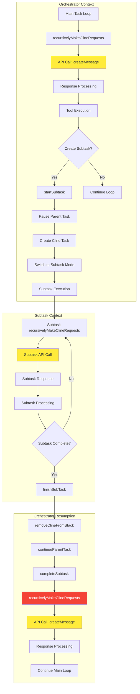
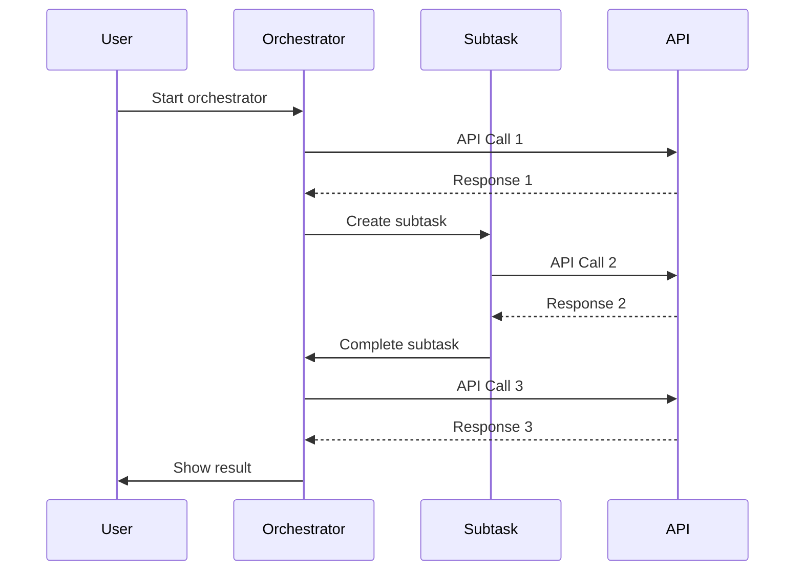
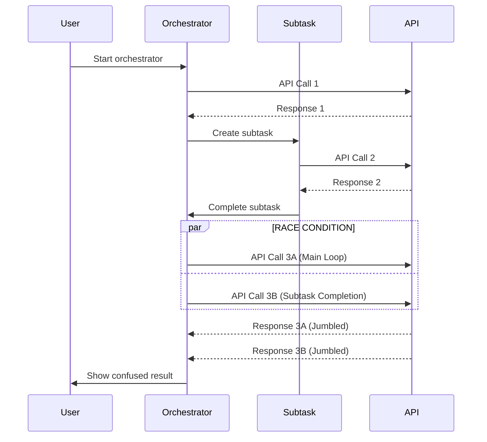
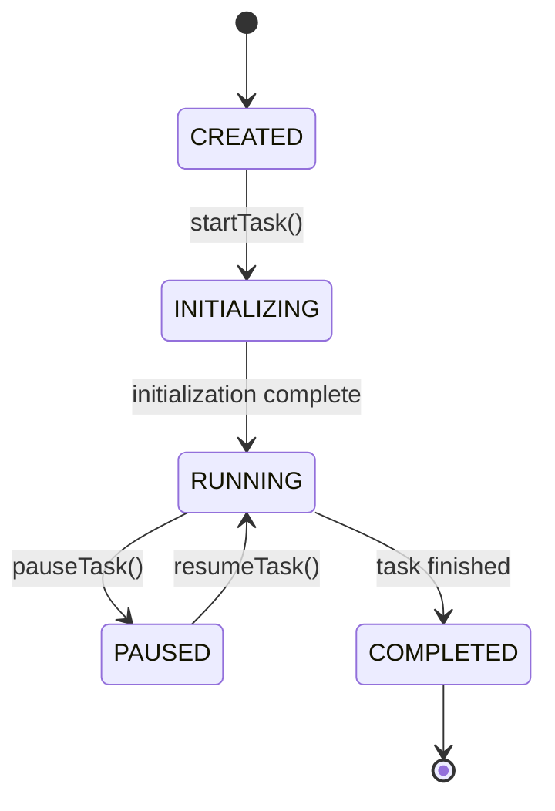
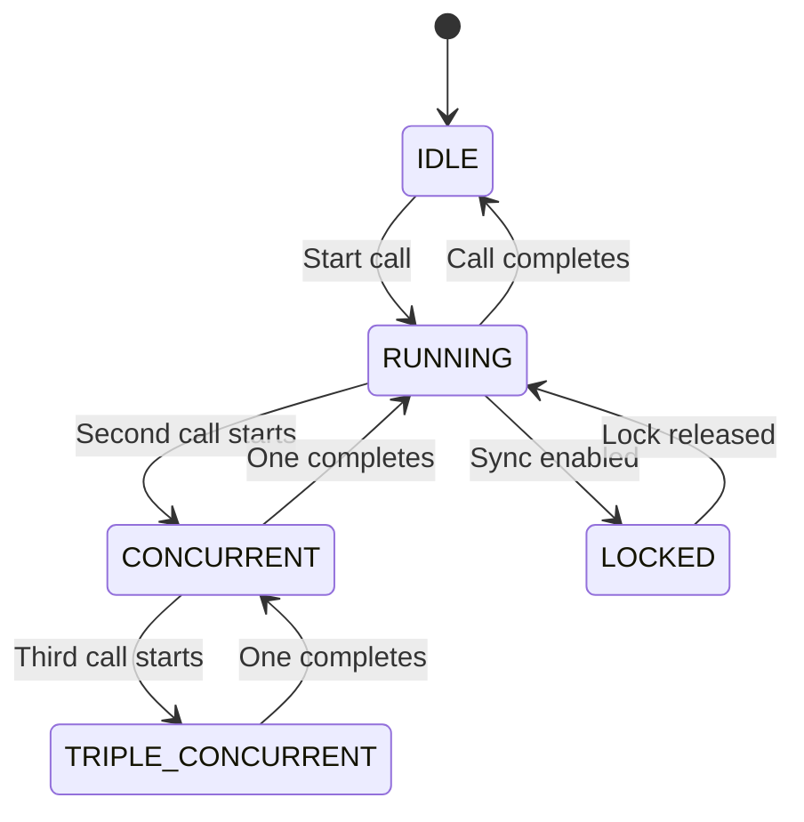
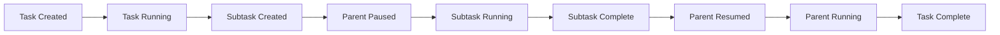

# Code Flow Analysis

**Purpose:** Detailed analysis of the code execution flow and how the race condition manifests in the system.

> **Dinosaur Fun Fact**: Architecture documentation is like a dinosaur fossil record - each layer tells us about the evolution of our system, helping us understand how it grew and changed over time! 🦕

## Complete Orchestrator-Subtask Architecture



## Detailed Execution Flow

### Phase 1: Orchestrator Initialization

```typescript
// 1. User starts orchestrator task
const orchestrator = await provider.createTask("Create a web app", undefined, undefined)

// 2. Orchestrator begins main execution loop
await orchestrator.recursivelyMakeClineRequests([], false)

// 3. Main loop processes user input
const nextUserContent = await this.processQueuedMessages()
```

### Phase 2: Subtask Creation

```typescript
// 4. Orchestrator decides to create subtask
const subtask = await this.startSubtask(message, initialTodos, mode)

// 5. Parent task is paused
this.isPaused = true
this.childTaskId = newTask.taskId

// 6. Subtask begins execution
await subtask.recursivelyMakeClineRequests([], false)
```

### Phase 3: Subtask Execution

```typescript
// 7. Subtask processes its work
const subtaskResult = await subtask.recursivelyMakeClineRequests([], false)

// 8. Subtask completes its work
// (Multiple iterations of step 7 may occur)
```

### Phase 4: Subtask Completion (RACE CONDITION POINT)

```typescript
// 9. Subtask calls finishSubTask
await this.finishSubTask(lastMessage)

// 10. Remove subtask from stack
await this.removeClineFromStack()

// 11. Continue parent task (RACE CONDITION!)
await this.continueParentTask(lastMessage)
```

### Phase 5: Parent Task Resumption (RACE CONDITION POINT)

```typescript
// 12. Parent task completes subtask
await parentTask.completeSubtask(lastMessage)

// 13. Parent task continues execution (RACE CONDITION!)
if (!parentTask.isPaused && parentTask.isInitialized) {
	await parentTask.recursivelyMakeClineRequests([], false)
}
```

## Race Condition Timeline

### Normal Execution (No Race)



### Race Condition Execution



## Critical Code Locations

### 1. Main Task Loop Entry Point

**File**: `src/core/task/Task.ts:1760`

```typescript
// Main task execution loop
const didEndLoop = await this.recursivelyMakeClineRequests(nextUserContent, includeFileDetails)
```

**Context**: This is where the main orchestrator task continues its execution loop.

### 2. Subtask Completion Entry Point

**File**: `src/core/webview/ClineProvider.ts:1587`

```typescript
// Subtask completion handling
await parentTask.recursivelyMakeClineRequests([], false)
```

**Context**: This is where the subtask completion triggers parent task continuation.

### 3. API Call Location

**File**: `src/core/task/Task.ts:2984`

```typescript
// Where the actual API call happens
return this.api.createMessage(systemPrompt, cleanConversationHistory, metadata)
```

**Context**: This is where both execution paths ultimately make their API calls.

## State Transitions

### Task State Machine



### Recursive Call State Machine



## Data Flow Analysis

### Message Flow

```mermaid
graph LR
    A[User Input] --> B[Message Queue]
    B --> C[Main Task Loop]
    C --> D[API Call]
    D --> E[Response]
    E --> F[Tool Execution]
    F --> G[Subtask Creation]
    G --> H[Subtask Execution]
    H --> I[Subtask Completion]
    I --> J[Parent Continuation]
    J --> K[API Call]
    K --> L[Response]
    L --> M[User Output]
```



### State Flow



## Synchronization Points

### Current Synchronization

**None**: The system currently has no synchronization mechanism to prevent concurrent calls.

### Required Synchronization

**Lock-based**: Need a mechanism to ensure only one `recursivelyMakeClineRequests` call executes at a time.

```typescript
// Proposed synchronization
private recursiveCallLock = new AsyncLock()

async recursivelyMakeClineRequests(...) {
    return await this.recursiveCallLock.acquire(async () => {
        // Original implementation
    })
}
```

## Error Scenarios

### Scenario 1: 2-Request Race Condition

1. Main loop starts API call
2. Subtask completion starts API call
3. Both calls complete
4. Responses get jumbled
5. UI shows confused state

### Scenario 2: 3-Request Race Condition

1. Subtask incorrectly completes with green text
2. User sends new request
3. Three API calls start simultaneously
4. Severe corruption occurs
5. Chat history becomes permanently damaged

## Next Steps

1. **Understand the Navigation Scenario**: See [NAVIGATION_SCENARIO.md](NAVIGATION_SCENARIO.md)
2. **Explore the Impact**: See [IMPACT_ASSESSMENT.md](IMPACT_ASSESSMENT.md)
3. **Find the Solution**: See [SOLUTION_RECOMMENDATIONS.md](SOLUTION_RECOMMENDATIONS.md)

## 🧭 Navigation Footer

- [← Back to Race Condition Home](README.md)
- [→ Navigation Scenario](NAVIGATION_SCENARIO.md)
- [↑ Table of Contents](README.md)
