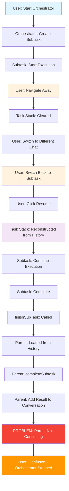
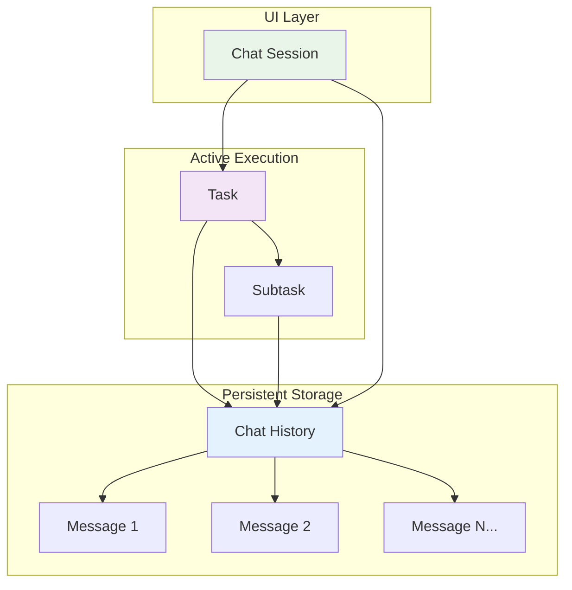

# Navigation Scenario Analysis
## Table of Contents

- [Navigation Scenario Analysis](#navigation-scenario-analysis)
  - [Table of Contents](#table-of-contents)
  - [When You're Here](#when-youre-here)
  - [Why This Change Was Made](#why-this-change-was-made)
  - [Research Context](#research-context)
    - [The Original Problem](#the-original-problem)
    - [The Navigation State Loss Problem](#the-navigation-state-loss-problem)
    - [The Specific Code Problem](#the-specific-code-problem)
  - [The Navigation Flow Diagram](#the-navigation-flow-diagram)
  - [The Solution Approach](#the-solution-approach)
    - [The Unintended Consequence](#the-unintended-consequence)
    - [The Complete Solution](#the-complete-solution)
  - [Why the Stack Differs Based on Navigation Path](#why-the-stack-differs-based-on-navigation-path)
    - [Path 1: Active Execution (Normal Flow)](#path-1-active-execution-normal-flow)
    - [Path 2: Navigation Return (Reconstruction Flow)](#path-2-navigation-return-reconstruction-flow)
  - [Chat History vs. Task vs. Chat Session](#chat-history-vs-task-vs-chat-session)
    - [Chat History (Persistent Data)](#chat-history-persistent-data)
    - [Task (Active Execution Context)](#task-active-execution-context)
    - [Chat Session (Active UI View)](#chat-session-active-ui-view)
    - [Relationship Diagram](#relationship-diagram)
  - [Session Inactivity and Task Completion](#session-inactivity-and-task-completion)
    - [What Counts as a Session Being Inactive?](#what-counts-as-a-session-being-inactive)
    - [What Counts as a Completed Task?](#what-counts-as-a-completed-task)
  - [Next Steps](#next-steps)
  - [🧭 Navigation Footer](#-navigation-footer)
  - [No Dead Ends Policy](#no-dead-ends-policy)
  - [Navigation](#navigation)

## When You're Here

This document provides \[purpose of document].

- **Purpose**: \[Brief description of what this document covers]
- **Context**: \[How this fits into the broader system/project]
- **Navigation**: Use the table of contents below to jump to specific topics

> **System Fun Fact**: Every complex system is just a collection of simple parts working together -
> documentation helps us understand how! ⚙️

- *Purpose:*\* Detailed analysis of why the problematic change was made and the navigation scenario
  it
  was designed to solve.

> **Dinosaur Fun Fact**: Architecture documentation is like a dinosaur fossil record - each layer
> tells us about the evolution of our system, helping us understand how it grew and changed over
> time! 🦕

## Why This Change Was Made

## Research Context

- *Purpose:*\* \[Describe the purpose and scope of this document]

- *Background:*\* \[Provide relevant background information]

- *Research Questions:*\* \[List key questions this document addresses]

- *Methodology:*\* \[Describe the approach or methodology used]

- *Findings:*\* \[Summarize key findings or conclusions]
- \*\*

### The Original Problem

The commit message reveals the intended purpose: **"fix children task loading to continue the
execution of the parent after finished"**

- *Critical Navigation Scenario Being Solved:*\*

The fix was specifically needed for a complex user workflow where task state could be lost during
navigation:
1. **Orchestrator creates subtask** → **Subtask starts executing**
2. **User navigates away** by switching to a different chat/task
3. **User switches back** to the subtask and clicks "Resume"
4. **Subtask completes** → **Problem**: Parent orchestrator reference is lost
5. **Result**: Subtask finishes but orchestrator doesn't continue execution

### The Navigation State Loss Problem

- *Root Issue*\*: When users navigate away from a running subtask and then return, the task stack
  reconstruction process was incomplete, causing the parent orchestrator to lose its execution
  context.

- *Technical Details:*\*

- **Task Stack**: The orchestrator maintains a stack of active tasks

- **Navigation**: Switching chats clears the current task stack

- **Resume**: Clicking "Resume" on a subtask reconstructs the stack from history

- **Missing Link**: The reconstructed parent task wasn't properly connected to continue execution

- *User Experience Impact:*\*

- **Lost Progress**: Orchestrator stops mid-workflow

- **Confusing State**: User expects orchestrator to continue after subtask

- **Manual Intervention**: User has to manually restart the orchestrator

- **Broken Workflow**: Complex multi-step processes get interrupted

### The Specific Code Problem

- *Before the Fix*\* (`finishSubTask` method):

```typescript
async finishSubTask(lastMessage: string) {
    await this.removeClineFromStack()
    // This only added the result to conversation - didn't continue execution
    await this.getCurrentTask()?.completeSubtask(lastMessage)
}
```

- *The Issue*\*: After task stack reconstruction from navigation, the parent orchestrator task was:
1. **Properly loaded** from history with correct conversation state
2. **Properly initialized** with saved messages and API conversation
3. **NOT continuing execution** - it was just sitting there waiting

- *The Missing Piece*\*: The orchestrator needed to be told to continue its execution loop after the
  subtask completed, especially when loaded from a navigation scenario.

## The Navigation Flow Diagram



## The Solution Approach

- *The Fix*\*: Add logic to continue parent execution after subtask completion, especially for
  navigation scenarios:

```typescript
private async continueParentTask(lastMessage: string): Promise<void> {
    const parentTask = this.getCurrentTask()
    if (parentTask) {
        // Initialize parent task if needed (crucial for navigation scenarios)
        if (!parentTask.isInitialized) {
            parentTask.clineMessages = await parentTask.getSavedClineMessages()
            parentTask.apiConversationHistory = await parentTask.getSavedApiConversationHistory()
            parentTask.isInitialized = true
        }

        // Complete the subtask (add result to conversation)
        await parentTask.completeSubtask(lastMessage)

        // CRITICAL: Continue parent execution (this was missing before)
        if (!parentTask.isPaused && parentTask.isInitialized) {
            const continueExecution = async () => {
                await parentTask.recursivelyMakeClineRequests([], false)
            }
            continueExecution() // Start in background
        }
    }
}
```

- *Why This Was Necessary:*\*
1. **Navigation Recovery**: Ensures orchestrator continues after user navigates away and back
2. **State Reconstruction**: Properly initializes parent task from saved history
3. **Execution Continuation**: Tells the orchestrator to continue its workflow
4. **User Experience**: Maintains the expected behavior of continuous execution

### The Unintended Consequence

- *The Problem*\*: The fix was designed for **navigation scenarios** but also affects **active
  execution scenarios**:

- **Navigation Scenario**: User navigates away and back (intended use case)

- **Active Execution Scenario**: User stays in chat during subtask execution (unintended side
  effect)

- *The Race Condition*\*: In active execution, both the main task loop and subtask completion can
  call
  `recursivelyMakeClineRequests` simultaneously, causing the API duplication issue.

- *The Challenge*\*: The fix is necessary for navigation scenarios but causes problems in active
  execution scenarios.

### The Complete Solution

- *What's Needed*\*: A solution that:
1. **Preserves the navigation fix** - orchestrator continues after navigation
2. **Prevents the race condition** - no concurrent API calls in active execution
3. **Maintains user experience** - seamless workflow in both scenarios

- *The Answer*\*: Synchronization mechanism that ensures only one `recursivelyMakeClineRequests`
  call
  executes at a time, regardless of the scenario.

## Why the Stack Differs Based on Navigation Path

- *The Core Issue*\*: The task stack state depends entirely on **how you arrived** at viewing a
  given
  task, not just which task you're viewing.

### Path 1: Active Execution (Normal Flow)

- *How you get there*\*: Start orchestrator → Create subtask → Stay in chat

- *Stack State*\*:

- **Parent Task**: Active in memory, running execution loop

- **Child Task**: Active in memory, running execution loop

- **Parent Reference**: Direct reference, no reconstruction needed

- **Execution Context**: Fully initialized and running

- *Code Flow*\*:

```typescript
// Parent task is actively running
const parentTask = this.getCurrentTask() // Direct reference
await parentTask.completeSubtask(lastMessage) // Add result
// Parent continues execution naturally
```

### Path 2: Navigation Return (Reconstruction Flow)

- *How you get there*\*: Start orchestrator → Create subtask → Navigate away → Return → Click Resume

- *Stack State*\*:

- **Parent Task**: Reconstructed from history, not actively running

- **Child Task**: Reconstructed from history, not actively running

- **Parent Reference**: Reconstructed reference, needs initialization

- **Execution Context**: Needs to be restarted

- *Code Flow*\*:

```typescript
// Parent task needs to be restarted
const parentTask = this.getCurrentTask() // Reconstructed reference
if (!parentTask.isInitialized) {
	// Initialize from saved state
	parentTask.clineMessages = await parentTask.getSavedClineMessages()
	parentTask.apiConversationHistory = await parentTask.getSavedApiConversationHistory()
	parentTask.isInitialized = true
}
await parentTask.completeSubtask(lastMessage) // Add result
// Parent needs explicit restart
await parentTask.recursivelyMakeClineRequests([], false)
```

## Chat History vs. Task vs. Chat Session

### Chat History (Persistent Data)

- *Definition*\*: The persistent record of all messages in a conversation, stored in the database.

- *Characteristics*\*:

- **Persistent**: Survives restarts, navigation, and system reboots

- **Static**: Just data, no execution context

- **Immutable**: Messages don't change once created

- **Searchable**: Can be queried and filtered

- *Data Model*\*:

```typescript
interface ChatHistory {
	id: string // Unique identifier
	title: string // Human-readable title
	createdAt: Date // Creation timestamp
	updatedAt: Date // Last modification timestamp
	messages: Message[] // Array of all messages
	metadata: ChatMetadata // Additional metadata
}
```

### Task (Active Execution Context)

- *Definition*\*: An active execution context that processes chat history and performs work.

- *Characteristics*\*:

- **Active**: Currently running and processing

- **Dynamic**: State changes during execution

- **Temporary**: Exists only while running

- **Stateful**: Maintains execution state and context

- *Data Model*\*:

```typescript
interface Task {
	taskId: string // Unique identifier
	isInitialized: boolean // Whether task is ready to run
	isPaused: boolean // Whether task is paused
	clineMessages: ClineMessage[] // Current message state
	apiConversationHistory: ApiMessage[] // API conversation state
	childTaskId?: string // Reference to child task
	// ... other execution state
}
```

### Chat Session (Active UI View)

- *Definition*\*: The active UI view that displays a chat history and manages user interaction.

- *Characteristics*\*:

- **UI Context**: What the user is currently viewing

- **Interactive**: Handles user input and displays responses

- **Temporary**: Exists only while the UI is open

- **Stateful**: Maintains UI state and user interaction context

- *Data Model*\*:

```typescript
interface ChatSession {
	sessionId: string // Unique identifier
	chatHistoryId: string // Reference to chat history
	currentTaskId?: string // Currently active task
	isActive: boolean // Whether session is active
	lastActivity: Date // Last user interaction
	// ... other UI state
}
```

### Relationship Diagram



## Session Inactivity and Task Completion

### What Counts as a Session Being Inactive?

A chat session is considered inactive when:
1. **No Active Task**: No task is currently running or paused
2. **Task Completed**: The current task has finished successfully
3. **User Ended**: User explicitly ended the session
4. **Timeout**: Session has been idle for too long
5. **Memory Pressure**: System needs to free up resources

- *Code Example*\*:

```typescript
interface SessionState {
	isActive: boolean
	hasActiveTask: boolean
	lastActivity: Date
	timeoutThreshold: number
}

function isSessionInactive(session: SessionState): boolean {
	if (!session.isActive) return true
	if (!session.hasActiveTask) return true
	if (session.currentTask?.isCompleted) return true
	if (Date.now() - session.lastActivity.getTime() > session.timeoutThreshold) return true
	return false
}
```

### What Counts as a Completed Task?

A task is considered completed when:
1. **Natural End**: Task finished its intended work
2. **Fatal Error**: Task encountered an unrecoverable error
3. **User End**: User explicitly stopped the task
4. **Timeout**: Task exceeded its time limit
5. **System Abort**: System terminated the task

- *Code Example*\*:

```typescript
enum TaskStatus {
	CREATED = "created",
	INITIALIZING = "initializing",
	RUNNING = "running",
	PAUSED = "paused",
	COMPLETED = "completed", // Natural completion
	FAILED = "failed", // Fatal error
	TIMEOUT = "timeout", // Time limit exceeded
	ABORTED = "aborted", // System abort
	CANCELLED = "cancelled", // User cancellation
	DESTROYED = "destroyed", // Cleanup
}

function isTaskCompleted(task: Task): boolean {
	return [
		TaskStatus.COMPLETED,
		TaskStatus.FAILED,
		TaskStatus.TIMEOUT,
		TaskStatus.ABORTED,
		TaskStatus.CANCELLED,
	].includes(task.status)
}
```

## Next Steps
1. **Understand the Impact**: See [IMPACT\_ASSESSMENT.md](IMPACT_ASSESSMENT.md)
2. **Explore the Solution**: See [SOLUTION\_RECOMMENDATIONS.md](SOLUTION_RECOMMENDATIONS.md)
3. **Plan the Testing**: See [TESTING\_STRATEGY.md](TESTING_STRATEGY.md)

## 🧭 Navigation Footer
- [← Back to Race Condition Home](README.md)
- [→ Impact Assessment](IMPACT_ASSESSMENT.md)
- [↑ Table of Contents](README.md)

## No Dead Ends Policy

This document follows the "No Dead Ends" principle - every path leads to useful information.
- Each section provides clear navigation to related content
- All internal links are validated and point to existing documents
- Cross-references include context for better understanding


## Navigation

- 📚 [Technical Glossary](../GLOSSARY.md)

## Navigation
- [← Architecture Overview](../README.md)
- [← Race Condition Analysis](README.md)
- [← Root Cause Analysis](ROOT_CAUSE_ANALYSIS.md)
- [← Code Flow Analysis](CODE_FLOW_ANALYSIS.md)
- [← Solution Recommendations](SOLUTION_RECOMMENDATIONS.md)
- [← Testing Strategy](TESTING_STRATEGY.md)
- [← Main Documentation](../README.md)
- [← Project Root](../README.md)
