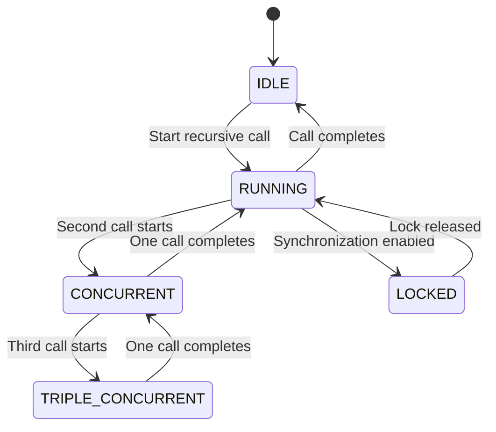

# Root Cause Analysis
## Table of Contents

- [Root Cause Analysis](#root-cause-analysis)
  - [Table of Contents](#table-of-contents)
  - [When You're Here](#when-youre-here)
  - [The Problematic Change](#the-problematic-change)
  - [Research Context](#research-context)
    - [Before the Change](#before-the-change)
    - [After the Change](#after-the-change)
  - [The Race Condition](#the-race-condition)
    - [Two Execution Paths](#two-execution-paths)
      - [Path 1: Main Task Loop](#path-1-main-task-loop)
      - [Path 2: Subtask Completion](#path-2-subtask-completion)
    - [The Timing Problem](#the-timing-problem)
    - [Why This Happens](#why-this-happens)
  - [Code Analysis](#code-analysis)
    - [Critical Code Locations](#critical-code-locations)
      - [1. Main Task Loop (](#1-main-task-loop-)
      - [2. Subtask Completion (](#2-subtask-completion-)
      - [3. API Call Location (](#3-api-call-location-)
    - [The API Call Chain](#the-api-call-chain)
  - [State Machine Analysis](#state-machine-analysis)
    - [Recursive Call States](#recursive-call-states)
    - [State Transitions](#state-transitions)
  - [Why the Fix Was Necessary](#why-the-fix-was-necessary)
    - [The Original Problem](#the-original-problem)
    - [The Navigation State Loss](#the-navigation-state-loss)
    - [The Solution Trade-off](#the-solution-tradeoff)
  - [Impact Analysis](#impact-analysis)
    - [Severity Levels](#severity-levels)
      - [Level 1: 2-Request Race Condition](#level-1-2request-race-condition)
      - [Level 2: 3-Request Race Condition](#level-2-3request-race-condition)
    - [User Experience Impact](#user-experience-impact)
  - [Next Steps](#next-steps)
  - [🧭 Navigation Footer](#-navigation-footer)
  - [Navigation Footer](#navigation-footer)
  - [No Dead Ends Policy](#no-dead-ends-policy)


## When You're Here

This document provides \[purpose of document].

- **Purpose**: \[Brief description of what this document covers]
- **Context**: \[How this fits into the broader system/project]
- **Navigation**: Use the table of contents below to jump to specific topics

> **Engineering Fun Fact**: Just as engineers use systematic approaches to solve complex problems,
> this documentation provides structured guidance for understanding and implementing solutions! 🔧

- *Purpose:*\* Detailed investigation of the root cause of the API duplication race condition issue.

> **Dinosaur Fun Fact**: Architecture documentation is like a dinosaur fossil record - each layer
> tells us about the evolution of our system, helping us understand how it grew and changed over
> time! 🦕

## The Problematic Change

## Research Context

- *Purpose:*\* \[Describe the purpose and scope of this document]

- *Background:*\* \[Provide relevant background information]

- *Research Questions:*\* \[List key questions this document addresses]

- *Methodology:*\* \[Describe the approach or methodology used]

- *Findings:*\* \[Summarize key findings or conclusions]
- \*\*

- *Commit*\*: `749f3d22a` - "fix children task loading to continue the execution of the parent after
  finished" **Date**: September 10, 2025 **Author**: Catriel Müller

### Before the Change

- *Original `finishSubTask` method*\* (`/src/core/webview/ClineProvider.ts:466`):

```typescript
async finishSubTask(lastMessage: string) {
    // Remove the last cline instance from the stack (this is the finished subtask)
    await this.removeClineFromStack()
// Resume the last cline instance in the stack (if it exists - this is the 'parent' calling task)
    await this.getCurrentTask()?.completeSubtask(lastMessage)
}
```

- *Behavior*\*: Only called `completeSubtask()` which added the subtask result to the parent's
  conversation history.

### After the Change

- *New `finishSubTask` method*\* with `continueParentTask`:

```typescript
async finishSubTask(lastMessage: string) {
    // Remove the last cline instance from the stack (this is the finished subtask)
    await this.removeClineFromStack()
// Resume the last cline instance in the stack (if it exists - this is the 'parent' calling task)
    await this.continueParentTask(lastMessage) // kilocode_change
}

private async continueParentTask(lastMessage: string): Promise<void> {
    const parentTask = this.getCurrentTask()
    if (parentTask) {
        // ... initialization logic ...

        // Complete the subtask on the existing parent task
        await parentTask.completeSubtask(lastMessage)

        // Check if the parent task needs to continue its execution
        if (!parentTask.isPaused && parentTask.isInitialized) {
            const continueExecution = async () => {
                try {
                    // RACE CONDITION: This call can run concurrently with main task loop
                    await parentTask.recursivelyMakeClineRequests([], false)
                } catch (error) {
this.log(`[continueParentTask] Error continuing parent task execution: ${error}`)
                }
            }
            // Start the continuation in the background to avoid blocking
            continueExecution()
        }
    }
}
```

- *Behavior*\*: Now calls `completeSubtask()` AND then calls
  `recursivelyMakeClineRequests([], false)`.

## The Race Condition

### Two Execution Paths

The race condition occurs because there are now **two independent execution paths** that can call
`recursivelyMakeClineRequests`:

#### Path 1: Main Task Loop

```typescript
// In Task.ts - main task execution loop
const didEndLoop = await this.recursivelyMakeClineRequests(nextUserContent, includeFileDetails)
```

#### Path 2: Subtask Completion

```typescript
// In ClineProvider.ts - subtask completion handling
await parentTask.recursivelyMakeClineRequests([], false)
```

### The Timing Problem
- \*Normal Execution (No Race)\*\*:
1. Main task loop calls `recursivelyMakeClineRequests`
2. API call completes
3. Subtask completion calls `recursivelyMakeClineRequests`
4. Second API call completes
- \*Race Condition (Concurrent Execution)\*\*:
1. Main task loop calls `recursivelyMakeClineRequests`
2. **Simultaneously**: Subtask completion calls `recursivelyMakeClineRequests`
3. **Both API calls happen at the same time**
4. Responses come back jumbled

### Why This Happens

The race condition occurs because:
1. **Asynchronous Execution**: Both calls are asynchronous and can interleave
2. **No Synchronization**: There's no mechanism to prevent concurrent calls
3. **Background Execution**: The subtask completion call runs in the background
4. **Timing Dependency**: The outcome depends on which call starts first

## Code Analysis

### Critical Code Locations

#### 1. Main Task Loop (`Task.ts:1760`)

```typescript
// Main task execution loop
const didEndLoop = await this.recursivelyMakeClineRequests(nextUserContent, includeFileDetails)
```

#### 2. Subtask Completion (`ClineProvider.ts:1587`)

```typescript
// Subtask completion handling
await parentTask.recursivelyMakeClineRequests([], false)
```

#### 3. API Call Location (`Task.ts:2984`)

```typescript
// Where the actual API call happens
return this.api.createMessage(systemPrompt, cleanConversationHistory, metadata)
```

### The API Call Chain

```typescript
// 1. Main task loop calls recursivelyMakeClineRequests
recursivelyMakeClineRequests()
  → processQueuedMessages()
  → ask()
  → this.api.createMessage() // API CALL 1

// 2. Subtask completion calls recursivelyMakeClineRequests
continueParentTask()
  → recursivelyMakeClineRequests()
  → processQueuedMessages()
  → ask()
  → this.api.createMessage() // API CALL 2 (CONCURRENT!)
```

## State Machine Analysis

### Recursive Call States

The system can be in different states regarding recursive calls:

- **IDLE**: No recursive calls in progress
- **RUNNING**: One recursive call in progress
- **CONCURRENT**: Multiple recursive calls in progress (RACE CONDITION!)
- **QUEUED**: Calls waiting for execution
- **LOCKED**: Synchronization lock acquired
- **TIMEOUT**: Call timed out
- **TRIPLE\_CONCURRENT**: 3 simultaneous calls (severe corruption)

### State Transitions



## Why the Fix Was Necessary

### The Original Problem

The fix was needed to solve a **navigation scenario** where:
1. User starts orchestrator task
2. Orchestrator creates subtask
3. User navigates away from chat
4. User returns and clicks "Resume" on subtask
5. Subtask completes but orchestrator doesn't continue

### The Navigation State Loss

When users navigate away and return:

- **Task Stack**: Gets cleared and reconstructed from history
- **Parent Reference**: Can be lost during reconstruction
- **Execution Context**: Parent task stops executing
- **User Experience**: Orchestrator appears "stuck"

### The Solution Trade-off

The fix solved the navigation problem but created a new race condition:

- **✅ Fixed**: Navigation scenarios work correctly
- **❌ Created**: Race condition in active execution scenarios
- **Challenge**: Need both to work without conflicts

## Impact Analysis

### Severity Levels

#### Level 1: 2-Request Race Condition

- **Impact**: Moderate
- **Symptoms**: Jumbled responses, confused UI
- **Recovery**: Usually self-corrects

#### Level 2: 3-Request Race Condition

- **Impact**: Severe
- **Symptoms**: XML corruption, permanent damage
- **Recovery**: Requires new chat session

### User Experience Impact

- **Confusion**: Users don't understand what's happening
- **Frustration**: Workflow gets interrupted
- **Lost Work**: Sometimes need to restart conversations
- **Trust Issues**: System appears unreliable

## Next Steps
1. **Understand the Code Flow**: See [CODE\_FLOW\_ANALYSIS.md](CODE_FLOW_ANALYSIS.md)
2. **Explore the Navigation Scenario**: See [NAVIGATION\_SCENARIO.md](NAVIGATION_SCENARIO.md)
3. **Find the Solution**: See [SOLUTION\_RECOMMENDATIONS.md](SOLUTION_RECOMMENDATIONS.md)

## 🧭 Navigation Footer
- [← Back to Race Condition Home](README.md)
- [→ Code Flow Analysis](CODE_FLOW_ANALYSIS.md)
- [↑ Table of Contents](README.md)

## Navigation Footer
- \*\*

- *Navigation*\*: [docs](../../) · [architecture](../architecture/) ·
  [race-condition](../architecture/) · ↑ Table of Contents

## No Dead Ends Policy

This document follows the "No Dead Ends" principle - every path leads to useful information.
- Each section provides clear navigation to related content
- All internal links are validated and point to existing documents
- Cross-references include context for better understanding
