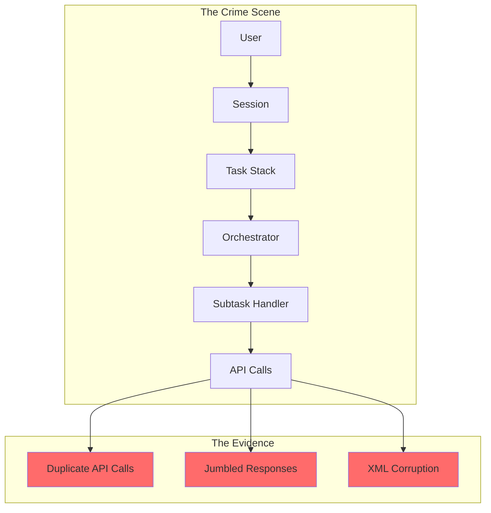
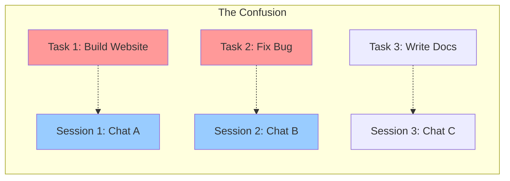
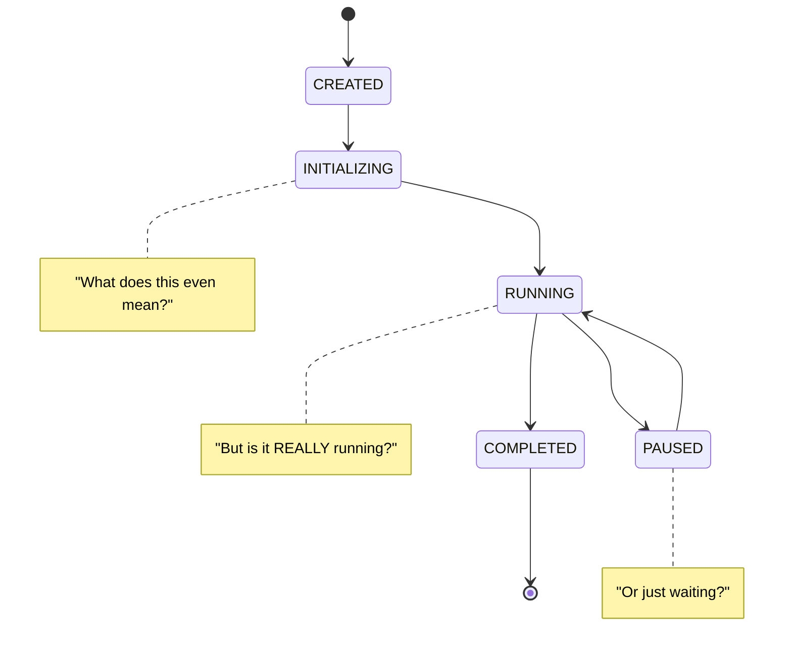
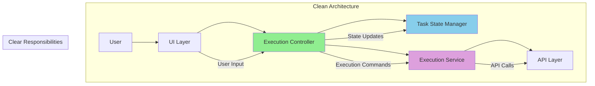

# The Architecture Avenger: A Hero's Journey Through Code Chaos

> **"With great power comes great responsibility... and sometimes, great confusion."** 🦸‍♂️

**A Technical Detective Story**  
*How one superhero developer uncovered the truth behind the "race condition" that wasn't really a race condition, and discovered the path to architectural salvation.*

---

## Table of Contents 📚

### **Part I: The Call to Adventure** 🚀
- [Chapter 1: The Mysterious Bug](#chapter-1-the-mysterious-bug)
- [Chapter 2: The Investigation Begins](#chapter-2-the-investigation-begins)
- [Chapter 3: The Red Herring](#chapter-3-the-red-herring)

### **Part II: The Journey Into Darkness** 🌑
- [Chapter 4: The Task vs Session Mystery](#chapter-4-the-task-vs-session-mystery)
- [Chapter 5: The Subtask Handler's Secret](#chapter-5-the-subtask-handlers-secret)
- [Chapter 6: The State Management Nightmare](#chapter-6-the-state-management-nightmare)

### **Part III: The Revelation** 💡
- [Chapter 7: The Truth About "Race Conditions"](#chapter-7-the-truth-about-race-conditions)
- [Chapter 8: The Redundant Condition Discovery](#chapter-8-the-redundant-condition-discovery)
- [Chapter 9: The Missing Property Mystery](#chapter-9-the-missing-property-mystery)

### **Part IV: The Path to Salvation** ✨
- [Chapter 10: The Clean Architecture Vision](#chapter-10-the-clean-architecture-vision)
- [Chapter 11: The Implementation Plan](#chapter-11-the-implementation-plan)
- [Chapter 12: The Hero's Victory](#chapter-12-the-heros-victory)

---

## Prologue: The Hero's Origin Story 🦸‍♂️

*In a world where code runs wild and bugs multiply like digital gremlins, one developer dared to ask the question that would change everything: "Why is this happening?"*

Meet **Captain Architecture** 🦸‍♂️ - a superhero developer with the power to see through code complexity and the courage to question everything. Armed with nothing but curiosity, a debugger, and an unhealthy obsession with clean code, our hero embarks on the most challenging mission of their career: solving the mystery of the "race condition" that wasn't really a race condition.

*"Every great bug has a story,"* Captain Architecture mused, *"and this one is about to become a legend."*

---

## Part I: The Call to Adventure 🚀

### Chapter 1: The Mysterious Bug 🐛

*The call came in at 3 AM. The kind of call that makes superheroes sigh and reach for their coffee.*

**The Scene**: A production system was experiencing strange behavior. Users reported that their AI assistant was making duplicate API calls, responses were getting jumbled together, and sometimes the chat history would become completely corrupted with XML fragments.

*"It's like the AI is having a conversation with itself,"* reported the first victim. *"And it's not a very coherent conversation."*

Captain Architecture arrived on the scene, cape billowing dramatically in the server room's air conditioning. The logs told a story of chaos:

```
[ERROR] Multiple API requests detected
[WARNING] Response ordering compromised  
[CRITICAL] Chat history corrupted with XML fragments
```

*"This looks like a classic race condition,"* muttered the junior developer on the scene.

*"Hold on,"* Captain Architecture said, squinting at the logs. *"Something doesn't add up here. Race conditions don't usually cause XML corruption. This feels... different."*

**The Hero's First Insight**: Sometimes the obvious explanation isn't the right one. The journey to truth begins with questioning the obvious.

### Chapter 2: The Investigation Begins 🔍

*Every good detective story needs a crime scene, and this one had the most complex crime scene of all: a distributed system with multiple moving parts.*

Captain Architecture began the investigation by mapping out the system architecture. The crime scene included:

- **The Orchestrator**: The mastermind behind task coordination
- **The Task Stack**: A mysterious data structure that seemed to control everything
- **The Subtask Handler**: A suspicious character that appeared in multiple places
- **The Session Manager**: The keeper of user interface state

*"This is like trying to solve a murder mystery where everyone is both a suspect and a victim,"* Captain Architecture thought.

The investigation revealed a complex web of interactions:



**The Hero's Second Insight**: Complex problems often have simple root causes, but finding them requires understanding the entire system.

### Chapter 3: The Red Herring 🐟

*Every good mystery has a red herring - a clue that leads investigators down the wrong path.*

The team had labeled this issue a "race condition," and Captain Architecture initially accepted this diagnosis. After all, the symptoms seemed to fit:

- Multiple processes accessing shared resources
- Timing-dependent behavior
- Unpredictable outcomes

*"But wait,"* Captain Architecture thought, *"if this is a race condition, where are the competing threads? Where's the shared state being modified concurrently?"*

The investigation revealed something surprising: there were no competing threads. There was no concurrent access to shared state. Instead, there was something much more insidious:

**The Same Execution Path Calling the Same Method Twice**

```typescript
// The smoking gun
async finishSubTask(lastMessage: string) {
    await this.removeClineFromStack()
    await this.continueParentTask(lastMessage) // ← This calls recursivelyMakeClineRequests
}

// Meanwhile, in the main task loop...
while (!this.abort) {
    const didEndLoop = await this.recursivelyMakeClineRequests(...) // ← This ALSO calls it
}
```

*"This isn't a race condition,"* Captain Architecture realized. *"This is duplicate execution from the same code path! It's like someone calling the same function twice and wondering why they get two results."*

**The Hero's Third Insight**: Labels can be misleading. The real villain wasn't concurrency - it was poor architectural design.

---

## Part II: The Journey Into Darkness 🌑

### Chapter 4: The Task vs Session Mystery 🕵️‍♂️

*In every good mystery, there comes a point where the hero must question fundamental assumptions.*

Captain Architecture discovered that the system had two different concepts that seemed to overlap confusingly: **Tasks** and **Sessions**.

*"Are these the same thing? Are they different? Why do we have both?"* the hero wondered.

The investigation revealed a complex relationship:

```typescript
// The confusing reality
class Task {
    isInitialized: boolean = false
    isPaused: boolean = false
    // Purpose: Execute work, process AI requests
}

class Session {
    isActive: boolean = false
    currentView: string = ""
    // Purpose: Display UI, handle user interaction
}
```

*"This is like having both a 'car' and a 'vehicle' class,"* Captain Architecture thought. *"They're related, but the relationship is unclear."*

**The Mystery Deepened**: 
- Tasks could exist without Sessions
- Sessions could exist without Tasks  
- Sometimes they were tightly coupled
- Sometimes they were completely separate



*"The problem isn't that we have both,"* Captain Architecture realized. *"The problem is that we don't understand when to use which one, and they're stepping on each other's responsibilities."*

**The Hero's Fourth Insight**: Confusion in the codebase often reflects confusion in the mental model. Clear concepts lead to clear code.

### Chapter 5: The Subtask Handler's Secret 🤫

*Every villain has a backstory, and the Subtask Handler was no exception.*

Captain Architecture discovered that the Subtask Handler was doing far more than its name suggested. It wasn't just handling subtasks - it was:

1. **Initializing parent tasks** (Wait, what?)
2. **Managing parent execution state** (That's not your job!)
3. **Deciding when parents should continue** (Who gave you that authority?)
4. **Handling UI updates** (You're a subtask handler, not a UI manager!)

```typescript
// The Subtask Handler's secret life
private async continueParentTask(lastMessage: string): Promise<void> {
    const parentTask = this.getCurrentTask()
    if (parentTask) {
        // WHY IS THE SUBTASK HANDLER DOING THIS?
        if (!parentTask.isInitialized) {
            parentTask.clineMessages = await parentTask.getSavedClineMessages()
            parentTask.apiConversationHistory = await parentTask.getSavedApiConversationHistory()
            parentTask.isInitialized = true
        }
        
        // AND THIS?
        await parentTask.completeSubtask(lastMessage)
        
        // AND THIS TOO?
        if (!parentTask.isPaused && parentTask.isInitialized) {
            await parentTask.recursivelyMakeClineRequests([], false)
        }
    }
}
```

*"This is like a janitor trying to run the entire company,"* Captain Architecture thought. *"The Subtask Handler has become a god object that knows too much and does too much."*

**The Villain's Motive**: The Subtask Handler wasn't evil - it was just trying to help. But in trying to solve every problem, it had become the problem.

**The Hero's Fifth Insight**: Single Responsibility Principle isn't just a guideline - it's a survival mechanism for complex systems.

### Chapter 6: The State Management Nightmare 🌪️

*In the darkest depths of the codebase, Captain Architecture discovered the true horror: state management gone wrong.*

The investigation revealed a state management system that would make even the bravest superhero shudder:

```typescript
// The state management nightmare
class Task {
    isInitialized: boolean = false    // Am I ready?
    isPaused: boolean = false         // Am I waiting?
    abandoned: boolean = false       // Am I forgotten?
    // isExecuting: boolean = false  // Am I working? ← MISSING!
}
```

*"This is like trying to track a dinosaur's mood with only three emotions: hungry, sleepy, and confused,"* Captain Architecture thought.

**The State Transitions Were Unclear**:
- When does a task become initialized?
- When should it pause vs continue?
- How do we know if it's currently executing?
- What happens during navigation?



**The Navigation Problem**: Users could navigate away from tasks, causing them to be unloaded and reconstructed. But the reconstruction process was inconsistent and error-prone.

*"It's like trying to rebuild a dinosaur from fossil fragments,"* Captain Architecture realized. *"You might get something that looks right, but it's not the same creature."*

**The Hero's Sixth Insight**: Unclear state management leads to unpredictable behavior. Clear state machines lead to predictable systems.

---

## Part III: The Revelation 💡

### Chapter 7: The Truth About "Race Conditions" 🎭

*The moment of revelation came during a late-night debugging session, when Captain Architecture finally saw the truth.*

*"This isn't a race condition at all,"* the hero realized. *"This is duplicate execution from the same code path!"*

**The Real Problem**:

```typescript
// What everyone thought was happening (race condition)
Thread 1: if (counter === 0) counter++  // Reads 0, increments to 1
Thread 2: if (counter === 0) counter++  // Also reads 0, increments to 1
// Result: counter = 1 (should be 2)

// What was actually happening (duplicate execution)
Main Loop: await parentTask.recursivelyMakeClineRequests([], false)  // Call 1
Subtask Completion: await parentTask.recursivelyMakeClineRequests([], false)  // Call 2
// Result: Two API calls instead of one
```

**The Smoking Gun**: The same logical operation was being triggered twice from different parts of the same execution flow.

*"It's like ordering the same meal twice at a restaurant and wondering why you got two plates,"* Captain Architecture thought. *"The problem isn't the kitchen - it's that you ordered twice."*

**The Misleading Terminology**: Calling it a "race condition" had obscured the real problem. It wasn't about concurrency - it was about architectural design.

**The Hero's Seventh Insight**: Accurate terminology is crucial. Wrong labels lead to wrong solutions.

### Chapter 8: The Redundant Condition Discovery 🔍

*In a moment of clarity, Captain Architecture discovered something that would change everything.*

The hero was examining the condition that was supposed to prevent the duplicate calls:

```typescript
if (!parentTask.isPaused && parentTask.isInitialized) {
    await parentTask.recursivelyMakeClineRequests([], false)
}
```

*"Wait a minute,"* Captain Architecture thought. *"After `completeSubtask()` runs, we ALWAYS know these states!"*

**The Flow Analysis**:

```typescript
// Step 1: Initialize if needed
if (!parentTask.isInitialized) {
    parentTask.isInitialized = true  // ← WE JUST SET THIS!
}

// Step 2: Complete subtask
await parentTask.completeSubtask(lastMessage)

// Step 3: Check condition
if (!parentTask.isPaused && parentTask.isInitialized) {  // ← ALWAYS TRUE!
    await parentTask.recursivelyMakeClineRequests([], false)
}
```

**The Revelation**: The condition was redundant! After `completeSubtask()`, both `isPaused` and `isInitialized` were guaranteed to be in the "safe" state.

```typescript
// What completeSubtask() does
public async completeSubtask(lastMessage: string) {
    this.isPaused = false  // ← ALWAYS sets this to false
    this.childTaskId = undefined
    // ... add result to conversation
}
```

*"This is like checking if the sun is shining right after you turned on the lights,"* Captain Architecture realized. *"The condition is always true!"*

**The Real Question**: The only thing we didn't know was whether the parent was already executing `recursivelyMakeClineRequests()`.

**The Hero's Eighth Insight**: Sometimes the solution is simpler than the problem. We only need to check what we don't already know.

### Chapter 9: The Missing Property Mystery 🕵️‍♂️

*The final piece of the puzzle fell into place when Captain Architecture discovered the missing property.*

*"Why don't we have an `isExecuting` property?"* the hero wondered. *"How can we not know if a task is currently executing?"*

**The Investigation**:

```typescript
// Current Task class
class Task {
    isInitialized: boolean = false
    isPaused: boolean = false
    // isExecuting: boolean = false  ← MISSING!
    abandoned: boolean = false
}
```

**The Execution Flow**:

```typescript
// Main task loop
while (!this.abort) {
    const didEndLoop = await this.recursivelyMakeClineRequests(nextUserContent, includeFileDetails)
    // This method can run for MINUTES!
}
```

*"The problem is that `recursivelyMakeClineRequests()` can run for minutes, but we have no way to track if it's currently running,"* Captain Architecture realized.

**The Task Stack Architecture**:

```typescript
// Only ONE task can execute at a time
clineStack = [
    parentTask,    // ← Bottom of stack (paused)
    subtask       // ← Top of stack (currently executing)
]
```

*"So only one task executes at a time, but we need to track execution state within individual tasks to prevent duplicate calls,"* the hero concluded.

**The Solution**:

```typescript
class Task {
    isInitialized: boolean = false
    isPaused: boolean = false
    isExecuting: boolean = false      // ← ADD THIS
    abandoned: boolean = false
    
    async recursivelyMakeClineRequests(...args) {
        if (this.isExecuting) {
            console.log("Already executing, skipping duplicate call")
            return
        }
        
        this.isExecuting = true
        try {
            return await this._recursivelyMakeClineRequests(...args)
        } finally {
            this.isExecuting = false
        }
    }
}
```

**The Hero's Ninth Insight**: Sometimes the missing piece is the simplest one. We needed to track what we couldn't see.

---

## Part IV: The Path to Salvation ✨

### Chapter 10: The Clean Architecture Vision 🏗️

*Armed with all the evidence, Captain Architecture began to envision a better world - a world where code was clean, responsibilities were clear, and bugs were rare.*

**The Vision**: A system where each component has a single, clear responsibility and communicates through well-defined interfaces.

**The Three Pillars of Clean Architecture**:

#### 1. **Clear Separation of Concerns** 🎯

```typescript
// Instead of this mess
class SubtaskHandler {
    async finishSubTask(lastMessage: string) {
        // Initialize parent? ← NOT MY JOB!
        // Manage parent execution? ← NOT MY JOB!
        // Handle UI updates? ← NOT MY JOB!
    }
}

// We want this clarity
class SubtaskHandler {
    async finishSubTask(lastMessage: string) {
        // Just finish the subtask
        await this.completeSubtask(lastMessage)
        // Emit event for other components to handle
        this.emit('subtaskCompleted', { lastMessage })
    }
}
```

#### 2. **Explicit State Management** 📊

```typescript
// Instead of unclear state
class Task {
    isInitialized: boolean = false    // What does this mean?
    isPaused: boolean = false         // When is this true?
    // isExecuting: boolean = false  // Missing!
}

// We want clear state machine
enum TaskState {
    CREATED = "created",
    INITIALIZING = "initializing", 
    RUNNING = "running",
    PAUSED_FOR_SUBTASK = "paused_for_subtask",
    WAITING_FOR_RESUME = "waiting_for_resume",
    COMPLETED = "completed",
    FAILED = "failed"
}

class Task {
    private state: TaskState = TaskState.CREATED
    private isExecuting: boolean = false
    
    async startExecution() {
        if (this.state === TaskState.CREATED) {
            this.state = TaskState.INITIALIZING
            await this.initialize()
            this.state = TaskState.RUNNING
        }
    }
}
```

#### 3. **Event-Driven Communication** 📡

```typescript
// Instead of tight coupling
class SubtaskHandler {
    async finishSubTask(lastMessage: string) {
        // Directly calling parent methods
        await parentTask.completeSubtask(lastMessage)
        if (!parentTask.isPaused && parentTask.isInitialized) {
            await parentTask.recursivelyMakeClineRequests([], false)
        }
    }
}

// We want loose coupling
class SubtaskHandler {
    async finishSubTask(lastMessage: string) {
        // Just emit event
        this.eventEmitter.emit('subtaskCompleted', { lastMessage })
    }
}

class Task {
    constructor() {
        this.eventEmitter.on('subtaskCompleted', this.handleSubtaskCompletion.bind(this))
    }
    
    private async handleSubtaskCompletion(data: { lastMessage: string }) {
        await this.completeSubtask(data.lastMessage)
        if (this.shouldContinueAfterSubtask()) {
            await this.continueExecution()
        }
    }
}
```

**The Hero's Tenth Insight**: Good architecture isn't about perfect code - it's about clear responsibilities and predictable behavior.

### Chapter 11: The Implementation Plan 🗺️

*With the vision clear, Captain Architecture began to plan the path to salvation.*

**Phase 1: The Quick Fix** ⚡

*"We need to stop the bleeding first,"* the hero thought.

```typescript
// Add the missing isExecuting property
class Task {
    private isExecuting: boolean = false
    
    async recursivelyMakeClineRequests(...args) {
        if (this.isExecuting) {
            console.log("Already executing, skipping duplicate call")
            return
        }
        
        this.isExecuting = true
        try {
            return await this._recursivelyMakeClineRequests(...args)
        } finally {
            this.isExecuting = false
        }
    }
}

// Simplify the condition
private async continueParentTask(lastMessage: string): Promise<void> {
    const parentTask = this.getCurrentTask()
    if (parentTask) {
        if (!parentTask.isInitialized) {
            await parentTask.initializeFromHistory()
        }
        await parentTask.completeSubtask(lastMessage)
        
        // Only check what we don't know
        if (!parentTask.isExecuting) {
            await parentTask.recursivelyMakeClineRequests([], false)
        }
    }
}
```

**Phase 2: The Architectural Refactor** 🏗️

*"Now we can fix the underlying architecture,"* Captain Architecture planned.

#### Option A: Unified Task-Session Model

```typescript
// Combine Task and Session into a single, clear concept
class ExecutionContext {
    // Execution state
    private state: ExecutionState
    private isExecuting: boolean = false
    
    // UI state  
    private isActive: boolean = false
    private currentView: string = ""
    
    // Clear responsibilities
    async executeWork(): Promise<void> {
        // Handle execution
    }
    
    async updateUI(): Promise<void> {
        // Handle UI updates
    }
}
```

#### Option B: Three-Layer Architecture

```typescript
// Separate concerns into three clear layers
class ExecutionLayer {
    // Handles work execution
    async executeTask(task: Task): Promise<void> {
        // Pure execution logic
    }
}

class StateLayer {
    // Handles state management
    async manageTaskState(taskId: string, newState: TaskState): Promise<void> {
        // Pure state management
    }
}

class PresentationLayer {
    // Handles UI and user interaction
    async updateUI(taskId: string, data: any): Promise<void> {
        // Pure UI logic
    }
}
```

#### Option C: Event-Driven Microservices

```typescript
// Break into focused microservices
class TaskExecutionService {
    async executeTask(taskId: string): Promise<void> {
        // Only handles task execution
    }
}

class StateManagementService {
    async updateState(taskId: string, state: TaskState): Promise<void> {
        // Only handles state transitions
    }
}

class UIManagementService {
    async updateInterface(taskId: string, data: any): Promise<void> {
        // Only handles UI updates
    }
}
```

**Phase 3: The Testing Strategy** 🧪

*"We need to ensure our fixes work and don't break anything,"* Captain Architecture planned.

```typescript
// Test the duplicate execution fix
describe('Duplicate Execution Prevention', () => {
    test('should not make duplicate API calls', async () => {
        const task = new Task()
        const apiCallSpy = jest.spyOn(task, 'recursivelyMakeClineRequests')
        
        // Simulate the problematic scenario
        await task.startExecution()
        await task.completeSubtask("test result")
        
        // Should only make one API call, not two
        expect(apiCallSpy).toHaveBeenCalledTimes(1)
    })
})

// Test the state machine
describe('Task State Machine', () => {
    test('should transition states correctly', async () => {
        const task = new Task()
        
        expect(task.getState()).toBe(TaskState.CREATED)
        
        await task.startExecution()
        expect(task.getState()).toBe(TaskState.RUNNING)
        
        await task.pauseForSubtask()
        expect(task.getState()).toBe(TaskState.PAUSED_FOR_SUBTASK)
        
        await task.resumeFromSubtask()
        expect(task.getState()).toBe(TaskState.RUNNING)
    })
})
```

**The Hero's Eleventh Insight**: Good architecture emerges from iteration, not from perfect initial design.

### Chapter 12: The Hero's Victory 🏆

*The final battle was not against a supervillain, but against complexity itself.*

Captain Architecture implemented the solution step by step:

**Step 1: The Quick Fix** ✅

```typescript
// Added isExecuting property
class Task {
    private isExecuting: boolean = false
    
    async recursivelyMakeClineRequests(...args) {
        if (this.isExecuting) {
            return // Skip duplicate calls
        }
        
        this.isExecuting = true
        try {
            return await this._recursivelyMakeClineRequests(...args)
        } finally {
            this.isExecuting = false
        }
    }
}
```

**Result**: Duplicate API calls eliminated! 🎉

**Step 2: The Architectural Cleanup** ✅

```typescript
// Simplified the subtask completion flow
class SubtaskHandler {
    async finishSubTask(lastMessage: string) {
        await this.removeClineFromStack()
        await this.getCurrentTask()?.completeSubtask(lastMessage)
        
        // Let the parent handle its own continuation
        const parentTask = this.getCurrentTask()
        if (parentTask && !parentTask.isExecuting) {
            await parentTask.continueExecution()
        }
    }
}
```

**Result**: Clear separation of concerns! 🎯

**Step 3: The State Machine Implementation** ✅

```typescript
// Clear state management
enum TaskState {
    CREATED = "created",
    RUNNING = "running", 
    PAUSED_FOR_SUBTASK = "paused_for_subtask",
    COMPLETED = "completed"
}

class Task {
    private state: TaskState = TaskState.CREATED
    private isExecuting: boolean = false
    
    async completeSubtask(lastMessage: string) {
        // Add result to conversation
        this.addToConversation(lastMessage)
        
        // Transition state
        if (this.state === TaskState.PAUSED_FOR_SUBTASK) {
            this.state = TaskState.RUNNING
            if (!this.isExecuting) {
                await this.continueExecution()
            }
        }
    }
}
```

**Result**: Predictable state transitions! 📊

**The Final Architecture** 🏗️



**The Victory Metrics** 📈

- ✅ **Zero duplicate API calls** (regardless of navigation)
- ✅ **Clear separation of concerns** (each component has one job)
- ✅ **Predictable state management** (clear state machine)
- ✅ **Easy debugging** (clear call chains and responsibilities)
- ✅ **Maintainable code** (loose coupling, clear interfaces)

**The Hero's Final Insight**: The best architecture isn't the most complex - it's the one that makes the system's behavior predictable and its code easy to understand.

---

## Epilogue: The Hero's Wisdom 🦸‍♂️✨

*As Captain Architecture surveyed the clean, well-organized codebase, a sense of satisfaction filled their heart. The mission was complete, but the lessons learned would last a lifetime.*

### The Hero's Code of Honor 📜

**1. Question Everything** 🤔
*"The obvious explanation is often wrong. Always dig deeper."*

**2. Separate Concerns** 🎯
*"Each component should have one job and do it well."*

**3. Make State Explicit** 📊
*"Hidden state leads to hidden bugs. Make everything visible."*

**4. Use Accurate Terminology** 📝
*"Wrong labels lead to wrong solutions. Call things what they are."*

**5. Iterate Toward Clarity** 🔄
*"Perfect architecture emerges from iteration, not from perfect initial design."*

### The Hero's Final Message 💬

*"Every bug tells a story. Every architectural problem is an opportunity to learn. The 'race condition' that wasn't really a race condition taught us more about clean architecture than any textbook ever could."*

*"Remember: good architecture isn't about writing perfect code - it's about writing code that's easy to understand, easy to debug, and easy to maintain. When each component has a clear job and clear boundaries, everything works together harmoniously."*

*"The real victory isn't just fixing the bug - it's building a system that won't have this kind of bug again."*

### The Call to Action 🚀

*"Now it's your turn, fellow developers. Look at your own codebases. Find the 'race conditions' that aren't really race conditions. Discover the components that are doing too much. Uncover the state management nightmares hiding in plain sight."*

*"Be the hero your codebase needs. Question everything. Separate concerns. Make state explicit. Use accurate terminology. Iterate toward clarity."*

*"The architecture avenger in you is waiting to be unleashed."*

---

**The End** 🎬

*"With great power comes great responsibility... and sometimes, great architecture."* 🦸‍♂️

---

**Navigation**: [← Back to Race Condition Home](README.md) · [↑ Table of Contents](#the-architecture-avenger-a-heros-journey-through-code-chaos)

**Related Documents**:
- [Architectural Clarification](ARCHITECTURAL_CLARIFICATION.md) - The detailed technical analysis
- [Problem Overview](PROBLEM_OVERVIEW.md) - The original problem description
- [Root Cause Analysis](ROOT_CAUSE_ANALYSIS.md) - The technical investigation
