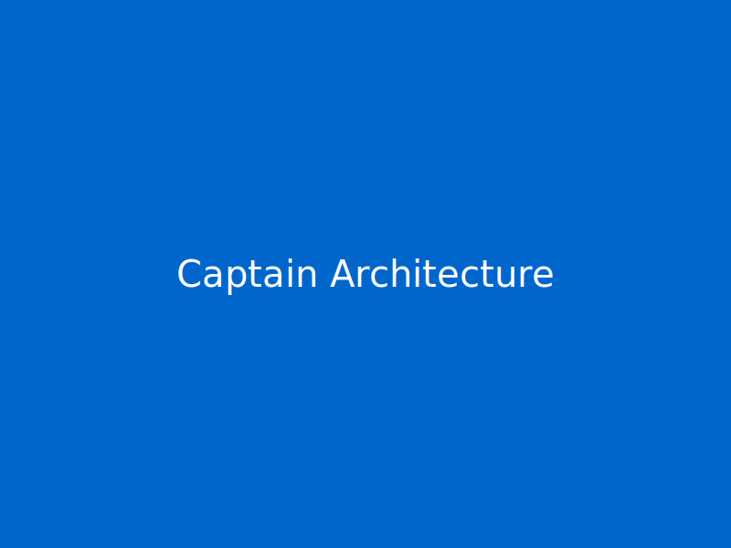
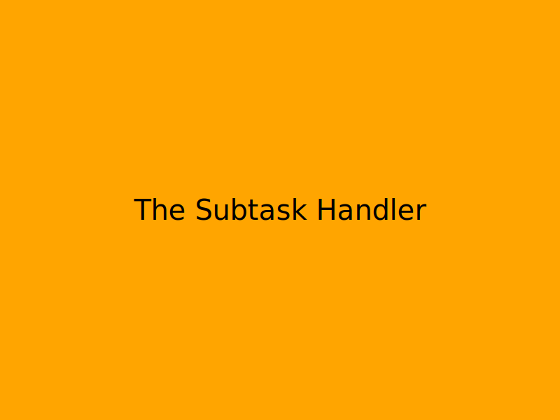
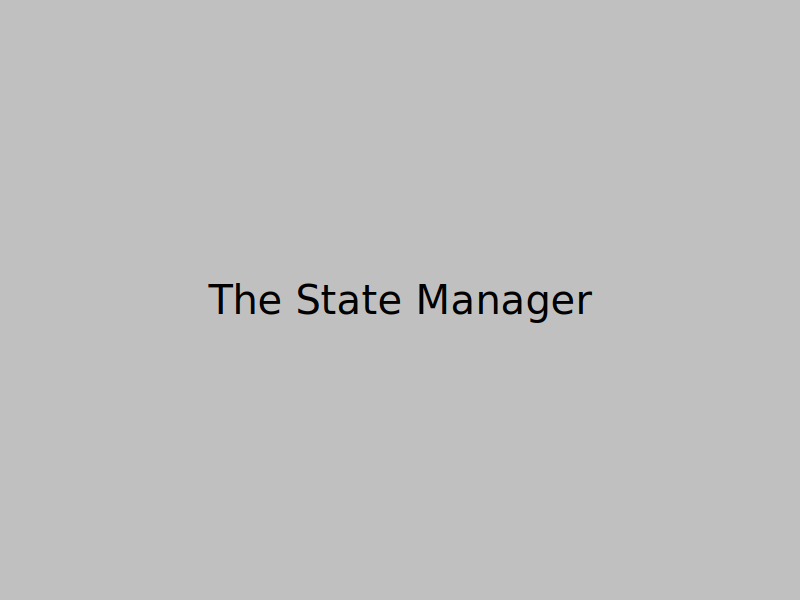

# The Architecture Avenger: A Hero's Journey Through Code Chaos

> **"With great power comes great responsibility... and sometimes, great confusion."** 🦸‍♂️

**A Technical Detective Story**  
_How one superhero developer uncovered the truth behind the "race condition" that wasn't really a race condition, and discovered the path to architectural salvation._

---

## 📚 Table of Contents

### **Part I: The Call to Adventure** 🚀

- [Prologue: The Hero's Origin Story](prologue.md) - _Meet Captain Architecture_
- [Chapter 1: The Mysterious Bug](part1/chapter1.md) - _The 3 AM call that changed everything_
- [Chapter 2: The Investigation Begins](part1/chapter2.md) - _Mapping the crime scene_
- [Chapter 3: The Red Herring](part1/chapter3.md) - _When the obvious explanation is wrong_

### **Part II: The Journey Into Darkness** 🌑

- [Chapter 4: The Task vs Session Mystery](part2/chapter4.md) - _Two concepts, one confusion_
- [Chapter 5: The Subtask Handler's Secret](part2/chapter5.md) - _The villain with a backstory_
- [Chapter 6: The State Management Nightmare](part2/chapter6.md) - _When state goes wrong_

### **Part III: The Revelation** 💡

- [Chapter 7: The Truth About "Race Conditions"](part3/chapter7.md) - _The moment of clarity_
- [Chapter 8: The Redundant Condition Discovery](part3/chapter8.md) - _When conditions are always true_
- [Chapter 9: The Missing Property Mystery](part3/chapter9.md) - _The piece that wasn't there_

### **Part IV: The Path to Salvation** ✨

- [Chapter 10: The Clean Architecture Vision](part4/chapter10.md) - _Envisioning a better world_
- [Chapter 11: The Implementation Plan](part4/chapter11.md) - _The roadmap to victory_
- [Chapter 12: The Hero's Victory](part4/chapter12.md) - _The final battle_
- [Epilogue: The Hero's Wisdom](epilogue.md) - _Lessons learned and wisdom gained_

---

## 🎯 Quick Navigation

### **By Problem Type**

- **🐛 Bug Investigation**: [Chapter 1](part1/chapter1.md) → [Chapter 2](part1/chapter2.md) → [Chapter 3](part1/chapter3.md)
- **🏗️ Architecture Issues**: [Chapter 4](part2/chapter4.md) → [Chapter 5](part2/chapter5.md) → [Chapter 6](part2/chapter6.md)
- **💡 Root Cause Discovery**: [Chapter 7](part3/chapter7.md) → [Chapter 8](part3/chapter8.md) → [Chapter 9](part3/chapter9.md)
- **✨ Solution Design**: [Chapter 10](part4/chapter10.md) → [Chapter 11](part4/chapter11.md) → [Chapter 12](part4/chapter12.md)

### **By Technical Concept**

- **🔍 Investigation Methods**: [Chapter 2](part1/chapter2.md), [Chapter 7](part3/chapter7.md)
- **🏛️ Architecture Patterns**: [Chapter 4](part2/chapter4.md), [Chapter 10](part4/chapter10.md)
- **📊 State Management**: [Chapter 6](part2/chapter6.md), [Chapter 8](part3/chapter8.md), [Chapter 9](part3/chapter9.md)
- **🛠️ Implementation**: [Chapter 11](part4/chapter11.md), [Chapter 12](part4/chapter12.md)

### **By Hero's Journey Stage**

- **🚀 Call to Adventure**: [Prologue](prologue.md) → [Chapter 1](part1/chapter1.md)
- **🌑 Journey Into Darkness**: [Chapter 4](part2/chapter4.md) → [Chapter 6](part2/chapter6.md)
- **💡 Revelation**: [Chapter 7](part3/chapter7.md) → [Chapter 9](part3/chapter9.md)
- **✨ Return with Elixir**: [Chapter 10](part4/chapter10.md) → [Epilogue](epilogue.md)

---

## 🦸‍♂️ Meet Captain Architecture

**Superpowers**:

- 🔍 **X-Ray Vision**: Can see through code complexity
- 🧠 **Pattern Recognition**: Spots architectural anti-patterns instantly
- 🛡️ **Debugging Shield**: Protects against misleading terminology
- ⚡ **Refactoring Lightning**: Strikes down technical debt with precision

**Mission**: To bring clarity to chaotic codebases and justice to architectural crimes.

**Nemesis**: The Subtask Handler (a well-meaning but overreaching component)

---

## 📖 How to Read This Book

### **For the Impatient** ⚡

Start with [Chapter 7](part3/chapter7.md) (The Truth About "Race Conditions") to get straight to the root cause, then jump to [Chapter 12](part4/chapter12.md) (The Hero's Victory) for the solution.

### **For the Methodical** 📚

Read from [Prologue](prologue.md) through [Epilogue](epilogue.md) in order to follow Captain Architecture's complete journey.

### **For the Technical** 🔧

Focus on [Chapter 4](part2/chapter4.md) (Architecture Issues), [Chapter 6](part2/chapter6.md) (State Management), and [Chapter 10](part4/chapter10.md) (Clean Architecture Vision).

### **For the Storyteller** 📖

Enjoy the narrative flow from [Prologue](prologue.md) to [Epilogue](epilogue.md), with plenty of superhero metaphors and technical insights.

---

## 🎭 The Cast of Characters

| Character                   |                                  Image                                   | Description                                                  |
| :-------------------------- | :----------------------------------------------------------------------: | :----------------------------------------------------------- |
| **🦸‍♂️ Captain Architecture** |  | Our hero, a developer with architectural superpowers         |
| **🤖 The Subtask Handler**  |     | The well-meaning but overreaching villain                    |
| **📊 The State Manager**    |        | A confused character who doesn't know its own state          |
| **🎭 The Task vs Session**  |                                                                          | Two characters who look similar but serve different purposes |
| **🐛 The "Race Condition"** |                                                                          | A mislabeled villain who isn't what it seems                 |

---

## 🏆 The Victory Conditions

By the end of this journey, you'll understand:

- ✅ Why the "race condition" wasn't really a race condition
- ✅ How architectural confusion leads to bugs
- ✅ The importance of clear separation of concerns
- ✅ How to design clean, maintainable systems
- ✅ The path from chaos to clarity

---

## 🔗 Related Documents

- [Architectural Clarification](../ARCHITECTURAL_CLARIFICATION.md) - The detailed technical analysis
- [Problem Overview](../PROBLEM_OVERVIEW.md) - The original problem description
- [Root Cause Analysis](../ROOT_CAUSE_ANALYSIS.md) - The technical investigation
- [Race Condition Home](../README.md) - The main documentation hub

---

**Ready to begin the adventure?** 🚀

[Start with the Prologue →](prologue.md)

---

_"Every great bug has a story, and this one is about to become a legend."_ 🦸‍♂️
