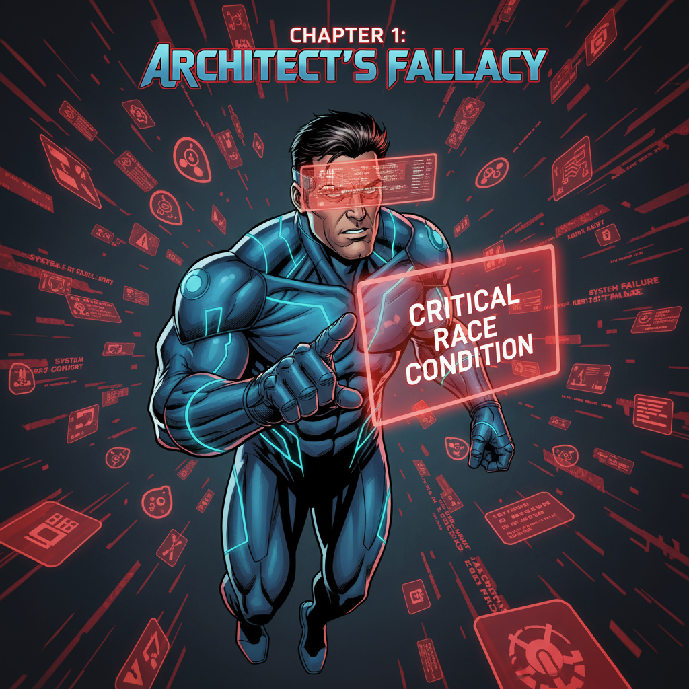
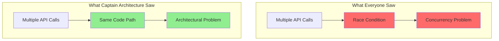

# Chapter 1: The Mysterious Bug 🐛



_The call came in at 3 AM. The kind of call that makes superheroes sigh and reach for their coffee._

---

## The Scene of the Crime 🚨

Captain Architecture arrived on the scene, cape billowing dramatically in the server room's air conditioning. The logs told a story of chaos:

```
[ERROR] Multiple API requests detected
[WARNING] Response ordering compromised
[CRITICAL] Chat history corrupted with XML fragments
```

_"This looks like a classic race condition,"_ muttered the junior developer on the scene.

_"Hold on,"_ Captain Architecture said, squinting at the logs. _"Something doesn't add up here. Race conditions don't usually cause XML corruption. This feels... different."_

## The Victim's Testimony 👥

The first victim's report was chilling:

_"It's like the AI is having a conversation with itself. And it's not a very coherent conversation. Sometimes it asks itself questions, sometimes it answers questions that were never asked, and sometimes the whole chat just becomes a mess of XML tags and error messages."_

Another user reported:

_"I asked it to write a simple function, and suddenly I had three different responses all mixed together. It was like watching three people try to write the same code at the same time."_

## The Evidence 📊

Captain Architecture began collecting evidence. The symptoms were clear:

### **Symptom 1: Duplicate API Calls** 🔄

```typescript
// What users experienced
User: "Write a function to sort an array"
AI Response 1: "Here's a function that sorts..."
AI Response 2: "Here's another function that sorts..." // ← DUPLICATE!
```

### **Symptom 2: Jumbled Responses** 🎭

```typescript
// What users saw
User: "What is 2+2?"
AI Response: "The answer is 4. Here's how to calculate it: 2+2=4. Wait, let me think about this differently. Actually, 2+2 equals 4."
```

### **Symptom 3: XML Corruption** 💥

```typescript
// The worst case scenario
User: "Help me debug this code"
AI Response: "<error>Invalid response</error><function>def debug()</function><error>Response corrupted</error>"
```

## The Initial Diagnosis 🤔

The team had quickly labeled this issue a "race condition," and Captain Architecture initially accepted this diagnosis. After all, the symptoms seemed to fit:

- **Multiple processes accessing shared resources** ✅
- **Timing-dependent behavior** ✅
- **Unpredictable outcomes** ✅

_"But wait,"_ Captain Architecture thought, _"if this is a race condition, where are the competing threads? Where's the shared state being modified concurrently?"_

## The Hero's First Insight 💡

**The Hero's First Insight**: Sometimes the obvious explanation isn't the right one. The journey to truth begins with questioning the obvious.

Captain Architecture's X-Ray Vision kicked in, revealing something that others had missed:



## The Investigation Begins 🔍

_"This isn't adding up,"_ Captain Architecture thought. _"If this were a true race condition, we'd see evidence of concurrent access to shared state. But what I'm seeing looks more like... duplicate execution from the same code path."_

The hero decided to dig deeper. The investigation would require mapping out the entire system architecture, understanding the execution flow, and identifying where the duplication was actually happening.

## The Mystery Deepens 🌊

As Captain Architecture prepared to investigate further, they realized this was no ordinary bug. This was an architectural mystery that would require all of their superpowers to solve.

The clues were there:

- Duplicate API calls
- Jumbled responses
- XML corruption
- Timing-dependent behavior

But the question remained: **What was really causing this chaos?**

## The Hero's Resolve 💪

_"Every great bug has a story,"_ Captain Architecture mused, _"and this one is about to become a legend."_

With determination in their heart and a debugger in their hand, our hero prepared to embark on the investigation that would change everything.

---

## What's Next? 🔮

The investigation continues in [Chapter 2: The Investigation Begins](part2/chapter2.md), where Captain Architecture maps out the crime scene and discovers the complex web of interactions that led to this architectural mystery.

---

**Navigation**:

- [← Prologue: The Hero's Origin Story](prologue.md)
- [→ Chapter 2: The Investigation Begins](part1/chapter2.md)
- [↑ Table of Contents](README.md)

---

**Key Insights from This Chapter**:

- 🐛 **The Bug**: Duplicate API calls, jumbled responses, XML corruption
- 🤔 **The Initial Diagnosis**: Labeled as a "race condition"
- 💡 **The Hero's Insight**: The obvious explanation might be wrong
- 🔍 **The Next Step**: Deep investigation into the system architecture

---

_"Sometimes the most dangerous bugs are the ones that look like something else entirely."_ 🦸‍♂️
