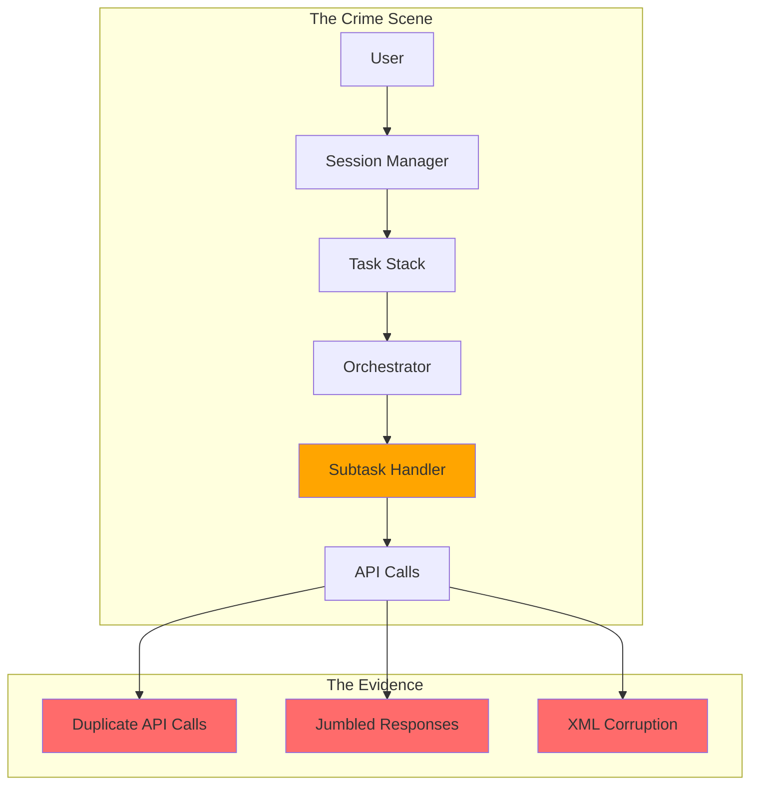

# Chapter 2: The Investigation Begins 🔍


_Every good detective story needs a crime scene, and this one had the most complex crime scene of all: a distributed system with multiple moving parts._

---

## Mapping the Crime Scene 🗺️

Captain Architecture began the investigation by mapping out the system architecture. The crime scene included several key players:

### **The Orchestrator** 🎭

_The mastermind behind task coordination_

- **Role**: Manages the lifecycle of tasks and subtasks
- **Suspicion Level**: Medium - Could be orchestrating the chaos
- **Key Method**: `recursivelyMakeClineRequests()`

### **The Task Stack** 📚

_A mysterious data structure that seemed to control everything_

- **Role**: Maintains the hierarchy of active tasks
- **Suspicion Level**: High - Controls which task is "current"
- **Key Property**: `clineStack[]`

### **The Subtask Handler** 🤖

_A suspicious character that appeared in multiple places_

- **Role**: Handles completion of subtasks
- **Suspicion Level**: Very High - Appears in multiple crime scenes
- **Key Method**: `finishSubTask()`

### **The Session Manager** 🖥️

_The keeper of user interface state_

- **Role**: Manages what the user sees and interacts with
- **Suspicion Level**: Low - Seems innocent but could be hiding something
- **Key Property**: `isActive`

## The Complex Web of Interactions 🕸️

The investigation revealed a complex web of interactions:



## The Execution Flow Analysis 🔄

Captain Architecture's Pattern Recognition superpower kicked in, revealing the execution flow:

### **Normal Flow** ✅

```typescript
// What should happen
User Input → Task Stack → Orchestrator → API Call → Response
```

### **Problematic Flow** ❌

```typescript
// What was actually happening
User Input → Task Stack → Orchestrator → API Call
                ↓
Subtask Completion → Subtask Handler → Another API Call
```

_"Aha!"_ Captain Architecture thought. _"I'm seeing two execution paths that both lead to API calls. This isn't a race condition - this is duplicate execution!"_

## The Smoking Gun 🔫

The hero discovered the smoking gun in the code:

```typescript
// Path 1: Main task loop
while (!this.abort) {
    const didEndLoop = await this.recursivelyMakeClineRequests(nextUserContent, includeFileDetails)
    // This calls the API
}

// Path 2: Subtask completion
async finishSubTask(lastMessage: string) {
    await this.removeClineFromStack()
    await this.continueParentTask(lastMessage) // ← This ALSO calls the API!
}
```

## The Hero's Second Insight 💡

**The Hero's Second Insight**: Complex problems often have simple root causes, but finding them requires understanding the entire system.

Captain Architecture realized that the problem wasn't about concurrency or race conditions. It was about **the same logical operation being triggered twice from different parts of the same execution flow**.

## The Evidence Mounts 📈

As the investigation continued, more evidence emerged:

### **Timing Evidence** ⏰

- The duplicate calls happened in quick succession
- They weren't truly concurrent - one followed the other
- The timing was predictable, not random

### **Code Path Evidence** 🛤️

- Both calls came from the same codebase
- Both calls used the same method: `recursivelyMakeClineRequests()`
- Both calls were triggered by the same user action

### **State Evidence** 📊

- The task state was consistent between calls
- No shared state was being modified concurrently
- The "race" was actually sequential execution

## The Red Herring Emerges 🐟

_"Wait,"_ Captain Architecture thought. _"If this isn't a race condition, why does it behave like one?"_

The hero realized that the symptoms were misleading:

- **Multiple API calls** ✅ (But not from competing threads)
- **Timing-dependent behavior** ✅ (But not random timing)
- **Unpredictable outcomes** ✅ (But predictable in their unpredictability)

_"This is like a red herring,"_ the hero realized. _"The symptoms look like a race condition, but the cause is something else entirely."_

## The Investigation Continues 🔍

With the crime scene mapped and the initial evidence collected, Captain Architecture prepared to dig deeper into the mystery.

The next step would be to examine the Subtask Handler more closely - the character that appeared in multiple places and seemed to be orchestrating the chaos.

---

## What's Next? 🔮

The investigation continues in [Chapter 3: The Red Herring](part1/chapter3.md), where Captain Architecture discovers that the "race condition" diagnosis was a red herring that was leading the investigation down the wrong path.

---

**Navigation**:

- [← Chapter 1: The Mysterious Bug](chapter1.md)
- [→ Chapter 3: The Red Herring](chapter3.md)
- [↑ Table of Contents](../README.md)

---

**Key Insights from This Chapter**:

- 🗺️ **The Crime Scene**: Complex system with multiple interacting components
- 🔍 **The Investigation**: Mapping execution flows and identifying duplicate paths
- 💡 **The Hero's Insight**: Complex problems often have simple root causes
- 🐟 **The Red Herring**: Symptoms that look like a race condition but aren't

---

_"The best detectives don't just follow the evidence - they question whether the evidence is pointing in the right direction."_ 🦸‍♂️
