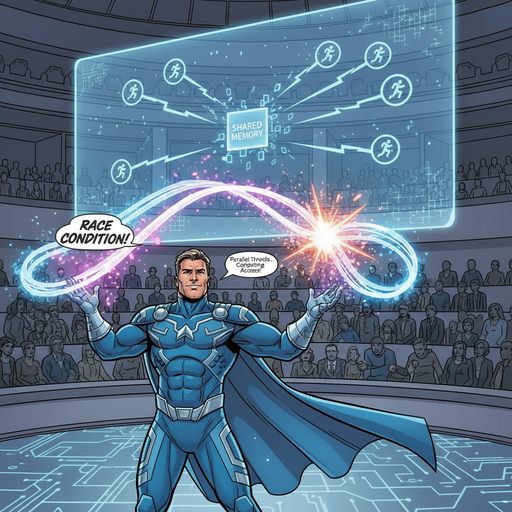
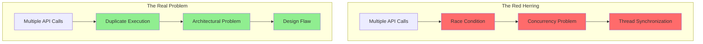

# Chapter 3: The Red Herring 🐟



_Every good mystery has a red herring - a clue that leads investigators down the wrong path._

---

## The Misleading Diagnosis 🎭

The team had labeled this issue a "race condition," and Captain Architecture initially accepted this diagnosis. After all, the symptoms seemed to fit perfectly:

- **Multiple processes accessing shared resources** ✅
- **Timing-dependent behavior** ✅
- **Unpredictable outcomes** ✅

_"But wait,"_ Captain Architecture thought, _"if this is a race condition, where are the competing threads? Where's the shared state being modified concurrently?"_

## The Hero's X-Ray Vision 🔍

Captain Architecture's X-Ray Vision superpower activated, revealing the truth beneath the surface:

### **What Everyone Thought Was Happening** 🤔

```typescript
// Classic race condition scenario
Thread 1: if (counter === 0) counter++  // Reads 0, increments to 1
Thread 2: if (counter === 0) counter++  // Also reads 0, increments to 1
// Result: counter = 1 (should be 2)
```

### **What Was Actually Happening** 💡

```typescript
// Duplicate execution from the same code path
Main Loop: await parentTask.recursivelyMakeClineRequests([], false)  // Call 1
Subtask Completion: await parentTask.recursivelyMakeClineRequests([], false)  // Call 2
// Result: Two API calls instead of one
```

## The Smoking Gun Revealed 🔫

The hero discovered the smoking gun in the code:

```typescript
// The problematic flow
async finishSubTask(lastMessage: string) {
    await this.removeClineFromStack()
    await this.continueParentTask(lastMessage) // ← This calls recursivelyMakeClineRequests
}

// Meanwhile, in the main task loop...
while (!this.abort) {
    const didEndLoop = await this.recursivelyMakeClineRequests(...) // ← This ALSO calls it
}
```

_"This isn't a race condition,"_ Captain Architecture realized. _"This is duplicate execution from the same code path! It's like someone calling the same function twice and wondering why they get two results."_

## The Red Herring's Deception 🎭

The "race condition" label was a red herring because:

### **False Concurrency** ❌

- No competing threads
- No concurrent access to shared state
- Sequential execution, not parallel

### **False Timing** ❌

- Timing was predictable, not random
- Calls happened in sequence, not simultaneously
- No race to access resources

### **False Symptoms** ❌

- Symptoms looked like concurrency issues
- But the cause was architectural design
- The "race" was actually duplicate execution

## The Hero's Third Insight 💡

**The Hero's Third Insight**: Labels can be misleading. The real villain wasn't concurrency - it was poor architectural design.

Captain Architecture realized that calling it a "race condition" had obscured the real problem. It wasn't about threads competing for resources - it was about the same logical operation being triggered twice from different parts of the same execution flow.

## The Real Problem Emerges 🎯

The hero's Pattern Recognition superpower kicked in, revealing the true nature of the problem:



## The Misleading Terminology Trap 🕳️

_"This is like calling a peaceful grazing session a 'violent stampede',"_ Captain Architecture thought. _"The words don't match the reality."_

The problem with misleading terminology:

- **Wrong labels** → **Wrong solutions**
- **"Race condition"** → **Thread synchronization attempts**
- **"Concurrency issue"** → **Lock-based fixes**
- **"Timing problem"** → **Delay-based workarounds**

But the real problem was **architectural design**, not concurrency.

## The Investigation Deepens 🔍

With the red herring identified, Captain Architecture prepared to dig deeper into the real problem.

The hero realized that the issue wasn't about preventing concurrency - it was about preventing duplicate execution from the same code path.

_"The real question isn't 'How do we prevent a race condition?'"_ Captain Architecture thought. _"The real question is 'Why is the same operation being triggered twice?'"_

## The Path Forward 🛤️

The hero's investigation would now focus on:

1. **Understanding the execution flow** - Why does subtask completion trigger parent execution?
2. **Identifying the architectural flaw** - What design decision led to this duplication?
3. **Finding the root cause** - Why wasn't this prevented by the existing design?

---

## What's Next? 🔮

The investigation continues in [Chapter 4: The Task vs Session Mystery](part2/chapter4.md), where Captain Architecture discovers that the system has two different concepts that seem to overlap confusingly, leading to architectural confusion.

---

**Navigation**:

- [← Chapter 2: The Investigation Begins](chapter2.md)
- [→ Chapter 4: The Task vs Session Mystery](../part2/chapter4.md)
- [↑ Table of Contents](../README.md)

---

**Key Insights from This Chapter**:

- 🐟 **The Red Herring**: "Race condition" diagnosis was misleading
- 🔍 **The Real Problem**: Duplicate execution from the same code path
- 💡 **The Hero's Insight**: Wrong labels lead to wrong solutions
- 🎯 **The Path Forward**: Focus on architectural design, not concurrency

---

_"The best detectives don't just solve the case - they solve the right case."_ 🦸‍♂️
