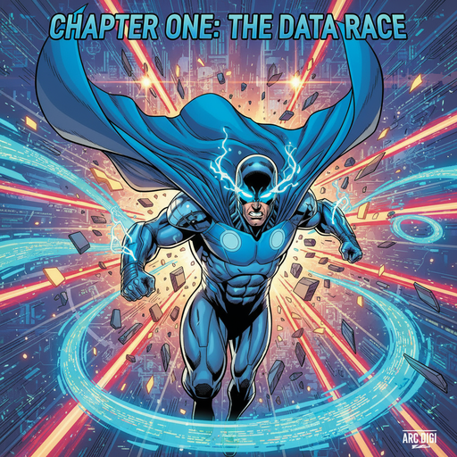
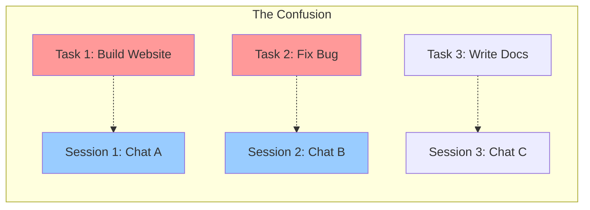
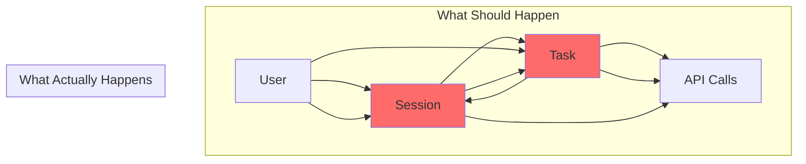

# Chapter 4: The Task vs Session Mystery 🕵️‍♂️



_In every good mystery, there comes a point where the hero must question fundamental assumptions._

---

## The Fundamental Question 🤔

Captain Architecture discovered that the system had two different concepts that seemed to overlap confusingly: **Tasks** and **Sessions**.

_"Are these the same thing? Are they different? Why do we have both?"_ the hero wondered.

## The Confusing Reality 😵

The investigation revealed a complex relationship:

```typescript
// The confusing reality
class Task {
	isInitialized: boolean = false
	isPaused: boolean = false
	// Purpose: Execute work, process AI requests
}

class Session {
	isActive: boolean = false
	currentView: string = ""
	// Purpose: Display UI, handle user interaction
}
```

_"This is like having both a 'car' and a 'vehicle' class,"_ Captain Architecture thought. _"They're related, but the relationship is unclear."_

## The Mystery Deepens 🌊

**The Mystery Deepened**:

- Tasks could exist without Sessions
- Sessions could exist without Tasks
- Sometimes they were tightly coupled
- Sometimes they were completely separate



## The Hero's Fourth Insight 💡

**The Hero's Fourth Insight**: Confusion in the codebase often reflects confusion in the mental model. Clear concepts lead to clear code.

Captain Architecture realized that the problem wasn't that we have both Tasks and Sessions. The problem was that we don't understand when to use which one, and they're stepping on each other's responsibilities.

## The Relationship Analysis 🔍

### **What Tasks Are Supposed To Do** 🎯

- Execute work
- Process AI requests
- Manage execution state
- Handle subtask coordination

### **What Sessions Are Supposed To Do** 🖥️

- Display UI
- Handle user interaction
- Manage view state
- Coordinate user experience

### **What They're Actually Doing** 😵

- Tasks are managing UI state
- Sessions are managing execution state
- Both are handling user interaction
- Neither has clear boundaries

## The Architectural Confusion 🏗️

The hero's X-Ray Vision revealed the architectural confusion:



_"This is like having two chefs in the same kitchen, both trying to cook the same meal,"_ Captain Architecture thought. _"They're stepping on each other's toes and making a mess."_

## The Real Problem 🎯

_"The problem isn't that we have both Tasks and Sessions,"_ Captain Architecture realized. _"The problem is that we don't understand when to use which one, and they're stepping on each other's responsibilities."_

The confusion was causing:

- **Unclear responsibilities** - Who does what?
- **Tight coupling** - Changes in one affect the other
- **State management chaos** - Both managing similar state
- **Debugging nightmares** - Hard to trace issues

## The Subtask Handler's Role 🤖

This confusion was particularly evident in the Subtask Handler, which seemed to be doing everything:

```typescript
// The Subtask Handler's confused responsibilities
class SubtaskHandler {
	async finishSubTask(lastMessage: string) {
		// Task responsibility: Complete subtask
		await this.completeSubtask(lastMessage)

		// Session responsibility: Update UI
		await this.updateUI()

		// Task responsibility: Continue execution
		await this.continueExecution()

		// Session responsibility: Handle user interaction
		await this.handleUserInteraction()
	}
}
```

_"This is like a janitor trying to run the entire company,"_ Captain Architecture thought. _"The Subtask Handler has become a god object that knows too much and does too much."_

## The Path to Clarity 🛤️

Captain Architecture realized that the solution wasn't to eliminate either Tasks or Sessions, but to clarify their responsibilities:

### **Clear Task Responsibilities** 🎯

- Execute work
- Manage execution state
- Handle subtask coordination
- Process AI requests

### **Clear Session Responsibilities** 🖥️

- Display UI
- Handle user interaction
- Manage view state
- Coordinate user experience

### **Clear Boundaries** 🚧

- Tasks don't manage UI
- Sessions don't manage execution
- Clear interfaces between them
- Single responsibility principle

## The Investigation Continues 🔍

With the Task vs Session mystery identified, Captain Architecture prepared to dig deeper into the Subtask Handler's secret life.

The hero realized that the confusion between Tasks and Sessions was just the beginning of a deeper architectural problem.

---

## What's Next? 🔮

The investigation continues in [Chapter 5: The Subtask Handler's Secret](chapter5.md), where Captain Architecture discovers that the Subtask Handler was doing far more than its name suggested, becoming a god object that was orchestrating the chaos.

---

**Navigation**:

- [← Chapter 3: The Red Herring](../part1/chapter3.md)
- [→ Chapter 5: The Subtask Handler's Secret](chapter5.md)
- [↑ Table of Contents](../README.md)

---

**Key Insights from This Chapter**:

- 🤔 **The Mystery**: Two concepts (Task vs Session) with unclear boundaries
- 🔍 **The Confusion**: Both stepping on each other's responsibilities
- 💡 **The Hero's Insight**: Confusion in code reflects confusion in mental model
- 🎯 **The Path Forward**: Clarify responsibilities and boundaries

---

_"The best architects don't just build systems - they build systems that are easy to understand."_ 🦸‍♂️
