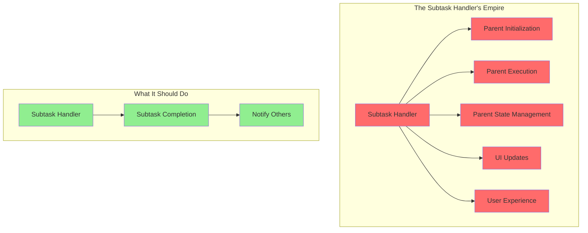
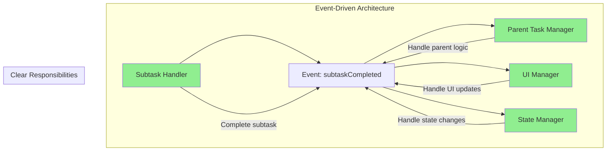

# Chapter 5: The Subtask Handler's Secret 🤫

*Every villain has a backstory, and the Subtask Handler was no exception.*

---

## The Villain's Secret Life 🕵️‍♂️

Captain Architecture discovered that the Subtask Handler was doing far more than its name suggested. It wasn't just handling subtasks - it was:

1. **Initializing parent tasks** (Wait, what?)
2. **Managing parent execution state** (That's not your job!)
3. **Deciding when parents should continue** (Who gave you that authority?)
4. **Handling UI updates** (You're a subtask handler, not a UI manager!)

## The Smoking Gun 🔫

The hero found the smoking gun in the code:

```typescript
// The Subtask Handler's secret life
private async continueParentTask(lastMessage: string): Promise<void> {
    const parentTask = this.getCurrentTask()
    if (parentTask) {
        // WHY IS THE SUBTASK HANDLER DOING THIS?
        if (!parentTask.isInitialized) {
            parentTask.clineMessages = await parentTask.getSavedClineMessages()
            parentTask.apiConversationHistory = await parentTask.getSavedApiConversationHistory()
            parentTask.isInitialized = true
        }
        
        // AND THIS?
        await parentTask.completeSubtask(lastMessage)
        
        // AND THIS TOO?
        if (!parentTask.isPaused && parentTask.isInitialized) {
            await parentTask.recursivelyMakeClineRequests([], false)
        }
    }
}
```

*"This is like a janitor trying to run the entire company,"* Captain Architecture thought. *"The Subtask Handler has become a god object that knows too much and does too much."*

## The Villain's Motive 🎭

**The Villain's Motive**: The Subtask Handler wasn't evil - it was just trying to help. But in trying to solve every problem, it had become the problem.

The hero's Pattern Recognition superpower revealed the pattern:



## The Hero's Fifth Insight 💡

**The Hero's Fifth Insight**: Single Responsibility Principle isn't just a guideline - it's a survival mechanism for complex systems.

Captain Architecture realized that the Subtask Handler's violation of the Single Responsibility Principle was causing:

- **Tight coupling** - Changes in one area affect everything
- **Hard to test** - Too many responsibilities to test effectively
- **Hard to debug** - Unclear where problems originate
- **Hard to maintain** - Changes require understanding everything

## The God Object Problem 🏛️

The hero's X-Ray Vision revealed the true nature of the problem:

```typescript
// The God Object Pattern (Anti-pattern)
class SubtaskHandler {
    // Subtask responsibilities
    async completeSubtask() { /* ... */ }
    
    // Parent task responsibilities  
    async initializeParent() { /* ... */ }
    async manageParentState() { /* ... */ }
    async continueParentExecution() { /* ... */ }
    
    // UI responsibilities
    async updateUI() { /* ... */ }
    async handleUserInteraction() { /* ... */ }
    
    // State management responsibilities
    async manageTaskState() { /* ... */ }
    async handleNavigation() { /* ... */ }
    
    // API responsibilities
    async makeApiCalls() { /* ... */ }
    async handleApiResponses() { /* ... */ }
}
```

*"This is like having one person try to be the CEO, CFO, CTO, and janitor all at the same time,"* Captain Architecture thought. *"It's not sustainable."*

## The Architectural Violations 🚨

The hero identified multiple architectural violations:

### **Violation 1: Single Responsibility Principle** ❌
- One class doing multiple jobs
- Unclear boundaries
- Hard to reason about

### **Violation 2: Separation of Concerns** ❌
- UI logic mixed with business logic
- State management mixed with execution
- Navigation mixed with subtask handling

### **Violation 3: Dependency Inversion** ❌
- High-level modules depending on low-level modules
- Tight coupling between components
- Hard to test and maintain

## The Path to Redemption 🛤️

Captain Architecture envisioned a better design:

```typescript
// Clean separation of concerns
class SubtaskHandler {
    async finishSubTask(lastMessage: string) {
        // Just finish the subtask
        await this.completeSubtask(lastMessage)
        // Emit event for other components to handle
        this.eventEmitter.emit('subtaskCompleted', { lastMessage })
    }
}

class ParentTaskManager {
    async handleSubtaskCompletion(data: { lastMessage: string }) {
        // Handle parent-specific logic
        await this.completeSubtask(data.lastMessage)
        if (this.shouldContinueAfterSubtask()) {
            await this.continueExecution()
        }
    }
}

class UIManager {
    async handleSubtaskCompletion(data: { lastMessage: string }) {
        // Handle UI-specific logic
        await this.updateChatHistory(data.lastMessage)
        await this.refreshUI()
    }
}
```

## The Event-Driven Solution 📡

The hero realized that the solution was event-driven architecture:



## The Investigation Continues 🔍

With the Subtask Handler's secret revealed, Captain Architecture prepared to dig deeper into the state management nightmare.

The hero realized that the Subtask Handler's overreach was just one symptom of a deeper architectural problem: unclear state management.

---

## What's Next? 🔮

The investigation continues in [Chapter 6: The State Management Nightmare](chapter6.md), where Captain Architecture discovers a state management system that would make even the bravest superhero shudder.

---

**Navigation**: 
- [← Chapter 4: The Task vs Session Mystery](chapter4.md)
- [→ Chapter 6: The State Management Nightmare](chapter6.md)
- [↑ Table of Contents](../README.md)

---

**Key Insights from This Chapter**:
- 🤫 **The Secret**: Subtask Handler was doing far more than its name suggested
- 🎭 **The Motive**: Trying to help but becoming the problem
- 💡 **The Hero's Insight**: Single Responsibility Principle is a survival mechanism
- 🛤️ **The Path Forward**: Event-driven architecture with clear responsibilities

---

*"The best villains aren't evil - they're just trying to help in the wrong way."* 🦸‍♂️
