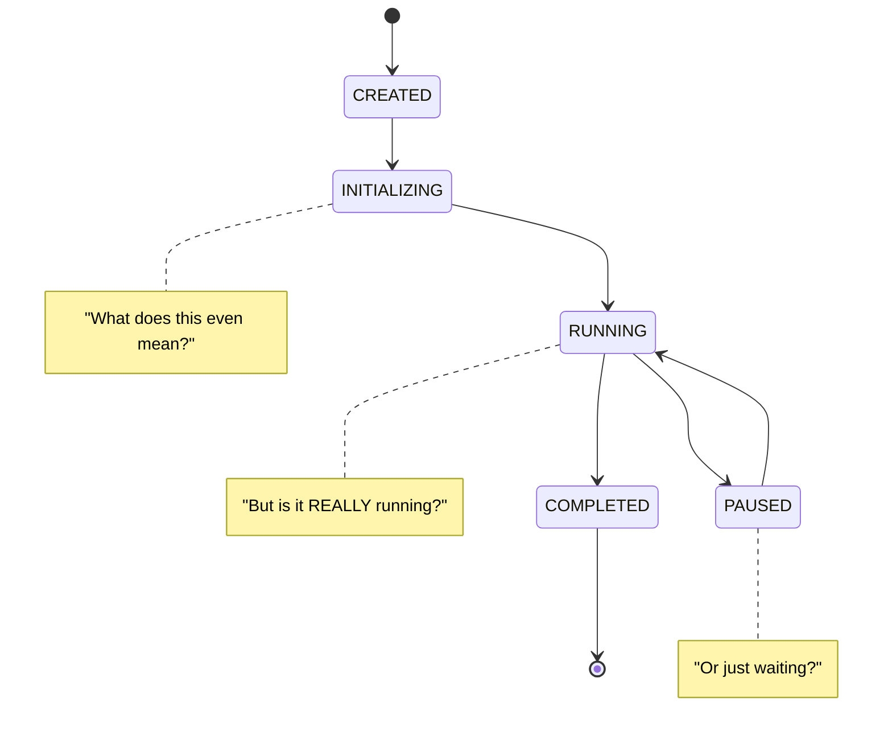
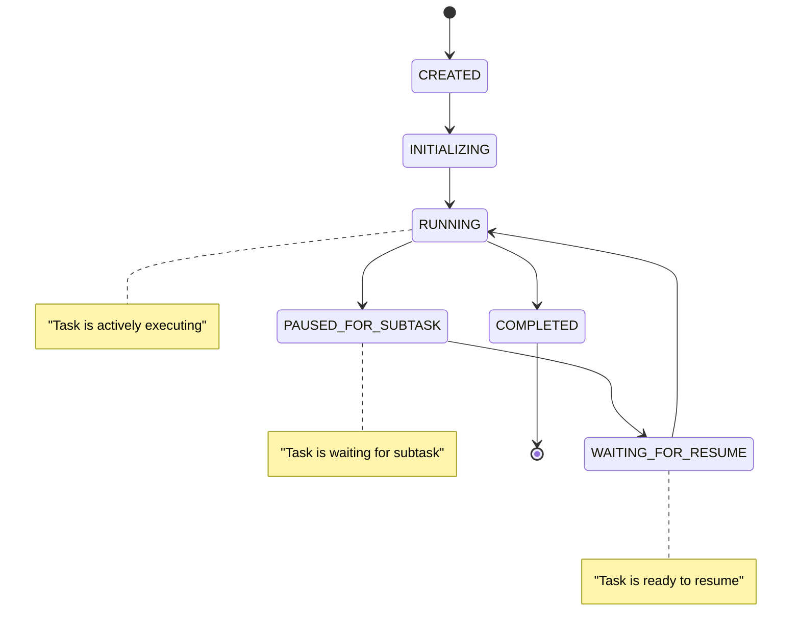

# Chapter 6: The State Management Nightmare 🌪️

*In the darkest depths of the codebase, Captain Architecture discovered the true horror: state management gone wrong.*

---

## The Horror Revealed 😱

The investigation revealed a state management system that would make even the bravest superhero shudder:

```typescript
// The state management nightmare
class Task {
    isInitialized: boolean = false    // Am I ready?
    isPaused: boolean = false         // Am I waiting?
    abandoned: boolean = false       // Am I forgotten?
    // isExecuting: boolean = false  // Am I working? ← MISSING!
}
```

*"This is like trying to track a dinosaur's mood with only three emotions: hungry, sleepy, and confused,"* Captain Architecture thought.

## The State Transitions Were Unclear 🔄

The hero's X-Ray Vision revealed the confusion:



**The Questions That Haunted the System**:
- When does a task become initialized?
- When should it pause vs continue?
- How do we know if it's currently executing?
- What happens during navigation?

## The Navigation Problem 🧭

Users could navigate away from tasks, causing them to be unloaded and reconstructed. But the reconstruction process was inconsistent and error-prone.

*"It's like trying to rebuild a dinosaur from fossil fragments,"* Captain Architecture realized. *"You might get something that looks right, but it's not the same creature."*

### **The Reconstruction Nightmare** 🏗️

```typescript
// The problematic reconstruction
async reconstructTaskFromHistory(taskId: string) {
    const task = new Task()
    
    // Try to restore state
    task.isInitialized = true  // ← But is it really?
    task.isPaused = false      // ← But should it be?
    
    // Try to restore execution
    if (task.shouldContinue()) {
        await task.recursivelyMakeClineRequests([], false)  // ← But is it safe?
    }
}
```

## The Hero's Sixth Insight 💡

**The Hero's Sixth Insight**: Unclear state management leads to unpredictable behavior. Clear state machines lead to predictable systems.

Captain Architecture realized that the state management confusion was causing:

- **Unpredictable behavior** - Same inputs, different outputs
- **Hard to debug** - Unclear what state the system is in
- **Hard to test** - Unclear what states to test
- **Hard to maintain** - Unclear how state changes

## The State Machine Vision 🎯

The hero envisioned a clear state machine:

```typescript
// Clear state machine
enum TaskState {
    CREATED = "created",
    INITIALIZING = "initializing", 
    RUNNING = "running",
    PAUSED_FOR_SUBTASK = "paused_for_subtask",
    WAITING_FOR_RESUME = "waiting_for_resume",
    COMPLETED = "completed",
    FAILED = "failed"
}

class Task {
    private state: TaskState = TaskState.CREATED
    private isExecuting: boolean = false
    
    async startExecution() {
        if (this.state === TaskState.CREATED) {
            this.state = TaskState.INITIALIZING
            await this.initialize()
            this.state = TaskState.RUNNING
        }
    }
    
    async pauseForSubtask() {
        if (this.state === TaskState.RUNNING) {
            this.state = TaskState.PAUSED_FOR_SUBTASK
        }
    }
    
    async resumeFromSubtask() {
        if (this.state === TaskState.PAUSED_FOR_SUBTASK) {
            this.state = TaskState.WAITING_FOR_RESUME
            if (!this.isExecuting) {
                this.state = TaskState.RUNNING
                await this.continueExecution()
            }
        }
    }
}
```

## The Clear State Transitions 📊



## The Missing Property Mystery 🕵️‍♂️

The hero discovered the missing piece:

```typescript
// What was missing
class Task {
    isInitialized: boolean = false
    isPaused: boolean = false
    // isExecuting: boolean = false  ← MISSING!
    abandoned: boolean = false
}
```

*"How can we not know if a task is currently executing?"* Captain Architecture wondered. *"This is like not knowing if someone is currently eating!"*

## The Execution Tracking Problem 🔍

The hero's Pattern Recognition superpower revealed the problem:

```typescript
// Main task loop
while (!this.abort) {
    const didEndLoop = await this.recursivelyMakeClineRequests(nextUserContent, includeFileDetails)
    // This method can run for MINUTES!
}
```

*"The problem is that `recursivelyMakeClineRequests()` can run for minutes, but we have no way to track if it's currently running,"* Captain Architecture realized.

## The Solution: Clear State Management ✅

The hero envisioned a solution:

```typescript
class Task {
    private state: TaskState = TaskState.CREATED
    private isExecuting: boolean = false
    
    async recursivelyMakeClineRequests(...args) {
        if (this.isExecuting) {
            console.log("Already executing, skipping duplicate call")
            return
        }
        
        this.isExecuting = true
        try {
            return await this._recursivelyMakeClineRequests(...args)
        } finally {
            this.isExecuting = false
        }
    }
    
    getState(): TaskState {
        return this.state
    }
    
    isCurrentlyExecuting(): boolean {
        return this.isExecuting
    }
}
```

## The Investigation Continues 🔍

With the state management nightmare identified, Captain Architecture prepared to dig deeper into the revelation phase.

The hero realized that the state management confusion was just one piece of a larger puzzle that was about to be solved.

---

## What's Next? 🔮

The investigation continues in [Chapter 7: The Truth About "Race Conditions"](part3/chapter7.md), where Captain Architecture has the moment of revelation that changes everything.

---

**Navigation**: 
- [← Chapter 5: The Subtask Handler's Secret](chapter5.md)
- [→ Chapter 7: The Truth About "Race Conditions"](../part3/chapter7.md)
- [↑ Table of Contents](../README.md)

---

**Key Insights from This Chapter**:
- 🌪️ **The Nightmare**: Unclear state management causing unpredictable behavior
- 🔄 **The Confusion**: Unclear state transitions and missing properties
- 💡 **The Hero's Insight**: Clear state machines lead to predictable systems
- ✅ **The Solution**: Clear state management with explicit transitions

---

*"The best state management isn't complex - it's clear."* 🦸‍♂️
