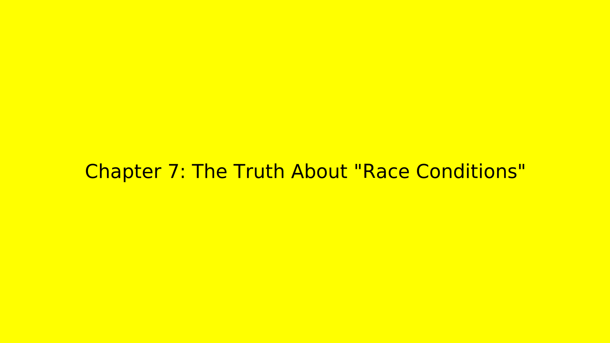
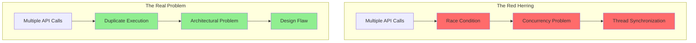

# Chapter 7: The Truth About "Race Conditions" 🎭



_The moment of revelation came during a late-night debugging session, when Captain Architecture finally saw the truth._

---

## The Moment of Clarity 💡

_"This isn't a race condition at all,"_ the hero realized. _"This is duplicate execution from the same code path!"_

The revelation came like a lightning bolt, illuminating the entire investigation in a new light.

## The Real Problem Revealed 🔍

**The Real Problem**:

```typescript
// What everyone thought was happening (race condition)
Thread 1: if (counter === 0) counter++  // Reads 0, increments to 1
Thread 2: if (counter === 0) counter++  // Also reads 0, increments to 1
// Result: counter = 1 (should be 2)

// What was actually happening (duplicate execution)
Main Loop: await parentTask.recursivelyMakeClineRequests([], false)  // Call 1
Subtask Completion: await parentTask.recursivelyMakeClineRequests([], false)  // Call 2
// Result: Two API calls instead of one
```

## The Smoking Gun 🔫

The hero discovered the smoking gun in the code:

```typescript
// The problematic flow
async finishSubTask(lastMessage: string) {
    await this.removeClineFromStack()
    await this.continueParentTask(lastMessage) // ← This calls recursivelyMakeClineRequests
}

// Meanwhile, in the main task loop...
while (!this.abort) {
    const didEndLoop = await this.recursivelyMakeClineRequests(...) // ← This ALSO calls it
}
```

_"This isn't a race condition,"_ Captain Architecture realized. _"This is duplicate execution from the same code path! It's like someone calling the same function twice and wondering why they get two results."_

## The Hero's Seventh Insight 💡

**The Hero's Seventh Insight**: Accurate terminology is crucial. Wrong labels lead to wrong solutions.

Captain Architecture realized that calling it a "race condition" had obscured the real problem. It wasn't about concurrency - it was about architectural design.

## The Misleading Terminology Trap 🕳️

The "race condition" label was a red herring because:

### **False Concurrency** ❌

- No competing threads
- No concurrent access to shared state
- Sequential execution, not parallel

### **False Timing** ❌

- Timing was predictable, not random
- Calls happened in sequence, not simultaneously
- No race to access resources

### **False Symptoms** ❌

- Symptoms looked like concurrency issues
- But the cause was architectural design
- The "race" was actually duplicate execution

## The Real Problem Emerges 🎯

The hero's Pattern Recognition superpower kicked in, revealing the true nature of the problem:



## The Architectural Root Cause 🏗️

The hero realized that the problem wasn't about preventing concurrency - it was about preventing duplicate execution from the same code path.

**The Real Question**: Why is the same logical operation being triggered twice?

**The Real Answer**: Poor architectural design that allows multiple execution paths to trigger the same operation.

## The Execution Path Analysis 🛤️

Captain Architecture mapped out the execution paths:

### **Path 1: Main Task Loop** 🔄

```typescript
// Normal execution flow
User Input → Task Stack → Orchestrator → recursivelyMakeClineRequests() → API Call
```

### **Path 2: Subtask Completion** 🤖

```typescript
// Problematic execution flow
Subtask Completion → Subtask Handler → continueParentTask() → recursivelyMakeClineRequests() → API Call
```

_"Both paths lead to the same destination,"_ Captain Architecture thought. _"But they're taking different routes to get there."_

## The Solution Becomes Clear ✨

With the real problem identified, the solution became clear:

**The Problem**: The same logical operation is being triggered twice from different parts of the same execution flow.

**The Solution**: Ensure only one "continue processing" happens, not prevent concurrency.

## The Hero's Realization 🎯

\*"The issue isn't concurrency** - it's that **the same logical operation is being triggered twice\*\*:

1. **Main task loop**: "Continue processing"
2. **Subtask completion**: "Continue processing" (unintended duplicate)

**Solution**: Ensure only one "continue processing" happens, not prevent concurrency.

## The Path Forward 🛤️

Captain Architecture now understood the path forward:

1. **Identify the duplicate execution paths**
2. **Understand why both paths exist**
3. **Design a solution that prevents duplication**
4. **Implement the fix without breaking existing functionality**

---

## What's Next? 🔮

The investigation continues in [Chapter 8: The Redundant Condition Discovery](chapter8.md), where Captain Architecture discovers that the condition meant to prevent duplicate calls was actually redundant.

---

**Navigation**:

- [← Chapter 6: The State Management Nightmare](../part2/chapter6.md)
- [→ Chapter 8: The Redundant Condition Discovery](chapter8.md)
- [↑ Table of Contents](../README.md)

---

**Key Insights from This Chapter**:

- 🎭 **The Truth**: "Race condition" was actually duplicate execution
- 🔍 **The Real Problem**: Same logical operation triggered twice
- 💡 **The Hero's Insight**: Accurate terminology is crucial
- 🛤️ **The Path Forward**: Prevent duplication, not concurrency

---

_"The best revelations don't just solve the problem - they reveal the right problem to solve."_ 🦸‍♂️
