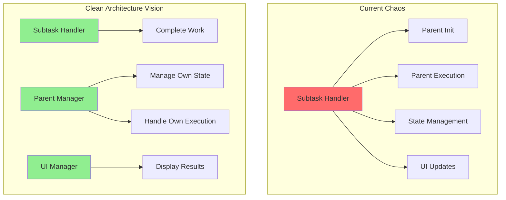
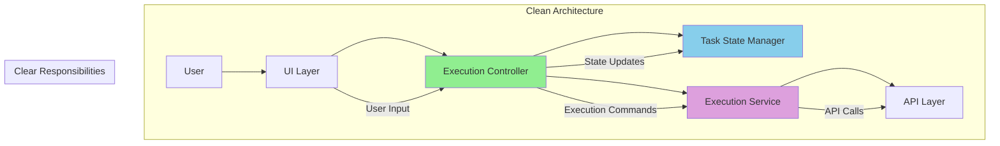

# Chapter 10: The Clean Architecture Vision 🏗️

*Armed with all the evidence, Captain Architecture began to envision a better world - a world where code was clean, responsibilities were clear, and bugs were rare.*

---

## The Vision Emerges ✨

**The Vision**: A system where each component has a single, clear responsibility and communicates through well-defined interfaces.

Captain Architecture's architectural superpowers kicked in, revealing the path to salvation:



## The Three Pillars of Clean Architecture 🏛️

### **1. Clear Separation of Concerns** 🎯

**Current (Bad) Design**:
```typescript
// The Subtask Handler's confused responsibilities
class SubtaskHandler {
    async finishSubTask(lastMessage: string) {
        // Initialize parent? ← NOT MY JOB!
        // Manage parent execution? ← NOT MY JOB!
        // Handle UI updates? ← NOT MY JOB!
    }
}
```

**Clean Architecture Vision**:
```typescript
// Clear responsibilities
class SubtaskHandler {
    async finishSubTask(lastMessage: string) {
        // Just finish the subtask
        await this.completeSubtask(lastMessage)
        // Emit event for other components to handle
        this.emit('subtaskCompleted', { lastMessage })
    }
}
```

### **2. Explicit State Management** 📊

**Current (Confusing) Design**:
```typescript
// Unclear state
class Task {
    isInitialized: boolean = false    // What does this mean?
    isPaused: boolean = false         // When is this true?
    // isExecuting: boolean = false  // Missing!
}
```

**Clean Architecture Vision**:
```typescript
// Clear state machine
enum TaskState {
    CREATED = "created",
    INITIALIZING = "initializing", 
    RUNNING = "running",
    PAUSED_FOR_SUBTASK = "paused_for_subtask",
    WAITING_FOR_RESUME = "waiting_for_resume",
    COMPLETED = "completed",
    FAILED = "failed"
}

class Task {
    private state: TaskState = TaskState.CREATED
    private isExecuting: boolean = false
    
    async startExecution() {
        if (this.state === TaskState.CREATED) {
            this.state = TaskState.INITIALIZING
            await this.initialize()
            this.state = TaskState.RUNNING
        }
    }
}
```

### **3. Event-Driven Communication** 📡

**Current (Tight Coupling) Design**:
```typescript
// Direct method calls
class SubtaskHandler {
    async finishSubTask(lastMessage: string) {
        // Directly calling parent methods
        await parentTask.completeSubtask(lastMessage)
        if (!parentTask.isPaused && parentTask.isInitialized) {
            await parentTask.recursivelyMakeClineRequests([], false)
        }
    }
}
```

**Clean Architecture Vision**:
```typescript
// Event-driven communication
class SubtaskHandler {
    async finishSubTask(lastMessage: string) {
        // Just emit event
        this.eventEmitter.emit('subtaskCompleted', { lastMessage })
    }
}

class Task {
    constructor() {
        this.eventEmitter.on('subtaskCompleted', this.handleSubtaskCompletion.bind(this))
    }
    
    private async handleSubtaskCompletion(data: { lastMessage: string }) {
        await this.completeSubtask(data.lastMessage)
        if (this.shouldContinueAfterSubtask()) {
            await this.continueExecution()
        }
    }
}
```

## The Hero's Tenth Insight 💡

**The Hero's Tenth Insight**: Good architecture isn't about perfect code - it's about clear responsibilities and predictable behavior.

Captain Architecture realized that the goal wasn't to write perfect code, but to write code that was:
- **Easy to understand** - Clear responsibilities
- **Easy to debug** - Clear call chains
- **Easy to maintain** - Clear boundaries
- **Easy to test** - Clear interfaces

## The Architectural Patterns 🎨

### **Pattern 1: Single Responsibility Principle** 🎯

```typescript
// Each class has one job
class SubtaskHandler {
    // Only handles subtask completion
}

class ParentTaskManager {
    // Only handles parent task logic
}

class UIManager {
    // Only handles UI updates
}
```

### **Pattern 2: Event-Driven Architecture** 📡

```typescript
// Components communicate through events
class Task {
    constructor() {
        this.eventEmitter.on('subtaskCompleted', this.handleSubtaskCompletion.bind(this))
        this.eventEmitter.on('userInput', this.handleUserInput.bind(this))
    }
}
```

### **Pattern 3: State Machine** 📊

```typescript
// Clear state transitions
enum TaskState {
    CREATED = "created",
    RUNNING = "running",
    PAUSED_FOR_SUBTASK = "paused_for_subtask",
    COMPLETED = "completed"
}
```

## The Clean Architecture Diagram 🏗️



## The Benefits of Clean Architecture 🌟

### **1. Predictable Behavior** 🎯
- Clear state transitions
- Explicit execution paths
- No hidden side effects

### **2. Easy Debugging** 🔍
- Clear call chains
- Explicit responsibilities
- Isolated components

### **3. Easy Testing** 🧪
- Clear interfaces
- Isolated components
- Mockable dependencies

### **4. Easy Maintenance** 🔧
- Clear boundaries
- Loose coupling
- Single responsibility

## The Path Forward 🛤️

Captain Architecture now had a clear vision of the path forward:

1. **Implement the quick fix** - Add `isExecuting` property
2. **Refactor the architecture** - Separate concerns
3. **Implement state machine** - Clear state management
4. **Add event-driven communication** - Loose coupling

---

## What's Next? 🔮

The vision continues in [Chapter 11: The Implementation Plan](chapter11.md), where Captain Architecture creates a detailed roadmap to transform the chaotic system into a clean, maintainable architecture.

---

**Navigation**: 
- [← Chapter 9: The Missing Property Mystery](../part3/chapter9.md)
- [→ Chapter 11: The Implementation Plan](chapter11.md)
- [↑ Table of Contents](../README.md)

---

**Key Insights from This Chapter**:
- ✨ **The Vision**: Clean architecture with clear responsibilities
- 🏛️ **The Three Pillars**: Separation of concerns, state management, event-driven communication
- 💡 **The Hero's Insight**: Good architecture is about clarity, not perfection
- 🛤️ **The Path Forward**: Clear roadmap to transformation

---

*"The best architecture isn't the most complex - it's the one that makes the system's behavior predictable."* 🦸‍♂️
