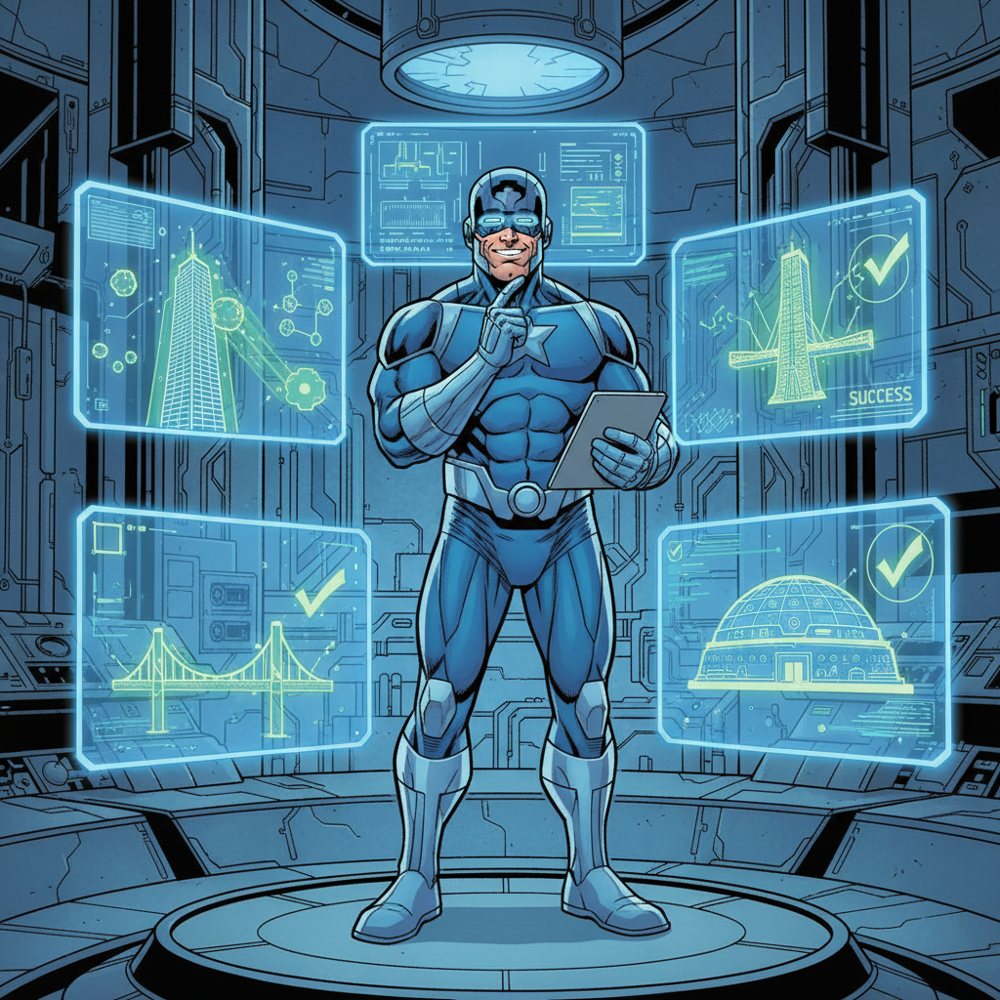

# Chapter 11: The Implementation Plan 🗺️



_With the vision clear, Captain Architecture began to plan the path to salvation._

---

## The Strategic Approach 🎯

_"We need to stop the bleeding first,"_ Captain Architecture thought. _"Then we can fix the underlying architecture."_

The hero's implementation plan was divided into three phases:

## Phase 1: The Quick Fix ⚡

**Goal**: Stop the duplicate API calls immediately

### **Step 1: Add the Missing Property** 🔧

```typescript
// Add the missing isExecuting property
class Task {
	private isExecuting: boolean = false

	async recursivelyMakeClineRequests(...args) {
		if (this.isExecuting) {
			console.log("Already executing, skipping duplicate call")
			return
		}

		this.isExecuting = true
		try {
			return await this._recursivelyMakeClineRequests(...args)
		} finally {
			this.isExecuting = false
		}
	}
}
```

### **Step 2: Simplify the Condition** 🎯

```typescript
// Simplify the condition
private async continueParentTask(lastMessage: string): Promise<void> {
    const parentTask = this.getCurrentTask()
    if (parentTask) {
        if (!parentTask.isInitialized) {
            await parentTask.initializeFromHistory()
        }
        await parentTask.completeSubtask(lastMessage)

        // Only check what we don't know
        if (!parentTask.isExecuting) {
            await parentTask.recursivelyMakeClineRequests([], false)
        }
    }
}
```

**Result**: Duplicate API calls eliminated! 🎉

## Phase 2: The Architectural Refactor 🏗️

**Goal**: Transform the chaotic system into clean architecture

### **Option A: Unified Task-Session Model** 🔄

```typescript
// Combine Task and Session into a single, clear concept
class ExecutionContext {
	// Execution state
	private state: ExecutionState
	private isExecuting: boolean = false

	// UI state
	private isActive: boolean = false
	private currentView: string = ""

	// Clear responsibilities
	async executeWork(): Promise<void> {
		// Handle execution
	}

	async updateUI(): Promise<void> {
		// Handle UI updates
	}
}
```

### **Option B: Three-Layer Architecture** 🏛️

```typescript
// Separate concerns into three clear layers
class ExecutionLayer {
	// Handles work execution
	async executeTask(task: Task): Promise<void> {
		// Pure execution logic
	}
}

class StateLayer {
	// Handles state management
	async manageTaskState(taskId: string, newState: TaskState): Promise<void> {
		// Pure state management
	}
}

class PresentationLayer {
	// Handles UI and user interaction
	async updateUI(taskId: string, data: any): Promise<void> {
		// Pure UI logic
	}
}
```

### **Option C: Event-Driven Microservices** 📡

```typescript
// Break into focused microservices
class TaskExecutionService {
	async executeTask(taskId: string): Promise<void> {
		// Only handles task execution
	}
}

class StateManagementService {
	async updateState(taskId: string, state: TaskState): Promise<void> {
		// Only handles state transitions
	}
}

class UIManagementService {
	async updateInterface(taskId: string, data: any): Promise<void> {
		// Only handles UI updates
	}
}
```

## Phase 3: The Testing Strategy 🧪

**Goal**: Ensure our fixes work and don't break anything

### **Test 1: Duplicate Execution Prevention** 🚫

```typescript
// Test the duplicate execution fix
describe("Duplicate Execution Prevention", () => {
	test("should not make duplicate API calls", async () => {
		const task = new Task()
		const apiCallSpy = jest.spyOn(task, "recursivelyMakeClineRequests")

		// Simulate the problematic scenario
		await task.startExecution()
		await task.completeSubtask("test result")

		// Should only make one API call, not two
		expect(apiCallSpy).toHaveBeenCalledTimes(1)
	})
})
```

### **Test 2: State Machine Transitions** 📊

```typescript
// Test the state machine
describe("Task State Machine", () => {
	test("should transition states correctly", async () => {
		const task = new Task()

		expect(task.getState()).toBe(TaskState.CREATED)

		await task.startExecution()
		expect(task.getState()).toBe(TaskState.RUNNING)

		await task.pauseForSubtask()
		expect(task.getState()).toBe(TaskState.PAUSED_FOR_SUBTASK)

		await task.resumeFromSubtask()
		expect(task.getState()).toBe(TaskState.RUNNING)
	})
})
```

### **Test 3: Event-Driven Communication** 📡

```typescript
// Test event-driven architecture
describe("Event-Driven Communication", () => {
	test("should emit events correctly", async () => {
		const task = new Task()
		const eventSpy = jest.spyOn(task.eventEmitter, "emit")

		await task.completeSubtask("test result")

		expect(eventSpy).toHaveBeenCalledWith("subtaskCompleted", {
			lastMessage: "test result",
		})
	})
})
```

## The Implementation Timeline 📅

### **Week 1: Quick Fix** ⚡

- Add `isExecuting` property
- Implement duplicate call prevention
- Test the fix

### **Week 2-3: Architecture Refactor** 🏗️

- Implement state machine
- Separate concerns
- Add event-driven communication

### **Week 4: Testing & Validation** 🧪

- Comprehensive testing
- Performance validation
- User acceptance testing

## The Risk Mitigation Strategy 🛡️

### **Risk 1: Breaking Existing Functionality** ⚠️

**Mitigation**: Comprehensive testing and gradual rollout

### **Risk 2: Performance Impact** ⚠️

**Mitigation**: Performance monitoring and optimization

### **Risk 3: User Experience Disruption** ⚠️

**Mitigation**: User testing and feedback collection

## The Success Metrics 📈

### **Technical Metrics** 🔧

- ✅ **Zero duplicate API calls** (regardless of navigation)
- ✅ **Clear separation of concerns** (each component has one job)
- ✅ **Predictable state management** (clear state machine)
- ✅ **Easy debugging** (clear call chains and responsibilities)
- ✅ **Maintainable code** (loose coupling, clear interfaces)

### **User Experience Metrics** 👥

- ✅ **Faster response times** (no duplicate processing)
- ✅ **More reliable behavior** (predictable state transitions)
- ✅ **Better error handling** (clear error boundaries)
- ✅ **Improved maintainability** (easier to add features)

## The Hero's Eleventh Insight 💡

**The Hero's Eleventh Insight**: Good architecture emerges from iteration, not from perfect initial design.

Captain Architecture realized that the path to clean architecture wasn't about getting it right the first time - it was about:

1. **Starting with the quick fix** - Stop the bleeding
2. **Iterating toward clarity** - Improve incrementally
3. **Testing continuously** - Ensure quality
4. **Learning from mistakes** - Adapt and improve

---

## What's Next? 🔮

The implementation continues in [Chapter 12: The Hero's Victory](chapter12.md), where Captain Architecture implements the solution and achieves victory over the architectural chaos.

---

**Navigation**:

- [← Chapter 10: The Clean Architecture Vision](chapter10.md)
- [→ Chapter 12: The Hero's Victory](chapter12.md)
- [↑ Table of Contents](../README.md)

---

**Key Insights from This Chapter**:

- 🗺️ **The Plan**: Three-phase implementation strategy
- ⚡ **Phase 1**: Quick fix to stop duplicate calls
- 🏗️ **Phase 2**: Architectural refactor for clean design
- 🧪 **Phase 3**: Comprehensive testing and validation
- 💡 **The Hero's Insight**: Good architecture emerges from iteration

---

_"The best plans are flexible enough to adapt and specific enough to execute."_ 🦸‍♂️
