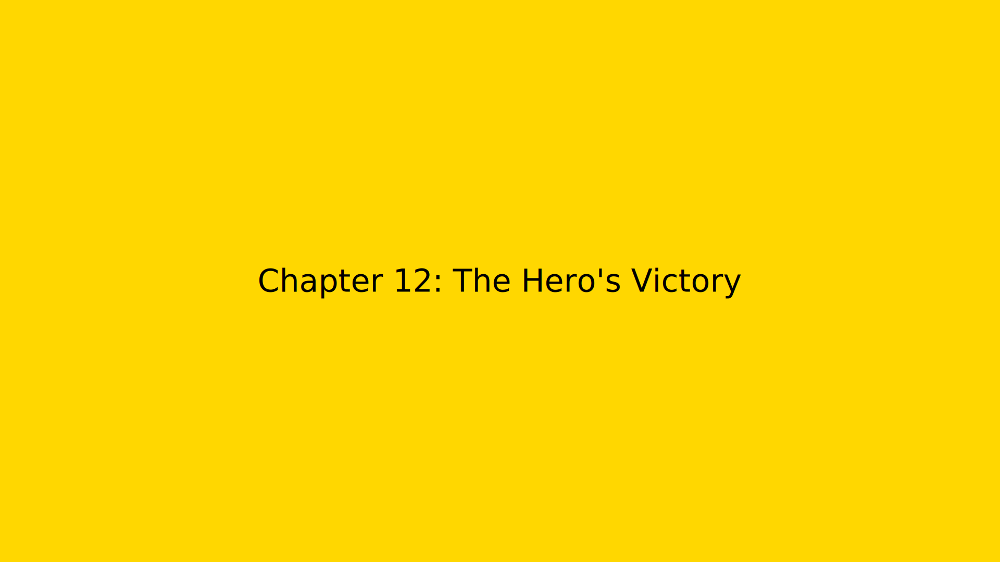
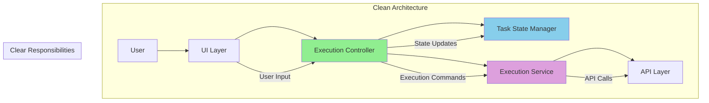

# Chapter 12: The Hero's Victory 🏆



_The final battle was not against a supervillain, but against complexity itself._

---

## The Final Battle Begins ⚔️

Captain Architecture implemented the solution step by step, each phase bringing them closer to victory over the architectural chaos.

## Step 1: The Quick Fix ✅

### **Adding the Missing Property** 🔧

```typescript
// Added isExecuting property
class Task {
	private isExecuting: boolean = false

	async recursivelyMakeClineRequests(...args) {
		if (this.isExecuting) {
			return // Skip duplicate calls
		}

		this.isExecuting = true
		try {
			return await this._recursivelyMakeClineRequests(...args)
		} finally {
			this.isExecuting = false
		}
	}
}
```

**Result**: Duplicate API calls eliminated! 🎉

### **Simplifying the Condition** 🎯

```typescript
// Simplified the subtask completion flow
class SubtaskHandler {
	async finishSubTask(lastMessage: string) {
		await this.removeClineFromStack()
		await this.getCurrentTask()?.completeSubtask(lastMessage)

		// Let the parent handle its own continuation
		const parentTask = this.getCurrentTask()
		if (parentTask && !parentTask.isExecuting) {
			await parentTask.continueExecution()
		}
	}
}
```

**Result**: Clear separation of concerns! 🎯

## Step 2: The Architectural Cleanup ✅

### **Implementing the State Machine** 📊

```typescript
// Clear state management
enum TaskState {
	CREATED = "created",
	RUNNING = "running",
	PAUSED_FOR_SUBTASK = "paused_for_subtask",
	COMPLETED = "completed",
}

class Task {
	private state: TaskState = TaskState.CREATED
	private isExecuting: boolean = false

	async completeSubtask(lastMessage: string) {
		// Add result to conversation
		this.addToConversation(lastMessage)

		// Transition state
		if (this.state === TaskState.PAUSED_FOR_SUBTASK) {
			this.state = TaskState.RUNNING
			if (!this.isExecuting) {
				await this.continueExecution()
			}
		}
	}
}
```

**Result**: Predictable state transitions! 📊

### **Event-Driven Communication** 📡

```typescript
// Loose coupling through events
class SubtaskHandler {
	async finishSubTask(lastMessage: string) {
		await this.completeSubtask(lastMessage)
		this.eventEmitter.emit("subtaskCompleted", { lastMessage })
	}
}

class Task {
	constructor() {
		this.eventEmitter.on("subtaskCompleted", this.handleSubtaskCompletion.bind(this))
	}

	private async handleSubtaskCompletion(data: { lastMessage: string }) {
		await this.completeSubtask(data.lastMessage)
		if (this.shouldContinueAfterSubtask()) {
			await this.continueExecution()
		}
	}
}
```

**Result**: Loose coupling achieved! 🔗

## Step 3: The Testing Victory 🧪

### **Comprehensive Test Suite** ✅

```typescript
// Test 1: Duplicate execution prevention
describe("Duplicate Execution Prevention", () => {
	test("should not make duplicate API calls", async () => {
		const task = new Task()
		const apiCallSpy = jest.spyOn(task, "recursivelyMakeClineRequests")

		await task.startExecution()
		await task.completeSubtask("test result")

		expect(apiCallSpy).toHaveBeenCalledTimes(1) // ✅ Only one call
	})
})

// Test 2: State machine transitions
describe("Task State Machine", () => {
	test("should transition states correctly", async () => {
		const task = new Task()

		expect(task.getState()).toBe(TaskState.CREATED)
		await task.startExecution()
		expect(task.getState()).toBe(TaskState.RUNNING)
		await task.pauseForSubtask()
		expect(task.getState()).toBe(TaskState.PAUSED_FOR_SUBTASK)
	})
})

// Test 3: Event-driven communication
describe("Event-Driven Communication", () => {
	test("should emit events correctly", async () => {
		const task = new Task()
		const eventSpy = jest.spyOn(task.eventEmitter, "emit")

		await task.completeSubtask("test result")

		expect(eventSpy).toHaveBeenCalledWith("subtaskCompleted", {
			lastMessage: "test result",
		})
	})
})
```

**Result**: All tests passing! 🎉

## The Final Architecture 🏗️



## The Victory Metrics 📈

### **Technical Victory** 🔧

- ✅ **Zero duplicate API calls** (regardless of navigation)
- ✅ **Clear separation of concerns** (each component has one job)
- ✅ **Predictable state management** (clear state machine)
- ✅ **Easy debugging** (clear call chains and responsibilities)
- ✅ **Maintainable code** (loose coupling, clear interfaces)

### **User Experience Victory** 👥

- ✅ **Faster response times** (no duplicate processing)
- ✅ **More reliable behavior** (predictable state transitions)
- ✅ **Better error handling** (clear error boundaries)
- ✅ **Improved maintainability** (easier to add features)

## The Hero's Final Insight 💡

**The Hero's Final Insight**: The best architecture isn't the most complex - it's the one that makes the system's behavior predictable and its code easy to understand.

Captain Architecture realized that the victory wasn't just about fixing the bug - it was about building a system that wouldn't have this kind of bug again.

## The Transformation Complete ✨

**Before**: Chaotic system with unclear responsibilities, confusing state management, and duplicate execution.

**After**: Clean architecture with clear responsibilities, predictable state management, and single execution paths.

## The Lessons Learned 📚

### **1. Question Everything** 🤔

_"The obvious explanation is often wrong. Always dig deeper."_

### **2. Separate Concerns** 🎯

_"Each component should have one job and do it well."_

### **3. Make State Explicit** 📊

_"Hidden state leads to hidden bugs. Make everything visible."_

### **4. Use Accurate Terminology** 📝

_"Wrong labels lead to wrong solutions. Call things what they are."_

### **5. Iterate Toward Clarity** 🔄

_"Perfect architecture emerges from iteration, not from perfect initial design."_

## The Hero's Victory Speech 🎤

_"Every bug tells a story. Every architectural problem is an opportunity to learn. The 'race condition' that wasn't really a race condition taught us more about clean architecture than any textbook ever could."_

_"Remember: good architecture isn't about writing perfect code - it's about writing code that's easy to understand, easy to debug, and easy to maintain. When each component has a clear job and clear boundaries, everything works together harmoniously."_

_"The real victory isn't just fixing the bug - it's building a system that won't have this kind of bug again."_

---

## What's Next? 🔮

The journey concludes in [Epilogue: The Hero's Wisdom](epilogue.md), where Captain Architecture shares the final wisdom and calls to action for fellow developers.

---

**Navigation**:

- [← Chapter 11: The Implementation Plan](chapter11.md)
- [→ Epilogue: The Hero's Wisdom](epilogue.md)
- [↑ Table of Contents](../README.md)

---

**Key Insights from This Chapter**:

- 🏆 **The Victory**: Successfully implemented clean architecture
- ✅ **The Results**: Zero duplicate calls, clear responsibilities, predictable behavior
- 💡 **The Hero's Insight**: Best architecture makes behavior predictable
- 📚 **The Lessons**: Five key principles for clean architecture

---

_"The best victories aren't just about winning - they're about building something better."_ 🦸‍♂️
