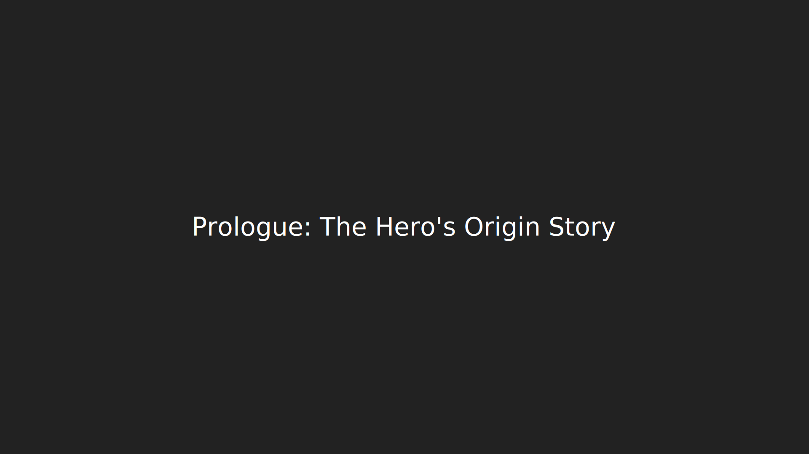

# Prologue: The Hero's Origin Story 🦸‍♂️

_In a world where code runs wild and bugs multiply like digital gremlins, one developer dared to ask the question that would change everything: "Why is this happening?"_

---

## The Birth of a Hero 🌟

Meet **Captain Architecture** 🦸‍♂️ - a superhero developer with the power to see through code complexity and the courage to question everything. Armed with nothing but curiosity, a debugger, and an unhealthy obsession with clean code, our hero embarks on the most challenging mission of their career: solving the mystery of the "race condition" that wasn't really a race condition.

_"Every great bug has a story,"_ Captain Architecture mused, _"and this one is about to become a legend."_

## The Hero's Powers 🦸‍♂️

**🔍 X-Ray Vision**: Can see through code complexity to spot the real issues hiding beneath layers of abstraction.

**🧠 Pattern Recognition**: Instantly spots architectural anti-patterns and design flaws that others miss.

**🛡️ Debugging Shield**: Protects against misleading terminology and false explanations that lead developers astray.

**⚡ Refactoring Lightning**: Strikes down technical debt with precision, leaving clean, maintainable code in its wake.

**🎯 Single Responsibility Sense**: Can detect when components are doing too much and violating the principle of focused responsibility.

## The Hero's Mission 🎯

Captain Architecture's mission is simple yet profound: **To bring clarity to chaotic codebases and justice to architectural crimes.**

In a world where:

- Components have unclear responsibilities
- State management is a mystery
- Terminology obscures rather than illuminates
- Bugs multiply faster than they can be fixed

Our hero stands as a beacon of hope, showing that with the right approach, even the most complex systems can be understood, debugged, and improved.

## The Hero's Philosophy 💭

_"Good architecture isn't about writing perfect code - it's about writing code that's easy to understand, easy to debug, and easy to maintain. When each component has a clear job and clear boundaries, everything works together harmoniously."_

## The Call to Adventure 📞

The call came in at 3 AM. The kind of call that makes superheroes sigh and reach for their coffee.

A production system was experiencing strange behavior. Users reported that their AI assistant was making duplicate API calls, responses were getting jumbled together, and sometimes the chat history would become completely corrupted with XML fragments.

_"It's like the AI is having a conversation with itself,"_ reported the first victim. _"And it's not a very coherent conversation."_

Captain Architecture knew this was no ordinary bug. This was the beginning of an adventure that would test every skill, challenge every assumption, and ultimately reveal the path to architectural salvation.

## The Hero's Journey Begins 🚀

As our hero prepares to investigate this mysterious case, they carry with them the wisdom of experience:

- **Question Everything**: The obvious explanation is often wrong
- **Separate Concerns**: Each component should have one job and do it well
- **Make State Explicit**: Hidden state leads to hidden bugs
- **Use Accurate Terminology**: Wrong labels lead to wrong solutions
- **Iterate Toward Clarity**: Perfect architecture emerges from iteration, not from perfect initial design

_"The real adventure begins not when you find the answer, but when you realize the question you've been asking is wrong."_

---

## What's Next? 🔮

The investigation begins with [Chapter 1: The Mysterious Bug](part1/chapter1.md), where Captain Architecture arrives on the scene to discover that this is no ordinary bug - it's an architectural mystery that will require all of their superpowers to solve.

---

**Navigation**:

- [← Back to Table of Contents](README.md)
- [→ Chapter 1: The Mysterious Bug](part1/chapter1.md)

---

_"With great power comes great responsibility... and sometimes, great confusion."_ 🦸‍♂️
