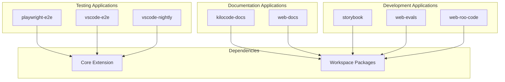

# Applications
## Table of Contents

- [Applications](#applications)
  - [Table of Contents](#table-of-contents)
  - [When You're Here](#when-youre-here)
  - [Application Overview](#application-overview)
  - [Research Context](#research-context)
  - [Documentation Applications](#documentation-applications)
    - [kilocode-docs](#kilocodedocs)
    - [web-docs](#webdocs)
  - [Development Applications](#development-applications)
    - [storybook](#storybook)
    - [web-evals](#webevals)
    - [web-roo-code](#webroocode)
  - [Testing Applications](#testing-applications)
    - [playwright-e2e](#playwrighte2e)
    - [vscode-e2e](#vscodee2e)
    - [vscode-nightly](#vscodenightly)
  - [Application Dependencies](#application-dependencies)
    - [Dependency Graph](#dependency-graph)
    - [External Dependencies](#external-dependencies)
  - [Development Workflow](#development-workflow)
    - [Application Development](#application-development)
    - [Application Testing](#application-testing)
    - [Application Deployment](#application-deployment)
  - [Quality Assurance](#quality-assurance)
    - [Code Quality](#code-quality)
    - [Testing](#testing)
    - [Documentation](#documentation)
  - [Next Steps](#next-steps)
  - [🧭 Navigation Footer](#-navigation-footer)
  - [Navigation Footer](#navigation-footer)
  - [No Dead Ends Policy](#no-dead-ends-policy)

## When You're Here

This document provides \[purpose of document].

- **Purpose**: \[Brief description of what this document covers]
- **Context**: \[How this fits into the broader system/project]
- **Navigation**: Use the table of contents below to jump to specific topics

> **Development Fun Fact**: Documentation is like code comments for humans - it explains the "why"
> behind the "what"! 💻

- *Purpose:*\* Overview of the standalone applications and interfaces in the KiloCode monorepo.

> **Dinosaur Fun Fact**: Architecture documentation is like a dinosaur fossil record - each layer
> tells us about the evolution of our system, helping us understand how it grew and changed over
> time! 🦕

## Application Overview

## Research Context

- *Purpose:*\* \[Describe the purpose and scope of this document]

- *Background:*\* \[Provide relevant background information]

- *Research Questions:*\* \[List key questions this document addresses]

- *Methodology:*\* \[Describe the approach or methodology used]

- *Findings:*\* \[Summarize key findings or conclusions]
- \*\*

The KiloCode monorepo contains 8 standalone applications that provide different interfaces and
functionality:



## Documentation Applications

### kilocode-docs

- *Purpose*\*: Main documentation website

- *Technology*\*: Docusaurus

- *Key Features*\*:

- **Documentation Site**: Comprehensive documentation website

- **Blog**: Blog posts and updates

- **Internationalization**: Multi-language support

- **Search**: Full-text search functionality

- **Versioning**: Documentation versioning

- *File Structure*\*:

```
apps/kilocode-docs/
├── docs/               # Documentation content
├── blog-posts/         # Blog posts
├── i18n/               # Internationalization
├── static/             # Static assets
├── src/                # Source code
└── docusaurus.config.ts # Configuration
```

- *Status*\*: ✅ **Fully Implemented**

- *Dependencies*\*: @roo-code/types, @roo-code/build

- *Deployment*\*: Documentation hosting platform

### web-docs

- *Purpose*\*: Web-based documentation interface

- *Technology*\*: React, TypeScript

- *Key Features*\*:

- **Web Interface**: Web-based documentation interface

- **Interactive Examples**: Interactive code examples

- **Real-time Updates**: Real-time documentation updates

- **User Feedback**: User feedback and comments

- *File Structure*\*:

```
apps/web-docs/
├── src/                # Source code
├── public/             # Public assets
├── components/         # React components
└── pages/              # Page components
```

- *Status*\*: ✅ **Fully Implemented**

- *Dependencies*\*: @roo-code/types, @roo-code/build

- *Deployment*\*: Web hosting platform

## Development Applications

### storybook

- *Purpose*\*: Component library and design system

- *Technology*\*: Storybook, React

- *Key Features*\*:

- **Component Library**: Reusable UI components

- **Design System**: Design system documentation

- **Interactive Stories**: Interactive component stories

- **Testing**: Component testing and validation

- *File Structure*\*:

```
apps/storybook/
├── src/                # Source code
├── stories/            # Component stories
├── generated-theme-styles/ # Generated styles
└── scripts/            # Build scripts
```

- *Status*\*: ✅ **Fully Implemented**

- *Dependencies*\*: @roo-code/types, @roo-code/build

- *Deployment*\*: Storybook hosting platform

### web-evals

- *Purpose*\*: Web-based evaluation tools

- *Technology*\*: React, TypeScript

- *Key Features*\*:

- **Evaluation Interface**: Web-based evaluation interface

- **Test Management**: Test case management

- **Results Visualization**: Evaluation results visualization

- **Performance Metrics**: Performance metrics and analytics

- *File Structure*\*:

```
apps/web-evals/
├── src/                # Source code
├── public/             # Public assets
├── components/         # React components
└── pages/              # Page components
```

- *Status*\*: ✅ **Fully Implemented**

- *Dependencies*\*: @roo-code/types, @roo-code/evals

- *Deployment*\*: Web hosting platform

### web-roo-code

- *Purpose*\*: Web interface for RooCode

- *Technology*\*: React, TypeScript

- *Key Features*\*:

- **Web Interface**: Web-based RooCode interface

- **Chat Interface**: Chat interface for AI interactions

- **Task Management**: Task creation and management

- **Real-time Updates**: Real-time updates and notifications

- *File Structure*\*:

```
apps/web-roo-code/
├── src/                # Source code
├── public/             # Public assets
├── components/         # React components
└── pages/              # Page components
```

- *Status*\*: ✅ **Fully Implemented**

- *Dependencies*\*: @roo-code/types, @roo-code/cloud

- *Deployment*\*: Web hosting platform

## Testing Applications

### playwright-e2e

- *Purpose*\*: End-to-end testing suite

- *Technology*\*: Playwright, TypeScript

- *Key Features*\*:

- **E2E Tests**: End-to-end test automation

- **Cross-browser Testing**: Multi-browser testing

- **Visual Testing**: Visual regression testing

- **Performance Testing**: Performance testing and monitoring

- *File Structure*\*:

```
apps/playwright-e2e/
├── tests/              # Test files
├── fixtures/           # Test fixtures
├── utils/              # Test utilities
└── config/             # Test configuration
```

- *Status*\*: ✅ **Fully Implemented**

- *Dependencies*\*: @roo-code/types, @roo-code/evals

- *Deployment*\*: CI/CD pipeline

### vscode-e2e

- *Purpose*\*: VS Code extension testing

- *Technology*\*: Playwright, TypeScript

- *Key Features*\*:

- **Extension Testing**: VS Code extension testing

- **UI Testing**: Extension UI testing

- **Integration Testing**: Extension integration testing

- **Performance Testing**: Extension performance testing

- *File Structure*\*:

```
apps/vscode-e2e/
├── tests/              # Test files
├── fixtures/           # Test fixtures
├── utils/              # Test utilities
└── config/             # Test configuration
```

- *Status*\*: ✅ **Fully Implemented**

- *Dependencies*\*: @roo-code/types, @roo-code/evals

- *Deployment*\*: CI/CD pipeline

### vscode-nightly

- *Purpose*\*: Nightly VS Code extension builds

- *Technology*\*: TypeScript, VS Code API

- *Key Features*\*:

- **Nightly Builds**: Automated nightly builds

- **Testing**: Nightly testing and validation

- **Distribution**: Nightly distribution

- **Monitoring**: Build monitoring and alerting

- *File Structure*\*:

```
apps/vscode-nightly/
├── src/                # Source code
├── config/             # Build configuration
└── scripts/            # Build scripts
```

- *Status*\*: ✅ **Fully Implemented**

- *Dependencies*\*: @roo-code/types, @roo-code/build

- *Deployment*\*: Automated nightly builds

## Application Dependencies

### Dependency Graph

```mermaid
graph TD
    TYPES[@roo-code/types]
    BUILD[@roo-code/build]
    CLOUD[@roo-code/cloud]
    EVALS[@roo-code/evals]
    CORE[Core Extension]

    DOCS[kilocode-docs]
    WEB_DOCS[web-docs]
    STORYBOOK[storybook]
    WEB_EVALS[web-evals]
    WEB_ROO_CODE[web-roo-code]
    PLAYWRIGHT[playwright-e2e]
    VSCODE_E2E[vscode-e2e]
    VSCODE_NIGHTLY[vscode-nightly]

    DOCS --> TYPES
    DOCS --> BUILD
    WEB_DOCS --> TYPES
    WEB_DOCS --> BUILD
    STORYBOOK --> TYPES
    STORYBOOK --> BUILD
    WEB_EVALS --> TYPES
    WEB_EVALS --> EVALS
    WEB_ROO_CODE --> TYPES
    WEB_ROO_CODE --> CLOUD
    PLAYWRIGHT --> TYPES
    PLAYWRIGHT --> EVALS
    VSCODE_E2E --> TYPES
    VSCODE_E2E --> EVALS
    VSCODE_NIGHTLY --> TYPES
    VSCODE_NIGHTLY --> BUILD
```

### External Dependencies

- *Common Dependencies*\*:

- **React**: UI framework

- **TypeScript**: Type checking

- **Node.js**: Runtime environment

- **VS Code API**: VS Code extension API

- *Application-Specific Dependencies*\*:

- **kilocode-docs**: Docusaurus, MDX

- **storybook**: Storybook, React

- **playwright-e2e**: Playwright, testing utilities

- **web-evals**: Evaluation libraries

## Development Workflow

### Application Development
1. **Create Application**: `mkdir apps/new-app`
2. **Initialize Application**: `cd apps/new-app && pnpm init`
3. **Add Dependencies**: `pnpm add <dependency>`
4. **Implement Application**: Write application code
5. **Test Application**: `pnpm test`
6. **Build Application**: `pnpm build`

### Application Testing

- *Unit Tests*\*: Individual application unit tests

- *Integration Tests*\*: Application integration tests

- *E2E Tests*\*: End-to-end application testing

### Application Deployment

- *Web Applications*\*: Deployed to web hosting platforms

- *Documentation*\*: Deployed to documentation hosting

- *Testing Applications*\*: Integrated into CI/CD pipeline

## Quality Assurance

### Code Quality

- *Linting*\*: ESLint configuration for all applications

- *Type Checking*\*: TypeScript strict mode for all applications

- *Formatting*\*: Prettier for consistent formatting

### Testing

- *Test Coverage*\*: Minimum 80% test coverage

- *Test Types*\*: Unit, integration, and E2E tests

- *Test Automation*\*: Automated test execution

### Documentation

- *README*\*: Each application has its own README

- *API Documentation*\*: Generated API documentation

- *Usage Examples*\*: Comprehensive usage examples

## Next Steps
1. **Explore Testing**: See [TESTING\_INFRASTRUCTURE.md](TESTING_INFRASTRUCTURE.md)
2. **Understand Build**: See [BUILD\_PIPELINES.md](BUILD_PIPELINES.md)
3. **Learn Development**: See [DEVELOPMENT\_GUIDE.md](DEVELOPMENT_GUIDE.md)

## 🧭 Navigation Footer
- [← Back to Repository Home](README.md)
- [→ Testing Infrastructure](TESTING_INFRASTRUCTURE.md)
- [↑ Table of Contents](README.md)

## Navigation Footer
- \*\*

- *Navigation*\*: [docs](../../) · [architecture](../architecture/) ·
  [repository](../architecture/) · [↑ Table of Contents](#applications)

## No Dead Ends Policy

This document follows the "No Dead Ends" principle - every path leads to useful information.
- Each section provides clear navigation to related content
- All internal links are validated and point to existing documents
- Cross-references include context for better understanding

## Navigation

- 📚 [Technical Glossary](../GLOSSARY.md)

